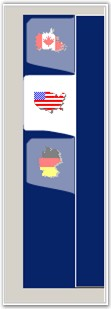

::: {style="DISPLAY: none"}
{#d2h_url_template}{#d2h_package_url style="WIDTH: 0px; DISPLAY: none; HEIGHT: 0px"}
:::

:::: {.d2h_secondary_topic style="PADDING-BOTTOM: 10pt; MARGIN: 0pt; PADDING-LEFT: 0pt; PADDING-RIGHT: 0pt; PADDING-TOP: 0pt"}
#### How to Customize TabRendering {#how-to-customize-tabrendering style="MARGIN-LEFT: 18pt; tab-stops: 18.0pt"}

[]{style="COLOR: #15428b"} 

The simplest way to customize TabDrawing is to handle the **DrawItem** event. A departure from the normal is the TabControlAdv\'s ability to let you selectively draw portions of the tab. For this purpose, TabDrawing is classified into three portions: Background, Border and Interior (text and image). The event args lets you delegate drawing of one or more portions of the tab to the default drawing code while custom drawing the other portions of the tab.

[]{style="COLOR: #15428b"} 

::: {style="BORDER-BOTTOM: windowtext 1pt solid; BORDER-LEFT: medium none; PADDING-BOTTOM: 1pt; MARGIN: 9pt 0pt 9pt 18pt; PADDING-LEFT: 0pt; PADDING-RIGHT: 0pt; BORDER-TOP: windowtext 1pt solid; BORDER-RIGHT: medium none; PADDING-TOP: 1pt"}
{border="0"} Note: The following code provides a sample discussion of the Custom TabControls.
:::

[]{style="COLOR: #15428b"} 

[·      ]{style="FONT-FAMILY: Symbol"}The following code sample demonstrates how to create **Yahoo Messenger-like tabs**.

[]{style="COLOR: #15428b"} 

+-----------------------------------------------------------------------------------------------------------------------------------------------------------------------------------------------------------------------------------------------------------------+
| **[\[C#\]]{style="FONT-FAMILY: 'Courier New'; COLOR: black"}**                                                                                                                                                                                                  |
|                                                                                                                                                                                                                                                                 |
| []{style="FONT-FAMILY: 'Courier New'; COLOR: blue"}                                                                                                                                                                                                             |
|                                                                                                                                                                                                                                                                 |
| [private]{style="FONT-FAMILY: 'Courier New'; COLOR: blue"}[ [void]{style="COLOR: blue"} Tab_DrawItemYahooMessengerLike([object]{style="COLOR: blue"} sender, DrawTabEventArgs drawItemInfo)]{style="FONT-FAMILY: 'Courier New'"}                                |
|                                                                                                                                                                                                                                                                 |
| [{]{style="FONT-FAMILY: 'Courier New'"}                                                                                                                                                                                                                         |
|                                                                                                                                                                                                                                                                 |
| [// This will work only when the TabStyle is set to 3D (typeof(TabRenderer3D)).]{style="FONT-FAMILY: 'Courier New'; COLOR: green"}                                                                                                                              |
|                                                                                                                                                                                                                                                                 |
| [// Draw the default background and interior in all cases by delegating the drawing to the default drawing code.]{style="FONT-FAMILY: 'Courier New'; COLOR: green"}                                                                                             |
|                                                                                                                                                                                                                                                                 |
| [drawItemInfo.DrawBackground();]{style="FONT-FAMILY: 'Courier New'"}                                                                                                                                                                                            |
|                                                                                                                                                                                                                                                                 |
| [drawItemInfo.DrawInterior();]{style="FONT-FAMILY: 'Courier New'"}                                                                                                                                                                                              |
|                                                                                                                                                                                                                                                                 |
| []{style="FONT-FAMILY: 'Courier New'"}                                                                                                                                                                                                                          |
|                                                                                                                                                                                                                                                                 |
| [// The border should be drawn only when the item is selected or highlighted.]{style="FONT-FAMILY: 'Courier New'; COLOR: green"}                                                                                                                                |
|                                                                                                                                                                                                                                                                 |
| [if]{style="FONT-FAMILY: 'Courier New'; COLOR: blue"}[((([int]{style="COLOR: blue"})drawItemInfo.State & (([int]{style="COLOR: blue"})DrawItemState.Selected \| ([int]{style="COLOR: blue"})DrawItemState.HotLight)) \> 0)]{style="FONT-FAMILY: 'Courier New'"} |
|                                                                                                                                                                                                                                                                 |
| [{]{style="FONT-FAMILY: 'Courier New'"}                                                                                                                                                                                                                         |
|                                                                                                                                                                                                                                                                 |
| [// Draw the borders.]{style="FONT-FAMILY: 'Courier New'; COLOR: green"}                                                                                                                                                                                        |
|                                                                                                                                                                                                                                                                 |
| [drawItemInfo.DrawBorders();]{style="FONT-FAMILY: 'Courier New'"}                                                                                                                                                                                               |
|                                                                                                                                                                                                                                                                 |
| [}]{style="FONT-FAMILY: 'Courier New'"}                                                                                                                                                                                                                         |
|                                                                                                                                                                                                                                                                 |
| [}]{style="FONT-FAMILY: 'Courier New'"}                                                                                                                                                                                                                         |
+-----------------------------------------------------------------------------------------------------------------------------------------------------------------------------------------------------------------------------------------------------------------+

[]{style="COLOR: #15428b"} 

+-----------------------------------------------------------------------------------------------------------------------------------------------------------------------------------------------------------------------------------------------------------------------------------------------------------------------------------------------+
| **[\[VB.NET\]]{style="FONT-FAMILY: 'Courier New'; COLOR: black"}**                                                                                                                                                                                                                                                                            |
|                                                                                                                                                                                                                                                                                                                                               |
| **[]{style="FONT-FAMILY: 'Courier New'; COLOR: black"}**                                                                                                                                                                                                                                                                                      |
|                                                                                                                                                                                                                                                                                                                                               |
| [Private]{style="FONT-FAMILY: 'Courier New'; COLOR: blue"}[ [Sub]{style="COLOR: blue"} Tab_DrawItemYahooMessengerLike([ByVal]{style="COLOR: blue"} sender [As]{style="COLOR: blue"} [Object]{style="COLOR: blue"}, [ByVal]{style="COLOR: blue"} drawItemInfo [As]{style="COLOR: blue"} DrawTabEventArgs)]{style="FONT-FAMILY: 'Courier New'"} |
|                                                                                                                                                                                                                                                                                                                                               |
| [\' This will work only when the TabStyle is set to 3D (typeof(TabRenderer3D)).]{style="FONT-FAMILY: 'Courier New'; COLOR: green"}                                                                                                                                                                                                            |
|                                                                                                                                                                                                                                                                                                                                               |
| [\' Draw the default background and interior in all cases by delegating the drawing to the default drawing code.]{style="FONT-FAMILY: 'Courier New'; COLOR: green"}                                                                                                                                                                           |
|                                                                                                                                                                                                                                                                                                                                               |
| [drawItemInfo.DrawBackground()]{style="FONT-FAMILY: 'Courier New'"}                                                                                                                                                                                                                                                                           |
|                                                                                                                                                                                                                                                                                                                                               |
| [drawItemInfo.DrawInterior()]{style="FONT-FAMILY: 'Courier New'"}                                                                                                                                                                                                                                                                             |
|                                                                                                                                                                                                                                                                                                                                               |
| [\' The border should be drawn only when the item is selected or highlighted.]{style="FONT-FAMILY: 'Courier New'; COLOR: green"}                                                                                                                                                                                                              |
|                                                                                                                                                                                                                                                                                                                                               |
| [If]{style="FONT-FAMILY: 'Courier New'; COLOR: blue"}[ ([CInt]{style="COLOR: blue"}(drawItemInfo.State) [And]{style="COLOR: blue"} ([CInt]{style="COLOR: blue"}(DrawItemState.Selected) [Or]{style="COLOR: blue"} [CInt]{style="COLOR: blue"}(DrawItemState.HotLight))) \> 0 [Then]{style="COLOR: blue"}]{style="FONT-FAMILY: 'Courier New'"} |
|                                                                                                                                                                                                                                                                                                                                               |
| [\' Draw the borders.]{style="FONT-FAMILY: 'Courier New'; COLOR: green"}                                                                                                                                                                                                                                                                      |
|                                                                                                                                                                                                                                                                                                                                               |
| [drawItemInfo.DrawBorders()]{style="FONT-FAMILY: 'Courier New'"}                                                                                                                                                                                                                                                                              |
|                                                                                                                                                                                                                                                                                                                                               |
| [End]{style="FONT-FAMILY: 'Courier New'; COLOR: blue"}[ [If]{style="COLOR: blue"}]{style="FONT-FAMILY: 'Courier New'"}                                                                                                                                                                                                                        |
|                                                                                                                                                                                                                                                                                                                                               |
| [End]{style="FONT-FAMILY: 'Courier New'; COLOR: blue"}[ [Sub]{style="COLOR: blue"}]{style="FONT-FAMILY: 'Courier New'"}                                                                                                                                                                                                                       |
+-----------------------------------------------------------------------------------------------------------------------------------------------------------------------------------------------------------------------------------------------------------------------------------------------------------------------------------------------+

[]{style="COLOR: #15428b"} 

[·      ]{style="FONT-FAMILY: Symbol"}The following code sample demonstrates how to create **MSN Messenger-like tabs**.

[]{style="COLOR: #15428b"} 

+--------------------------------------------------------------------------------------------------------------------------------------------------------------------------------------------------------------------------------+
| **[\[C#\]]{style="FONT-FAMILY: 'Courier New'; COLOR: black"}**                                                                                                                                                                 |
|                                                                                                                                                                                                                                |
| **[]{style="FONT-FAMILY: 'Courier New'; COLOR: black"}**                                                                                                                                                                       |
|                                                                                                                                                                                                                                |
| [private]{style="FONT-FAMILY: 'Courier New'; COLOR: blue"}[ [void]{style="COLOR: blue"} Tab_DrawItemMSNMessengerLike([object]{style="COLOR: blue"} sender, DrawTabEventArgs drawItemInfo)]{style="FONT-FAMILY: 'Courier New'"} |
|                                                                                                                                                                                                                                |
| [{]{style="FONT-FAMILY: 'Courier New'"}                                                                                                                                                                                        |
|                                                                                                                                                                                                                                |
| [Rectangle rectTab = drawItemInfo.Bounds;]{style="FONT-FAMILY: 'Courier New'"}                                                                                                                                                 |
|                                                                                                                                                                                                                                |
| [Graphics g = drawItemInfo.Graphics;]{style="FONT-FAMILY: 'Courier New'"}                                                                                                                                                      |
|                                                                                                                                                                                                                                |
| [g.SmoothingMode = SmoothingMode.AntiAlias;]{style="FONT-FAMILY: 'Courier New'"}                                                                                                                                               |
|                                                                                                                                                                                                                                |
| []{style="FONT-FAMILY: 'Courier New'"}                                                                                                                                                                                         |
|                                                                                                                                                                                                                                |
| [// Create a path for the border.]{style="FONT-FAMILY: 'Courier New'; COLOR: green"}                                                                                                                                           |
|                                                                                                                                                                                                                                |
| [GraphicsPath gp = [new]{style="COLOR: blue"} GraphicsPath();]{style="FONT-FAMILY: 'Courier New'"}                                                                                                                             |
|                                                                                                                                                                                                                                |
| [gp.AddBezier(rectTab.Right - 1, rectTab.Bottom + 6, rectTab.Right-1, rectTab.Bottom + 2,rectTab.Left, rectTab.Bottom-3,rectTab.Left, rectTab.Bottom-7);]{style="FONT-FAMILY: 'Courier New'"}                                  |
|                                                                                                                                                                                                                                |
| [gp.AddLine(rectTab.Left, rectTab.Bottom-4, rectTab.Left, rectTab.Top + 5);]{style="FONT-FAMILY: 'Courier New'"}                                                                                                               |
|                                                                                                                                                                                                                                |
| [Point\[\] curvePoints1 = {[new]{style="COLOR: blue"} Point(rectTab.Left, rectTab.Top + 5), [new]{style="COLOR: blue"} Point(rectTab.Left+2, rectTab.Top+2),]{style="FONT-FAMILY: 'Courier New'"}                              |
|                                                                                                                                                                                                                                |
| [new]{style="FONT-FAMILY: 'Courier New'; COLOR: blue"}[ Point(rectTab.Left+3, rectTab.Top+1), [new]{style="COLOR: blue"} Point(rectTab.Left+5, rectTab.Top)};]{style="FONT-FAMILY: 'Courier New'"}                             |
|                                                                                                                                                                                                                                |
| [gp.AddCurve(curvePoints1);]{style="FONT-FAMILY: 'Courier New'"}                                                                                                                                                               |
|                                                                                                                                                                                                                                |
| [gp.AddBezier(curvePoints1\[0\], curvePoints1\[1\], curvePoints1\[2\], curvePoints1\[3\]);]{style="FONT-FAMILY: 'Courier New'"}                                                                                                |
|                                                                                                                                                                                                                                |
| [gp.AddLine(curvePoints1\[3\], [new]{style="COLOR: blue"} Point(rectTab.Right-6, rectTab.Top));]{style="FONT-FAMILY: 'Courier New'"}                                                                                           |
|                                                                                                                                                                                                                                |
| [Point\[\] curvePoints2 = {[new]{style="COLOR: blue"} Point(rectTab.Right-6, rectTab.Top), [new]{style="COLOR: blue"} Point(rectTab.Right-2, rectTab.Top-1),]{style="FONT-FAMILY: 'Courier New'"}                              |
|                                                                                                                                                                                                                                |
| [new]{style="FONT-FAMILY: 'Courier New'; COLOR: blue"}[ Point(rectTab.Right-2, rectTab.Top-3), [new]{style="COLOR: blue"} Point(rectTab.Right-1, rectTab.Top - 5)};]{style="FONT-FAMILY: 'Courier New'"}                       |
|                                                                                                                                                                                                                                |
| [gp.AddCurve(curvePoints2); ]{style="FONT-FAMILY: 'Courier New'"}                                                                                                                                                              |
|                                                                                                                                                                                                                                |
| []{style="FONT-FAMILY: 'Courier New'"}                                                                                                                                                                                         |
|                                                                                                                                                                                                                                |
| [if]{style="FONT-FAMILY: 'Courier New'; COLOR: blue"}[((([int]{style="COLOR: blue"})drawItemInfo.State & ([int]{style="COLOR: blue"})DrawItemState.Selected) \> 0)]{style="FONT-FAMILY: 'Courier New'"}                        |
|                                                                                                                                                                                                                                |
| [{]{style="FONT-FAMILY: 'Courier New'"}                                                                                                                                                                                        |
|                                                                                                                                                                                                                                |
| [g.FillPath([new]{style="COLOR: blue"} SolidBrush(drawItemInfo.BackColor), gp);]{style="FONT-FAMILY: 'Courier New'"}                                                                                                           |
|                                                                                                                                                                                                                                |
| [drawItemInfo.DrawInterior();]{style="FONT-FAMILY: 'Courier New'"}                                                                                                                                                             |
|                                                                                                                                                                                                                                |
| [}]{style="FONT-FAMILY: 'Courier New'"}                                                                                                                                                                                        |
|                                                                                                                                                                                                                                |
| [else]{style="FONT-FAMILY: 'Courier New'; COLOR: blue"}                                                                                                                                                                        |
|                                                                                                                                                                                                                                |
| [{]{style="FONT-FAMILY: 'Courier New'"}                                                                                                                                                                                        |
|                                                                                                                                                                                                                                |
| [// Draw the text and image first.]{style="FONT-FAMILY: 'Courier New'; COLOR: green"}                                                                                                                                          |
|                                                                                                                                                                                                                                |
| [drawItemInfo.DrawInterior();]{style="FONT-FAMILY: 'Courier New'"}                                                                                                                                                             |
|                                                                                                                                                                                                                                |
| [// Then alpha-blend active tab color over it.]{style="FONT-FAMILY: 'Courier New'; COLOR: green"}                                                                                                                              |
|                                                                                                                                                                                                                                |
| [g.FillPath([new]{style="COLOR: blue"} SolidBrush(Color.FromArgb(128, [this]{style="COLOR: blue"}.tabControlExt1.ActiveTabColor)),gp);]{style="FONT-FAMILY: 'Courier New'"}                                                    |
|                                                                                                                                                                                                                                |
| [}]{style="FONT-FAMILY: 'Courier New'"}                                                                                                                                                                                        |
|                                                                                                                                                                                                                                |
| [}]{style="FONT-FAMILY: 'Courier New'"}                                                                                                                                                                                        |
+--------------------------------------------------------------------------------------------------------------------------------------------------------------------------------------------------------------------------------+

[]{style="COLOR: #15428b"} 

+-------------------------------------------------------------------------------------------------------------------------------------------------------------------------------------------------------------------------------------------------------------------------------------------------------------------------------------------------------------------------------------------------------------------------------------------------+
| **[\[VB.NET\]]{style="FONT-FAMILY: 'Courier New'; COLOR: black"}**                                                                                                                                                                                                                                                                                                                                                                              |
|                                                                                                                                                                                                                                                                                                                                                                                                                                                 |
| **[]{style="FONT-FAMILY: 'Courier New'; COLOR: black"}**                                                                                                                                                                                                                                                                                                                                                                                        |
|                                                                                                                                                                                                                                                                                                                                                                                                                                                 |
| [Private]{style="FONT-FAMILY: 'Courier New'; COLOR: blue"}[ [Sub]{style="COLOR: blue"} Tab_DrawItemMSNMessengerLike([ByVal]{style="COLOR: blue"} sender [As]{style="COLOR: blue"} [Object]{style="COLOR: blue"}, [ByVal]{style="COLOR: blue"} drawItemInfo [As]{style="COLOR: blue"} DrawTabEventArgs)]{style="FONT-FAMILY: 'Courier New'"}                                                                                                     |
|                                                                                                                                                                                                                                                                                                                                                                                                                                                 |
| [Dim]{style="FONT-FAMILY: 'Courier New'; COLOR: blue"}[ rectTab [As]{style="COLOR: blue"} Rectangle = drawItemInfo.Bounds]{style="FONT-FAMILY: 'Courier New'"}                                                                                                                                                                                                                                                                                  |
|                                                                                                                                                                                                                                                                                                                                                                                                                                                 |
| [Dim]{style="FONT-FAMILY: 'Courier New'; COLOR: blue"}[ g [As]{style="COLOR: blue"} Graphics = drawItemInfo.Graphics]{style="FONT-FAMILY: 'Courier New'"}                                                                                                                                                                                                                                                                                       |
|                                                                                                                                                                                                                                                                                                                                                                                                                                                 |
| [g.SmoothingMode = SmoothingMode.AntiAlias]{style="FONT-FAMILY: 'Courier New'"}                                                                                                                                                                                                                                                                                                                                                                 |
|                                                                                                                                                                                                                                                                                                                                                                                                                                                 |
| [\' Create a path for the border.]{style="FONT-FAMILY: 'Courier New'; COLOR: green"}                                                                                                                                                                                                                                                                                                                                                            |
|                                                                                                                                                                                                                                                                                                                                                                                                                                                 |
| [Dim]{style="FONT-FAMILY: 'Courier New'; COLOR: blue"}[ gp [As]{style="COLOR: blue"} [New]{style="COLOR: blue"} GraphicsPath()]{style="FONT-FAMILY: 'Courier New'"}                                                                                                                                                                                                                                                                             |
|                                                                                                                                                                                                                                                                                                                                                                                                                                                 |
| []{style="FONT-FAMILY: 'Courier New'"}                                                                                                                                                                                                                                                                                                                                                                                                          |
|                                                                                                                                                                                                                                                                                                                                                                                                                                                 |
| [gp.AddBezier(rectTab.Right - 1, rectTab.Bottom + 6, rectTab.Right - 1, rectTab.Bottom + 2, rectTab.Left, rectTab.Bottom - 3,               rectTab.Left, rectTab.Bottom - 7)]{style="FONT-FAMILY: 'Courier New'"}                                                                                                                                                                                                                              |
|                                                                                                                                                                                                                                                                                                                                                                                                                                                 |
| [gp.AddLine(rectTab.Left, rectTab.Bottom - 4, rectTab.Left, rectTab.Top + 5)]{style="FONT-FAMILY: 'Courier New'"}                                                                                                                                                                                                                                                                                                                               |
|                                                                                                                                                                                                                                                                                                                                                                                                                                                 |
| [Dim]{style="FONT-FAMILY: 'Courier New'; COLOR: blue"}[ curvePoints1 [As]{style="COLOR: blue"} Point() = {[New]{style="COLOR: blue"} Point(rectTab.Left, rectTab.Top + 5), [New]{style="COLOR: blue"} Point(rectTab.Left + 2, rectTab.Top + 2), [New]{style="COLOR: blue"}                Point(rectTab.Left + 3, rectTab.Top + 1), [New]{style="COLOR: blue"} Point(rectTab.Left + 5, rectTab.Top)}]{style="FONT-FAMILY: 'Courier New'"}       |
|                                                                                                                                                                                                                                                                                                                                                                                                                                                 |
| [gp.AddCurve(curvePoints1)]{style="FONT-FAMILY: 'Courier New'"}                                                                                                                                                                                                                                                                                                                                                                                 |
|                                                                                                                                                                                                                                                                                                                                                                                                                                                 |
| [gp.AddBezier(curvePoints1(0), curvePoints1(1), curvePoints1(2), curvePoints1(3))]{style="FONT-FAMILY: 'Courier New'"}                                                                                                                                                                                                                                                                                                                          |
|                                                                                                                                                                                                                                                                                                                                                                                                                                                 |
| [gp.AddLine(curvePoints1(3), [New]{style="COLOR: blue"} Point(rectTab.Right - 6, rectTab.Top))]{style="FONT-FAMILY: 'Courier New'"}                                                                                                                                                                                                                                                                                                             |
|                                                                                                                                                                                                                                                                                                                                                                                                                                                 |
| [Dim]{style="FONT-FAMILY: 'Courier New'; COLOR: blue"}[ curvePoints2 [As]{style="COLOR: blue"} Point() = {[New]{style="COLOR: blue"} Point(rectTab.Right - 6, rectTab.Top), [New]{style="COLOR: blue"} Point(rectTab.Right - 2, rectTab.Top - 1), [New]{style="COLOR: blue"}              Point(rectTab.Right - 2, rectTab.Top - 3), [New]{style="COLOR: blue"} Point(rectTab.Right - 1, rectTab.Top - 5)}]{style="FONT-FAMILY: 'Courier New'"} |
|                                                                                                                                                                                                                                                                                                                                                                                                                                                 |
| [gp.AddCurve(curvePoints2)]{style="FONT-FAMILY: 'Courier New'"}                                                                                                                                                                                                                                                                                                                                                                                 |
|                                                                                                                                                                                                                                                                                                                                                                                                                                                 |
| []{style="FONT-FAMILY: 'Courier New'"}                                                                                                                                                                                                                                                                                                                                                                                                          |
|                                                                                                                                                                                                                                                                                                                                                                                                                                                 |
| [If]{style="FONT-FAMILY: 'Courier New'; COLOR: blue"}[ ([CInt]{style="COLOR: blue"}(drawItemInfo.State) [And]{style="COLOR: blue"} [CInt]{style="COLOR: blue"}(DrawItemState.Selected)) \> 0 [Then]{style="COLOR: blue"}]{style="FONT-FAMILY: 'Courier New'"}                                                                                                                                                                                   |
|                                                                                                                                                                                                                                                                                                                                                                                                                                                 |
| [g.FillPath([New]{style="COLOR: blue"} SolidBrush(drawItemInfo.BackColor), gp)]{style="FONT-FAMILY: 'Courier New'"}                                                                                                                                                                                                                                                                                                                             |
|                                                                                                                                                                                                                                                                                                                                                                                                                                                 |
| [drawItemInfo.DrawInterior()]{style="FONT-FAMILY: 'Courier New'"}                                                                                                                                                                                                                                                                                                                                                                               |
|                                                                                                                                                                                                                                                                                                                                                                                                                                                 |
| [Else]{style="FONT-FAMILY: 'Courier New'; COLOR: blue"}                                                                                                                                                                                                                                                                                                                                                                                         |
|                                                                                                                                                                                                                                                                                                                                                                                                                                                 |
| [\' Draw the text and image first.]{style="FONT-FAMILY: 'Courier New'; COLOR: green"}                                                                                                                                                                                                                                                                                                                                                           |
|                                                                                                                                                                                                                                                                                                                                                                                                                                                 |
| [drawItemInfo.DrawInterior()]{style="FONT-FAMILY: 'Courier New'"}                                                                                                                                                                                                                                                                                                                                                                               |
|                                                                                                                                                                                                                                                                                                                                                                                                                                                 |
| [\' Then alpha-blend active tab color over it.]{style="FONT-FAMILY: 'Courier New'; COLOR: green"}                                                                                                                                                                                                                                                                                                                                               |
|                                                                                                                                                                                                                                                                                                                                                                                                                                                 |
| [g.FillPath([New]{style="COLOR: blue"} SolidBrush(Color.FromArgb(128, [Me]{style="COLOR: blue"}.tabControlExt1.ActiveTabColor)), gp)]{style="FONT-FAMILY: 'Courier New'"}                                                                                                                                                                                                                                                                       |
|                                                                                                                                                                                                                                                                                                                                                                                                                                                 |
| [End]{style="FONT-FAMILY: 'Courier New'; COLOR: blue"}[ [If]{style="COLOR: blue"}]{style="FONT-FAMILY: 'Courier New'"}                                                                                                                                                                                                                                                                                                                          |
|                                                                                                                                                                                                                                                                                                                                                                                                                                                 |
| [End]{style="FONT-FAMILY: 'Courier New'; COLOR: blue"}[ [Sub]{style="COLOR: blue"}]{style="FONT-FAMILY: 'Courier New'"}                                                                                                                                                                                                                                                                                                                         |
+-------------------------------------------------------------------------------------------------------------------------------------------------------------------------------------------------------------------------------------------------------------------------------------------------------------------------------------------------------------------------------------------------------------------------------------------------+

[]{style="COLOR: #15428b"} 

{border="0"}

[]{style="COLOR: #15428b"} 

Figure 1080: MSN Messenger-like Tabs

**[]{style="COLOR: #15428b"}** 

See Also

 

[[How to Display TabStrip when there are no TabPages?]{.UGHyperlink}](../../../../../../../../Documents%20and%20Settings/sylviap/Desktop/Tools%20-%20Part%202.docx#_How_to_Display_1)[]{.UGHyperlink}

 

 

 

[]{#p890} 

[]{#related-topics}
::::
