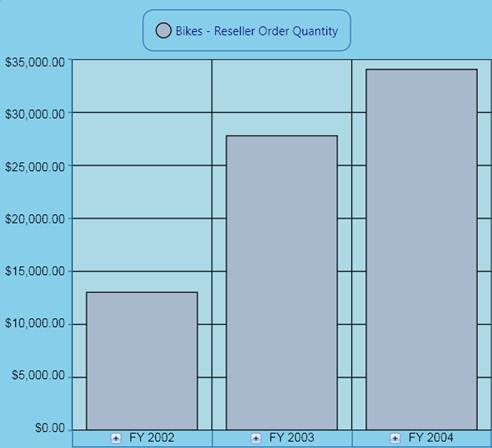

::: {style="DISPLAY: none"}
{#d2h_url_template}{#d2h_package_url style="WIDTH: 0px; DISPLAY: none; HEIGHT: 0px"}
:::

::: {.d2h_secondary_topic style="PADDING-BOTTOM: 10pt; MARGIN: 0pt; PADDING-LEFT: 0pt; PADDING-RIGHT: 0pt; PADDING-TOP: 0pt"}
##### How to customize the background properties of the OlapArea? {#how-to-customize-the-background-properties-of-the-olaparea style="tab-stops: 0pt"}

[]{style="FONT-FAMILY: 'Calibri','sans-serif'; FONT-SIZE: 11pt"} 

OlapArea allows you to customize the background properties in an easy manner. The following code snippets explain how to customize the OlapArea with various background properties:

 

###### 1.6.1.1.4.1 Background {#background style="tab-stops: 0pt"}

[]{style="FONT-FAMILY: 'Calibri','sans-serif'; COLOR: black; FONT-SIZE: 11pt"} 

+------------------------------------------------------------------------------------------------------------------------+
| **\[C#\]**                                                                                                             |
|                                                                                                                        |
|                                                                                                                        |
|                                                                                                                        |
| [       this]{style="COLOR: blue"}.olapchart1.Series\[0\].Area.Background = [Brushes]{style="COLOR: #2b91af"}.SkyBlue; |
|                                                                                                                        |
|                                                                                                                        |
+------------------------------------------------------------------------------------------------------------------------+

[]{style="FONT-FAMILY: 'Calibri','sans-serif'; FONT-SIZE: 11pt"} 

+------------------------------------------------------------------------------------------------------------------------------------------+
| **\[VB\]**                                                                                                                               |
|                                                                                                                                          |
|                                                                                                                                          |
|                                                                                                                                          |
| [       ]{style="COLOR: blue"}[Me]{style="COLOR: blue"}.olapchart1.Series(0).Area.Background = [Brushes]{style="COLOR: #2b91af"}.SkyBlue |
|                                                                                                                                          |
|                                                                                                                                          |
+------------------------------------------------------------------------------------------------------------------------------------------+

[]{style="FONT-FAMILY: 'Calibri','sans-serif'; FONT-SIZE: 11pt"} 

[]{style="FONT-FAMILY: 'Calibri','sans-serif'; FONT-SIZE: 11pt"} 

###### 1.6.1.1.4.2 GridBackground {#gridbackground style="tab-stops: 0pt"}

[]{style="FONT-FAMILY: 'Calibri','sans-serif'; COLOR: black; FONT-SIZE: 11pt"} 

+------------------------------------------------------------------------------------------------------------------------------+
| **\[C#\]**                                                                                                                   |
|                                                                                                                              |
|                                                                                                                              |
|                                                                                                                              |
| [       this]{style="COLOR: blue"}.olapchart1.Series\[0\].Area.GridBackground = [Brushes]{style="COLOR: #2b91af"}.LightBlue; |
|                                                                                                                              |
|                                                                                                                              |
+------------------------------------------------------------------------------------------------------------------------------+

[]{style="FONT-FAMILY: 'Calibri','sans-serif'; FONT-SIZE: 11pt"} 

+------------------------------------------------------------------------------------------------------------------------------------------------+
| **\[VB\]**                                                                                                                                     |
|                                                                                                                                                |
|                                                                                                                                                |
|                                                                                                                                                |
| [       ]{style="COLOR: blue"}[Me]{style="COLOR: blue"}.olapchart1.Series(0).Area.GridBackground = [Brushes]{style="COLOR: #2b91af"}.LightBlue |
|                                                                                                                                                |
|                                                                                                                                                |
+------------------------------------------------------------------------------------------------------------------------------------------------+

[]{style="FONT-FAMILY: 'Calibri','sans-serif'; FONT-SIZE: 11pt"} 

[]{style="FONT-FAMILY: 'Calibri','sans-serif'; FONT-SIZE: 11pt"} 

{border="0"}

 

Figure 29: An OlapArea of the OlapChart with customized Background and GridBackground

[]{style="FONT-FAMILY: 'Calibri','sans-serif'; FONT-SIZE: 11pt"} 

[]{#related-topics}
:::
