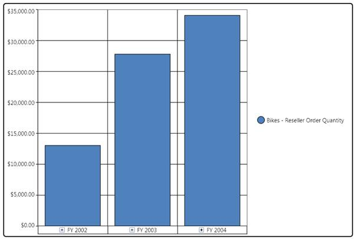

::: {style="DISPLAY: none"}
{#d2h_url_template}{#d2h_package_url style="WIDTH: 0px; DISPLAY: none; HEIGHT: 0px"}
:::

::: {.d2h_secondary_topic style="PADDING-BOTTOM: 10pt; MARGIN: 0pt; PADDING-LEFT: 0pt; PADDING-RIGHT: 0pt; PADDING-TOP: 0pt"}
##### How to customize the border properties of the OlapArea? {#how-to-customize-the-border-properties-of-the-olaparea style="tab-stops: 0pt"}

[]{style="FONT-FAMILY: 'Calibri','sans-serif'; FONT-SIZE: 11pt"} 

OlapArea allows you to customize the border properties. The following code snippets explain how these properties can be customized:

[]{style="FONT-FAMILY: 'Calibri','sans-serif'; FONT-SIZE: 11pt"} 

###### 1.6.1.1.3.1 BorderBrush {#borderbrush style="tab-stops: 0pt"}

[]{style="FONT-FAMILY: 'Calibri','sans-serif'; COLOR: black; FONT-SIZE: 11pt"} 

+----------------------------------------------------------------------------------------------------------------+
| **\[C#\]**                                                                                                     |
|                                                                                                                |
|                                                                                                                |
|                                                                                                                |
| [this]{style="COLOR: blue"}.olapchart1.Series\[0\].Area.BorderBrush = [Brushes]{style="COLOR: #2b91af"}.Black; |
|                                                                                                                |
|                                                                                                                |
+----------------------------------------------------------------------------------------------------------------+

[]{style="FONT-FAMILY: 'Calibri','sans-serif'; FONT-SIZE: 11pt"} 

+-----------------------------------------------------------------------------------------------------------------+
| **\[VB\]**                                                                                                      |
|                                                                                                                 |
|                                                                                                                 |
|                                                                                                                 |
| [      Me]{style="COLOR: blue"}.olapchart1.Series(0).Area.BorderBrush = [Brushes]{style="COLOR: #2b91af"}.Black |
|                                                                                                                 |
|                                                                                                                 |
+-----------------------------------------------------------------------------------------------------------------+

[]{style="FONT-FAMILY: 'Calibri','sans-serif'; FONT-SIZE: 11pt"} 

###### 1.6.1.1.3.2 BorderThickness {#borderthickness style="tab-stops: 0pt"}

[]{style="FONT-FAMILY: 'Calibri','sans-serif'; COLOR: black; FONT-SIZE: 11pt"} 

+-----------------------------------------------------------------------------------------------------------------------------------------------------+
| **\[C#\]**                                                                                                                                          |
|                                                                                                                                                     |
|                                                                                                                                                     |
|                                                                                                                                                     |
| [       this]{style="COLOR: blue"}.olapchart1.Series\[0\].Area.BorderThickness = [new]{style="COLOR: blue"} [Thickness]{style="COLOR: #2b91af"}(2); |
|                                                                                                                                                     |
|                                                                                                                                                     |
+-----------------------------------------------------------------------------------------------------------------------------------------------------+

[]{style="FONT-FAMILY: 'Calibri','sans-serif'; FONT-SIZE: 11pt"} 

+-----------------------------------------------------------------------------------------------------------------------------------------------+
| **\[VB\]**                                                                                                                                    |
|                                                                                                                                               |
|                                                                                                                                               |
|                                                                                                                                               |
| [      Me]{style="COLOR: blue"}.olapchart1.Series(0).Area.BorderThickness = [New]{style="COLOR: blue"} [Thickness]{style="COLOR: #2b91af"}(2) |
|                                                                                                                                               |
|                                                                                                                                               |
+-----------------------------------------------------------------------------------------------------------------------------------------------+

[]{style="FONT-FAMILY: 'Calibri','sans-serif'; FONT-SIZE: 11pt"} 

###### 1.6.1.1.3.3 CornerRadius {#cornerradius style="tab-stops: 0pt"}

[]{style="FONT-FAMILY: 'Calibri','sans-serif'; COLOR: black; FONT-SIZE: 11pt"} 

+-----------------------------------------------------------------------------------------------------------------------------------------------------+
| **\[C#\]**                                                                                                                                          |
|                                                                                                                                                     |
|                                                                                                                                                     |
|                                                                                                                                                     |
| [       this]{style="COLOR: blue"}.olapchart1.Series\[0\].Area.CornerRadius = [new]{style="COLOR: blue"} [CornerRadius]{style="COLOR: #2b91af"}(5); |
|                                                                                                                                                     |
|                                                                                                                                                     |
+-----------------------------------------------------------------------------------------------------------------------------------------------------+

[]{style="FONT-FAMILY: 'Calibri','sans-serif'; FONT-SIZE: 11pt"} 

+-----------------------------------------------------------------------------------------------------------------------------------------------+
| **\[VB\]**                                                                                                                                    |
|                                                                                                                                               |
|                                                                                                                                               |
|                                                                                                                                               |
| [      Me]{style="COLOR: blue"}.olapchart1.Series(0).Area.CornerRadius = [New]{style="COLOR: blue"} [CornerRadius]{style="COLOR: #2b91af"}(5) |
|                                                                                                                                               |
|                                                                                                                                               |
+-----------------------------------------------------------------------------------------------------------------------------------------------+

[]{style="FONT-FAMILY: 'Calibri','sans-serif'; FONT-SIZE: 11pt"} 

{border="0"}

Figure 28: An OlapArea customized with border color, border thickness, and corner radius[]{style="FONT-FAMILY: 'Calibri','sans-serif'; FONT-SIZE: 11pt"}

[]{style="FONT-FAMILY: 'Calibri','sans-serif'; FONT-SIZE: 11pt"} 

[]{#related-topics}
:::
