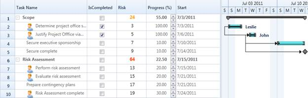

::: {style="DISPLAY: none"}
{#d2h_url_template}{#d2h_package_url style="WIDTH: 0px; DISPLAY: none; HEIGHT: 0px"}
:::

::::: {#nsbanner .d2h_main_nsbanner style="BORDER-BOTTOM: #999999 1px solid; POSITION: relative; PADDING-BOTTOM: 0px; BACKGROUND-COLOR: transparent; PADDING-LEFT: 0px; PADDING-RIGHT: 0px; DISPLAY: none; BORDER-TOP: #999999 1px solid; PADDING-TOP: 0px; LEFT: 0px"}
:::: {#TitleRow .d2h_main_titlerow style="PADDING-BOTTOM: 4px; BACKGROUND-COLOR: transparent; PADDING-LEFT: 22px; WIDTH: 100%; PADDING-RIGHT: 10px; DISPLAY: none; PADDING-TOP: 4px"}
::: {#ienav .d2h_main_ienav style="DISPLAY: none"}
{#D2HPrevious .D2HPreviousEnabled}  {#D2HNext .D2HNextEnabled}
:::
::::
:::::

:::: {#nstext .d2h_main_nstext style="PADDING-BOTTOM: 10px; BACKGROUND-COLOR: transparent; PADDING-LEFT: 22px; PADDING-RIGHT: 10px; HEIGHT: 100%; OVERFLOW: auto; PADDING-TOP: 5px" hasuserbackground="true" valign="bottom"}
::: {#d2h_breadcrumbs .d2h_breadcrumbs}
[Essential Studio User Guide Documentation](ms-xhelp:///?Id=12457748-09e3-4d74-a240-8e049cedf030){.d2h_breadcrumbsNormal}[ \> ]{.d2h_breadcrumbsLinkSeparator}[User Interface Edition](ms-xhelp:///?Id=c29296b7-531c-413b-a0ec-488ca1f7f669){.d2h_breadcrumbsNormal}[ \> ]{.d2h_breadcrumbsLinkSeparator}[Essential Silverlight](ms-xhelp:///?Id=66221bd1-ba2e-43c2-94a7-618f50e01d24){.d2h_breadcrumbsNormal}[ \> ]{.d2h_breadcrumbsLinkSeparator}[Essential Gantt]{.d2h_breadcrumbsContentsOnly}[ \> ]{.d2h_breadcrumbsLinkSeparator}[How To?](ms-xhelp:///?Id=145d5994-b759-4096-8ce7-31a94b5fe239){.d2h_breadcrumbsNormal}
:::

## How to customize the existing Columns {#how-to-customize-the-existing-columns style="TEXT-ALIGN: justify; tab-stops: 0pt"}

You can directly access the Gantt Grid columns and customize its appearance and type by defining the style info of the columns, after Gantt loads. The following code illustrates this: 

 

+------------------------------------------------------------------------------------------------------------------------------------------------------------------------------------------------------------------------------------------+
| **[\[C#\]]{style="FONT-FAMILY: 'Courier New'"}**                                                                                                                                                                                         |
|                                                                                                                                                                                                                                          |
| []{style="FONT-FAMILY: 'Courier New'"}                                                                                                                                                                                                   |
|                                                                                                                                                                                                                                          |
| [    ]{style="FONT-FAMILY: 'Courier New'; COLOR: #a31515"}[///]{style="FONT-FAMILY: 'Courier New'; COLOR: gray"}[ Hooking loaded event of Gantt]{style="FONT-FAMILY: 'Courier New'; COLOR: green"}[]{style="FONT-FAMILY: 'Courier New'"} |
|                                                                                                                                                                                                                                          |
| [    [this]{style="COLOR: blue"}.Gantt.Loaded += [new]{style="COLOR: blue"} [RoutedEventHandler]{style="COLOR: #2b91af"}(Gantt_Loaded);]{style="FONT-FAMILY: 'Courier New'"}                                                             |
|                                                                                                                                                                                                                                          |
| []{style="FONT-FAMILY: 'Courier New'"}                                                                                                                                                                                                   |
|                                                                                                                                                                                                                                          |
| [    ///]{style="FONT-FAMILY: 'Courier New'; COLOR: gray"}[ Handling the loaded event of Gantt]{style="FONT-FAMILY: 'Courier New'; COLOR: green"}[]{style="FONT-FAMILY: 'Courier New'"}                                                  |
|                                                                                                                                                                                                                                          |
| [    void]{style="FONT-FAMILY: 'Courier New'; COLOR: blue"}[ Gantt_Loaded([object]{style="COLOR: blue"} sender, [RoutedEventArgs]{style="COLOR: #2b91af"} e)]{style="FONT-FAMILY: 'Courier New'"}                                        |
|                                                                                                                                                                                                                                          |
| [        {]{style="FONT-FAMILY: 'Courier New'"}                                                                                                                                                                                          |
|                                                                                                                                                                                                                                          |
| [            [///]{style="COLOR: gray"}[ Fetching the Progress Column from the Grid(Table)]{style="COLOR: green"}]{style="FONT-FAMILY: 'Courier New'"}                                                                                   |
|                                                                                                                                                                                                                                          |
| [            [GridTreeColumn]{style="COLOR: #2b91af"} progColumn = [this]{style="COLOR: blue"}.Gantt.GanttGrid.Columns\[5\];]{style="FONT-FAMILY: 'Courier New'"}                                                                        |
|                                                                                                                                                                                                                                          |
| [            [///]{style="COLOR: gray"}[ Changing the cell type of progress Column]{style="COLOR: green"}]{style="FONT-FAMILY: 'Courier New'"}                                                                                           |
|                                                                                                                                                                                                                                          |
| [            progColumn.StyleInfo = [new]{style="COLOR: blue"} [GridStyleInfo]{style="COLOR: #2b91af"} ]{style="FONT-FAMILY: 'Courier New'"}                                                                                             |
|                                                                                                                                                                                                                                          |
| [            { ]{style="FONT-FAMILY: 'Courier New'"}                                                                                                                                                                                     |
|                                                                                                                                                                                                                                          |
| [                CellType = [\"UpDownEdit\"]{style="COLOR: #a31515"}, ]{style="FONT-FAMILY: 'Courier New'"}                                                                                                                              |
|                                                                                                                                                                                                                                          |
| [                UpDownEdit = [new]{style="COLOR: blue"} [GridUpDownEditStyleInfo]{style="COLOR: #2b91af"} { MaxValue = 100, MinValue = 0, Step = 5 } ]{style="FONT-FAMILY: 'Courier New'"}                                              |
|                                                                                                                                                                                                                                          |
| [            };]{style="FONT-FAMILY: 'Courier New'"}                                                                                                                                                                                     |
|                                                                                                                                                                                                                                          |
| [            ]{style="FONT-FAMILY: 'Courier New'"}                                                                                                                                                                                       |
|                                                                                                                                                                                                                                          |
| [            [///]{style="COLOR: gray"}[ Repopulating the GanttGrid to reflect the new changes]{style="COLOR: green"}]{style="FONT-FAMILY: 'Courier New'"}                                                                               |
|                                                                                                                                                                                                                                          |
| [            [this]{style="COLOR: blue"}.Gantt.GanttGrid.InternalGrid.PopulateGridNodes([true]{style="COLOR: blue"});]{style="FONT-FAMILY: 'Courier New'"}                                                                               |
|                                                                                                                                                                                                                                          |
| [            [this]{style="COLOR: blue"}.Gantt.GanttGrid.InternalGrid.InvalidateCells();]{style="FONT-FAMILY: 'Courier New'"}                                                                                                            |
|                                                                                                                                                                                                                                          |
| [        }]{style="FONT-FAMILY: 'Courier New'"}                                                                                                                                                                                          |
|                                                                                                                                                                                                                                          |
| []{style="FONT-FAMILY: 'Courier New'"}                                                                                                                                                                                                   |
|                                                                                                                                                                                                                                          |
| []{style="FONT-FAMILY: 'Courier New'"}                                                                                                                                                                                                   |
+------------------------------------------------------------------------------------------------------------------------------------------------------------------------------------------------------------------------------------------+

 

{border="0"}

Figure 42: Customized Columns

 

Samples Link

To view samples:

1.   Open **Syncfusion Dashboard**.

2.   Select **User Interface \> Silverlight**.

3.   Click **Run Samples**.

4.   Navigate to **Gantt \>** **Table Customization item \> Customized Table sample**.

 

[]{#related-topics}
::::
