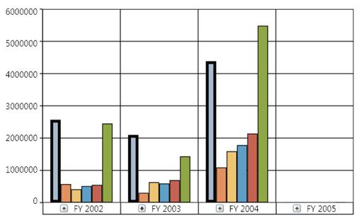
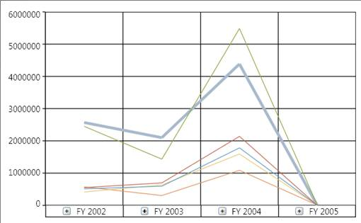
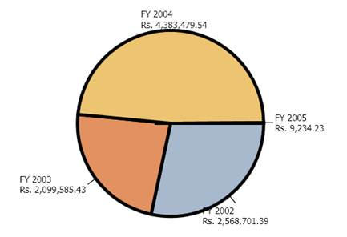

::: {style="DISPLAY: none"}
{#d2h_url_template}{#d2h_package_url style="WIDTH: 0px; DISPLAY: none; HEIGHT: 0px"}
:::

:::: {.d2h_secondary_topic style="PADDING-BOTTOM: 10pt; MARGIN: 0pt; PADDING-LEFT: 0pt; PADDING-RIGHT: 0pt; PADDING-TOP: 0pt"}
##### How to customize the series border properties? {#how-to-customize-the-series-border-properties style="tab-stops: 0pt"}

[]{style="FONT-FAMILY: 'Calibri','sans-serif'; FONT-SIZE: 11pt"} 

You can customize the thickness of the series border of an OlapChart by using the following code snippet:

 

[]{style="FONT-FAMILY: 'Calibri','sans-serif'; COLOR: black; FONT-SIZE: 11pt"} 

+--------------------------------------------------------------------------------------------------------------+
| **\[C#\]**                                                                                                   |
|                                                                                                              |
|                                                                                                              |
|                                                                                                              |
|        [this]{style="COLOR: blue"}.olapchart1.Series\[0\].Stroke = [Brushes]{style="COLOR: #2b91af"}.Black;\ |
|        [this]{style="COLOR: blue"}.olapchart1.Series\[0\].StrokeThickness = 4;                               |
|                                                                                                              |
|                                                                                                              |
+--------------------------------------------------------------------------------------------------------------+

[]{style="FONT-FAMILY: 'Calibri','sans-serif'; FONT-SIZE: 11pt"} 

+-----------------------------------------------------------------------------------------------------------+
| **\[VB\]**                                                                                                |
|                                                                                                           |
|                                                                                                           |
|                                                                                                           |
|           [Me]{style="COLOR: blue"}.olapchart1.Series(0).Stroke = [Brushes]{style="COLOR: #2b91af"}.Black |
|                                                                                                           |
|           [Me]{style="COLOR: blue"}.olapchart1.Series(0).StrokeThickness = 4                              |
|                                                                                                           |
|                                                                                                           |
+-----------------------------------------------------------------------------------------------------------+

[]{style="FONT-FAMILY: 'Calibri','sans-serif'; FONT-SIZE: 11pt"} 

::: {style="BORDER-BOTTOM: windowtext 1pt solid; BORDER-LEFT: medium none; PADDING-BOTTOM: 1pt; MARGIN-TOP: 9pt; PADDING-LEFT: 0pt; PADDING-RIGHT: 0pt; MARGIN-BOTTOM: 9pt; BORDER-TOP: windowtext 1pt solid; BORDER-RIGHT: medium none; PADDING-TOP: 1pt"}
[{border="0"}]{style="FONT-FAMILY: 'Calibri','sans-serif'; COLOR: black; FONT-SIZE: 11pt"}Note: The behaviour of the series border will vary for different chart types. The following illustration describes them in detail.
:::

**** 

The series border is applied for the first series of a Column chart by using the StrokeThickness property. Notice that the first series element is surrounded with the applied border.

{border="0"}

 

Figure 31: Stroke applied for a single series in a column type chart[]{style="FONT-FAMILY: 'Calibri','sans-serif'; FONT-SIZE: 11pt"}

***[]{style="FONT-FAMILY: 'Calibri','sans-serif'; FONT-SIZE: 11pt"}*** 

Notice the variation. The same series border property is applied for a series in the line chart. Instead of creating a 4 pixel width border it increases the thickness of the particular series line.

[]{style="FONT-FAMILY: 'Calibri','sans-serif'; FONT-SIZE: 11pt"} 

{border="0"}

Figure 32: Stroke property applied for a series in a line chart[]{style="FONT-FAMILY: 'Calibri','sans-serif'; FONT-SIZE: 11pt"}

[]{style="FONT-FAMILY: 'Calibri','sans-serif'; FONT-SIZE: 11pt"} 

Since, you know that the pie chart renders everything in a single series each block in the pie chart known as segments will have the border applied on them. This is described in the following illustration:

{border="0"}

Figure 33: Stroke property applied for a Pie chart[]{style="FONT-FAMILY: 'Calibri','sans-serif'; FONT-SIZE: 11pt"}

[]{style="FONT-FAMILY: 'Calibri','sans-serif'; FONT-SIZE: 11pt"} 

[]{#related-topics}
::::
