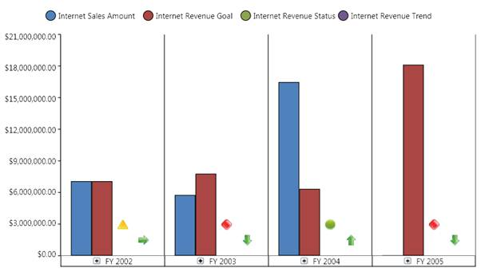

::: {style="DISPLAY: none"}
{#d2h_url_template}{#d2h_package_url style="WIDTH: 0px; DISPLAY: none; HEIGHT: 0px"}
:::

:::: {.d2h_secondary_topic style="PADDING-BOTTOM: 10pt; MARGIN: 0pt; PADDING-LEFT: 0pt; PADDING-RIGHT: 0pt; PADDING-TOP: 0pt"}
##### How to disable horizontal grid lines? {#how-to-disable-horizontal-grid-lines style="tab-stops: 0pt"}

[]{style="FONT-FAMILY: 'Calibri','sans-serif'; FONT-SIZE: 11pt"} 

In general, for column type charts, the ***horizontal grid line belongs to*** ***the secondary axis***. To disable the horizontal grid lines for these types of charts, you need to use the ShowGridLines property of the secondary axis.

The following illustration describes how the chart will look after the horizontal grid lines are disabled:[]{style="FONT-FAMILY: 'Calibri','sans-serif'; FONT-SIZE: 11pt"}

[]{style="FONT-FAMILY: 'Calibri','sans-serif'; FONT-SIZE: 11pt"} 

{border="0"}

Figure 35: An OlapChart with horizontal grid lines disabled[]{style="FONT-FAMILY: 'Calibri','sans-serif'; FONT-SIZE: 11pt"}

***[]{style="FONT-FAMILY: 'Calibri','sans-serif'; FONT-SIZE: 11pt"}*** 

The following code snippet describes how to disable the horizontal grid lines:

[]{style="FONT-FAMILY: 'Calibri','sans-serif'; COLOR: black; FONT-SIZE: 11pt"} 

+-------------------------------------------------------------------------------------------------+
| **\[C#\]**                                                                                      |
|                                                                                                 |
|                                                                                                 |
|                                                                                                 |
| [      this]{style="COLOR: blue"}.olapChart.Series\[0\].Area.SecondaryAxis.SetValue(            |
|                                                                                                 |
| [      ChartArea]{style="COLOR: #2b91af"}.ShowGridLinesProperty, [false]{style="COLOR: blue"}); |
|                                                                                                 |
|                                                                                                 |
+-------------------------------------------------------------------------------------------------+

[]{style="FONT-FAMILY: 'Calibri','sans-serif'; FONT-SIZE: 11pt"} 

+------------------------------------------------------------------------------------------------+
| **\[VB\]**                                                                                     |
|                                                                                                |
|                                                                                                |
|                                                                                                |
|           [Me]{style="COLOR: blue"}.olapChart.Series(0).Area.SecondaryAxis.SetValue(           |
|                                                                                                |
|       [ChartArea]{style="COLOR: #2b91af"}.ShowGridLinesProperty, [False]{style="COLOR: blue"}) |
|                                                                                                |
|                                                                                                |
+------------------------------------------------------------------------------------------------+

[]{style="FONT-FAMILY: 'Calibri','sans-serif'; FONT-SIZE: 11pt"} 

::: {style="BORDER-BOTTOM: windowtext 1pt solid; BORDER-LEFT: medium none; PADDING-BOTTOM: 1pt; MARGIN-TOP: 9pt; PADDING-LEFT: 0pt; PADDING-RIGHT: 0pt; MARGIN-BOTTOM: 9pt; BORDER-TOP: windowtext 1pt solid; BORDER-RIGHT: medium none; PADDING-TOP: 1pt"}
 

[{border="0"}]{style="FONT-FAMILY: 'Calibri','sans-serif'; COLOR: black; FONT-SIZE: 11pt"}Note: For bar type charts, such as Bar, Stacking bar, and Stacking100 Bar you can disable the horizontal grid lines by using the ShowGridLinesProperty of the PrimaryAxis.
:::

[]{style="FONT-FAMILY: 'Calibri','sans-serif'; FONT-SIZE: 11pt"} 

[]{#related-topics}
::::
