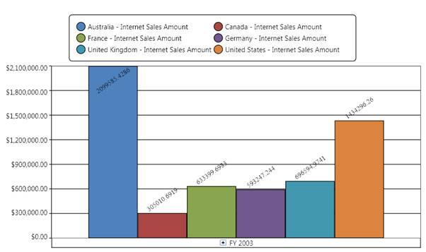

::: {style="DISPLAY: none"}
{#d2h_url_template}{#d2h_package_url style="WIDTH: 0px; DISPLAY: none; HEIGHT: 0px"}
:::

::: {.d2h_secondary_topic style="PADDING-BOTTOM: 10pt; MARGIN: 0pt; PADDING-LEFT: 0pt; PADDING-RIGHT: 0pt; PADDING-TOP: 0pt"}
##### How to display a point label in an OlapChart? {#how-to-display-a-point-label-in-an-olapchart style="tab-stops: 0pt"}

[]{style="FONT-FAMILY: 'Calibri','sans-serif'; FONT-SIZE: 11pt"} 

Point label provides information about the data point. Data point can be added to a series by using the following code snippet:

[]{style="FONT-FAMILY: 'Calibri','sans-serif'; COLOR: black; FONT-SIZE: 11pt"} 

+---------------------------------------------------------------------------------------------------------------------------+
| **\[C#\]**                                                                                                                |
|                                                                                                                           |
|                                                                                                                           |
|                                                                                                                           |
| [for]{style="COLOR: blue"}([int]{style="COLOR: blue"} i=0; i\< [this]{style="COLOR: blue"}.olapchart1.Series.Count; i++)\ |
| {\                                                                                                                        |
|     [//// Setting the visibility of adornment.]{style="COLOR: green"}\                                                    |
|     [this]{style="COLOR: blue"}.olapchart1.Series\[i\].AdornmentsInfo.Visible = [true]{style="COLOR: blue"};\             |
|  \                                                                                                                        |
|     [//// Setting horizontal alignment]{style="COLOR: green"}\                                                            |
|     [this]{style="COLOR: blue"}.olapchart1.Series\[i\].AdornmentsInfo.SegmentHorizontalAlignment =                        |
|                                                                                                                           |
| System.Windows.[HorizontalAlignment]{style="COLOR: #2b91af"}.Right;\                                                      |
|  \                                                                                                                        |
|     [//// Makes the segment out from the series.]{style="COLOR: green"}\                                                  |
|     [this]{style="COLOR: blue"}.olapchart1.Series\[i\].AdornmentsInfo.SegmentIsOut = [true]{style="COLOR: blue"};\        |
|  \                                                                                                                        |
|     [this]{style="COLOR: blue"}.olapchart1.Series\[i\].AdornmentsInfo.SegmentLabelContent =                               |
|                                                                                                                           |
| [LabelContent]{style="COLOR: #2b91af"}.LabelContentPath;                                                                  |
|                                                                                                                           |
| \                                                                                                                         |
|     [this]{style="COLOR: blue"}.olapchart1.Series\[i\].AdornmentsInfo.SegmentLabelFontSize = 12;\                         |
|     [this]{style="COLOR: blue"}.olapchart1.Series\[i\].AdornmentsInfo.SegmentLabelRotation = 325;\                        |
| }                                                                                                                         |
|                                                                                                                           |
|                                                                                                                           |
|                                                                                                                           |
|                                                                                                                           |
+---------------------------------------------------------------------------------------------------------------------------+

[]{style="FONT-FAMILY: 'Calibri','sans-serif'; FONT-SIZE: 11pt"} 

+---------------------------------------------------------------------------------------------------------------------------------------------------------------------------+
| **\[VB\]**                                                                                                                                                                |
|                                                                                                                                                                           |
|                                                                                                                                                                           |
|                                                                                                                                                                           |
| [For]{style="COLOR: blue"} i [As]{style="COLOR: blue"} [Integer]{style="COLOR: blue"} = 0 [To]{style="COLOR: blue"} [Me]{style="COLOR: blue"}.olapchart1.Series.Count - 1 |
|                                                                                                                                                                           |
|           [\' Setting the visibility of adornment.]{style="COLOR: green"}                                                                                                 |
|                                                                                                                                                                           |
|           [Me]{style="COLOR: blue"}.olapchart1.Series(i).AdornmentsInfo.Visible = [True]{style="COLOR: blue"}                                                             |
|                                                                                                                                                                           |
|                                                                                                                                                                           |
|                                                                                                                                                                           |
|           [\' Setting horizontal alignment]{style="COLOR: green"}                                                                                                         |
|                                                                                                                                                                           |
|           [Me]{style="COLOR: blue"}.olapchart1.Series(i).AdornmentsInfo.SegmentHorizontalAlignment = System.Windows.HorizontalAlignment.Right                             |
|                                                                                                                                                                           |
|                                                                                                                                                                           |
|                                                                                                                                                                           |
|           [\' Makes the segment out from the series.]{style="COLOR: green"}                                                                                               |
|                                                                                                                                                                           |
|           [Me]{style="COLOR: blue"}.olapchart1.Series(i).AdornmentsInfo.SegmentIsOut = [True]{style="COLOR: blue"}                                                        |
|                                                                                                                                                                           |
|                                                                                                                                                                           |
|                                                                                                                                                                           |
|           [Me]{style="COLOR: blue"}.olapchart1.Series(i).AdornmentsInfo.SegmentLabelContent = LabelContent.LabelContentPath                                               |
|                                                                                                                                                                           |
|           [Me]{style="COLOR: blue"}.olapchart1.Series(i).AdornmentsInfo.SegmentLabelFontSize = 12                                                                         |
|                                                                                                                                                                           |
|           [Me]{style="COLOR: blue"}.olapchart1.Series(i).AdornmentsInfo.SegmentLabelRotation = 325                                                                        |
|                                                                                                                                                                           |
| [Next]{style="COLOR: blue"} i                                                                                                                                             |
+---------------------------------------------------------------------------------------------------------------------------------------------------------------------------+

[]{style="FONT-FAMILY: 'Calibri','sans-serif'; FONT-SIZE: 11pt"} 

The following figure shows an OlapChart with PointLabels enabled:

 

{border="0"}

Figure 30: A Simple OlapChart with PointLabels[]{style="FONT-FAMILY: 'Calibri','sans-serif'; FONT-SIZE: 11pt"}

[]{style="FONT-FAMILY: 'Calibri','sans-serif'; FONT-SIZE: 11pt"} 

See also:

ChartAdornmentInfo

[]{#related-topics}
:::
