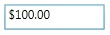

::: {style="DISPLAY: none"}
{#d2h_url_template}{#d2h_package_url style="WIDTH: 0px; DISPLAY: none; HEIGHT: 0px"}
:::

::: {.d2h_secondary_topic style="PADDING-BOTTOM: 10pt; MARGIN: 0pt; PADDING-LEFT: 0pt; PADDING-RIGHT: 0pt; PADDING-TOP: 0pt"}
#### How to enable the NullValue support {#how-to-enable-the-nullvalue-support style="tab-stops: 0pt"}

CurrencyTextBox accepts null values. To enable the null option you have to set the **UseNullOption** property to true. You can also set the **NullValue** property for the CurrencyTextBox. When you set the null value to the **Value** property, by default the value of the **NullValue** (Default value is null) property will be assigned to the Value property.

 

+------------------------------------------------------------------------------------------------------------------------------------------------------------------------------------------------------------------------------------------------------------------------------------------------------------------------------------------------------------------------------------------------------------------------------------------------------------------------------------------------------------------------------------------------------------------------------------------------------------------------------------------------------------------------------------------------------------------------------------------------------------------+
| **[XAML[]{style="COLOR: blue"}]{style="FONT-FAMILY: 'Courier New'"}**                                                                                                                                                                                                                                                                                                                                                                                                                                                                                                                                                                                                                                                                                            |
|                                                                                                                                                                                                                                                                                                                                                                                                                                                                                                                                                                                                                                                                                                                                                                  |
| []{style="FONT-FAMILY: 'Courier New'; COLOR: blue"}                                                                                                                                                                                                                                                                                                                                                                                                                                                                                                                                                                                                                                                                                                              |
|                                                                                                                                                                                                                                                                                                                                                                                                                                                                                                                                                                                                                                                                                                                                                                  |
| [\<]{style="FONT-FAMILY: 'Courier New'; COLOR: blue"}[syncfusion]{style="FONT-FAMILY: 'Courier New'; COLOR: #a31515"}[:]{style="FONT-FAMILY: 'Courier New'; COLOR: blue"}[CurrencyTextBox]{style="FONT-FAMILY: 'Courier New'; COLOR: #a31515"}[ x]{style="FONT-FAMILY: 'Courier New'; COLOR: red"}[:]{style="FONT-FAMILY: 'Courier New'; COLOR: blue"}[Name]{style="FONT-FAMILY: 'Courier New'; COLOR: red"}[=\"currencyTextBox\"]{style="FONT-FAMILY: 'Courier New'; COLOR: blue"}[ Height]{style="FONT-FAMILY: 'Courier New'; COLOR: red"}[=\"25\"]{style="FONT-FAMILY: 'Courier New'; COLOR: blue"}[ Width]{style="FONT-FAMILY: 'Courier New'; COLOR: red"}[=\"150\"]{style="FONT-FAMILY: 'Courier New'; COLOR: blue"}[ ]{style="FONT-FAMILY: 'Courier New'"} |
|                                                                                                                                                                                                                                                                                                                                                                                                                                                                                                                                                                                                                                                                                                                                                                  |
| [           [ UseNullOption]{style="COLOR: red"}[=\"True\"]{style="COLOR: blue"}[ NullValue]{style="COLOR: red"}[=\"100\"/\>]{style="COLOR: blue"}]{style="FONT-FAMILY: 'Courier New'"}                                                                                                                                                                                                                                                                                                                                                                                                                                                                                                                                                                          |
+------------------------------------------------------------------------------------------------------------------------------------------------------------------------------------------------------------------------------------------------------------------------------------------------------------------------------------------------------------------------------------------------------------------------------------------------------------------------------------------------------------------------------------------------------------------------------------------------------------------------------------------------------------------------------------------------------------------------------------------------------------------+

 

+---------------------------------------------------------------------------------------------------------------------------------------------------------+
| **[C#]{style="FONT-FAMILY: 'Courier New'"}**                                                                                                            |
|                                                                                                                                                         |
| []{style="FONT-FAMILY: 'Courier New'"}                                                                                                                  |
|                                                                                                                                                         |
| [Syncfusion.Windows.Shared.[CurrencyTextBox]{style="COLOR: #2b91af"} currencyTextBox = [new]{style="COLOR: blue"} ]{style="FONT-FAMILY: 'Courier New'"} |
|                                                                                                                                                         |
| [                          Syncfusion.Windows.Shared.[CurrencyTextBox]{style="COLOR: #2b91af"}();]{style="FONT-FAMILY: 'Courier New'"}                  |
|                                                                                                                                                         |
| [currencyTextBox.Width = 100;]{style="FONT-FAMILY: 'Courier New'"}                                                                                      |
|                                                                                                                                                         |
| [currencyTextBox.Height = 25;]{style="FONT-FAMILY: 'Courier New'"}                                                                                      |
|                                                                                                                                                         |
| [currencyTextBox.UseNullOption = [true]{style="COLOR: blue"};]{style="FONT-FAMILY: 'Courier New'"}                                                      |
|                                                                                                                                                         |
| [currencyTextBox.NullValue = 100;]{style="FONT-FAMILY: 'Courier New'"}                                                                                  |
+---------------------------------------------------------------------------------------------------------------------------------------------------------+

 

In this sample, the NullValue (NullValue = 1) is set to the Value property of the CurrencyTextBox because the default value of the Value property is zero.

 

{border="0"}

Figure 261: CurrencyTextBox

 

+------------------------------------------------------------------------------------------------------------------------------------------------------------------------------------------------------------------------------------------------------------------------------------------------------------------------------------------------------------------------------------------------------------------------------------------------------------------------------------------------------------------------------------------------------------------------------------------------------------------------------------------------------------------------------------------------------------------------------------------------------------------+
| [XAML]{style="FONT-FAMILY: 'Courier New'"}                                                                                                                                                                                                                                                                                                                                                                                                                                                                                                                                                                                                                                                                                                                       |
|                                                                                                                                                                                                                                                                                                                                                                                                                                                                                                                                                                                                                                                                                                                                                                  |
| []{style="FONT-FAMILY: 'Courier New'"}                                                                                                                                                                                                                                                                                                                                                                                                                                                                                                                                                                                                                                                                                                                           |
|                                                                                                                                                                                                                                                                                                                                                                                                                                                                                                                                                                                                                                                                                                                                                                  |
| [\<]{style="FONT-FAMILY: 'Courier New'; COLOR: blue"}[syncfusion]{style="FONT-FAMILY: 'Courier New'; COLOR: #a31515"}[:]{style="FONT-FAMILY: 'Courier New'; COLOR: blue"}[CurrencyTextBox]{style="FONT-FAMILY: 'Courier New'; COLOR: #a31515"}[ x]{style="FONT-FAMILY: 'Courier New'; COLOR: red"}[:]{style="FONT-FAMILY: 'Courier New'; COLOR: blue"}[Name]{style="FONT-FAMILY: 'Courier New'; COLOR: red"}[=\"currencyTextBox\"]{style="FONT-FAMILY: 'Courier New'; COLOR: blue"}[ Height]{style="FONT-FAMILY: 'Courier New'; COLOR: red"}[=\"25\"]{style="FONT-FAMILY: 'Courier New'; COLOR: blue"}[ Width]{style="FONT-FAMILY: 'Courier New'; COLOR: red"}[=\"150\"]{style="FONT-FAMILY: 'Courier New'; COLOR: blue"}[ ]{style="FONT-FAMILY: 'Courier New'"} |
|                                                                                                                                                                                                                                                                                                                                                                                                                                                                                                                                                                                                                                                                                                                                                                  |
| [           [ UseNullOption]{style="COLOR: red"}[=\"True\"]{style="COLOR: blue"}[ NullValue]{style="COLOR: red"}[=\"{]{style="COLOR: blue"}[x]{style="COLOR: #a31515"}[:]{style="COLOR: blue"}[Null]{style="COLOR: #a31515"}[}\"/\>]{style="COLOR: blue"}]{style="FONT-FAMILY: 'Courier New'"}                                                                                                                                                                                                                                                                                                                                                                                                                                                                   |
+------------------------------------------------------------------------------------------------------------------------------------------------------------------------------------------------------------------------------------------------------------------------------------------------------------------------------------------------------------------------------------------------------------------------------------------------------------------------------------------------------------------------------------------------------------------------------------------------------------------------------------------------------------------------------------------------------------------------------------------------------------------+

 

+---------------------------------------------------------------------------------------------------------------------------------------------------------+
| [C#]{style="FONT-FAMILY: 'Courier New'"}                                                                                                                |
|                                                                                                                                                         |
| []{style="FONT-FAMILY: 'Courier New'"}                                                                                                                  |
|                                                                                                                                                         |
| [Syncfusion.Windows.Shared.[CurrencyTextBox]{style="COLOR: #2b91af"} currencyTextBox = [new]{style="COLOR: blue"} ]{style="FONT-FAMILY: 'Courier New'"} |
|                                                                                                                                                         |
| [                          Syncfusion.Windows.Shared.[CurrencyTextBox]{style="COLOR: #2b91af"}();]{style="FONT-FAMILY: 'Courier New'"}                  |
|                                                                                                                                                         |
| [currencyTextBox.Width = 100;]{style="FONT-FAMILY: 'Courier New'"}                                                                                      |
|                                                                                                                                                         |
| [currencyTextBox.Height = 25;]{style="FONT-FAMILY: 'Courier New'"}                                                                                      |
|                                                                                                                                                         |
| [currencyTextBox.UseNullOption = [true]{style="COLOR: blue"};]{style="FONT-FAMILY: 'Courier New'"}                                                      |
|                                                                                                                                                         |
| [currencyTextBox.NullValue = [null]{style="COLOR: blue"};]{style="FONT-FAMILY: 'Courier New'"}                                                          |
+---------------------------------------------------------------------------------------------------------------------------------------------------------+

 

In this sample, the NullValue (NullValue = null) is set to the Value property of the CurrencyTextBox. (Default value of the Value property is 0).

 

{border="0"}

Figure 262: CurrencyTextBox

 

 

[]{#related-topics}
:::
