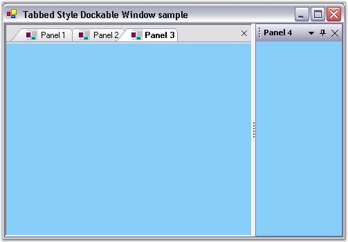

::: {style="DISPLAY: none"}
{#d2h_url_template}{#d2h_package_url style="WIDTH: 0px; DISPLAY: none; HEIGHT: 0px"}
:::

::: {.d2h_secondary_topic style="PADDING-BOTTOM: 10pt; MARGIN: 0pt; PADDING-LEFT: 0pt; PADDING-RIGHT: 0pt; PADDING-TOP: 0pt"}
##### How to Enable the Tabbed Style Dockable Window using TabbedMDI manager? {#how-to-enable-the-tabbed-style-dockable-window-using-tabbedmdi-manager style="tab-stops: 0pt"}

 

The Tabbed MDI Package provides a new Tabbed MDI layout mode (as an alternative to the default Cascade and Tiled modes), popularized by VS .NET.

 

We can enable and attach the dockable window into the Tabbed MDI manager during application startup using the following simple steps.

[]{style="COLOR: #15428b"} 

[·      ]{style="FONT-FAMILY: Symbol"}Add 4 panels and the DockingManager to your application.

[·      ]{style="FONT-FAMILY: Symbol"}Declare the TabbedMDIManager.

[]{style="COLOR: #15428b"} 

+------------------------------------------------------------------------------------------------------------------------------------------------------+
| **[\[C#\]]{style="FONT-FAMILY: 'Courier New'; COLOR: black"}**                                                                                       |
|                                                                                                                                                      |
| **[]{style="FONT-FAMILY: 'Courier New'; COLOR: black"}**                                                                                             |
|                                                                                                                                                      |
| [private]{style="FONT-FAMILY: 'Courier New'; COLOR: blue"}[ Syncfusion.Windows.Forms.Tools.TabbedMDIManager tm;]{style="FONT-FAMILY: 'Courier New'"} |
+------------------------------------------------------------------------------------------------------------------------------------------------------+

[]{style="COLOR: #15428b"} 

+-------------------------------------------------------------------------------------------------------------------------------------------------------------------------------+
| **[\[VB.NET\]]{style="FONT-FAMILY: 'Courier New'; COLOR: black"}**                                                                                                            |
|                                                                                                                                                                               |
| **[]{style="FONT-FAMILY: 'Courier New'; COLOR: black"}**                                                                                                                      |
|                                                                                                                                                                               |
| [Private]{style="FONT-FAMILY: 'Courier New'; COLOR: blue"}[ tm [As]{style="COLOR: blue"} Syncfusion.Windows.Forms.Tools.TabbedMDIManager]{style="FONT-FAMILY: 'Courier New'"} |
+-------------------------------------------------------------------------------------------------------------------------------------------------------------------------------+

[]{style="COLOR: #15428b"} 

[·      ]{style="FONT-FAMILY: Symbol"}Set the form\'s **IsMDIContainer** property to true. Add a form, form2 to the project.

[·      ]{style="FONT-FAMILY: Symbol"}In the form constructor, you have to enable the dockable window into an MDIChild by calling the SetAsMDIChild method. This has to be done before calling the AttachToMdiContainer method. It will give the look and feel of the VS. NET editor with dockable tabbed window appearance.

 

+-----------------------------------------------------------------------------------------------------------------------------------------------------------------------------------------------------------------------------------+
| **[\[C#\]]{style="FONT-FAMILY: 'Courier New'; COLOR: black"}**                                                                                                                                                                    |
|                                                                                                                                                                                                                                   |
| **[]{style="FONT-FAMILY: 'Courier New'; COLOR: black"}**                                                                                                                                                                          |
|                                                                                                                                                                                                                                   |
| [// Enables docking for panel.]{style="FONT-FAMILY: 'Courier New'; COLOR: green"}                                                                                                                                                 |
|                                                                                                                                                                                                                                   |
| [this]{style="FONT-FAMILY: 'Courier New'; COLOR: blue"}[.dockingManager1.SetEnableDocking([this]{style="COLOR: blue"}.panel1,[true]{style="COLOR: blue"});]{style="FONT-FAMILY: 'Courier New'"}                                   |
|                                                                                                                                                                                                                                   |
| [this]{style="FONT-FAMILY: 'Courier New'; COLOR: blue"}[.dockingManager1.SetEnableDocking([this]{style="COLOR: blue"}.panel2,[true]{style="COLOR: blue"});]{style="FONT-FAMILY: 'Courier New'"}                                   |
|                                                                                                                                                                                                                                   |
| [this]{style="FONT-FAMILY: 'Courier New'; COLOR: blue"}[.dockingManager1.SetEnableDocking([this]{style="COLOR: blue"}.panel3,[true]{style="COLOR: blue"});]{style="FONT-FAMILY: 'Courier New'"}                                   |
|                                                                                                                                                                                                                                   |
| [this]{style="FONT-FAMILY: 'Courier New'; COLOR: blue"}[.dockingManager1.SetEnableDocking([this]{style="COLOR: blue"}.panel4,[true]{style="COLOR: blue"});]{style="FONT-FAMILY: 'Courier New'"}                                   |
|                                                                                                                                                                                                                                   |
| []{style="FONT-FAMILY: 'Courier New'"}                                                                                                                                                                                            |
|                                                                                                                                                                                                                                   |
| [// Sets dock label.            ]{style="FONT-FAMILY: 'Courier New'; COLOR: green"}                                                                                                                                               |
|                                                                                                                                                                                                                                   |
| [this]{style="FONT-FAMILY: 'Courier New'; COLOR: blue"}[.dockingManager1.SetDockLabel([this]{style="COLOR: blue"}.panel1,[\"Panel 1\"]{style="COLOR: maroon"});                             ]{style="FONT-FAMILY: 'Courier New'"} |
|                                                                                                                                                                                                                                   |
| [this]{style="FONT-FAMILY: 'Courier New'; COLOR: blue"}[.dockingManager1.SetDockLabel([this]{style="COLOR: blue"}.panel2,[\"Panel 2\"]{style="COLOR: maroon"});]{style="FONT-FAMILY: 'Courier New'"}                              |
|                                                                                                                                                                                                                                   |
| [this]{style="FONT-FAMILY: 'Courier New'; COLOR: blue"}[.dockingManager1.SetDockLabel([this]{style="COLOR: blue"}.panel3,[\"Panel 3\"]{style="COLOR: maroon"});]{style="FONT-FAMILY: 'Courier New'"}                              |
|                                                                                                                                                                                                                                   |
| [this]{style="FONT-FAMILY: 'Courier New'; COLOR: blue"}[.dockingManager1.SetDockLabel([this]{style="COLOR: blue"}.panel4,[\"Panel 4\"]{style="COLOR: maroon"});]{style="FONT-FAMILY: 'Courier New'"}                              |
|                                                                                                                                                                                                                                   |
| []{style="FONT-FAMILY: 'Courier New'; COLOR: green"}                                                                                                                                                                              |
|                                                                                                                                                                                                                                   |
| [// Changes docking window to MDI child window.]{style="FONT-FAMILY: 'Courier New'; COLOR: green"}                                                                                                                                |
|                                                                                                                                                                                                                                   |
| [this]{style="FONT-FAMILY: 'Courier New'; COLOR: blue"}[.dockingManager1.SetAsMDIChild([this]{style="COLOR: blue"}.panel1,[true]{style="COLOR: blue"});]{style="FONT-FAMILY: 'Courier New'"}                                      |
|                                                                                                                                                                                                                                   |
| [this]{style="FONT-FAMILY: 'Courier New'; COLOR: blue"}[.dockingManager1.SetAsMDIChild([this]{style="COLOR: blue"}.panel2,[true]{style="COLOR: blue"});]{style="FONT-FAMILY: 'Courier New'"}                                      |
|                                                                                                                                                                                                                                   |
| [this]{style="FONT-FAMILY: 'Courier New'; COLOR: blue"}[.dockingManager1.SetAsMDIChild([this]{style="COLOR: blue"}.panel3,[true]{style="COLOR: blue"});]{style="FONT-FAMILY: 'Courier New'"}                                      |
|                                                                                                                                                                                                                                   |
| []{style="FONT-FAMILY: 'Courier New'; COLOR: black"}                                                                                                                                                                              |
|                                                                                                                                                                                                                                   |
| [    [// Attach MDI container to TabbedMDI manager.]{style="COLOR: green"}]{style="FONT-FAMILY: 'Courier New'"}                                                                                                                   |
|                                                                                                                                                                                                                                   |
| [this]{style="FONT-FAMILY: 'Courier New'; COLOR: blue"}[.tm= [new]{style="COLOR: blue"} TabbedMDIManager();]{style="FONT-FAMILY: 'Courier New'"}                                                                                  |
|                                                                                                                                                                                                                                   |
| [this]{style="FONT-FAMILY: 'Courier New'; COLOR: blue"}[.tm.TabControlAdded+= [new]{style="COLOR: blue"} TabbedMDITabControlEventHandler(tm_TabControlAdded);]{style="FONT-FAMILY: 'Courier New'"}                                |
|                                                                                                                                                                                                                                   |
| [    ]{style="FONT-FAMILY: 'Courier New'"}                                                                                                                                                                                        |
|                                                                                                                                                                                                                                   |
| [    [// Assign the MDI form into the TabbedManager MDI container.]{style="COLOR: green"}]{style="FONT-FAMILY: 'Courier New'"}                                                                                                    |
|                                                                                                                                                                                                                                   |
| [this]{style="FONT-FAMILY: 'Courier New'; COLOR: blue"}[.tb.AttachToMdiContainer([this]{style="COLOR: blue"});]{style="FONT-FAMILY: 'Courier New'"}                                                                               |
|                                                                                                                                                                                                                                   |
| [this]{style="FONT-FAMILY: 'Courier New'; COLOR: blue"}[.dockingManager1.VisualStyle = Syncfusion.Windows.Forms.VisualStyle.Office2003;]{style="FONT-FAMILY: 'Courier New'"}                                                      |
+-----------------------------------------------------------------------------------------------------------------------------------------------------------------------------------------------------------------------------------+

[]{style="COLOR: #15428b"} 

+---------------------------------------------------------------------------------------------------------------------------------------------------------------------------------------------+
| **[\[VB.NET\]]{style="FONT-FAMILY: 'Courier New'; COLOR: black"}**                                                                                                                          |
|                                                                                                                                                                                             |
| **[]{style="FONT-FAMILY: 'Courier New'; COLOR: black"}**                                                                                                                                    |
|                                                                                                                                                                                             |
| [\'Enables docking for panel.]{style="FONT-FAMILY: 'Courier New'; COLOR: green"}                                                                                                            |
|                                                                                                                                                                                             |
| [Me]{style="FONT-FAMILY: 'Courier New'; COLOR: blue"}[.dockingManager1.SetEnableDocking([Me]{style="COLOR: blue"}.panel1, [True]{style="COLOR: blue"})]{style="FONT-FAMILY: 'Courier New'"} |
|                                                                                                                                                                                             |
| [Me]{style="FONT-FAMILY: 'Courier New'; COLOR: blue"}[.dockingManager1.SetEnableDocking([Me]{style="COLOR: blue"}.panel2,[True]{style="COLOR: blue"})]{style="FONT-FAMILY: 'Courier New'"}  |
|                                                                                                                                                                                             |
| [Me]{style="FONT-FAMILY: 'Courier New'; COLOR: blue"}[.dockingManager1.SetEnableDocking([Me]{style="COLOR: blue"}.panel3,[True]{style="COLOR: blue"})]{style="FONT-FAMILY: 'Courier New'"}  |
|                                                                                                                                                                                             |
| [Me]{style="FONT-FAMILY: 'Courier New'; COLOR: blue"}[.dockingManager1.SetEnableDocking([Me]{style="COLOR: blue"}.panel4, [True]{style="COLOR: blue"})]{style="FONT-FAMILY: 'Courier New'"} |
|                                                                                                                                                                                             |
| [\'Sets dock label.            ]{style="FONT-FAMILY: 'Courier New'; COLOR: green"}                                                                                                          |
|                                                                                                                                                                                             |
| [Me]{style="FONT-FAMILY: 'Courier New'; COLOR: blue"}[.dockingManager1.SetDockLabel([Me]{style="COLOR: blue"}.panel1,\"Panel 1\")]{style="FONT-FAMILY: 'Courier New'"}                      |
|                                                                                                                                                                                             |
| [Me]{style="FONT-FAMILY: 'Courier New'; COLOR: blue"}[.dockingManager1.SetDockLabel([Me]{style="COLOR: blue"}.panel2,\"Panel 2\")]{style="FONT-FAMILY: 'Courier New'"}                      |
|                                                                                                                                                                                             |
| [Me]{style="FONT-FAMILY: 'Courier New'; COLOR: blue"}[.dockingManager1.SetDockLabel([Me]{style="COLOR: blue"}.panel3,\"Panel 3\")]{style="FONT-FAMILY: 'Courier New'"}                      |
|                                                                                                                                                                                             |
| []{style="FONT-FAMILY: 'Courier New'"}                                                                                                                                                      |
|                                                                                                                                                                                             |
| [\'Changes docking window to MDI child window.]{style="FONT-FAMILY: 'Courier New'; COLOR: green"}                                                                                           |
|                                                                                                                                                                                             |
| [Me]{style="FONT-FAMILY: 'Courier New'; COLOR: blue"}[.dockingManager1.SetAsMDIChild([Me]{style="COLOR: blue"}.panel1,[True]{style="COLOR: blue"})]{style="FONT-FAMILY: 'Courier New'"}     |
|                                                                                                                                                                                             |
| [Me]{style="FONT-FAMILY: 'Courier New'; COLOR: blue"}[.dockingManager1.SetAsMDIChild([Me]{style="COLOR: blue"}.panel2,[True]{style="COLOR: blue"})]{style="FONT-FAMILY: 'Courier New'"}     |
|                                                                                                                                                                                             |
| [Me]{style="FONT-FAMILY: 'Courier New'; COLOR: blue"}[.dockingManager1.SetAsMDIChild([Me]{style="COLOR: blue"}.panel3,[True]{style="COLOR: blue"})]{style="FONT-FAMILY: 'Courier New'"}     |
|                                                                                                                                                                                             |
| [Me]{style="FONT-FAMILY: 'Courier New'; COLOR: blue"}[.dockingManager1.SetAsMdiChild([Me]{style="COLOR: blue"}.Panel4, [True]{style="COLOR: blue"})]{style="FONT-FAMILY: 'Courier New'"}    |
|                                                                                                                                                                                             |
| [\'Attach MDI container to TabbedMDI manager.]{style="FONT-FAMILY: 'Courier New'; COLOR: green"}                                                                                            |
|                                                                                                                                                                                             |
| [Me]{style="FONT-FAMILY: 'Courier New'; COLOR: blue"}[.tm= [New]{style="COLOR: blue"} TabbedMDIManager()]{style="FONT-FAMILY: 'Courier New'"}                                               |
|                                                                                                                                                                                             |
| [AddHandler]{style="FONT-FAMILY: 'Courier New'; COLOR: blue"}[ tm.TabControlAdded, [AddressOf]{style="COLOR: blue"} tm_TabControlAdded]{style="FONT-FAMILY: 'Courier New'"}                 |
|                                                                                                                                                                                             |
| [ [\' Assign the MDI form into the TabbedManager MDI container.]{style="COLOR: green"}]{style="FONT-FAMILY: 'Courier New'"}                                                                 |
|                                                                                                                                                                                             |
| [Me]{style="FONT-FAMILY: 'Courier New'; COLOR: blue"}[.tb.AttachToMdiContainer([Me]{style="COLOR: blue"})]{style="FONT-FAMILY: 'Courier New'"}                                              |
|                                                                                                                                                                                             |
| [Me]{style="FONT-FAMILY: 'Courier New'; COLOR: blue"}[.dockingManager1.VisualStyle = Syncfusion.Windows.Forms.VisualStyle.Office2003]{style="FONT-FAMILY: 'Courier New'"}                   |
+---------------------------------------------------------------------------------------------------------------------------------------------------------------------------------------------+

[]{style="COLOR: #15428b"} 

[·      ]{style="FONT-FAMILY: Symbol"}You can also change the appearance of the tabs by applying the TabStyle in the TabControlAdded event.

[]{style="COLOR: #15428b"} 

+--------------------------------------------------------------------------------------------------------------------------------------------------------------------------------------------------------------------------+
| **[\[C#\]]{style="FONT-FAMILY: 'Courier New'; COLOR: black"}**                                                                                                                                                           |
|                                                                                                                                                                                                                          |
| **[]{style="FONT-FAMILY: 'Courier New'; COLOR: black"}**                                                                                                                                                                 |
|                                                                                                                                                                                                                          |
| [// Enable the rendering for the Tabbed MDI manager tabs.]{style="FONT-FAMILY: 'Courier New'; COLOR: green"}                                                                                                             |
|                                                                                                                                                                                                                          |
| [private]{style="FONT-FAMILY: 'Courier New'; COLOR: blue"}[ [void]{style="COLOR: blue"} tm_TabControlAdded([object]{style="COLOR: blue"} sender, TabbedMDITabControlEventArgs args)]{style="FONT-FAMILY: 'Courier New'"} |
|                                                                                                                                                                                                                          |
| [{]{style="FONT-FAMILY: 'Courier New'"}                                                                                                                                                                                  |
|                                                                                                                                                                                                                          |
| [      args.TabControl.TabStyle = [typeof]{style="COLOR: blue"}(TabRendererWhidbey);]{style="FONT-FAMILY: 'Courier New'"}                                                                                                |
|                                                                                                                                                                                                                          |
| [}]{style="FONT-FAMILY: 'Courier New'"}                                                                                                                                                                                  |
+--------------------------------------------------------------------------------------------------------------------------------------------------------------------------------------------------------------------------+

[]{style="COLOR: #15428b"} 

+---------------------------------------------------------------------------------------------------------------------------------------------------------------------------------------------------------------------------------------------------------------------------------------------------------------------------------------+
| **[\[VB.NET\]]{style="FONT-FAMILY: 'Courier New'; COLOR: black"}**                                                                                                                                                                                                                                                                    |
|                                                                                                                                                                                                                                                                                                                                       |
| **[]{style="FONT-FAMILY: 'Courier New'; COLOR: black"}**                                                                                                                                                                                                                                                                              |
|                                                                                                                                                                                                                                                                                                                                       |
| [\'Enable the rendering for the Tabbed MDI manager tabs.]{style="FONT-FAMILY: 'Courier New'; COLOR: green"}                                                                                                                                                                                                                           |
|                                                                                                                                                                                                                                                                                                                                       |
| [Private]{style="FONT-FAMILY: 'Courier New'; COLOR: blue"}[ [Sub]{style="COLOR: blue"} tm_TabControlAdded([ByVal]{style="COLOR: blue"} sender [As]{style="COLOR: blue"} [Object]{style="COLOR: blue"}, [ByVal]{style="COLOR: blue"} args [As]{style="COLOR: blue"} TabbedMDITabControlEventArgs)]{style="FONT-FAMILY: 'Courier New'"} |
|                                                                                                                                                                                                                                                                                                                                       |
| [      args.TabControl.TabStyle=[GetType]{style="COLOR: blue"}(TabRendererWhidbey)]{style="FONT-FAMILY: 'Courier New'"}                                                                                                                                                                                                               |
|                                                                                                                                                                                                                                                                                                                                       |
| [End]{style="FONT-FAMILY: 'Courier New'; COLOR: blue"}[ [Sub]{style="COLOR: blue"}]{style="FONT-FAMILY: 'Courier New'"}                                                                                                                                                                                                               |
+---------------------------------------------------------------------------------------------------------------------------------------------------------------------------------------------------------------------------------------------------------------------------------------------------------------------------------------+

[]{style="COLOR: blue; FONT-SIZE: 8pt"} 

[{border="0"}]{style="COLOR: blue; FONT-SIZE: 8pt"}[]{style="COLOR: blue; FONT-SIZE: 8pt"}

[]{style="FONT-SIZE: 8pt"} 

Figure 101: Tabbed Style Dockable Window

**[]{style="COLOR: #15428b"}** 

See Also

 

[Tabbed Docking]{.UGHyperlink}[]{.UGHyperlink}

[[]{style="TEXT-DECORATION: none"}]{.UGHyperlink} 

[]{#related-topics}
:::
