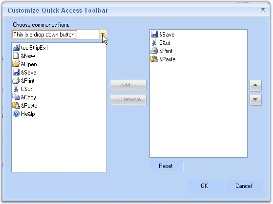

::: {style="DISPLAY: none"}
{#d2h_url_template}{#d2h_package_url style="WIDTH: 0px; DISPLAY: none; HEIGHT: 0px"}
:::

::: {.d2h_secondary_topic style="PADDING-BOTTOM: 10pt; MARGIN: 0pt; PADDING-LEFT: 0pt; PADDING-RIGHT: 0pt; PADDING-TOP: 0pt"}
##### How to get or set the description on RibbonControlAdv? {#how-to-get-or-set-the-description-on-ribboncontroladv style="MARGIN-LEFT: 18pt; tab-stops: 18.0pt"}

[]{style="COLOR: #15428b"} 

The **GetDescription** or **SetDescription** methods of the RibbonControlAdv can be used to gets / sets the text that is displayed with the component in the quick panel customizing dialog.

[]{style="COLOR: #15428b"} 

+-----------------------------------------------------------------------------------------------------------------------------------------------------------------------------------------------------------------------------------------+
| **[\[C#\]]{style="FONT-FAMILY: 'Courier New'; COLOR: black"}**                                                                                                                                                                          |
|                                                                                                                                                                                                                                         |
| []{style="COLOR: #15428b"}                                                                                                                                                                                                              |
|                                                                                                                                                                                                                                         |
| [//Gets the description]{style="FONT-FAMILY: 'Courier New'; COLOR: green"}                                                                                                                                                              |
|                                                                                                                                                                                                                                         |
| [this]{style="FONT-FAMILY: 'Courier New'; COLOR: blue"}[.ribbonControlAdv1.GetDescription([this]{style="COLOR: blue"}.toolStripTabItem1);]{style="FONT-FAMILY: 'Courier New'"}                                                          |
|                                                                                                                                                                                                                                         |
| []{style="COLOR: #15428b"}                                                                                                                                                                                                              |
|                                                                                                                                                                                                                                         |
| [//Sets the description]{style="FONT-FAMILY: 'Courier New'; COLOR: green"}                                                                                                                                                              |
|                                                                                                                                                                                                                                         |
| [this]{style="FONT-FAMILY: 'Courier New'; COLOR: blue"}[.ribbonControlAdv1.SetDescription([this]{style="COLOR: blue"}.toolStripTabItem1, [\"This is a drop down button\"]{style="COLOR: maroon"});]{style="FONT-FAMILY: 'Courier New'"} |
+-----------------------------------------------------------------------------------------------------------------------------------------------------------------------------------------------------------------------------------------+

[]{style="COLOR: #15428b"} 

+------------------------------------------------------------------------------------------------------------------------------------------------------------------------------------------------------------------------------------+
| **[\[VB.NET\]]{style="FONT-FAMILY: 'Courier New'; COLOR: black"}**                                                                                                                                                                 |
|                                                                                                                                                                                                                                    |
| []{style="COLOR: black"}                                                                                                                                                                                                           |
|                                                                                                                                                                                                                                    |
| [\'Gets the description]{style="FONT-FAMILY: 'Courier New'; COLOR: green"}                                                                                                                                                         |
|                                                                                                                                                                                                                                    |
| [this]{style="FONT-FAMILY: 'Courier New'; COLOR: blue"}[.ribbonControlAdv1.GetDescription([this]{style="COLOR: blue"}.toolStripTabItem1);]{style="FONT-FAMILY: 'Courier New'"}                                                     |
|                                                                                                                                                                                                                                    |
| []{style="FONT-FAMILY: 'Courier New'; COLOR: green"}                                                                                                                                                                               |
|                                                                                                                                                                                                                                    |
| [\'Sets the description]{style="FONT-FAMILY: 'Courier New'; COLOR: green"}                                                                                                                                                         |
|                                                                                                                                                                                                                                    |
| [Me]{style="FONT-FAMILY: 'Courier New'; COLOR: blue"}[.ribbonControlAdv1.SetDescription([Me]{style="COLOR: blue"}.toolStripTabItem1, [\"This is a drop down button\"]{style="COLOR: maroon"})]{style="FONT-FAMILY: 'Courier New'"} |
+------------------------------------------------------------------------------------------------------------------------------------------------------------------------------------------------------------------------------------+

[]{style="COLOR: #15428b"} 

{border="0"}

[]{style="COLOR: #15428b"} 

Figure 1468: Customize Quick Access Toolbar Dialog with Description at Run Time

 

[]{#related-topics}
:::
