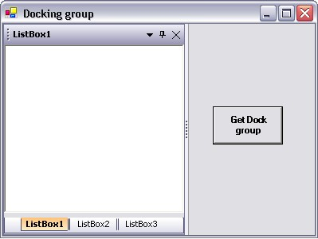

::: {style="DISPLAY: none"}
{#d2h_url_template}{#d2h_package_url style="WIDTH: 0px; DISPLAY: none; HEIGHT: 0px"}
:::

::: {.d2h_secondary_topic style="PADDING-BOTTOM: 10pt; MARGIN: 0pt; PADDING-LEFT: 0pt; PADDING-RIGHT: 0pt; PADDING-TOP: 0pt"}
##### How to get the docking group details? {#how-to-get-the-docking-group-details style="tab-stops: 0pt"}

[]{#p139}[]{style="COLOR: #15428b"} 

To get the docking group

[]{style="COLOR: #15428b"} 

There is no concept of \'group\' in Docking Manager and a tabbed group is just an intermediate state. However, if necessary, this can be determined by first ascertaining that the control is in a tabbed docking group, getting hold of the DockTabController, it's DockTab and then iterating the DockTabPages. The dhcClient member of each DockTabPage will reference the DockHostController that is associated with it. Once the controller is available, you can get to the control through the DockHostController.HostControl property and use the control's Controls\[0\] indexer to get the actual dockable control.

[]{style="COLOR: #15428b"} 

Follow the given steps to get the docking group.

[]{style="COLOR: #15428b"} 

1.   Add three listboxes, a button and a docking manager to the form.

2.   Set the EnableDocking on Docking Manager property to true.

3.   Add the namespace Syncfusion.Windows.Forms.Tools in your application.

[  ]{style="COLOR: #15428b"}

+--------------------------------------------------------------------------------------------------------------------------------+
| **[\[C#\]]{style="FONT-FAMILY: 'Courier New'; COLOR: black"}**                                                                 |
|                                                                                                                                |
| []{style="FONT-FAMILY: 'Courier New'; COLOR: blue"}                                                                            |
|                                                                                                                                |
| [using]{style="FONT-FAMILY: 'Courier New'; COLOR: blue"}[ Syncfusion.Windows.Forms.Tools;]{style="FONT-FAMILY: 'Courier New'"} |
+--------------------------------------------------------------------------------------------------------------------------------+

[]{style="COLOR: #15428b"} 

+---------------------------------------------------------------------------------------------------------------------------------+
| **[\[VB.NET\]]{style="FONT-FAMILY: 'Courier New'; COLOR: black"}**                                                              |
|                                                                                                                                 |
| **[]{style="FONT-FAMILY: 'Courier New'; COLOR: black"}**                                                                        |
|                                                                                                                                 |
| [Imports]{style="FONT-FAMILY: 'Courier New'; COLOR: blue"}[ Syncfusion.Windows.Forms.Tools]{style="FONT-FAMILY: 'Courier New'"} |
+---------------------------------------------------------------------------------------------------------------------------------+

[     ]{style="COLOR: #15428b"}

4.   Tab the controls as shown below.

[]{style="COLOR: #15428b"} 

{border="0"}

[]{style="COLOR: #15428b"} 

Figure 104: Docking Group dialog box to get the Docking Group Details

[]{style="COLOR: #15428b"} 

Add the code given below in the button click event.

[]{style="COLOR: #15428b"} 

+--------------------------------------------------------------------------------------------------------------------------------------------------------------------------------------------------------------+
| **[\[C#\]]{style="FONT-FAMILY: 'Courier New'; COLOR: black"}**                                                                                                                                               |
|                                                                                                                                                                                                              |
| **[]{style="FONT-FAMILY: 'Courier New'; COLOR: black"}**                                                                                                                                                     |
|                                                                                                                                                                                                              |
| [Syncfusion.Windows.Forms.Tools.DockHost dhost = [this]{style="COLOR: blue"}.listBox1.Parent [as]{style="COLOR: blue"} Syncfusion.Windows.Forms.Tools.DockHost; ]{style="FONT-FAMILY: 'Courier New'"}        |
|                                                                                                                                                                                                              |
| [Syncfusion.Windows.Forms.Tools.DockHostController dhc = dhost.InternalController [as]{style="COLOR: blue"}  Syncfusion.Windows.Forms.Tools.DockHostController;]{style="FONT-FAMILY: 'Courier New'"}         |
|                                                                                                                                                                                                              |
| [// If ParentController is DockTabController the control will be in a tab.]{style="FONT-FAMILY: 'Courier New'; COLOR: green"}                                                                                |
|                                                                                                                                                                                                              |
| [if]{style="FONT-FAMILY: 'Courier New'; COLOR: blue"}[(dhc.ParentController [is]{style="COLOR: blue"} Syncfusion.Windows.Forms.Tools.DockTabController) ]{style="FONT-FAMILY: 'Courier New'"}                |
|                                                                                                                                                                                                              |
| [{ ]{style="FONT-FAMILY: 'Courier New'"}                                                                                                                                                                     |
|                                                                                                                                                                                                              |
| [       [// Getting the DockTabControl from the DockTabController.]{style="COLOR: green"}]{style="FONT-FAMILY: 'Courier New'"}                                                                               |
|                                                                                                                                                                                                              |
| [Syncfusion.Windows.Forms.Tools.DockTabControl docktab = (dhc.ParentController [as]{style="COLOR: blue"}  Syncfusion.Windows.Forms.Tools.DockTabController).TabControl;]{style="FONT-FAMILY: 'Courier New'"} |
|                                                                                                                                                                                                              |
| []{style="FONT-FAMILY: 'Courier New'"}                                                                                                                                                                       |
|                                                                                                                                                                                                              |
| [       [// Iterating through the tabpages to get other controls in that tab.]{style="COLOR: green"}]{style="FONT-FAMILY: 'Courier New'"}                                                                    |
|                                                                                                                                                                                                              |
| [       [foreach]{style="COLOR: blue"}(DockTabPage tabpage [in]{style="COLOR: blue"} docktab.TabPages) ]{style="FONT-FAMILY: 'Courier New'"}                                                                 |
|                                                                                                                                                                                                              |
| [       { ]{style="FONT-FAMILY: 'Courier New'"}                                                                                                                                                              |
|                                                                                                                                                                                                              |
| [           Control siblingcontrol = tabpage.dhcClient.HostControl.Controls\[0\];]{style="FONT-FAMILY: 'Courier New'"}                                                                                       |
|                                                                                                                                                                                                              |
| [           MessageBox.Show(siblingcontrol.Name);]{style="FONT-FAMILY: 'Courier New'"}                                                                                                                       |
|                                                                                                                                                                                                              |
| [       }]{style="FONT-FAMILY: 'Courier New'"}                                                                                                                                                               |
|                                                                                                                                                                                                              |
| [}]{style="FONT-FAMILY: 'Courier New'"}                                                                                                                                                                      |
+--------------------------------------------------------------------------------------------------------------------------------------------------------------------------------------------------------------+

[]{style="COLOR: #15428b"} 

+-------------------------------------------------------------------------------------------------------------------------------------------------------------------------------------------------------------------------------------------------------------------------------------------------------------------------------------------------------------------------------------------------------------------------------------------------------------------------+
| **[\[VB.NET\]]{style="FONT-FAMILY: 'Courier New'; COLOR: black"}**                                                                                                                                                                                                                                                                                                                                                                                                      |
|                                                                                                                                                                                                                                                                                                                                                                                                                                                                         |
| **[]{style="FONT-FAMILY: 'Courier New'; COLOR: black"}**                                                                                                                                                                                                                                                                                                                                                                                                                |
|                                                                                                                                                                                                                                                                                                                                                                                                                                                                         |
| [Dim]{style="FONT-FAMILY: 'Courier New'; COLOR: blue"}[ dhost [As]{style="COLOR: blue"} Syncfusion.Windows.Forms.Tools.DockHost = [CType]{style="COLOR: blue"}(IIf([TypeOf]{style="COLOR: blue"} [Me]{style="COLOR: blue"}.listBox1.Parent [Is]{style="COLOR: blue"} Syncfusion.Windows.Forms.Tools.DockHost, [Me]{style="COLOR: blue"}.listBox1.Parent, [Nothing]{style="COLOR: blue"}), Syncfusion.Windows.Forms.Tools.DockHost)]{style="FONT-FAMILY: 'Courier New'"} |
|                                                                                                                                                                                                                                                                                                                                                                                                                                                                         |
| [Dim]{style="FONT-FAMILY: 'Courier New'; COLOR: blue"}[ dhc [As]{style="COLOR: blue"} Syncfusion.Windows.Forms.Tools.DockHostController = [CType]{style="COLOR: blue"}(IIf([TypeOf]{style="COLOR: blue"} dhost.InternalController [Is]{style="COLOR: blue"} Syncfusion.Windows.Forms.Tools.DockHostController, dhost.InternalController, [Nothing]{style="COLOR: blue"}), Syncfusion.Windows.Forms.Tools.DockHostController)]{style="FONT-FAMILY: 'Courier New'"}       |
|                                                                                                                                                                                                                                                                                                                                                                                                                                                                         |
| []{style="FONT-FAMILY: 'Courier New'; COLOR: green"}                                                                                                                                                                                                                                                                                                                                                                                                                    |
|                                                                                                                                                                                                                                                                                                                                                                                                                                                                         |
| [    \'If Parentcontroller is DockTabController the control will be in a tab.]{style="FONT-FAMILY: 'Courier New'; COLOR: green"}                                                                                                                                                                                                                                                                                                                                        |
|                                                                                                                                                                                                                                                                                                                                                                                                                                                                         |
| [    [If]{style="COLOR: blue"} [TypeOf]{style="COLOR: blue"} dhc.ParentController [Is]{style="COLOR: blue"} Syncfusion.Windows.Forms.Tools.DockTabController [Then]{style="COLOR: blue"}]{style="FONT-FAMILY: 'Courier New'"}                                                                                                                                                                                                                                           |
|                                                                                                                                                                                                                                                                                                                                                                                                                                                                         |
| [       ]{style="FONT-FAMILY: 'Courier New'; COLOR: green"}                                                                                                                                                                                                                                                                                                                                                                                                             |
|                                                                                                                                                                                                                                                                                                                                                                                                                                                                         |
| [       \'Getting the DockTabControl from the DockTabController]{style="FONT-FAMILY: 'Courier New'; COLOR: green"}                                                                                                                                                                                                                                                                                                                                                      |
|                                                                                                                                                                                                                                                                                                                                                                                                                                                                         |
| [Dim]{style="FONT-FAMILY: 'Courier New'; COLOR: blue"}[ docktab [As]{style="COLOR: blue"} Syncfusion.Windows.Forms.Tools.DockTabControl = ([CType]{style="COLOR: blue"}(IIf([TypeOf]{style="COLOR: blue"} dhc.ParentController [Is ]{style="COLOR: blue"} Syncfusion.Windows.Forms.Tools.DockTabController, dhc.ParentController, [Nothing]{style="COLOR: blue"}), Syncfusion.Windows.Forms.Tools.DockTabController)).TabControl]{style="FONT-FAMILY: 'Courier New'"}   |
|                                                                                                                                                                                                                                                                                                                                                                                                                                                                         |
| [      ]{style="FONT-FAMILY: 'Courier New'; COLOR: green"}                                                                                                                                                                                                                                                                                                                                                                                                              |
|                                                                                                                                                                                                                                                                                                                                                                                                                                                                         |
| [       \'Iterating through the tabpages to get other controls in that tab.]{style="FONT-FAMILY: 'Courier New'; COLOR: green"}                                                                                                                                                                                                                                                                                                                                          |
|                                                                                                                                                                                                                                                                                                                                                                                                                                                                         |
| [        [For]{style="COLOR: blue"} [Each]{style="COLOR: blue"} tabpage [As]{style="COLOR: blue"} DockTabPage [In]{style="COLOR: blue"} docktab.TabPages]{style="FONT-FAMILY: 'Courier New'"}                                                                                                                                                                                                                                                                           |
|                                                                                                                                                                                                                                                                                                                                                                                                                                                                         |
| [            Dim]{style="FONT-FAMILY: 'Courier New'; COLOR: blue"}[ siblingcontrol [As]{style="COLOR: blue"} Control = tabpage.dhcClient.HostControl.Controls(0)]{style="FONT-FAMILY: 'Courier New'"}                                                                                                                                                                                                                                                                   |
|                                                                                                                                                                                                                                                                                                                                                                                                                                                                         |
| [            MessageBox.Show(siblingcontrol.Name)]{style="FONT-FAMILY: 'Courier New'"}                                                                                                                                                                                                                                                                                                                                                                                  |
|                                                                                                                                                                                                                                                                                                                                                                                                                                                                         |
| [    [Next]{style="COLOR: blue"} tabpage]{style="FONT-FAMILY: 'Courier New'"}                                                                                                                                                                                                                                                                                                                                                                                           |
|                                                                                                                                                                                                                                                                                                                                                                                                                                                                         |
| [End]{style="FONT-FAMILY: 'Courier New'; COLOR: blue"}[ [If]{style="COLOR: blue"}]{style="FONT-FAMILY: 'Courier New'"}                                                                                                                                                                                                                                                                                                                                                  |
+-------------------------------------------------------------------------------------------------------------------------------------------------------------------------------------------------------------------------------------------------------------------------------------------------------------------------------------------------------------------------------------------------------------------------------------------------------------------------+

[]{#p140} 

[]{#related-topics}
:::
