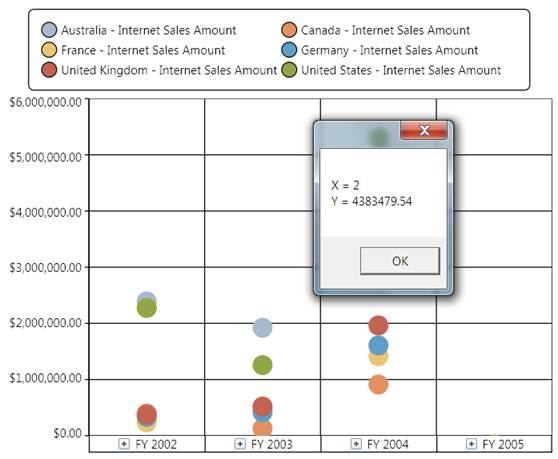

::: {style="DISPLAY: none"}
{#d2h_url_template}{#d2h_package_url style="WIDTH: 0px; DISPLAY: none; HEIGHT: 0px"}
:::

::: {.d2h_secondary_topic style="PADDING-BOTTOM: 10pt; MARGIN: 0pt; PADDING-LEFT: 0pt; PADDING-RIGHT: 0pt; PADDING-TOP: 0pt"}
##### How to handle ChartMouseEventArgs {#how-to-handle-chartmouseeventargs style="tab-stops: 0pt"}

ChartMouseEventArgs are the arguments returned when the mouse events are triggered by the ChartSeries. ChartMouseEventArgs return the segment on which the mouse events are triggered along with the default mouse event args. This event args can be used to perform customization of a segment when a mouse event is encountered. The segment returns different values that can be used to perform calculations or operations.

The following code snippet demonstrates how the ChartMouseEventArgs can be used to retrieve information on the ChartSeries segment:

 

+--------------------------------------------------------------------------------------------------------------------------------------------------------------------------------------------------------+
| \[C#\]                                                                                                                                                                                                 |
|                                                                                                                                                                                                        |
| [//// Event tagging]{style="COLOR: green"}                                                                                                                                                             |
|                                                                                                                                                                                                        |
| [this]{style="COLOR: blue"}.olapchart1.Series\[0\].MouseClick += [new]{style="COLOR: blue"} [ChartMouseEventHandler]{style="COLOR: #2b91af"}(series_MouseClick);                                       |
|                                                                                                                                                                                                        |
|                                                                                                                                                                                                        |
|                                                                                                                                                                                                        |
| [////]{style="COLOR: gray"}[ Mouse click event for a series.]{style="COLOR: green"}\                                                                                                                   |
| [void]{style="COLOR: blue"} series_MouseClick([object]{style="COLOR: blue"} sender, [ChartMouseEventArgs]{style="COLOR: #2b91af"} e)\                                                                  |
| {\                                                                                                                                                                                                     |
|     [ChartPoint]{style="COLOR: #2b91af"} point = ([ChartPoint]{style="COLOR: #2b91af"})e.Segment.CorrespondingPoints\[0\].DataPoint;\                                                                  |
|     [MessageBox]{style="COLOR: #2b91af"}.Show([\"X = \"]{style="COLOR: #a31515"} + point.X.ToString() + [\"\\n\"]{style="COLOR: #a31515"} + [\"Y = \"]{style="COLOR: #a31515"} + point.Y.ToString());\ |
| }                                                                                                                                                                                                      |
+--------------------------------------------------------------------------------------------------------------------------------------------------------------------------------------------------------+

[]{style="FONT-FAMILY: 'Calibri','sans-serif'; FONT-SIZE: 11pt"} 

+--------------------------------------------------------------------------------------------------------------------------------------------------------------------------------------------------------------------------------------------------------+
| **\[VB\]**                                                                                                                                                                                                                                             |
|                                                                                                                                                                                                                                                        |
|                                                                                                                                                                                                                                                        |
|                                                                                                                                                                                                                                                        |
| [\' Event tagging]{style="COLOR: green"}                                                                                                                                                                                                               |
|                                                                                                                                                                                                                                                        |
| [AddHandler]{style="COLOR: blue"} olapchart1.Series(0).MouseClick, [AddressOf]{style="COLOR: blue"} series_MouseClick                                                                                                                                  |
|                                                                                                                                                                                                                                                        |
|                                                                                                                                                                                                                                                        |
|                                                                                                                                                                                                                                                        |
|                                                                                                                                                                                                                                                        |
|                                                                                                                                                                                                                                                        |
| [\' Mouse click event for a series.]{style="COLOR: green"}                                                                                                                                                                                             |
|                                                                                                                                                                                                                                                        |
| [Private]{style="COLOR: blue"} [Sub]{style="COLOR: blue"} series_MouseClick([ByVal]{style="COLOR: blue"} sender [As]{style="COLOR: blue"} [Object]{style="COLOR: blue"}, [ByVal]{style="COLOR: blue"} e [As]{style="COLOR: blue"} ChartMouseEventArgs) |
|                                                                                                                                                                                                                                                        |
|           [Dim]{style="COLOR: blue"} point [As]{style="COLOR: blue"} ChartPoint = [CType]{style="COLOR: blue"}(e.Segment.CorrespondingPoints(0).DataPoint, ChartPoint)                                                                                 |
|                                                                                                                                                                                                                                                        |
|           MessageBox.Show(\"X = \" & point.X.ToString() & Constants.vbLf & \"Y = \" & point.Y.ToString())                                                                                                                                              |
|                                                                                                                                                                                                                                                        |
| [End]{style="COLOR: blue"} [Sub]{style="COLOR: blue"}                                                                                                                                                                                                  |
|                                                                                                                                                                                                                                                        |
|                                                                                                                                                                                                                                                        |
+--------------------------------------------------------------------------------------------------------------------------------------------------------------------------------------------------------------------------------------------------------+

[]{style="FONT-FAMILY: 'Calibri','sans-serif'; FONT-SIZE: 11pt"} 

{border="0"}

Figure 34:\" Displays the Data Point obtained by using the ChartMouseEventArgs on a MouseClick

 

See Also

[[Chart Series]{.UGHyperlink}](http://help.syncfusion.com/ug_82/WPFBI_Chart/ChartSeries.html)[]{.UGHyperlink}

[]{style="FONT-FAMILY: 'Calibri','sans-serif'; FONT-SIZE: 11pt"} 

[]{#related-topics}
:::
