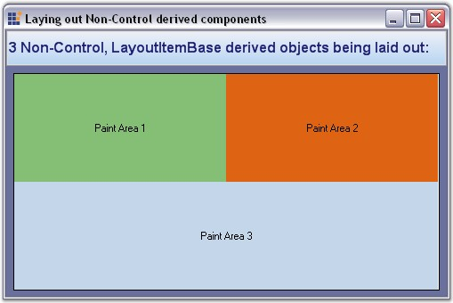

::: {style="DISPLAY: none"}
{#d2h_url_template}{#d2h_package_url style="WIDTH: 0px; DISPLAY: none; HEIGHT: 0px"}
:::

::: {.d2h_secondary_topic style="PADDING-BOTTOM: 10pt; MARGIN: 0pt; PADDING-LEFT: 0pt; PADDING-RIGHT: 0pt; PADDING-TOP: 0pt"}
#### How to layout non-control based Child components {#how-to-layout-non-control-based-child-components style="tab-stops: 0pt"}

[]{style="COLOR: #15428b"} 

The Layout Manager architecture seamlessly lets you use non-control derived Child-instances as the layout\'s Child controls. You can easily accomplish this by deriving your Child-types from the **LayoutItemBase** type and implementing methods. These instances can be used in any of the Layout Manager methods in the place of a Child control (for ex: SetConstraints, SetPreferredSize). This is feasible because the LayoutItemBase class has an implicit type-conversion operator that can convert itself to a control (use LayoutItemBase.ToControl method in VB.NET).

 

The following step by step procedure helps you to layout non-control based Child components.

 

Drag and drop the Panel (Container control) and GridBagLayout control to the form.

 

Use Step 1 to Step 5 in **Form_Load** event,

[]{style="COLOR: #15428b"} 

1.   Declare variables representing the Child control (non-control based components).

[]{style="COLOR: #15428b"} 

+--------------------------------------------------------------------------------------------------------------------------------------------------------------------------------------+
| **[\[C#\]]{style="FONT-FAMILY: 'Courier New'; COLOR: black"}**                                                                                                                       |
|                                                                                                                                                                                      |
| []{style="FONT-FAMILY: 'Courier New'; COLOR: black"}                                                                                                                                 |
|                                                                                                                                                                                      |
| [private]{style="FONT-FAMILY: 'Courier New'; COLOR: blue"}[ [MyRectangle]{style="COLOR: teal"} myRect1;]{style="FONT-FAMILY: 'Courier New'"}                                         |
|                                                                                                                                                                                      |
| [private]{style="FONT-FAMILY: 'Courier New'; COLOR: blue"}[ [MyRectangle]{style="COLOR: teal"} myRect2;]{style="FONT-FAMILY: 'Courier New'"}                                         |
|                                                                                                                                                                                      |
| [private]{style="FONT-FAMILY: 'Courier New'; COLOR: blue"}[ [MyRectangle]{style="COLOR: teal"} myRect3;]{style="FONT-FAMILY: 'Courier New'"}                                         |
|                                                                                                                                                                                      |
| [private]{style="FONT-FAMILY: 'Courier New'; COLOR: blue"}[ Syncfusion.Windows.Forms.Tools.[GridBagLayout]{style="COLOR: teal"} gridBagLayout1;]{style="FONT-FAMILY: 'Courier New'"} |
|                                                                                                                                                                                      |
| [private]{style="FONT-FAMILY: 'Courier New'; COLOR: blue"}[ [MyPanel]{style="COLOR: teal"} panel1;]{style="FONT-FAMILY: 'Courier New'"}                                              |
+--------------------------------------------------------------------------------------------------------------------------------------------------------------------------------------+

[]{style="COLOR: #15428b"} 

+------------------------------------------------------------------------------------------------------------------------------------------------------------------------------------------+
| **[\[VB.NET\]]{style="FONT-FAMILY: 'Courier New'; COLOR: black"}**                                                                                                                       |
|                                                                                                                                                                                          |
| []{style="FONT-FAMILY: 'Courier New'; COLOR: black"}                                                                                                                                     |
|                                                                                                                                                                                          |
| [Private]{style="FONT-FAMILY: 'Courier New'; COLOR: blue"}[ [WithEvents]{style="COLOR: blue"} myRect1 [As]{style="COLOR: blue"} MyRectangle]{style="FONT-FAMILY: 'Courier New'"}         |
|                                                                                                                                                                                          |
| [Private]{style="FONT-FAMILY: 'Courier New'; COLOR: blue"}[ [WithEvents]{style="COLOR: blue"} myRect2 [As]{style="COLOR: blue"} MyRectangle]{style="FONT-FAMILY: 'Courier New'"}         |
|                                                                                                                                                                                          |
| [Private]{style="FONT-FAMILY: 'Courier New'; COLOR: blue"}[ [WithEvents]{style="COLOR: blue"} myRect3 [As]{style="COLOR: blue"} MyRectangle]{style="FONT-FAMILY: 'Courier New'"}         |
|                                                                                                                                                                                          |
| [Private]{style="FONT-FAMILY: 'Courier New'; COLOR: blue"}[ gridBagLayout1 [As]{style="COLOR: blue"} Syncfusion.Windows.Forms.Tools.GridBagLayout ;]{style="FONT-FAMILY: 'Courier New'"} |
|                                                                                                                                                                                          |
| [Private]{style="FONT-FAMILY: 'Courier New'; COLOR: blue"}[ panel1 [As ]{style="COLOR: blue"}MyPanel ;]{style="FONT-FAMILY: 'Courier New'"}                                              |
+------------------------------------------------------------------------------------------------------------------------------------------------------------------------------------------+

[]{style="COLOR: #15428b"} 

2.   Set the Container control, color and text for the above variables (non-control based components).

[]{style="COLOR: #15428b"} 

+--------------------------------------------------------------------------------------------------------------------------------------------------------------------------------------------------------------------------------------------------------------------------------------------------------------------------------------+
| **[\[C#\]]{style="FONT-FAMILY: 'Courier New'; COLOR: black"}**                                                                                                                                                                                                                                                                       |
|                                                                                                                                                                                                                                                                                                                                      |
| []{style="FONT-FAMILY: 'Courier New'; COLOR: black"}                                                                                                                                                                                                                                                                                 |
|                                                                                                                                                                                                                                                                                                                                      |
| [// Layout Component 1]{style="FONT-FAMILY: 'Courier New'; COLOR: green"}                                                                                                                                                                                                                                                            |
|                                                                                                                                                                                                                                                                                                                                      |
| [this]{style="FONT-FAMILY: 'Courier New'; COLOR: blue"}[.myRect1 = [new]{style="COLOR: blue"} [MyRectangle]{style="COLOR: teal"}([this]{style="COLOR: blue"}.gridBagLayout1.ContainerControl, [Color]{style="COLOR: teal"}.FromArgb(133, 191, 117), [\"Paint Area 1\"]{style="COLOR: maroon"});]{style="FONT-FAMILY: 'Courier New'"} |
|                                                                                                                                                                                                                                                                                                                                      |
| [this]{style="FONT-FAMILY: 'Courier New'; COLOR: blue"}[.myRect1.Bounds = [new]{style="COLOR: blue"} [Rectangle]{style="COLOR: teal"}(10, 10, 80, 20);]{style="FONT-FAMILY: 'Courier New'"}                                                                                                                                          |
|                                                                                                                                                                                                                                                                                                                                      |
| [this]{style="FONT-FAMILY: 'Courier New'; COLOR: blue"}[.myRect1.Visible = [true]{style="COLOR: blue"};]{style="FONT-FAMILY: 'Courier New'"}                                                                                                                                                                                         |
|                                                                                                                                                                                                                                                                                                                                      |
| []{style="FONT-FAMILY: 'Courier New'"}                                                                                                                                                                                                                                                                                               |
|                                                                                                                                                                                                                                                                                                                                      |
| [// Layout Component 2]{style="FONT-FAMILY: 'Courier New'; COLOR: green"}                                                                                                                                                                                                                                                            |
|                                                                                                                                                                                                                                                                                                                                      |
| [this]{style="FONT-FAMILY: 'Courier New'; COLOR: blue"}[.myRect2 = [new]{style="COLOR: blue"} [MyRectangle]{style="COLOR: teal"}([this]{style="COLOR: blue"}.gridBagLayout1.ContainerControl, [Color]{style="COLOR: teal"}.FromArgb(222, 100, 19), [\"Paint Area 2\"]{style="COLOR: maroon"});]{style="FONT-FAMILY: 'Courier New'"}  |
|                                                                                                                                                                                                                                                                                                                                      |
| [this]{style="FONT-FAMILY: 'Courier New'; COLOR: blue"}[.myRect2.Bounds = [new]{style="COLOR: blue"} [Rectangle]{style="COLOR: teal"}(10, 40, 80, 20);]{style="FONT-FAMILY: 'Courier New'"}                                                                                                                                          |
|                                                                                                                                                                                                                                                                                                                                      |
| [this]{style="FONT-FAMILY: 'Courier New'; COLOR: blue"}[.myRect2.Visible = [true]{style="COLOR: blue"};]{style="FONT-FAMILY: 'Courier New'"}                                                                                                                                                                                         |
|                                                                                                                                                                                                                                                                                                                                      |
| []{style="FONT-FAMILY: 'Courier New'"}                                                                                                                                                                                                                                                                                               |
|                                                                                                                                                                                                                                                                                                                                      |
| [// Layout Component 3]{style="FONT-FAMILY: 'Courier New'; COLOR: green"}                                                                                                                                                                                                                                                            |
|                                                                                                                                                                                                                                                                                                                                      |
| [this]{style="FONT-FAMILY: 'Courier New'; COLOR: blue"}[.myRect3 = [new]{style="COLOR: blue"} [MyRectangle]{style="COLOR: teal"}([this]{style="COLOR: blue"}.gridBagLayout1.ContainerControl, [Color]{style="COLOR: teal"}.FromArgb(196, 214, 233), [\"Paint Area 3\"]{style="COLOR: maroon"});]{style="FONT-FAMILY: 'Courier New'"} |
|                                                                                                                                                                                                                                                                                                                                      |
| [this]{style="FONT-FAMILY: 'Courier New'; COLOR: blue"}[.myRect3.Bounds = [new]{style="COLOR: blue"} [Rectangle]{style="COLOR: teal"}(10, 70, 80, 20);]{style="FONT-FAMILY: 'Courier New'"}                                                                                                                                          |
|                                                                                                                                                                                                                                                                                                                                      |
| [this]{style="FONT-FAMILY: 'Courier New'; COLOR: blue"}[.myRect3.Visible = [true]{style="COLOR: blue"};]{style="FONT-FAMILY: 'Courier New'"}                                                                                                                                                                                         |
+--------------------------------------------------------------------------------------------------------------------------------------------------------------------------------------------------------------------------------------------------------------------------------------------------------------------------------------+

[]{style="COLOR: #15428b"} 

+----------------------------------------------------------------------------------------------------------------------------------------------------------------------------------------------------------------------------------------------------------------------------------+
| **[\[VB.NET\]]{style="FONT-FAMILY: 'Courier New'; COLOR: black"}**                                                                                                                                                                                                               |
|                                                                                                                                                                                                                                                                                  |
| []{style="FONT-FAMILY: 'Courier New'; COLOR: black"}                                                                                                                                                                                                                             |
|                                                                                                                                                                                                                                                                                  |
| [\' Layout Component 1]{style="FONT-FAMILY: 'Courier New'; COLOR: green"}                                                                                                                                                                                                        |
|                                                                                                                                                                                                                                                                                  |
| [Me]{style="FONT-FAMILY: 'Courier New'; COLOR: blue"}[.myRect1 = [New]{style="COLOR: blue"} MyRectangle([Me]{style="COLOR: blue"}.gridBagLayout1.ContainerControl,Color.FromArgb(133, 191, 117), [\"Paint Area 1\"]{style="COLOR: maroon"})]{style="FONT-FAMILY: 'Courier New'"} |
|                                                                                                                                                                                                                                                                                  |
| [Me]{style="FONT-FAMILY: 'Courier New'; COLOR: blue"}[.myRect1.Bounds = [New]{style="COLOR: blue"} Rectangle(10, 10, 80, 20)]{style="FONT-FAMILY: 'Courier New'"}                                                                                                                |
|                                                                                                                                                                                                                                                                                  |
| [Me]{style="FONT-FAMILY: 'Courier New'; COLOR: blue"}[.myRect1.Visible = [True]{style="COLOR: blue"}]{style="FONT-FAMILY: 'Courier New'"}                                                                                                                                        |
|                                                                                                                                                                                                                                                                                  |
| []{style="FONT-FAMILY: 'Courier New'; COLOR: green"}                                                                                                                                                                                                                             |
|                                                                                                                                                                                                                                                                                  |
| [\' Layout Component 2]{style="FONT-FAMILY: 'Courier New'; COLOR: green"}                                                                                                                                                                                                        |
|                                                                                                                                                                                                                                                                                  |
| [Me]{style="FONT-FAMILY: 'Courier New'; COLOR: blue"}[.myRect2 = [New]{style="COLOR: blue"} MyRectangle([Me]{style="COLOR: blue"}.gridBagLayout1.ContainerControl,Color.FromArgb(222, 100, 19), [\"Paint Area 2\"]{style="COLOR: maroon"})]{style="FONT-FAMILY: 'Courier New'"}  |
|                                                                                                                                                                                                                                                                                  |
| [Me]{style="FONT-FAMILY: 'Courier New'; COLOR: blue"}[.myRect2.Bounds = [New]{style="COLOR: blue"} Rectangle(10, 40, 80, 20)]{style="FONT-FAMILY: 'Courier New'"}                                                                                                                |
|                                                                                                                                                                                                                                                                                  |
| [Me]{style="FONT-FAMILY: 'Courier New'; COLOR: blue"}[.myRect2.Visible = [True]{style="COLOR: blue"}]{style="FONT-FAMILY: 'Courier New'"}                                                                                                                                        |
|                                                                                                                                                                                                                                                                                  |
| []{style="FONT-FAMILY: 'Courier New'"}                                                                                                                                                                                                                                           |
|                                                                                                                                                                                                                                                                                  |
| [\' Layout Component 3]{style="FONT-FAMILY: 'Courier New'; COLOR: green"}                                                                                                                                                                                                        |
|                                                                                                                                                                                                                                                                                  |
| [Me]{style="FONT-FAMILY: 'Courier New'; COLOR: blue"}[.myRect3 = [New]{style="COLOR: blue"} MyRectangle([Me]{style="COLOR: blue"}.gridBagLayout1.ContainerControl,Color.FromArgb(196, 214, 233), [\"Paint Area 3\"]{style="COLOR: maroon"})]{style="FONT-FAMILY: 'Courier New'"} |
|                                                                                                                                                                                                                                                                                  |
| [Me]{style="FONT-FAMILY: 'Courier New'; COLOR: blue"}[.myRect3.Bounds = [New]{style="COLOR: blue"} Rectangle(10, 70, 80, 20)]{style="FONT-FAMILY: 'Courier New'"}                                                                                                                |
|                                                                                                                                                                                                                                                                                  |
| [Me]{style="FONT-FAMILY: 'Courier New'; COLOR: blue"}[.myRect3.Visible = [True]{style="COLOR: blue"}]{style="FONT-FAMILY: 'Courier New'"}                                                                                                                                        |
+----------------------------------------------------------------------------------------------------------------------------------------------------------------------------------------------------------------------------------------------------------------------------------+

[]{style="COLOR: #15428b"} 

3.   Declare instances for the GridBagConstraints which specifies how the components will be positioned inside a Container managed by the GridBagLayout control.

[]{style="COLOR: #15428b"} 

+--------------------------------------------------------------------------------------------------------------------------------------------------------------------------------------------+
| **[\[C#\]]{style="FONT-FAMILY: 'Courier New'; COLOR: black"}**                                                                                                                             |
|                                                                                                                                                                                            |
| []{style="FONT-FAMILY: 'Courier New'; COLOR: black"}                                                                                                                                       |
|                                                                                                                                                                                            |
| [GridBagConstraints]{style="FONT-FAMILY: 'Courier New'; COLOR: teal"}[ gbc1 = [new]{style="COLOR: blue"} [GridBagConstraints]{style="COLOR: teal"}();]{style="FONT-FAMILY: 'Courier New'"} |
|                                                                                                                                                                                            |
| [GridBagConstraints]{style="FONT-FAMILY: 'Courier New'; COLOR: teal"}[ gbc2 = [new]{style="COLOR: blue"} [GridBagConstraints]{style="COLOR: teal"}();]{style="FONT-FAMILY: 'Courier New'"} |
|                                                                                                                                                                                            |
| [GridBagConstraints]{style="FONT-FAMILY: 'Courier New'; COLOR: teal"}[ gbc3 = [new]{style="COLOR: blue"} [GridBagConstraints]{style="COLOR: teal"}();]{style="FONT-FAMILY: 'Courier New'"} |
+--------------------------------------------------------------------------------------------------------------------------------------------------------------------------------------------+

[]{style="COLOR: #15428b"} 

+------------------------------------------------------------------------------------------------------------------------------------------------+
| **[\[VB.NET\]]{style="FONT-FAMILY: 'Courier New'; COLOR: black"}**                                                                             |
|                                                                                                                                                |
| []{style="FONT-FAMILY: 'Courier New'; COLOR: black"}                                                                                           |
|                                                                                                                                                |
| [Dim]{style="FONT-FAMILY: 'Courier New'; COLOR: blue"}[ gbc1 [As]{style="COLOR: blue"} GridBagConstraints]{style="FONT-FAMILY: 'Courier New'"} |
|                                                                                                                                                |
| [gbc1 = [New]{style="COLOR: blue"} GridBagConstraints()]{style="FONT-FAMILY: 'Courier New'"}                                                   |
|                                                                                                                                                |
| [Dim]{style="FONT-FAMILY: 'Courier New'; COLOR: blue"}[ gbc2 [As]{style="COLOR: blue"} GridBagConstraints]{style="FONT-FAMILY: 'Courier New'"} |
|                                                                                                                                                |
| [gbc2 = [New]{style="COLOR: blue"} GridBagConstraints()]{style="FONT-FAMILY: 'Courier New'"}                                                   |
|                                                                                                                                                |
| [Dim]{style="FONT-FAMILY: 'Courier New'; COLOR: blue"}[ gbc3 [As]{style="COLOR: blue"} GridBagConstraints]{style="FONT-FAMILY: 'Courier New'"} |
|                                                                                                                                                |
| [gbc3 = [New]{style="COLOR: blue"} GridBagConstraints()]{style="FONT-FAMILY: 'Courier New'"}                                                   |
+------------------------------------------------------------------------------------------------------------------------------------------------+

[]{style="COLOR: #15428b"} 

4.   Set the FillType, WeightX, WeightY, GridPosX and GridPosY properties for the components.

[]{style="COLOR: #15428b"} 

+-----------------------------------------------------------------------------------------+
| **[\[C#\]]{style="FONT-FAMILY: 'Courier New'; COLOR: black"}**                          |
|                                                                                         |
| []{style="FONT-FAMILY: 'Courier New'; COLOR: black"}                                    |
|                                                                                         |
| [gbc1.Fill = [FillType]{style="COLOR: teal"}.Both;]{style="FONT-FAMILY: 'Courier New'"} |
|                                                                                         |
| [gbc1.WeightX = 0.2;]{style="FONT-FAMILY: 'Courier New'"}                               |
|                                                                                         |
| [gbc1.WeightY = 0.5;]{style="FONT-FAMILY: 'Courier New'"}                               |
|                                                                                         |
| [gbc1.GridPosX = 0;]{style="FONT-FAMILY: 'Courier New'"}                                |
|                                                                                         |
| [gbc1.GridPosY = 0;]{style="FONT-FAMILY: 'Courier New'"}                                |
|                                                                                         |
| []{style="FONT-FAMILY: 'Courier New'"}                                                  |
|                                                                                         |
| [gbc2.Fill = [FillType]{style="COLOR: teal"}.Both;]{style="FONT-FAMILY: 'Courier New'"} |
|                                                                                         |
| [gbc2.WeightX = 0.2;]{style="FONT-FAMILY: 'Courier New'"}                               |
|                                                                                         |
| [gbc2.WeightY = 0.5;]{style="FONT-FAMILY: 'Courier New'"}                               |
|                                                                                         |
| [gbc2.GridPosX = 1;]{style="FONT-FAMILY: 'Courier New'"}                                |
|                                                                                         |
| [gbc2.GridPosY = 0;]{style="FONT-FAMILY: 'Courier New'"}                                |
|                                                                                         |
| []{style="FONT-FAMILY: 'Courier New'"}                                                  |
|                                                                                         |
| [gbc3.Fill = [FillType]{style="COLOR: teal"}.Both;]{style="FONT-FAMILY: 'Courier New'"} |
|                                                                                         |
| [gbc3.WeightX = 0.4;]{style="FONT-FAMILY: 'Courier New'"}                               |
|                                                                                         |
| [gbc3.WeightY = 0.5;]{style="FONT-FAMILY: 'Courier New'"}                               |
|                                                                                         |
| [gbc3.GridPosX = 0;]{style="FONT-FAMILY: 'Courier New'"}                                |
|                                                                                         |
| [gbc3.GridPosY = 1;]{style="FONT-FAMILY: 'Courier New'"}                                |
|                                                                                         |
| [gbc3.CellSpanX = 2;]{style="FONT-FAMILY: 'Courier New'"}                               |
+-----------------------------------------------------------------------------------------+

[]{style="COLOR: #15428b"} 

+-----------------------------------------------------------------------+
| **[\[VB.NET\]]{style="FONT-FAMILY: 'Courier New'; COLOR: black"}**    |
|                                                                       |
| []{style="FONT-FAMILY: 'Courier New'; COLOR: black"}                  |
|                                                                       |
| [gbc1.Fill = FillType.Both]{style="FONT-FAMILY: 'Courier New'"}       |
|                                                                       |
| [gbc1.WeightX = 0.2]{style="FONT-FAMILY: 'Courier New'"}              |
|                                                                       |
| [gbc1.WeightY = 0.5]{style="FONT-FAMILY: 'Courier New'"}              |
|                                                                       |
| [gbc1.GridPosX = 0]{style="FONT-FAMILY: 'Courier New'"}               |
|                                                                       |
| [gbc1.GridPosY = 0]{style="FONT-FAMILY: 'Courier New'"}               |
|                                                                       |
| []{style="FONT-FAMILY: 'Courier New'"}                                |
|                                                                       |
| [gbc2.Fill = FillType.Both]{style="FONT-FAMILY: 'Courier New'"}       |
|                                                                       |
| [gbc2.WeightX = 0.2]{style="FONT-FAMILY: 'Courier New'"}              |
|                                                                       |
| [gbc2.WeightY = 0.5]{style="FONT-FAMILY: 'Courier New'"}              |
|                                                                       |
| [gbc2.GridPosX = 1]{style="FONT-FAMILY: 'Courier New'"}               |
|                                                                       |
| [gbc2.GridPosY = 0]{style="FONT-FAMILY: 'Courier New'"}               |
|                                                                       |
| []{style="FONT-FAMILY: 'Courier New'"}                                |
|                                                                       |
| [gbc3.Fill = FillType.Both]{style="FONT-FAMILY: 'Courier New'"}       |
|                                                                       |
| [gbc3.WeightX = 0.4]{style="FONT-FAMILY: 'Courier New'"}              |
|                                                                       |
| [gbc3.WeightY = 0.5]{style="FONT-FAMILY: 'Courier New'"}              |
|                                                                       |
| [gbc3.GridPosX = 0]{style="FONT-FAMILY: 'Courier New'"}               |
|                                                                       |
| [gbc3.GridPosY = 1]{style="FONT-FAMILY: 'Courier New'"}               |
|                                                                       |
| [gbc3.CellSpanX = 2]{style="FONT-FAMILY: 'Courier New'"}              |
+-----------------------------------------------------------------------+

[]{style="COLOR: #15428b"} 

5.   Associate non-control based components with the constraints.

[]{style="COLOR: #15428b"} 

+-------------------------------------------------------------------------------------------------------------------------------------------------------------------------------------+
| **[\[C#\]]{style="FONT-FAMILY: 'Courier New'; COLOR: black"}**                                                                                                                      |
|                                                                                                                                                                                     |
| []{style="FONT-FAMILY: 'Courier New'; COLOR: black"}                                                                                                                                |
|                                                                                                                                                                                     |
| [this]{style="FONT-FAMILY: 'Courier New'; COLOR: blue"}[.gridBagLayout1.SetConstraints([this]{style="COLOR: blue"}.myRect1.ToControl(), gbc1);]{style="FONT-FAMILY: 'Courier New'"} |
|                                                                                                                                                                                     |
| [this]{style="FONT-FAMILY: 'Courier New'; COLOR: blue"}[.gridBagLayout1.SetConstraints([this]{style="COLOR: blue"}.myRect2.ToControl(), gbc2);]{style="FONT-FAMILY: 'Courier New'"} |
|                                                                                                                                                                                     |
| [this]{style="FONT-FAMILY: 'Courier New'; COLOR: blue"}[.gridBagLayout1.SetConstraints([this]{style="COLOR: blue"}.myRect3.ToControl(), gbc3);]{style="FONT-FAMILY: 'Courier New'"} |
+-------------------------------------------------------------------------------------------------------------------------------------------------------------------------------------+

[]{style="COLOR: #15428b"} 

+------------------------------------------------------------------------------------------------------------------------------------------------------------------------------+
| **[\[VB.NET\]]{style="FONT-FAMILY: 'Courier New'; COLOR: black"}**                                                                                                           |
|                                                                                                                                                                              |
| **[]{style="FONT-FAMILY: 'Courier New'; COLOR: black"}**                                                                                                                     |
|                                                                                                                                                                              |
| [Me]{style="FONT-FAMILY: 'Courier New'; COLOR: blue"}[.gridBagLayout1.SetConstraints([Me]{style="COLOR: blue"}.myRect1.ToControl, gbc1)]{style="FONT-FAMILY: 'Courier New'"} |
|                                                                                                                                                                              |
| [Me]{style="FONT-FAMILY: 'Courier New'; COLOR: blue"}[.gridBagLayout1.SetConstraints([Me]{style="COLOR: blue"}.myRect2.ToControl, gbc2)]{style="FONT-FAMILY: 'Courier New'"} |
|                                                                                                                                                                              |
| [Me]{style="FONT-FAMILY: 'Courier New'; COLOR: blue"}[.gridBagLayout1.SetConstraints([Me]{style="COLOR: blue"}.myRect3.ToControl, gbc3)]{style="FONT-FAMILY: 'Courier New'"} |
+------------------------------------------------------------------------------------------------------------------------------------------------------------------------------+

[]{style="COLOR: #15428b"} 

6.   Define the class for \'MyRectangle\' that implements the LayoutItemBase.

[]{style="COLOR: #15428b"} 

Use Step 6 to Step 9 inside the **MyRectangle** class that implements the LayoutItemBase.

[]{style="COLOR: #15428b"} 

7.   Declare variables for the size, color and base class of the control.

[]{style="COLOR: #15428b"} 

+------------------------------------------------------------------------------------------------------------------------------------------------------------------------------------------------------------------------------------+
| **[\[C#\]]{style="FONT-FAMILY: 'Courier New'; COLOR: black"}**                                                                                                                                                                     |
|                                                                                                                                                                                                                                    |
| []{style="FONT-FAMILY: 'Courier New'; COLOR: black"}                                                                                                                                                                               |
|                                                                                                                                                                                                                                    |
| [public]{style="FONT-FAMILY: 'Courier New'; COLOR: blue"}[ [class]{style="COLOR: blue"} [MyRectangle]{style="COLOR: teal"} : [LayoutItemBase]{style="COLOR: teal"}]{style="FONT-FAMILY: 'Courier New'"}                            |
|                                                                                                                                                                                                                                    |
| [{]{style="FONT-FAMILY: 'Courier New'"}                                                                                                                                                                                            |
|                                                                                                                                                                                                                                    |
| [public]{style="FONT-FAMILY: 'Courier New'; COLOR: blue"}[ [static]{style="COLOR: blue"} [Size]{style="COLOR: teal"} PrefSize = [new]{style="COLOR: blue"} [Size]{style="COLOR: teal"}(0, 0);]{style="FONT-FAMILY: 'Courier New'"} |
|                                                                                                                                                                                                                                    |
| [protected]{style="FONT-FAMILY: 'Courier New'; COLOR: blue"}[ [Control]{style="COLOR: teal"} parent;]{style="FONT-FAMILY: 'Courier New'"}                                                                                          |
|                                                                                                                                                                                                                                    |
| [protected]{style="FONT-FAMILY: 'Courier New'; COLOR: blue"}[ [Color]{style="COLOR: teal"} color;]{style="FONT-FAMILY: 'Courier New'"}                                                                                             |
|                                                                                                                                                                                                                                    |
| [protected]{style="FONT-FAMILY: 'Courier New'; COLOR: blue"}[ [string]{style="COLOR: blue"} text;]{style="FONT-FAMILY: 'Courier New'"}                                                                                             |
|                                                                                                                                                                                                                                    |
| [}]{style="FONT-FAMILY: 'Courier New'"}                                                                                                                                                                                            |
+------------------------------------------------------------------------------------------------------------------------------------------------------------------------------------------------------------------------------------+

[]{style="COLOR: #15428b"} 

+-----------------------------------------------------------------------------------------------------------------------------------------------------------------------------------------+
| **[\[VB.NET\]]{style="FONT-FAMILY: 'Courier New'; COLOR: black"}**                                                                                                                      |
|                                                                                                                                                                                         |
| []{style="FONT-FAMILY: 'Courier New'; COLOR: black"}                                                                                                                                    |
|                                                                                                                                                                                         |
| [Public]{style="FONT-FAMILY: 'Courier New'; COLOR: blue"}[ [Class]{style="COLOR: blue"} MyRectangle [Inherits]{style="COLOR: blue"} LayoutItemBase]{style="FONT-FAMILY: 'Courier New'"} |
|                                                                                                                                                                                         |
| [Protected]{style="FONT-FAMILY: 'Courier New'; COLOR: blue"}[ [WithEvents]{style="COLOR: blue"} parent [As]{style="COLOR: blue"} Control]{style="FONT-FAMILY: 'Courier New'"}           |
|                                                                                                                                                                                         |
| [Protected]{style="FONT-FAMILY: 'Courier New'; COLOR: blue"}[ color [As]{style="COLOR: blue"} color]{style="FONT-FAMILY: 'Courier New'"}                                                |
|                                                                                                                                                                                         |
| [Protected]{style="FONT-FAMILY: 'Courier New'; COLOR: blue"}[ \[text\] [As]{style="COLOR: blue"} [String]{style="COLOR: blue"}]{style="FONT-FAMILY: 'Courier New'"}                     |
|                                                                                                                                                                                         |
| [Public]{style="FONT-FAMILY: 'Courier New'; COLOR: blue"}[ [Shared]{style="COLOR: blue"} PrefSize [As]{style="COLOR: blue"} System.Drawing.Size]{style="FONT-FAMILY: 'Courier New'"}    |
+-----------------------------------------------------------------------------------------------------------------------------------------------------------------------------------------+

[]{style="COLOR: #15428b"} 

8.   Set the variables declared in step 6 in the constructor.

[]{style="COLOR: #15428b"} 

+----------------------------------------------------------------------------------------------------------------------------------------------------------------------------------------------------------------------------+
| **[\[C#\]]{style="FONT-FAMILY: 'Courier New'; COLOR: black"}**                                                                                                                                                             |
|                                                                                                                                                                                                                            |
| []{style="FONT-FAMILY: 'Courier New'; COLOR: black"}                                                                                                                                                                       |
|                                                                                                                                                                                                                            |
| [public]{style="FONT-FAMILY: 'Courier New'; COLOR: blue"}[ MyRectangle([Control]{style="COLOR: teal"} parent, [Color]{style="COLOR: teal"} color, [string]{style="COLOR: blue"} text)]{style="FONT-FAMILY: 'Courier New'"} |
|                                                                                                                                                                                                                            |
| [{]{style="FONT-FAMILY: 'Courier New'"}                                                                                                                                                                                    |
|                                                                                                                                                                                                                            |
| [this]{style="FONT-FAMILY: 'Courier New'; COLOR: blue"}[.parent = parent;]{style="FONT-FAMILY: 'Courier New'"}                                                                                                             |
|                                                                                                                                                                                                                            |
| [this]{style="FONT-FAMILY: 'Courier New'; COLOR: blue"}[.color = color;]{style="FONT-FAMILY: 'Courier New'"}                                                                                                               |
|                                                                                                                                                                                                                            |
| [this]{style="FONT-FAMILY: 'Courier New'; COLOR: blue"}[.text = text;]{style="FONT-FAMILY: 'Courier New'"}                                                                                                                 |
|                                                                                                                                                                                                                            |
| [}]{style="FONT-FAMILY: 'Courier New'"}                                                                                                                                                                                    |
+----------------------------------------------------------------------------------------------------------------------------------------------------------------------------------------------------------------------------+

[]{style="COLOR: #15428b"} 

+-------------------------------------------------------------------------------------------------------------------------------------------------------------------------------------------------------------------------------------------------------------------------------------------------------------------------------------------------------------------------------------------------+
| **[\[VB.NET\]]{style="FONT-FAMILY: 'Courier New'; COLOR: black"}**                                                                                                                                                                                                                                                                                                                              |
|                                                                                                                                                                                                                                                                                                                                                                                                 |
| []{style="FONT-FAMILY: 'Courier New'; COLOR: black"}                                                                                                                                                                                                                                                                                                                                            |
|                                                                                                                                                                                                                                                                                                                                                                                                 |
| [Public]{style="FONT-FAMILY: 'Courier New'; COLOR: blue"}[ [Sub]{style="COLOR: blue"} [New]{style="COLOR: blue"}([ByVal]{style="COLOR: blue"} parent [As]{style="COLOR: blue"} Control, [ByVal]{style="COLOR: blue"} color [As]{style="COLOR: blue"} color, [ByVal]{style="COLOR: blue"} \[text\] [As]{style="COLOR: blue"} [String]{style="COLOR: blue"})]{style="FONT-FAMILY: 'Courier New'"} |
|                                                                                                                                                                                                                                                                                                                                                                                                 |
| [MyBase]{style="FONT-FAMILY: 'Courier New'; COLOR: blue"}[.New()]{style="FONT-FAMILY: 'Courier New'"}                                                                                                                                                                                                                                                                                           |
|                                                                                                                                                                                                                                                                                                                                                                                                 |
| [Me]{style="FONT-FAMILY: 'Courier New'; COLOR: blue"}[.parent = parent]{style="FONT-FAMILY: 'Courier New'"}                                                                                                                                                                                                                                                                                     |
|                                                                                                                                                                                                                                                                                                                                                                                                 |
| [Me]{style="FONT-FAMILY: 'Courier New'; COLOR: blue"}[.color = color]{style="FONT-FAMILY: 'Courier New'"}                                                                                                                                                                                                                                                                                       |
|                                                                                                                                                                                                                                                                                                                                                                                                 |
| [Me]{style="FONT-FAMILY: 'Courier New'; COLOR: blue"}[.text = \[text\]]{style="FONT-FAMILY: 'Courier New'"}                                                                                                                                                                                                                                                                                     |
|                                                                                                                                                                                                                                                                                                                                                                                                 |
| [End]{style="FONT-FAMILY: 'Courier New'; COLOR: blue"}[ [Sub]{style="COLOR: blue"}]{style="FONT-FAMILY: 'Courier New'"}                                                                                                                                                                                                                                                                         |
+-------------------------------------------------------------------------------------------------------------------------------------------------------------------------------------------------------------------------------------------------------------------------------------------------------------------------------------------------------------------------------------------------+

[]{style="COLOR: #15428b"} 

9.   Fill the interior of the rectangle specified by a pair of coordinates, width and a height using **OnPaint** event of LayoutItemBase.

[]{style="COLOR: #15428b"} 

+--------------------------------------------------------------------------------------------------------------------------------------------------------------------------+
| **[\[C#\]]{style="FONT-FAMILY: 'Courier New'; COLOR: black"}**                                                                                                           |
|                                                                                                                                                                          |
| []{style="FONT-FAMILY: 'Courier New'; COLOR: black"}                                                                                                                     |
|                                                                                                                                                                          |
| [e.Graphics.FillRectangle([new]{style="COLOR: blue"} [SolidBrush]{style="COLOR: teal"}(color), [this]{style="COLOR: blue"}.Bounds);]{style="FONT-FAMILY: 'Courier New'"} |
+--------------------------------------------------------------------------------------------------------------------------------------------------------------------------+

[]{style="COLOR: #15428b"} 

+--------------------------------------------------------------------------------------------------------------------------------------------------+
| **[\[VB.NET\]]{style="FONT-FAMILY: 'Courier New'; COLOR: black"}**                                                                               |
|                                                                                                                                                  |
| []{style="FONT-FAMILY: 'Courier New'; COLOR: black"}                                                                                             |
|                                                                                                                                                  |
| [e.Graphics.FillRectangle([new]{style="COLOR: blue"} SolidBrush(color), [this]{style="COLOR: blue"}.Bounds)]{style="FONT-FAMILY: 'Courier New'"} |
+--------------------------------------------------------------------------------------------------------------------------------------------------+

[]{style="COLOR: #15428b"} 

10.  Invalidate the Child controls assigned to the control in the **OnBoundsChanged** event of the LayoutItemBase.

[]{style="COLOR: #15428b"} 

+------------------------------------------------------------------------------------------------------------------------------------------------------------------------------------------------------------------+
| **[\[C#\]]{style="FONT-FAMILY: 'Courier New'; COLOR: black"}**                                                                                                                                                   |
|                                                                                                                                                                                                                  |
| []{style="FONT-FAMILY: 'Courier New'; COLOR: black"}                                                                                                                                                             |
|                                                                                                                                                                                                                  |
| [protected]{style="FONT-FAMILY: 'Courier New'; COLOR: blue"}[ [override]{style="COLOR: blue"} [void]{style="COLOR: blue"} OnBoundsChanged()]{style="FONT-FAMILY: 'Courier New'"}                                 |
|                                                                                                                                                                                                                  |
| [{]{style="FONT-FAMILY: 'Courier New'"}                                                                                                                                                                          |
|                                                                                                                                                                                                                  |
| [parent.Invalidate([new]{style="COLOR: blue"} [Rectangle]{style="COLOR: teal"}(0, 0, [this]{style="COLOR: blue"}.parent.Width, [this]{style="COLOR: blue"}.parent.Height));]{style="FONT-FAMILY: 'Courier New'"} |
|                                                                                                                                                                                                                  |
| [}]{style="FONT-FAMILY: 'Courier New'"}                                                                                                                                                                          |
+------------------------------------------------------------------------------------------------------------------------------------------------------------------------------------------------------------------+

[]{style="COLOR: #15428b"} 

+-------------------------------------------------------------------------------------------------------------------------------------------------------------------------------------------------------------------+
| **[\[VB.NET\]]{style="FONT-FAMILY: 'Courier New'; COLOR: black"}**                                                                                                                                                |
|                                                                                                                                                                                                                   |
| []{style="FONT-FAMILY: 'Courier New'; COLOR: black"}                                                                                                                                                              |
|                                                                                                                                                                                                                   |
| [Protected]{style="FONT-FAMILY: 'Courier New'; COLOR: blue"}[ [Overloads]{style="COLOR: blue"} [Overrides]{style="COLOR: blue"} [Sub]{style="COLOR: blue"} OnBoundsChanged()]{style="FONT-FAMILY: 'Courier New'"} |
|                                                                                                                                                                                                                   |
| [parent.Invalidate([New]{style="COLOR: blue"} Rectangle(0, 0, [Me]{style="COLOR: blue"}.parent.Width, [Me]{style="COLOR: blue"}.parent.Height))]{style="FONT-FAMILY: 'Courier New'"}                              |
|                                                                                                                                                                                                                   |
| [End]{style="FONT-FAMILY: 'Courier New'; COLOR: blue"}[ [Sub]{style="COLOR: blue"}]{style="FONT-FAMILY: 'Courier New'"}                                                                                           |
+-------------------------------------------------------------------------------------------------------------------------------------------------------------------------------------------------------------------+

[]{style="COLOR: #4a5c8c; FONT-SIZE: 8pt"} 

{border="0"}

[]{style="COLOR: #15428b"} 

Figure 699: Laid Out Non-Control based Child Components

[]{#related-topics}
:::
