::: {style="DISPLAY: none"}
{#d2h_url_template}{#d2h_package_url style="WIDTH: 0px; DISPLAY: none; HEIGHT: 0px"}
:::

::::: {#nsbanner .d2h_main_nsbanner style="BORDER-BOTTOM: #999999 1px solid; POSITION: relative; PADDING-BOTTOM: 0px; BACKGROUND-COLOR: transparent; PADDING-LEFT: 0px; PADDING-RIGHT: 0px; DISPLAY: none; BORDER-TOP: #999999 1px solid; PADDING-TOP: 0px; LEFT: 0px"}
:::: {#TitleRow .d2h_main_titlerow style="PADDING-BOTTOM: 4px; BACKGROUND-COLOR: transparent; PADDING-LEFT: 22px; WIDTH: 100%; PADDING-RIGHT: 10px; DISPLAY: none; PADDING-TOP: 4px"}
::: {#ienav .d2h_main_ienav style="DISPLAY: none"}
{#D2HPrevious .D2HPreviousEnabled}  {#D2HNext .D2HNextEnabled}
:::
::::
:::::

::::: {#nstext .d2h_main_nstext style="PADDING-BOTTOM: 10px; BACKGROUND-COLOR: transparent; PADDING-LEFT: 22px; PADDING-RIGHT: 10px; HEIGHT: 100%; OVERFLOW: auto; PADDING-TOP: 5px" hasuserbackground="true" valign="bottom"}
::: {#d2h_breadcrumbs .d2h_breadcrumbs}
[Essential Studio User Guide Documentation](ms-xhelp:///?Id=12457748-09e3-4d74-a240-8e049cedf030){.d2h_breadcrumbsNormal}[ \> ]{.d2h_breadcrumbsLinkSeparator}[User Interface Edition](ms-xhelp:///?Id=c29296b7-531c-413b-a0ec-488ca1f7f669){.d2h_breadcrumbsNormal}[ \> ]{.d2h_breadcrumbsLinkSeparator}[Essential Silverlight](ms-xhelp:///?Id=66221bd1-ba2e-43c2-94a7-618f50e01d24){.d2h_breadcrumbsNormal}[ \> ]{.d2h_breadcrumbsLinkSeparator}[Essential Grid]{.d2h_breadcrumbsContentsOnly}[ \> ]{.d2h_breadcrumbsLinkSeparator}[Frequently Asked Questions](ms-xhelp:///?Id=53575e1b-be13-43f8-baa0-b553e727944d){.d2h_breadcrumbsNormal}
:::

## How to Load Data from WCF RIA Services to GridData Control? {#how-to-load-data-from-wcf-ria-services-to-griddata-control style="TEXT-JUSTIFY: inter-ideograph; TEXT-ALIGN: justify; tab-stops: 0pt"}

Steps to load data from WCF RIA services to GridData control:

         

[]{#_How_to_Enable}1.   Create a new Silverlight application.

 

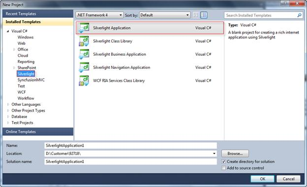{border="0"}

Figure 208: Creating a new Silverlight Application

 

2.   Ensure that the **Host the** **Silverlight application in a new Web site** and the **Enable WCF RIA Services** check boxes are enabled.

 

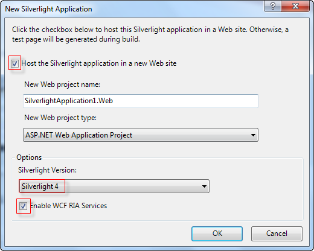{border="0"} 

Figure 209: Enabling WCF RIA Services

 

3.   Click **OK**. The created Silverlight application will appear under the **Solution Explorer** window.

 

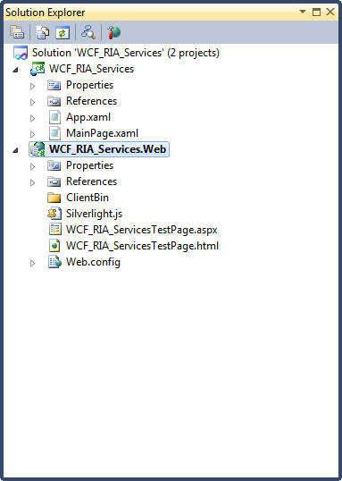{border="0"}

Figure 210: View of a new WCF RIA Service Silverlight application

 

4.   Add the Syncfusion Grid assemblies under the **References** folder in the created Silverlight application.

 

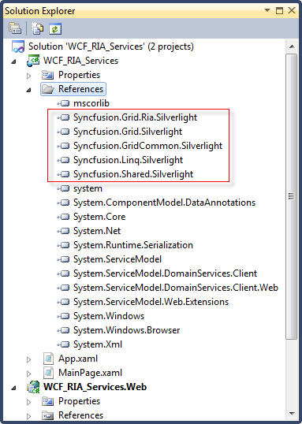{border="0"}

Figure 211: Adding the Syncfusion Grid Assemblies

 

5.   Right-click on the created Silverlight application. The context menu will open.

 

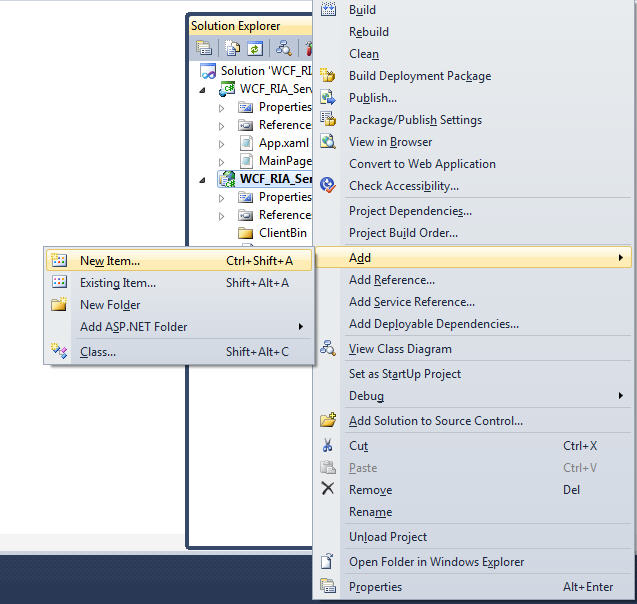{border="0"}

Figure 212: Adding new item to web project

 

6.   Click **Add** and select **New Item**. The **Add New Item** window will open.

7.   Select **Data** under **Installed Templates,** and then select **ADO.NET Entity Data Model**.

8.   Enter a name for the data model in the **Name** field.

[]{style="FONT-FAMILY: 'Verdana','sans-serif'"} 

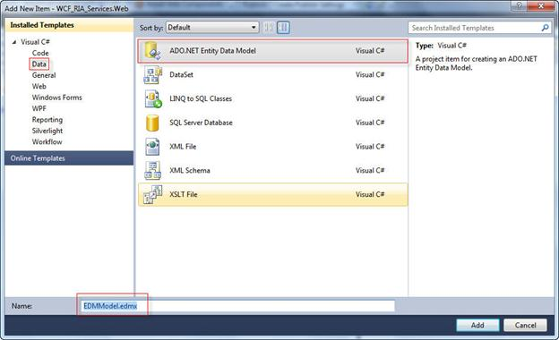{border="0"}

Figure 213: Adding an Entity Data Model

 

9.   Click **Add**. The **Entity DataModel Wizard** window will open.

10.  Select **Generate from database** under the **What should the model contain?** field**.**

 

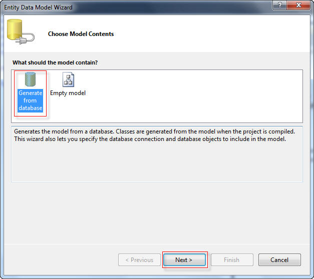{border="0"}

Figure 214: Entity Data Model Wizard

 

11.  Click **Next**.

12.  Select a data connection from the **Which data connection should your application use to connect to the database?** drop-down combo box or click **New Connection** to create a new data connection for the database.

[]{style="FONT-FAMILY: 'Verdana','sans-serif'"} 

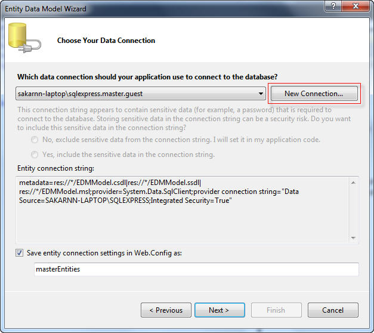{border="0"}

Figure 215: Creating a new connection String

 

The **Connection Properties** dialog will open if you click the **New Connection**.

13.  Under the **Connection Properties** dialog box, select a server name from the **Server name** drop-down combo box and select a database name from the **select or enter a database name** drop-down combo box.

14.  To check the connection, click **Test Connection.** The **Test connection succeeded** dialog will open if the connection is proper.

 

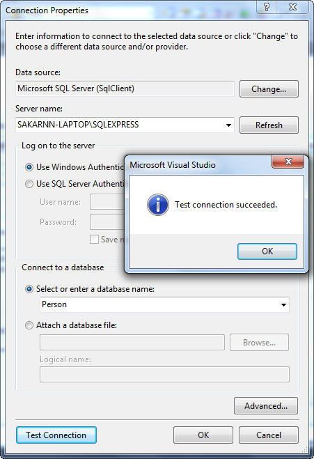{border="0"}

Figure 216: Connection Properties

 

15.  Click **OK**.

16.  On the **Entity Data Model Wizard**, select **Save entity connection settings in Web.Config as** check box and enter a name in the name field.

 

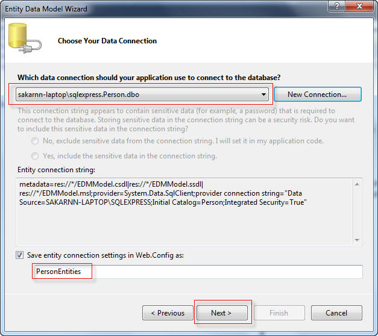{border="0"}

Figure 217: Connection String

 

17.  Click **Next**.

18.  Select **Tables,** and then select a required table in which the data to be added to the grid.

19.  Enter a name in the **Model Namespace** field.

 

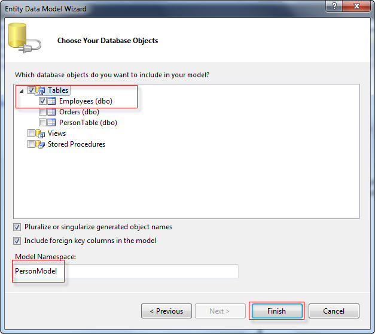{border="0"}

Figure 218: Choosing the Database objects

 

20.  Click **Finish.** The **Model Browser** window will appear with the list of properties of the selected table.

 

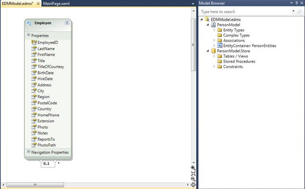{border="0"}

Figure 219: Properties of the Employee Table

 

21.  Open the **Add New Item** window.

22.  Click **Silverlight** and select **Silverlight-enabled WCF Service**.

 

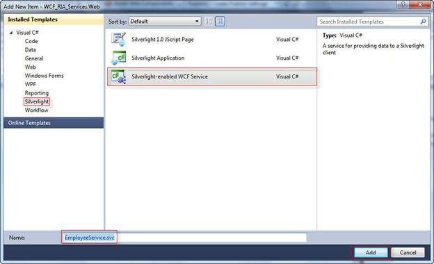{border="0"}

Figure 220: Adding a Silverlight enabled WCF Service

 

23.  Enter a name for the WCF service application in the **Name** field, and then click **Add**. The Editor window will open.

24.  To get the data from the PersonEntities class in the database, add the following code snipppet in the Editor window.

 

+----------------------------------------------------------------------------------------------------------------------------------------------------------------------------+
| **[\[C#\]]{style="FONT-FAMILY: 'Courier New'"}**                                                                                                                           |
|                                                                                                                                                                            |
| []{style="FONT-FAMILY: 'Courier New'; COLOR: blue"}                                                                                                                        |
|                                                                                                                                                                            |
| [public]{style="FONT-FAMILY: 'Courier New'; COLOR: blue"}[ [class]{style="COLOR: blue"} [EmployeeService]{style="COLOR: #2b91af"}]{style="FONT-FAMILY: 'Courier New'"}     |
|                                                                                                                                                                            |
| [    {]{style="FONT-FAMILY: 'Courier New'"}                                                                                                                                |
|                                                                                                                                                                            |
| [        \[[OperationContract]{style="COLOR: #2b91af"}\]]{style="FONT-FAMILY: 'Courier New'"}                                                                              |
|                                                                                                                                                                            |
| [        [public]{style="COLOR: blue"} [List]{style="COLOR: #2b91af"}\<[Employee]{style="COLOR: #2b91af"}\> GetEmployees()]{style="FONT-FAMILY: 'Courier New'"}            |
|                                                                                                                                                                            |
| [        {]{style="FONT-FAMILY: 'Courier New'"}                                                                                                                            |
|                                                                                                                                                                            |
| [            [PersonEntities]{style="COLOR: #2b91af"} entity = [new]{style="COLOR: blue"} [PersonEntities]{style="COLOR: #2b91af"}();]{style="FONT-FAMILY: 'Courier New'"} |
|                                                                                                                                                                            |
| [            [var]{style="COLOR: blue"} result = [from]{style="COLOR: blue"} emp [in]{style="COLOR: blue"} entity.Employees]{style="FONT-FAMILY: 'Courier New'"}           |
|                                                                                                                                                                            |
| [                         [select]{style="COLOR: blue"} emp;]{style="FONT-FAMILY: 'Courier New'"}                                                                          |
|                                                                                                                                                                            |
| [            [return]{style="COLOR: blue"} result.ToList();]{style="FONT-FAMILY: 'Courier New'"}                                                                           |
|                                                                                                                                                                            |
| [        }]{style="FONT-FAMILY: 'Courier New'"}                                                                                                                            |
|                                                                                                                                                                            |
| [    }]{style="FONT-FAMILY: 'Courier New'"}                                                                                                                                |
|                                                                                                                                                                            |
| []{style="FONT-FAMILY: 'Courier New'"}                                                                                                                                     |
+----------------------------------------------------------------------------------------------------------------------------------------------------------------------------+

 

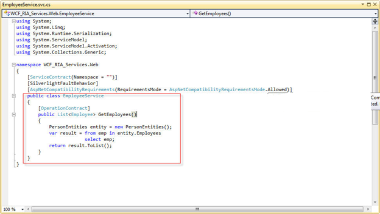{border="0"}

Figure 221: Editor Window with added code snippet

 

25.  Save the application.

26.  Open the **Solution Explorer** window.

27.  Right-click on the created WCF service application. The context menu will open.

 

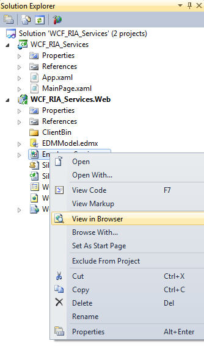{border="0"}

Figure 222: Viewing the service in the browser

 

28.  Select **View in Browser.** The WCF service application will open in the default browser.

29.  Copy the [WSDL link]{style="FONT-FAMILY: 'Verdana','sans-serif'"}.

 

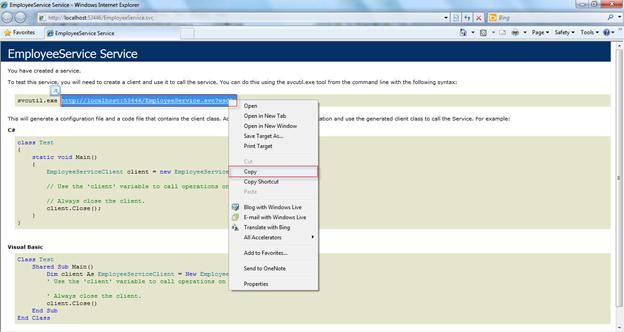{border="0"}

Figure 223: Wsdl link for the service

 

30.  Open the **Solution Explorer**.

31.  Right-click on the **References** folder.

 

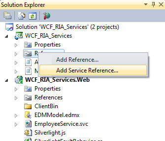{border="0"}

Figure 224: Adding the Service reference

 

32.  Select **Add Service Reference.** The **Add Service Reference** window will open.

33.  Paste the copied link in the **Address** field and click **Go**. It will display the available services in the **Services** field. The methods under the service will be displayed in the **Operations** field.

::: {style="BORDER-BOTTOM: windowtext 1pt solid; BORDER-LEFT: medium none; PADDING-BOTTOM: 1pt; MARGIN-TOP: 9pt; PADDING-LEFT: 0pt; PADDING-RIGHT: 0pt; MARGIN-BOTTOM: 9pt; BORDER-TOP: windowtext 1pt solid; BORDER-RIGHT: medium none; PADDING-TOP: 1pt"}
{border="0"}Note: You can browse the available services by clicking the Discover button.
:::

 

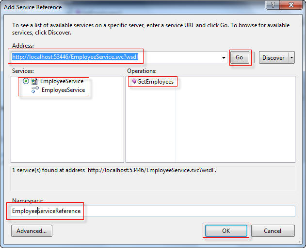{border="0"}

Figure 225: Getting the Service class and methods

 

34.  Enter a name in the **Namespace** field, and then click **OK**. The created service reference will appear under the **Service References** folder.

[]{style="FONT-FAMILY: 'Verdana','sans-serif'"} 

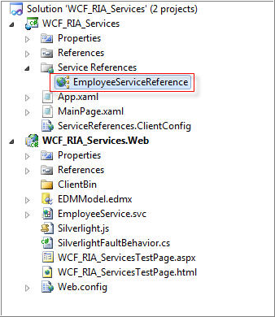{border="0"}

Figure 226: Added Service Reference

 

35.  Add the following code in the **MainPage.xaml** and save the changes. You need to define the GridDataControl in the code snippet to display the data[.]{style="FONT-FAMILY: 'Verdana','sans-serif'"}

 

+------------------------------------------------------------------------------------------------------------------------------------------------------------------------------------------------------------------------------------------------------------------------------------------------------------------------------------------------------------------------------------------------------------------------------------------------------------------------------------------------------------------------------------------------------------------------------------------------------------------------------------------------------------------------------------------------+
| [ ]{style="FONT-FAMILY: 'Verdana','sans-serif'"}**[\[XAML\]]{style="FONT-FAMILY: 'Courier New'"}**                                                                                                                                                                                                                                                                                                                                                                                                                                                                                                                                                                                             |
|                                                                                                                                                                                                                                                                                                                                                                                                                                                                                                                                                                                                                                                                                                |
| []{style="FONT-FAMILY: 'Courier New'; COLOR: blue"}                                                                                                                                                                                                                                                                                                                                                                                                                                                                                                                                                                                                                                            |
|                                                                                                                                                                                                                                                                                                                                                                                                                                                                                                                                                                                                                                                                                                |
| [\<]{style="FONT-FAMILY: 'Courier New'; COLOR: blue"}[Grid]{style="FONT-FAMILY: 'Courier New'; COLOR: #a31515"}[ x]{style="FONT-FAMILY: 'Courier New'; COLOR: red"}[:]{style="FONT-FAMILY: 'Courier New'; COLOR: blue"}[Name]{style="FONT-FAMILY: 'Courier New'; COLOR: red"}[=\"LayoutRoot\"]{style="FONT-FAMILY: 'Courier New'; COLOR: blue"}[ Background]{style="FONT-FAMILY: 'Courier New'; COLOR: red"}[=\"White\"\>]{style="FONT-FAMILY: 'Courier New'; COLOR: blue"}[]{style="FONT-FAMILY: 'Courier New'"}                                                                                                                                                                              |
|                                                                                                                                                                                                                                                                                                                                                                                                                                                                                                                                                                                                                                                                                                |
| [  ]{style="FONT-FAMILY: 'Courier New'; COLOR: #a31515"}[\<]{style="FONT-FAMILY: 'Courier New'; COLOR: blue"}[sync]{style="FONT-FAMILY: 'Courier New'; COLOR: #a31515"}[:]{style="FONT-FAMILY: 'Courier New'; COLOR: blue"}[GridDataControl]{style="FONT-FAMILY: 'Courier New'; COLOR: #a31515"}[ x]{style="FONT-FAMILY: 'Courier New'; COLOR: red"}[:]{style="FONT-FAMILY: 'Courier New'; COLOR: blue"}[Name]{style="FONT-FAMILY: 'Courier New'; COLOR: red"}[=\"grid\"]{style="FONT-FAMILY: 'Courier New'; COLOR: blue"}[ VisualStyle]{style="FONT-FAMILY: 'Courier New'; COLOR: red"}[=\"Metro\"]{style="FONT-FAMILY: 'Courier New'; COLOR: blue"}[   ]{style="FONT-FAMILY: 'Courier New'"} |
|                                                                                                                                                                                                                                                                                                                                                                                                                                                                                                                                                                                                                                                                                                |
| [      [AutoPopulateColumns]{style="COLOR: red"}[=\"False\"]{style="COLOR: blue"} ]{style="FONT-FAMILY: 'Courier New'"}                                                                                                                                                                                                                                                                                                                                                                                                                                                                                                                                                                        |
|                                                                                                                                                                                                                                                                                                                                                                                                                                                                                                                                                                                                                                                                                                |
| [      [AutoPopulateRelations]{style="COLOR: red"}[=\"False\"]{style="COLOR: blue"}[ ShowAddNewRow]{style="COLOR: red"}[=\"False\"]{style="COLOR: blue"}[ ColumnSizer]{style="COLOR: red"}[=\"Star\" \>]{style="COLOR: blue"}]{style="FONT-FAMILY: 'Courier New'"}                                                                                                                                                                                                                                                                                                                                                                                                                             |
|                                                                                                                                                                                                                                                                                                                                                                                                                                                                                                                                                                                                                                                                                                |
| [         ]{style="FONT-FAMILY: 'Courier New'; COLOR: #a31515"}[\<]{style="FONT-FAMILY: 'Courier New'; COLOR: blue"}[sync]{style="FONT-FAMILY: 'Courier New'; COLOR: #a31515"}[:]{style="FONT-FAMILY: 'Courier New'; COLOR: blue"}[GridDataControl.VisibleColumns]{style="FONT-FAMILY: 'Courier New'; COLOR: #a31515"}[\>]{style="FONT-FAMILY: 'Courier New'; COLOR: blue"}[]{style="FONT-FAMILY: 'Courier New'"}                                                                                                                                                                                                                                                                              |
|                                                                                                                                                                                                                                                                                                                                                                                                                                                                                                                                                                                                                                                                                                |
| [            sync]{style="FONT-FAMILY: 'Courier New'; COLOR: #a31515"}[:]{style="FONT-FAMILY: 'Courier New'; COLOR: blue"}[GridDataVisibleColumn]{style="FONT-FAMILY: 'Courier New'; COLOR: #a31515"}[ MappingName]{style="FONT-FAMILY: 'Courier New'; COLOR: red"}[=\"EmployeeID\"]{style="FONT-FAMILY: 'Courier New'; COLOR: blue"}[ HeaderText]{style="FONT-FAMILY: 'Courier New'; COLOR: red"}[=\"EmployeeID\" /\>]{style="FONT-FAMILY: 'Courier New'; COLOR: blue"}[]{style="FONT-FAMILY: 'Courier New'"}                                                                                                                                                                                 |
|                                                                                                                                                                                                                                                                                                                                                                                                                                                                                                                                                                                                                                                                                                |
| [                ]{style="FONT-FAMILY: 'Courier New'; COLOR: #a31515"}[\<]{style="FONT-FAMILY: 'Courier New'; COLOR: blue"}[sync]{style="FONT-FAMILY: 'Courier New'; COLOR: #a31515"}[:]{style="FONT-FAMILY: 'Courier New'; COLOR: blue"}[GridDataVisibleColumn]{style="FONT-FAMILY: 'Courier New'; COLOR: #a31515"}[ MappingName]{style="FONT-FAMILY: 'Courier New'; COLOR: red"}[=\"LastName\"]{style="FONT-FAMILY: 'Courier New'; COLOR: blue"}[ HeaderText]{style="FONT-FAMILY: 'Courier New'; COLOR: red"}[=\"LastName\" /\>]{style="FONT-FAMILY: 'Courier New'; COLOR: blue"}[]{style="FONT-FAMILY: 'Courier New'"}                                                                      |
|                                                                                                                                                                                                                                                                                                                                                                                                                                                                                                                                                                                                                                                                                                |
| [                ]{style="FONT-FAMILY: 'Courier New'; COLOR: #a31515"}[\<]{style="FONT-FAMILY: 'Courier New'; COLOR: blue"}[sync]{style="FONT-FAMILY: 'Courier New'; COLOR: #a31515"}[:]{style="FONT-FAMILY: 'Courier New'; COLOR: blue"}[GridDataVisibleColumn]{style="FONT-FAMILY: 'Courier New'; COLOR: #a31515"}[ MappingName]{style="FONT-FAMILY: 'Courier New'; COLOR: red"}[=\"FirstName\"]{style="FONT-FAMILY: 'Courier New'; COLOR: blue"}[ HeaderText]{style="FONT-FAMILY: 'Courier New'; COLOR: red"}[=\"FirstName\" /\>]{style="FONT-FAMILY: 'Courier New'; COLOR: blue"}[]{style="FONT-FAMILY: 'Courier New'"}                                                                    |
|                                                                                                                                                                                                                                                                                                                                                                                                                                                                                                                                                                                                                                                                                                |
| [                ]{style="FONT-FAMILY: 'Courier New'; COLOR: #a31515"}[\<]{style="FONT-FAMILY: 'Courier New'; COLOR: blue"}[sync]{style="FONT-FAMILY: 'Courier New'; COLOR: #a31515"}[:]{style="FONT-FAMILY: 'Courier New'; COLOR: blue"}[GridDataVisibleColumn]{style="FONT-FAMILY: 'Courier New'; COLOR: #a31515"}[ MappingName]{style="FONT-FAMILY: 'Courier New'; COLOR: red"}[=\"Title\"]{style="FONT-FAMILY: 'Courier New'; COLOR: blue"}[ HeaderText]{style="FONT-FAMILY: 'Courier New'; COLOR: red"}[=\"Title\" /\>]{style="FONT-FAMILY: 'Courier New'; COLOR: blue"}[]{style="FONT-FAMILY: 'Courier New'"}                                                                            |
|                                                                                                                                                                                                                                                                                                                                                                                                                                                                                                                                                                                                                                                                                                |
| [                ]{style="FONT-FAMILY: 'Courier New'; COLOR: #a31515"}[\<]{style="FONT-FAMILY: 'Courier New'; COLOR: blue"}[sync]{style="FONT-FAMILY: 'Courier New'; COLOR: #a31515"}[:]{style="FONT-FAMILY: 'Courier New'; COLOR: blue"}[GridDataVisibleColumn]{style="FONT-FAMILY: 'Courier New'; COLOR: #a31515"}[ MappingName]{style="FONT-FAMILY: 'Courier New'; COLOR: red"}[=\"TitleOfCourtesy\"]{style="FONT-FAMILY: 'Courier New'; COLOR: blue"}[ HeaderText]{style="FONT-FAMILY: 'Courier New'; COLOR: red"}[=\"TitleOfCourtesy\" /\>]{style="FONT-FAMILY: 'Courier New'; COLOR: blue"}[]{style="FONT-FAMILY: 'Courier New'"}                                                        |
|                                                                                                                                                                                                                                                                                                                                                                                                                                                                                                                                                                                                                                                                                                |
| [            ]{style="FONT-FAMILY: 'Courier New'; COLOR: #a31515"}[\</]{style="FONT-FAMILY: 'Courier New'; COLOR: blue"}[sync]{style="FONT-FAMILY: 'Courier New'; COLOR: #a31515"}[:]{style="FONT-FAMILY: 'Courier New'; COLOR: blue"}[GridDataControl.VisibleColumns]{style="FONT-FAMILY: 'Courier New'; COLOR: #a31515"}[\>]{style="FONT-FAMILY: 'Courier New'; COLOR: blue"}[]{style="FONT-FAMILY: 'Courier New'"}                                                                                                                                                                                                                                                                          |
|                                                                                                                                                                                                                                                                                                                                                                                                                                                                                                                                                                                                                                                                                                |
| [        ]{style="FONT-FAMILY: 'Courier New'; COLOR: #a31515"}[\</]{style="FONT-FAMILY: 'Courier New'; COLOR: blue"}[sync]{style="FONT-FAMILY: 'Courier New'; COLOR: #a31515"}[:]{style="FONT-FAMILY: 'Courier New'; COLOR: blue"}[GridDataControl]{style="FONT-FAMILY: 'Courier New'; COLOR: #a31515"}[\>]{style="FONT-FAMILY: 'Courier New'; COLOR: blue"}[]{style="FONT-FAMILY: 'Courier New'"}                                                                                                                                                                                                                                                                                             |
|                                                                                                                                                                                                                                                                                                                                                                                                                                                                                                                                                                                                                                                                                                |
| [    ]{style="FONT-FAMILY: 'Courier New'; COLOR: #a31515"}[\</]{style="FONT-FAMILY: 'Courier New'; COLOR: blue"}[Grid]{style="FONT-FAMILY: 'Courier New'; COLOR: #a31515"}[\>]{style="FONT-FAMILY: 'Courier New'; COLOR: blue"}                                                                                                                                                                                                                                                                                                                                                                                                                                                                |
|                                                                                                                                                                                                                                                                                                                                                                                                                                                                                                                                                                                                                                                                                                |
| **[]{style="FONT-FAMILY: 'Courier New'"}**                                                                                                                                                                                                                                                                                                                                                                                                                                                                                                                                                                                                                                                     |
+------------------------------------------------------------------------------------------------------------------------------------------------------------------------------------------------------------------------------------------------------------------------------------------------------------------------------------------------------------------------------------------------------------------------------------------------------------------------------------------------------------------------------------------------------------------------------------------------------------------------------------------------------------------------------------------------+

 

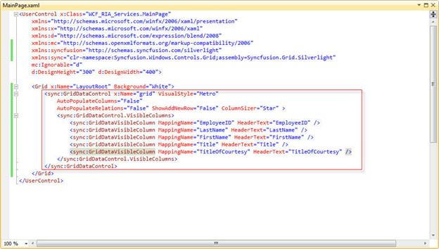{border="0"}

Figure 227: Defined GridDataControl

 

36.  To assign the itemsource for the grid, add the following code snipppet in **the MainPage.xaml.cs** under the **MainPage.xaml**.

 

+-------------------------------------------------------------------------------------------------------------------------------------------------------------------------------------------------------------------------------------------------------+
| **[\[C#\]]{style="FONT-FAMILY: 'Courier New'"}**                                                                                                                                                                                                      |
|                                                                                                                                                                                                                                                       |
| []{style="FONT-FAMILY: 'Courier New'; COLOR: blue"}                                                                                                                                                                                                   |
|                                                                                                                                                                                                                                                       |
| [public]{style="FONT-FAMILY: 'Courier New'; COLOR: blue"}[ MainPage()]{style="FONT-FAMILY: 'Courier New'"}                                                                                                                                            |
|                                                                                                                                                                                                                                                       |
| [{]{style="FONT-FAMILY: 'Courier New'"}                                                                                                                                                                                                               |
|                                                                                                                                                                                                                                                       |
| [    InitializeComponent();]{style="FONT-FAMILY: 'Courier New'"}                                                                                                                                                                                      |
|                                                                                                                                                                                                                                                       |
| [    EmployeeServiceReference.[EmployeeServiceClient]{style="COLOR: #2b91af"} client = [new]{style="COLOR: blue"} EmployeeServiceReference.[EmployeeServiceClient]{style="COLOR: #2b91af"}();]{style="FONT-FAMILY: 'Courier New'"}                    |
|                                                                                                                                                                                                                                                       |
| [    client.GetEmployeesCompleted += [new]{style="COLOR: blue"} [EventHandler]{style="COLOR: #2b91af"}\<EmployeeServiceReference.[GetEmployeesCompletedEventArgs]{style="COLOR: #2b91af"}\>(client]{style="FONT-FAMILY: 'Courier New'"}               |
|                                                                                                                                                                                                                                                       |
| [\_GetEmployeesCompleted);]{style="FONT-FAMILY: 'Courier New'"}                                                                                                                                                                                       |
|                                                                                                                                                                                                                                                       |
| [    client.GetEmployeesAsync();]{style="FONT-FAMILY: 'Courier New'"}                                                                                                                                                                                 |
|                                                                                                                                                                                                                                                       |
| [}]{style="FONT-FAMILY: 'Courier New'"}                                                                                                                                                                                                               |
|                                                                                                                                                                                                                                                       |
| []{style="FONT-FAMILY: 'Courier New'"}                                                                                                                                                                                                                |
|                                                                                                                                                                                                                                                       |
| [void]{style="FONT-FAMILY: 'Courier New'; COLOR: blue"}[ client_GetEmployeesCompleted([object]{style="COLOR: blue"} sender, EmployeeServiceReference.[GetEmployeesCompletedEventArgs]{style="COLOR: #2b91af"} e)]{style="FONT-FAMILY: 'Courier New'"} |
|                                                                                                                                                                                                                                                       |
| [{]{style="FONT-FAMILY: 'Courier New'"}                                                                                                                                                                                                               |
|                                                                                                                                                                                                                                                       |
| [    grid.ItemsSource = e.Result.ToList();]{style="FONT-FAMILY: 'Courier New'"}                                                                                                                                                                       |
|                                                                                                                                                                                                                                                       |
| [}]{style="FONT-FAMILY: 'Courier New'"}                                                                                                                                                                                                               |
|                                                                                                                                                                                                                                                       |
| []{style="FONT-FAMILY: 'Courier New'"}                                                                                                                                                                                                                |
+-------------------------------------------------------------------------------------------------------------------------------------------------------------------------------------------------------------------------------------------------------+

 

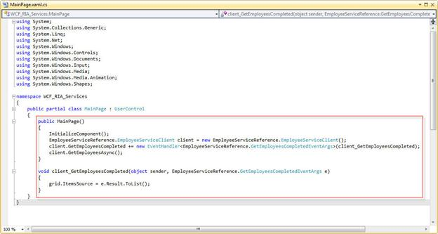{border="0"}

Figure 228: Grid with assigned Item source

 

37.  Run the application. The GridData control will be loaded with data.

[]{style="FONT-FAMILY: 'Verdana','sans-serif'"} 

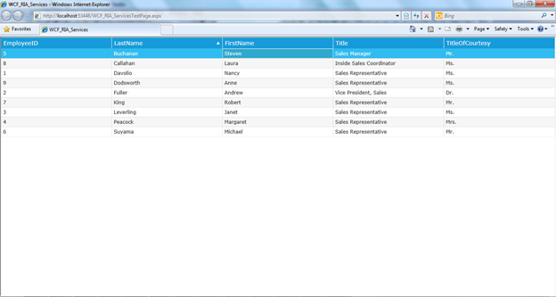{border="0"}

Figure 229: GridData Control with loaded data

 

[]{#related-topics}
:::::
