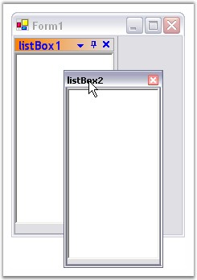

::: {style="DISPLAY: none"}
{#d2h_url_template}{#d2h_package_url style="WIDTH: 0px; DISPLAY: none; HEIGHT: 0px"}
:::

:::: {.d2h_secondary_topic style="PADDING-BOTTOM: 10pt; MARGIN: 0pt; PADDING-LEFT: 0pt; PADDING-RIGHT: 0pt; PADDING-TOP: 0pt"}
##### How to make a docked control Float Only? {#how-to-make-a-docked-control-float-only style="tab-stops: 0pt"}

[]{style="COLOR: #15428b"} 

The docked control can also be only floating and cannot be docked, by calling the SetFloatOnly method.

[]{style="COLOR: #15428b"} 

::: {align="center"}
+-----------------------------------+----------------------------------------------------------------------+
| Parameter                         | Description                                                          |
+-----------------------------------+----------------------------------------------------------------------+
| SetFloatOnly                      | Make the docked control a float only control.                        |
|                                   |                                                                      |
|                                   |                                                                      |
|                                   |                                                                      |
|                                   | *Ctrl* - The control for which docking is enabled.                   |
|                                   |                                                                      |
|                                   | *bFloating* - Represents a boolean value, TRUE, to disabled docking. |
+-----------------------------------+----------------------------------------------------------------------+
:::

[]{style="COLOR: #15428b"} 

+------------------------------------------------------------------------------------------------------------------------------------------------------------------------------------------------+
| **[\[C#\]]{style="FONT-FAMILY: 'Courier New'; COLOR: black"}**                                                                                                                                 |
|                                                                                                                                                                                                |
| []{style="FONT-FAMILY: 'Courier New'; COLOR: green"}                                                                                                                                           |
|                                                                                                                                                                                                |
| [this]{style="FONT-FAMILY: 'Courier New'; COLOR: blue"}[.dockingManager1.SetFloatOnly([this]{style="COLOR: blue"}.listBox2, [true]{style="COLOR: blue"});]{style="FONT-FAMILY: 'Courier New'"} |
+------------------------------------------------------------------------------------------------------------------------------------------------------------------------------------------------+

[]{style="COLOR: #15428b"} 

+--------------------------------------------------------------------------------------------------------------------------------------------------------------------------------------------+
| **[\[VB.NET\]]{style="FONT-FAMILY: 'Courier New'; COLOR: black"}**                                                                                                                         |
|                                                                                                                                                                                            |
| []{style="COLOR: #15428b"}                                                                                                                                                                 |
|                                                                                                                                                                                            |
| [Me]{style="FONT-FAMILY: 'Courier New'; COLOR: blue"}[.dockingManager1.SetFloatOnly([Me]{style="COLOR: blue"}.listBox2, [True]{style="COLOR: blue"});]{style="FONT-FAMILY: 'Courier New'"} |
+--------------------------------------------------------------------------------------------------------------------------------------------------------------------------------------------+

[]{style="COLOR: #15428b"} 

{border="0"}

[]{style="COLOR: #15428b"} 

Figure 106: Float Only Enabled

[]{#related-topics}
::::
