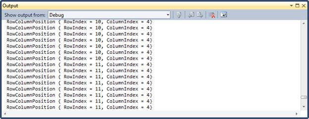

::: {style="DISPLAY: none"}
[](ms-xhelp:///?Id=d2h_url_template){#d2h_url_template}{#d2h_package_url style="WIDTH: 0px; DISPLAY: none; HEIGHT: 0px"}
:::

::::: {#nsbanner .d2h_main_nsbanner style="BORDER-BOTTOM: #999999 1px solid; POSITION: relative; PADDING-BOTTOM: 0px; BACKGROUND-COLOR: transparent; PADDING-LEFT: 0px; PADDING-RIGHT: 0px; DISPLAY: none; BORDER-TOP: #999999 1px solid; PADDING-TOP: 0px; LEFT: 0px"}
:::: {#TitleRow .d2h_main_titlerow style="PADDING-BOTTOM: 4px; BACKGROUND-COLOR: transparent; PADDING-LEFT: 22px; WIDTH: 100%; PADDING-RIGHT: 10px; DISPLAY: none; PADDING-TOP: 4px"}
::: {#ienav .d2h_main_ienav style="DISPLAY: none"}
[](ms-xhelp:///?Id=f0ba96de-029b-4b3a-8f3e-275c39720dbb){#D2HPrevious .D2HPreviousEnabled}  [](ms-xhelp:///?Id=8d3e0fa0-e5a4-4d8e-b9ee-d6d8912dfb9f){#D2HNext .D2HNextEnabled}
:::
::::
:::::

:::: {#nstext .d2h_main_nstext style="PADDING-BOTTOM: 10px; BACKGROUND-COLOR: transparent; PADDING-LEFT: 22px; PADDING-RIGHT: 10px; HEIGHT: 100%; OVERFLOW: auto; PADDING-TOP: 5px" hasuserbackground="true" valign="bottom"}
::: {#d2h_breadcrumbs .d2h_breadcrumbs}
[Essential Studio User Guide Documentation](ms-xhelp:///?Id=12457748-09e3-4d74-a240-8e049cedf030){.d2h_breadcrumbsNormal}[ \> ]{.d2h_breadcrumbsLinkSeparator}[User Interface Edition](ms-xhelp:///?Id=c29296b7-531c-413b-a0ec-488ca1f7f669){.d2h_breadcrumbsNormal}[ \> ]{.d2h_breadcrumbsLinkSeparator}[Essential WPF](ms-xhelp:///?Id=7f4f82c5-151c-4262-94d0-75c4626c77bc){.d2h_breadcrumbsNormal}[ \> ]{.d2h_breadcrumbsLinkSeparator}[Essential Grid]{.d2h_breadcrumbsContentsOnly}[ \> ]{.d2h_breadcrumbsLinkSeparator}[Frequently Asked Questions](ms-xhelp:///?Id=f0ba96de-029b-4b3a-8f3e-275c39720dbb){.d2h_breadcrumbsNormal}
:::

## How to Obtain Column and Row Indexes of the Cell? {#how-to-obtain-column-and-row-indexes-of-the-cell style="tab-stops: 0pt"}

 

The *PointToCellRowColumnIndexOutsideCells* method enables you to obtain column index and row index of a cell when the mouse pointer traverses over the GridDataControl. The following code example illustrates how to determine the column and row indexes of the cell.

 

+------------------------------------------------------------------------------+
| ``` {style="BACKGROUND: #f0f0f0"}                                            |
| [C#]                                                                         |
| ```                                                                          |
|                                                                              |
| ``` {style="BACKGROUND: #f0f0f0"}                                            |
|                                                                              |
| ```                                                                          |
|                                                                              |
| ``` {style="BACKGROUND: #f0f0f0"}                                            |
| void GridDataControl1_MouseMove(object sender, MouseEventArgs e)             |
| ```                                                                          |
|                                                                              |
| ``` {style="BACKGROUND: #f0f0f0"}                                            |
|         {                                                                    |
| ```                                                                          |
|                                                                              |
| ``` {style="BACKGROUND: #f0f0f0"}                                            |
|             var RowColumnIndex = GridDataControl1.Model.Grid.PointToCellRowC |
| ```                                                                          |
|                                                                              |
| ``` {style="BACKGROUND: #f0f0f0"}                                            |
| olumnIndexOutsideCells(Mouse.GetPosition(this), true);                       |
| ```                                                                          |
|                                                                              |
| ``` {style="BACKGROUND: #f0f0f0"}                                            |
|             Console.WriteLine(RowColumnIndex);                               |
| ```                                                                          |
|                                                                              |
| ``` {style="BACKGROUND: #f0f0f0"}                                            |
|         }                                                                    |
| ```                                                                          |
|                                                                              |
| []{style="FONT-FAMILY: 'Courier New'"}                                       |
+------------------------------------------------------------------------------+

 

The following screen shot shows the output for the above code in the GridDataControl.

 

{border="0"}

Figure 277: RowColumnPosition

[]{#related-topics}
::::
