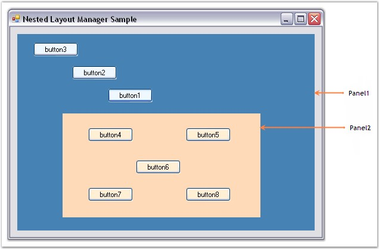
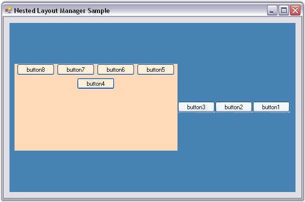

::: {style="DISPLAY: none"}
{#d2h_url_template}{#d2h_package_url style="WIDTH: 0px; DISPLAY: none; HEIGHT: 0px"}
:::

::: {.d2h_secondary_topic style="PADDING-BOTTOM: 10pt; MARGIN: 0pt; PADDING-LEFT: 0pt; PADDING-RIGHT: 0pt; PADDING-TOP: 0pt"}
#### How to programmatically nest various layouts {#how-to-programmatically-nest-various-layouts style="tab-stops: 0pt"}

[]{style="COLOR: #15428b"} 

It is possible to layout the Child controls programmatically using Multiple Layout Managers. The following step by step procedure illustrates this.

[]{style="COLOR: #15428b"} 

[·      ]{style="FONT-FAMILY: Symbol"}Set up a form with Buttons and Panels as shown in the below screen shot.

[]{style="COLOR: #15428b"} 

{border="0"}

[]{style="COLOR: #15428b"} 

Figure 700: Child Controls Added to the Form

[]{style="COLOR: #15428b"} 

[·      ]{style="FONT-FAMILY: Symbol"}Include the required namespace.

[]{style="COLOR: #15428b"} 

+--------------------------------------------------------------------------------------------------------------------------------+
| **[\[C#\]]{style="FONT-FAMILY: 'Courier New'; COLOR: black"}**                                                                 |
|                                                                                                                                |
| []{style="FONT-FAMILY: 'Courier New'; COLOR: black"}                                                                           |
|                                                                                                                                |
| [using ]{style="FONT-FAMILY: 'Courier New'; COLOR: blue"}[Syncfusion.Windows.Forms.Tools;]{style="FONT-FAMILY: 'Courier New'"} |
+--------------------------------------------------------------------------------------------------------------------------------+

[]{style="COLOR: #15428b"} 

+---------------------------------------------------------------------------------------------------------------------------------+
| **[\[VB.NET\]]{style="FONT-FAMILY: 'Courier New'; COLOR: black"}**                                                              |
|                                                                                                                                 |
| []{style="FONT-FAMILY: 'Courier New'; COLOR: black"}                                                                            |
|                                                                                                                                 |
| [Imports]{style="FONT-FAMILY: 'Courier New'; COLOR: blue"}[ Syncfusion.Windows.Forms.Tools]{style="FONT-FAMILY: 'Courier New'"} |
+---------------------------------------------------------------------------------------------------------------------------------+

[]{style="COLOR: #15428b"} 

[·      ]{style="FONT-FAMILY: Symbol"}Declare instances for FlowLayout and GridBagLayout Managers. FlowLayout is used for aligning the Child components of Panel2 (which contains button4 to button8) and GridBagLayout for aligning the Child components of Panel1 (which contains button1, button2, button3 and Panel2).

[]{style="COLOR: #15428b"} 

+--------------------------------------------------------------------------------------------------------------------------------------------------------------------------------------------------------------------------------------------------------+
| **[\[C#\]]{style="FONT-FAMILY: 'Courier New'; COLOR: black"}**                                                                                                                                                                                         |
|                                                                                                                                                                                                                                                        |
| []{style="FONT-FAMILY: 'Courier New'; COLOR: black"}                                                                                                                                                                                                   |
|                                                                                                                                                                                                                                                        |
| [private]{style="FONT-FAMILY: 'Courier New'; COLOR: blue"}[ Syncfusion.Windows.Forms.Tools.[GridBagLayout]{style="COLOR: teal"} gridBagLayout1;]{style="FONT-FAMILY: 'Courier New'"}                                                                   |
|                                                                                                                                                                                                                                                        |
| [private]{style="FONT-FAMILY: 'Courier New'; COLOR: blue"}[ Syncfusion.Windows.Forms.Tools.[FlowLayout]{style="COLOR: teal"} flowLayout1;]{style="FONT-FAMILY: 'Courier New'"}                                                                         |
|                                                                                                                                                                                                                                                        |
| []{style="FONT-FAMILY: 'Courier New'"}                                                                                                                                                                                                                 |
|                                                                                                                                                                                                                                                        |
| [this]{style="FONT-FAMILY: 'Courier New'; COLOR: blue"}[.flowLayout1 = [new]{style="COLOR: blue"} Syncfusion.Windows.Forms.Tools.[FlowLayout]{style="COLOR: teal"}([this]{style="COLOR: blue"}.components);]{style="FONT-FAMILY: 'Courier New'"}       |
|                                                                                                                                                                                                                                                        |
| [this]{style="FONT-FAMILY: 'Courier New'; COLOR: blue"}[.gridBagLayout1 = [new]{style="COLOR: blue"} Syncfusion.Windows.Forms.Tools.[GridBagLayout]{style="COLOR: teal"}([this]{style="COLOR: blue"}.components);]{style="FONT-FAMILY: 'Courier New'"} |
+--------------------------------------------------------------------------------------------------------------------------------------------------------------------------------------------------------------------------------------------------------+

[]{style="COLOR: #15428b"} 

+---------------------------------------------------------------------------------------------------------------------------------------------------------------------------------------------------------------------------------------------------------------------------------------+
| **[\[VB.NET\]]{style="FONT-FAMILY: 'Courier New'; COLOR: black"}**                                                                                                                                                                                                                    |
|                                                                                                                                                                                                                                                                                       |
| []{style="FONT-FAMILY: 'Courier New'; COLOR: black"}                                                                                                                                                                                                                                  |
|                                                                                                                                                                                                                                                                                       |
| [Private]{style="FONT-FAMILY: 'Courier New'; COLOR: blue"}[ gridBagLayout1 ]{style="FONT-FAMILY: 'Courier New'; COLOR: black"}[As]{style="FONT-FAMILY: 'Courier New'; COLOR: blue"}[ Syncfusion.Windows.Forms.Tools.GridBagLayout ]{style="FONT-FAMILY: 'Courier New'; COLOR: black"} |
|                                                                                                                                                                                                                                                                                       |
| [Private]{style="FONT-FAMILY: 'Courier New'; COLOR: blue"}[ flowLayout1 ]{style="FONT-FAMILY: 'Courier New'; COLOR: black"}[As]{style="FONT-FAMILY: 'Courier New'; COLOR: blue"}[ Syncfusion.Windows.Forms.Tools.FlowLayout ]{style="FONT-FAMILY: 'Courier New'; COLOR: black"}       |
|                                                                                                                                                                                                                                                                                       |
| []{style="FONT-FAMILY: 'Courier New'"}                                                                                                                                                                                                                                                |
|                                                                                                                                                                                                                                                                                       |
| [Me]{style="FONT-FAMILY: 'Courier New'; COLOR: blue"}[.flowLayout1 = [New]{style="COLOR: blue"} Syncfusion.Windows.Forms.Tools.FlowLayout([Me]{style="COLOR: blue"}.components) ]{style="FONT-FAMILY: 'Courier New'"}                                                                 |
|                                                                                                                                                                                                                                                                                       |
| [Me]{style="FONT-FAMILY: 'Courier New'; COLOR: blue"}[.gridBagLayout1 = [New]{style="COLOR: blue"} Syncfusion.Windows.Forms.Tools.GridBagLayout([Me]{style="COLOR: blue"}.components) ]{style="FONT-FAMILY: 'Courier New'"}                                                           |
+---------------------------------------------------------------------------------------------------------------------------------------------------------------------------------------------------------------------------------------------------------------------------------------+

[]{style="COLOR: #15428b"} 

[·      ]{style="FONT-FAMILY: Symbol"}Set the Container control and constraints for the GridBagLayout. All the Child controls of this Container control are automatically registered as children with the GridBagLayout Manager.

[]{style="COLOR: #15428b"} 

+------------------------------------------------------------------------------------------------------------------------------------------------------------------------------------------------------------------------------------------------------------------------------------------------------------------------------------------------------------------------------------------------------------------------------------------------------------------------------------------------------------------------------------------------------------------------------------+
| **[\[C#\]]{style="FONT-FAMILY: 'Courier New'; COLOR: black"}**                                                                                                                                                                                                                                                                                                                                                                                                                                                                                                                     |
|                                                                                                                                                                                                                                                                                                                                                                                                                                                                                                                                                                                    |
| []{style="FONT-FAMILY: 'Courier New'; COLOR: black"}                                                                                                                                                                                                                                                                                                                                                                                                                                                                                                                               |
|                                                                                                                                                                                                                                                                                                                                                                                                                                                                                                                                                                                    |
| [this]{style="FONT-FAMILY: 'Courier New'; COLOR: blue"}[.gridBagLayout1.ContainerControl = [this]{style="COLOR: blue"}.panel1;]{style="FONT-FAMILY: 'Courier New'"}                                                                                                                                                                                                                                                                                                                                                                                                                |
|                                                                                                                                                                                                                                                                                                                                                                                                                                                                                                                                                                                    |
| [this]{style="FONT-FAMILY: 'Courier New'; COLOR: blue"}[.gridBagLayout1.SetConstraints([this]{style="COLOR: blue"}.button1, [new]{style="COLOR: blue"} Syncfusion.Windows.Forms.Tools.[GridBagConstraints]{style="COLOR: teal"}(-1, -1, 1, 1, 0, 0, Syncfusion.Windows.Forms.Tools.[AnchorTypes]{style="COLOR: teal"}.Center, Syncfusion.Windows.Forms.Tools.[FillType]{style="COLOR: teal"}.None, [new]{style="COLOR: blue"} Syncfusion.Windows.Forms.Tools.[Insets]{style="COLOR: teal"}(0, 0, 0, 0), 0, 0, [false]{style="COLOR: blue"}));]{style="FONT-FAMILY: 'Courier New'"} |
|                                                                                                                                                                                                                                                                                                                                                                                                                                                                                                                                                                                    |
| [this]{style="FONT-FAMILY: 'Courier New'; COLOR: blue"}[.gridBagLayout1.SetConstraints([this]{style="COLOR: blue"}.button2, [new]{style="COLOR: blue"} Syncfusion.Windows.Forms.Tools.[GridBagConstraints]{style="COLOR: teal"}(-1, -1, 1, 1, 0, 0, Syncfusion.Windows.Forms.Tools.[AnchorTypes]{style="COLOR: teal"}.Center, Syncfusion.Windows.Forms.Tools.[FillType]{style="COLOR: teal"}.None, [new]{style="COLOR: blue"} Syncfusion.Windows.Forms.Tools.[Insets]{style="COLOR: teal"}(0, 0, 0, 0), 0, 0, [false]{style="COLOR: blue"}));]{style="FONT-FAMILY: 'Courier New'"} |
|                                                                                                                                                                                                                                                                                                                                                                                                                                                                                                                                                                                    |
| [this]{style="FONT-FAMILY: 'Courier New'; COLOR: blue"}[.gridBagLayout1.SetConstraints([this]{style="COLOR: blue"}.button3, [new]{style="COLOR: blue"} Syncfusion.Windows.Forms.Tools.[GridBagConstraints]{style="COLOR: teal"}(-1, -1, 1, 1, 0, 0, Syncfusion.Windows.Forms.Tools.[AnchorTypes]{style="COLOR: teal"}.Center, Syncfusion.Windows.Forms.Tools.[FillType]{style="COLOR: teal"}.None, [new]{style="COLOR: blue"} Syncfusion.Windows.Forms.Tools.[Insets]{style="COLOR: teal"}(0, 0, 0, 0), 0, 0, [false]{style="COLOR: blue"}));]{style="FONT-FAMILY: 'Courier New'"} |
|                                                                                                                                                                                                                                                                                                                                                                                                                                                                                                                                                                                    |
| [this]{style="FONT-FAMILY: 'Courier New'; COLOR: blue"}[.gridBagLayout1.SetConstraints([this]{style="COLOR: blue"}.panel2, [new]{style="COLOR: blue"} Syncfusion.Windows.Forms.Tools.[GridBagConstraints]{style="COLOR: teal"}(-1, -1, 1, 1, 0, 0, Syncfusion.Windows.Forms.Tools.[AnchorTypes]{style="COLOR: teal"}.Center, Syncfusion.Windows.Forms.Tools.[FillType]{style="COLOR: teal"}.None, [new]{style="COLOR: blue"} Syncfusion.Windows.Forms.Tools.[Insets]{style="COLOR: teal"}(0, 0, 0, 0), 0, 0, [false]{style="COLOR: blue"}));]{style="FONT-FAMILY: 'Courier New'"}  |
+------------------------------------------------------------------------------------------------------------------------------------------------------------------------------------------------------------------------------------------------------------------------------------------------------------------------------------------------------------------------------------------------------------------------------------------------------------------------------------------------------------------------------------------------------------------------------------+

[]{style="COLOR: #15428b"} 

+-------------------------------------------------------------------------------------------------------------------------------------------------------------------------------------------------------------------------------------------------------------------------------------------------------------------------------------------------------+
| **[\[VB.NET\]]{style="FONT-FAMILY: 'Courier New'; COLOR: black"}**                                                                                                                                                                                                                                                                                    |
|                                                                                                                                                                                                                                                                                                                                                       |
| []{style="FONT-FAMILY: 'Courier New'; COLOR: black"}                                                                                                                                                                                                                                                                                                  |
|                                                                                                                                                                                                                                                                                                                                                       |
| [Me]{style="FONT-FAMILY: 'Courier New'; COLOR: blue"}[.gridBagLayout1.ContainerControl = [Me]{style="COLOR: blue"}.panel1]{style="FONT-FAMILY: 'Courier New'"}                                                                                                                                                                                        |
|                                                                                                                                                                                                                                                                                                                                                       |
| [Me]{style="FONT-FAMILY: 'Courier New'; COLOR: blue"}[.gridBagLayout1.SetConstraints([Me]{style="COLOR: blue"}.button1, [New]{style="COLOR: blue"} GridBagConstraints(-1, -1, 1, 1, 0, 0, AnchorTypes.Center, FillType.None, [New]{style="COLOR: blue"} Insets(0, 0, 0, 0), 0, 0, [False]{style="COLOR: blue"}))]{style="FONT-FAMILY: 'Courier New'"} |
|                                                                                                                                                                                                                                                                                                                                                       |
| [Me]{style="FONT-FAMILY: 'Courier New'; COLOR: blue"}[.gridBagLayout1.SetConstraints([Me]{style="COLOR: blue"}.button2, [New]{style="COLOR: blue"} GridBagConstraints(-1, -1, 1, 1, 0, 0, AnchorTypes.Center, FillType.None, [New]{style="COLOR: blue"} Insets(0, 0, 0, 0), 0, 0, [False]{style="COLOR: blue"}))]{style="FONT-FAMILY: 'Courier New'"} |
|                                                                                                                                                                                                                                                                                                                                                       |
| [Me]{style="FONT-FAMILY: 'Courier New'; COLOR: blue"}[.gridBagLayout1.SetConstraints([Me]{style="COLOR: blue"}.panel2, [New]{style="COLOR: blue"} GridBagConstraints(-1, -1, 1, 1, 0, 0, AnchorTypes.Center, FillType.None, [New]{style="COLOR: blue"} Insets(0, 0, 0, 0), 0, 0, [False]{style="COLOR: blue"}))]{style="FONT-FAMILY: 'Courier New'"}  |
|                                                                                                                                                                                                                                                                                                                                                       |
| [Me]{style="FONT-FAMILY: 'Courier New'; COLOR: blue"}[.gridBagLayout1.SetConstraints([Me]{style="COLOR: blue"}.button3, [New]{style="COLOR: blue"} GridBagConstraints(-1, -1, 1, 1, 0, 0, AnchorTypes.Center, FillType.None, [New]{style="COLOR: blue"} Insets(0, 0, 0, 0), 0, 0, [False]{style="COLOR: blue"}))]{style="FONT-FAMILY: 'Courier New'"} |
+-------------------------------------------------------------------------------------------------------------------------------------------------------------------------------------------------------------------------------------------------------------------------------------------------------------------------------------------------------+

[]{style="COLOR: #15428b"} 

[·      ]{style="FONT-FAMILY: Symbol"}Set the Container control, horizontal spacing between the components and alignment for the FlowLayout Manager.

[]{style="COLOR: #15428b"} 

+------------------------------------------------------------------------------------------------------------------------------------------------------------------------+
| **[\[C#\]]{style="FONT-FAMILY: 'Courier New'; COLOR: black"}**                                                                                                         |
|                                                                                                                                                                        |
| []{style="FONT-FAMILY: 'Courier New'; COLOR: black"}                                                                                                                   |
|                                                                                                                                                                        |
| [this]{style="FONT-FAMILY: 'Courier New'; COLOR: blue"}[.flowLayout1.ContainerControl = [this]{style="COLOR: blue"}.panel2;      ]{style="FONT-FAMILY: 'Courier New'"} |
|                                                                                                                                                                        |
| [this]{style="FONT-FAMILY: 'Courier New'; COLOR: blue"}[.flowLayout1.HGap = 5;]{style="FONT-FAMILY: 'Courier New'"}                                                    |
|                                                                                                                                                                        |
| [this]{style="FONT-FAMILY: 'Courier New'; COLOR: blue"}[.flowLayout1.Alignment = FlowAlignment.Near;]{style="FONT-FAMILY: 'Courier New'"}                              |
+------------------------------------------------------------------------------------------------------------------------------------------------------------------------+

[]{style="COLOR: #15428b"} 

+-------------------------------------------------------------------------------------------------------------------------------------------------------------+
| **[\[VB.NET\]]{style="FONT-FAMILY: 'Courier New'; COLOR: black"}**                                                                                          |
|                                                                                                                                                             |
| []{style="FONT-FAMILY: 'Courier New'; COLOR: black"}                                                                                                        |
|                                                                                                                                                             |
| [Me]{style="FONT-FAMILY: 'Courier New'; COLOR: blue"}[.flowLayout1.ContainerControl = [Me]{style="COLOR: blue"}.panel2]{style="FONT-FAMILY: 'Courier New'"} |
|                                                                                                                                                             |
| [Me]{style="FONT-FAMILY: 'Courier New'; COLOR: blue"}[.flowLayout1.HGap = 5]{style="FONT-FAMILY: 'Courier New'"}                                            |
|                                                                                                                                                             |
| [Me]{style="FONT-FAMILY: 'Courier New'; COLOR: blue"}[.flowLayout1.Alignment = FlowAlignment.Near]{style="FONT-FAMILY: 'Courier New'"}                      |
+-------------------------------------------------------------------------------------------------------------------------------------------------------------+

[]{style="COLOR: #15428b"} 

[·      ]{style="FONT-FAMILY: Symbol"}Handle the **Layout** event of the form to reposition it\'s Child controls (Panels).

[]{style="COLOR: #15428b"} 

+------------------------------------------------------------------------------------------------------------------------------------------------------------------------------------------------------------------------------------------------+
| **[\[C#\]]{style="FONT-FAMILY: 'Courier New'; COLOR: black"}**                                                                                                                                                                                 |
|                                                                                                                                                                                                                                                |
| []{style="FONT-FAMILY: 'Courier New'; COLOR: black"}                                                                                                                                                                                           |
|                                                                                                                                                                                                                                                |
| [private]{style="FONT-FAMILY: 'Courier New'; COLOR: blue"}[ [void]{style="COLOR: blue"} Form1_Layout([object]{style="COLOR: blue"} sender, System.Windows.Forms.[LayoutEventArgs]{style="COLOR: teal"} e)]{style="FONT-FAMILY: 'Courier New'"} |
|                                                                                                                                                                                                                                                |
| [{]{style="FONT-FAMILY: 'Courier New'"}                                                                                                                                                                                                        |
|                                                                                                                                                                                                                                                |
| [this]{style="FONT-FAMILY: 'Courier New'; COLOR: blue"}[.gridBagLayout1.LayoutContainer();]{style="FONT-FAMILY: 'Courier New'"}                                                                                                                |
|                                                                                                                                                                                                                                                |
| [this]{style="FONT-FAMILY: 'Courier New'; COLOR: blue"}[.flowLayout1.LayoutContainer(); ]{style="FONT-FAMILY: 'Courier New'"}                                                                                                                  |
|                                                                                                                                                                                                                                                |
| [}]{style="FONT-FAMILY: 'Courier New'"}                                                                                                                                                                                                        |
+------------------------------------------------------------------------------------------------------------------------------------------------------------------------------------------------------------------------------------------------+

[]{style="COLOR: #15428b"} 

+--------------------------------------------------------------------------------------------------------------------------------------------------------------------------------------------------------------------------------------------------------------------------------------------------------------------------------------+
| **[\[VB.NET\]]{style="FONT-FAMILY: 'Courier New'; COLOR: black"}**                                                                                                                                                                                                                                                                   |
|                                                                                                                                                                                                                                                                                                                                      |
| []{style="FONT-FAMILY: 'Courier New'; COLOR: black"}                                                                                                                                                                                                                                                                                 |
|                                                                                                                                                                                                                                                                                                                                      |
| [Private]{style="FONT-FAMILY: 'Courier New'; COLOR: blue"}[ [Sub]{style="COLOR: blue"} Form1_Layout([ByVal]{style="COLOR: blue"} sender [As]{style="COLOR: blue"} [Object]{style="COLOR: blue"}, [ByVal]{style="COLOR: blue"} e [As]{style="COLOR: blue"} System.Windows.Forms.LayoutEventArgs)]{style="FONT-FAMILY: 'Courier New'"} |
|                                                                                                                                                                                                                                                                                                                                      |
| [Me]{style="FONT-FAMILY: 'Courier New'; COLOR: blue"}[.gridBagLayout1.LayoutContainer()]{style="FONT-FAMILY: 'Courier New'"}                                                                                                                                                                                                         |
|                                                                                                                                                                                                                                                                                                                                      |
| [Me]{style="FONT-FAMILY: 'Courier New'; COLOR: blue"}[.flowLayout1.LayoutContainer()]{style="FONT-FAMILY: 'Courier New'"}                                                                                                                                                                                                            |
|                                                                                                                                                                                                                                                                                                                                      |
| [End]{style="FONT-FAMILY: 'Courier New'; COLOR: blue"}[ [Sub]{style="COLOR: blue"}]{style="FONT-FAMILY: 'Courier New'"}                                                                                                                                                                                                              |
+--------------------------------------------------------------------------------------------------------------------------------------------------------------------------------------------------------------------------------------------------------------------------------------------------------------------------------------+

[]{style="COLOR: #15428b"} 

{border="0"}

[]{style="COLOR: #15428b"} 

Figure 701: Layout Managers Nested Programmatically

[]{style="COLOR: #15428b"} 

See Also

[]{style="COLOR: #333399"} 

[Creating a Simple Layout]{.UGHyperlink}[, ]{.UGHyperlink}[How to use multiple Layout Managers in a single form]{.UGHyperlink}[?]{.UGHyperlink}

[]{#related-topics}
:::
