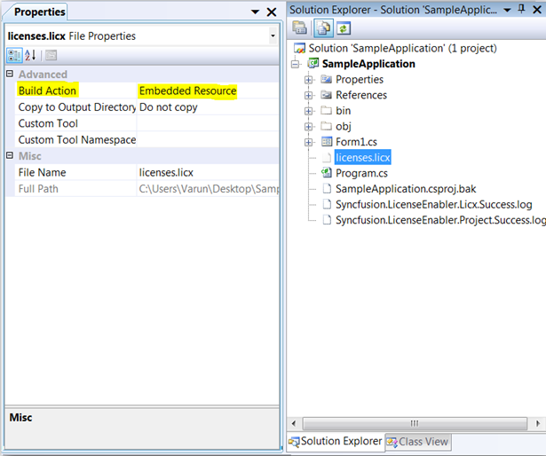
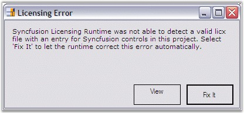
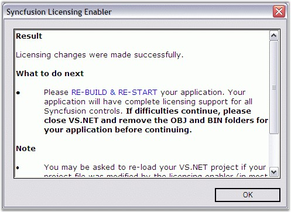
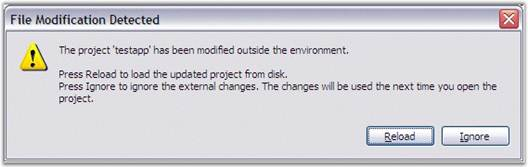
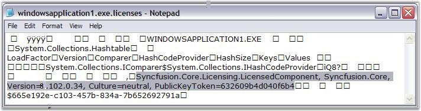
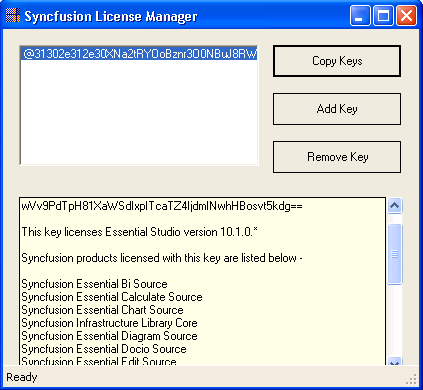
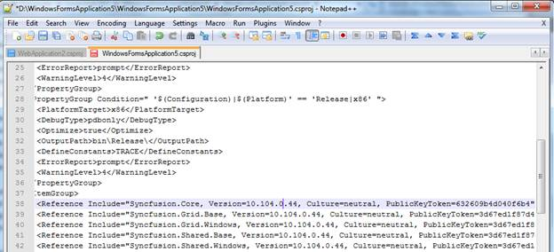
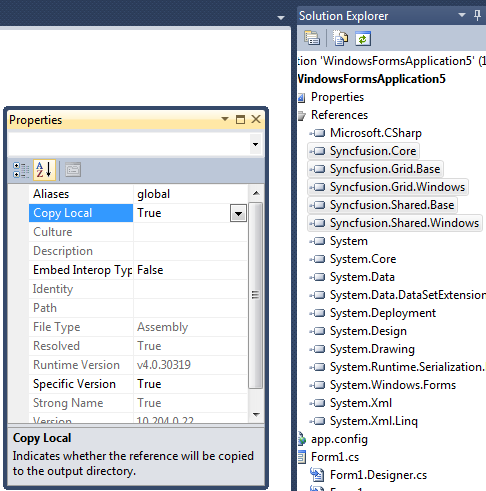

::: {style="DISPLAY: none"}
{#d2h_url_template}{#d2h_package_url style="WIDTH: 0px; DISPLAY: none; HEIGHT: 0px"}
:::

::::: {#nsbanner .d2h_main_nsbanner style="BORDER-BOTTOM: #999999 1px solid; POSITION: relative; PADDING-BOTTOM: 0px; BACKGROUND-COLOR: transparent; PADDING-LEFT: 0px; PADDING-RIGHT: 0px; DISPLAY: none; BORDER-TOP: #999999 1px solid; PADDING-TOP: 0px; LEFT: 0px"}
:::: {#TitleRow .d2h_main_titlerow style="PADDING-BOTTOM: 4px; BACKGROUND-COLOR: transparent; PADDING-LEFT: 22px; WIDTH: 100%; PADDING-RIGHT: 10px; DISPLAY: none; PADDING-TOP: 4px"}
::: {#ienav .d2h_main_ienav style="DISPLAY: none"}
{#D2HPrevious .D2HPreviousEnabled}  {#D2HNext .D2HNextEnabled}
:::
::::
:::::

:::: {#nstext .d2h_main_nstext style="PADDING-BOTTOM: 10px; BACKGROUND-COLOR: transparent; PADDING-LEFT: 22px; PADDING-RIGHT: 10px; HEIGHT: 100%; OVERFLOW: auto; PADDING-TOP: 5px" hasuserbackground="true" valign="bottom"}
::: {#d2h_breadcrumbs .d2h_breadcrumbs}
[Essential Studio User Guide Documentation](ms-xhelp:///?Id=12457748-09e3-4d74-a240-8e049cedf030){.d2h_breadcrumbsNormal}[ \> ]{.d2h_breadcrumbsLinkSeparator}[Essential Common](ms-xhelp:///?Id=2bfe10b6-fac1-4f91-a173-04db314f10c3){.d2h_breadcrumbsNormal}[ \> ]{.d2h_breadcrumbsLinkSeparator}[Frequently Asked Questions](ms-xhelp:///?Id=8c0b82fa-382a-437e-9ce1-9b9ffd3f2ead){.d2h_breadcrumbsNormal}
:::

## How to remove the licensing error that pops up each time the application is run? {#how-to-remove-the-licensing-error-that-pops-up-each-time-the-application-is-run style="tab-stops: 0pt"}

 

Applicable to all the older Syncfusion versions (before 8.2.0.x):

[]{style="FONT-FAMILY: 'Trebuchet MS','sans-serif'; COLOR: #004f8a; FONT-SIZE: 9pt"} 

The following information provides troubleshooting tips that will help configuring the system for a specific version of Syncfusion Essential Studio, and to avoid common licensing issues due to version conflicts.

1.  [Open the project in any text editor and ensure that only one **Syncfusion.Core** entry is referenced. If more than one entry is available, remove it]{style="COLOR: #333333"}

2.  [Reload the application and then remove the **bin** and **obj** folders. ]{style="COLOR: #333333"}

3.  [Ensure that the assemblies referred in the project belong to the same version.]{style="COLOR: #333333"}

4.  [Recompile your project and run it.]{style="COLOR: #333333"}[]{style="COLOR: #333333"}

5.   In the Solution Explorer, click **Show All Files**. []{style="COLOR: #15428b"}

6.   A file called *licenses.licx* with the following entry will be available in the project tree. []{style="COLOR: #15428b"}

[·      ]{style="FONT-FAMILY: Symbol"}Syncfusion.Core.Licensing.LicensedComponent[]{style="COLOR: #15428b"}

[·      ]{style="FONT-FAMILY: Symbol"}Syncfusion.Core. []{style="COLOR: #15428b"}

7.   Add the file to the[ ]{style="COLOR: #15428b"}project.[]{style="COLOR: #15428b"}

8.   Open the properties of this file. []{style="COLOR: #15428b"}

9.   Set the *BuildAction* property to *Embedded Resource* []{style="COLOR: #15428b"}

10.  Run the project.[ ]{style="COLOR: #15428b"}

**[]{style="COLOR: black"}** 

**[Embedding the License.licx file]{style="COLOR: black"}**

The following are the steps to Embed License.licx file as embedded resource in the project:

1.  [Open the project.]{style="COLOR: #333333"}

2.  [In the **Solution Explorer,** right-click on the project node and then select **Add New Item**.]{style="COLOR: #333333"}

3.  [Choose the licenses.licx file from the following location:]{style="COLOR: #333333"}

[]{style="COLOR: #333333"} 

***[{Installed Drive}:\\Program Files\\Syncfusion\\Essential Studio\\{Version}\\Templates\\licenses.licx file.]{style="COLOR: #333333"}***

***[]{style="COLOR: #333333"}*** 

***[The file will be added. ]{style="COLOR: #333333"}***

4.  [In Solution Explorer, click the license file node and then open the **Properties** window.]{style="COLOR: #333333"}

5.  [Set the **Build Action** property to **Embedded Resource**.]{style="COLOR: #333333"}

 {border="0"}

Figure 150: Property Window

[]{style="COLOR: #333333"} 

6.  A **[Licensing]{style="COLOR: #333333"} Error** message will open.

[]{style="FONT-FAMILY: 'Trebuchet MS','sans-serif'; COLOR: #15428b; FONT-SIZE: 9pt"} 

{border="0"}

Figure 151: MultiTarget Manager

7.  Click **Fix It**.

8.  The **Syncfusion Licensing Enabler** dialog box opens.

[]{style="FONT-FAMILY: 'Trebuchet MS','sans-serif'; COLOR: #15428b; FONT-SIZE: 9pt"} 

{border="0"}

Figure 152: Syncfusion Licensing Enabler

9.  Click **Ok**[]{style="FONT-FAMILY: 'Trebuchet MS','sans-serif'; COLOR: #15428b; FONT-SIZE: 9pt"}

10\. The **File Modification Detected** dialog box opens.

[]{style="FONT-FAMILY: 'Trebuchet MS','sans-serif'; COLOR: #15428b; FONT-SIZE: 9pt"} 

{border="0"}

Figure 153: File Modification Detected

[]{style="FONT-FAMILY: 'Trebuchet MS','sans-serif'; COLOR: #15428b; FONT-SIZE: 9pt"} 

11\. Click **Reload**.

 

This message appears because the **.exe.licenses** file shown in the following screenshot has been modified to include the Syncfusion licensing information. To embed this information into the output exe, the user needs to rebuild the application. Verify whether this file has the Syncfusion version information, for which the user has the license. If this has any other version, the **Licensing Error message** will open every time the user runs the application.

[]{style="FONT-FAMILY: 'Trebuchet MS','sans-serif'; COLOR: #15428b; FONT-SIZE: 9pt"} 

{border="0"}

Figure 154: Licensing Error message

[]{style="FONT-FAMILY: 'Trebuchet MS','sans-serif'; COLOR: #15428b; FONT-SIZE: 9pt"} 

12\. Rebuild and run the application again. The above mentioned messages should not be available.

 

 Resolving the Licensing Issues for the latest Syncfusion versions (Applicable to all the Syncfusion versions from 8.2.0.x):

1.  Syncfusion had removed run-time licensing for all Essential Studio products from the version 8.2.0.x. so it is not required to embed the **license.licx** file in your project. Remove the **license.licx** file from the project if it was already added.

 

The following are the steps to resolve the Licensing Issues for the latest Syncfusion versions:

1.   Ensure that the unlock key for the respective version has been properly installed in the registry using the License Manager utility from the dashboard.

 

{border="0"}

Figure 155: License Manager

 

2.   Open your Visual Studio project file in a text editor and ensure that only one Syncfusion.Core reference entry exists in your project.

[]{style="COLOR: black"} 

{border="0"}

Figure 156: Project in Text Editor

[]{style="COLOR: black"} 

3.   If more than one Syncfusion.Core entry exists in your project, remove those entries.

4.   Reload your project in Visual Studio.

5.   Set the **Copy Local** and **Specific Version** property set to **True** for all Syncfusion referenced assemblies.

 

{border="0"}

Figure 157: Property Window

 

[6. Rebuild your application.\
\
]{style="COLOR: black"}

 

 

[]{#related-topics}
::::
