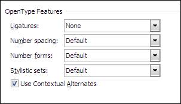
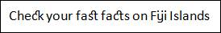
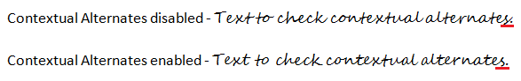
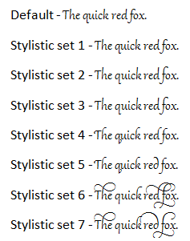

::: {style="DISPLAY: none"}
{#d2h_url_template}{#d2h_package_url style="WIDTH: 0px; DISPLAY: none; HEIGHT: 0px"}
:::

::::: {#nsbanner .d2h_main_nsbanner style="BORDER-BOTTOM: #999999 1px solid; POSITION: relative; PADDING-BOTTOM: 0px; BACKGROUND-COLOR: transparent; PADDING-LEFT: 0px; PADDING-RIGHT: 0px; DISPLAY: none; BORDER-TOP: #999999 1px solid; PADDING-TOP: 0px; LEFT: 0px"}
:::: {#TitleRow .d2h_main_titlerow style="PADDING-BOTTOM: 4px; BACKGROUND-COLOR: transparent; PADDING-LEFT: 22px; WIDTH: 100%; PADDING-RIGHT: 10px; DISPLAY: none; PADDING-TOP: 4px"}
::: {#ienav .d2h_main_ienav style="DISPLAY: none"}
{#D2HPrevious .D2HPreviousEnabled}  {#D2HNext .D2HNextEnabled}
:::
::::
:::::

:::: {#nstext .d2h_main_nstext style="PADDING-BOTTOM: 10px; BACKGROUND-COLOR: transparent; PADDING-LEFT: 22px; PADDING-RIGHT: 10px; HEIGHT: 100%; OVERFLOW: auto; PADDING-TOP: 5px" hasuserbackground="true" valign="bottom"}
::: {#d2h_breadcrumbs .d2h_breadcrumbs}
[Essential Studio User Guide Documentation](ms-xhelp:///?Id=12457748-09e3-4d74-a240-8e049cedf030){.d2h_breadcrumbsNormal}[ \> ]{.d2h_breadcrumbsLinkSeparator}[Reporting Edition](ms-xhelp:///?Id=027aa5b6-6676-4f93-ad23-c20e8c45792e){.d2h_breadcrumbsNormal}[ \> ]{.d2h_breadcrumbsLinkSeparator}[Essential DocIO](ms-xhelp:///?Id=b88d77b3-4c51-460f-a761-d2ef6d5b0ca6){.d2h_breadcrumbsNormal}[ \> ]{.d2h_breadcrumbsLinkSeparator}[Frequently Asked Questions](ms-xhelp:///?Id=82ce5b36-6d4b-438d-b8f8-cf8bbfb1678f){.d2h_breadcrumbsNormal}
:::

## How to set OpenType features? {#how-to-set-opentype-features style="tab-stops: 0pt"}

The open type features provide special effects for text, in order to make them more refined and easier to read. This support is provided specifically for Word 2010 documents. Microsoft Word 2010 has new open type features for a font that supports these features, to make your documents look professional when printed. When font designers create fonts, they often add designs for special features.

The OpenType features include:

[·      ]{style="FONT-FAMILY: Symbol"}Ligatures

[·      ]{style="FONT-FAMILY: Symbol"}Use Contextual Alternates

[·      ]{style="FONT-FAMILY: Symbol"}Number spacing

[·      ]{style="FONT-FAMILY: Symbol"}Number forms

[·      ]{style="FONT-FAMILY: Symbol"}Stylistic sets

{border="0"}

Figure 88: [MS Word ]{style="FONT-FAMILY: 'Calibri','sans-serif'"}Open Type Features for [Font]{style="FONT-FAMILY: 'Calibri','sans-serif'"}

Ligatures

A ligature is a combination of characters that is written as a glyph, which is written as though it is a single character. Most often, ligatures are made up of pairs of letters. This enhances readability and attractiveness by providing the best ligature choice for the surrounding text. The OpenType standard specifies four categories of ligatures namely:

 

[·      ]{style="FONT-FAMILY: Symbol"}**Standard** - The standard set of ligatures varies by language, but it contains the ligatures that most typographers and font designers agree are appropriate for that language.

 

[·      ]{style="FONT-FAMILY: Symbol"}**Contextual** - Contextual ligatures are ligatures that were appropriate for use with that font, but they are not standard.

 

[·      ]{style="FONT-FAMILY: Symbol"}**Historical and discretionary** - Historical forms are ligatures that were once standard but are no longer commonly used in the language. They can be used for a "period" effect. Discretionary ligatures are those that the font designer included for specific purposes. In general, you are more likely to want to apply historical or discretionary ligatures to just a portion of your text.

 

[·      ]{style="FONT-FAMILY: Symbol"}**All** - All ligature combinations that are available for a font are applied to the text.

 

{border="0"}

Figure 89: [Text with Ligatures]{style="FONT-FAMILY: 'Calibri','sans-serif'"}

 

Use Contextual Alternates

Contextual alternates provide fine-tuning of letters or combinations of letters, based on the surrounding characters. This feature can be used to make scripts look more natural and flowing. We can also use contextual alternates to provide specific letter forms at the start or end of a word, next to punctuations, or even at the end of a paragraph.

 

{border="0"}

Figure 90: Contextual alternates

 

Number spacing

[·      ]{style="FONT-FAMILY: Symbol"}**Default** - The default number spacing is specified by the font designer of each font.

 

[·      ]{style="FONT-FAMILY: Symbol"}**Proportional** - Numbers are spaced more like letters with varying widths. For example, an 8 is wider than a 1. This spacing is easier to read in text.

 

[·      ]{style="FONT-FAMILY: Symbol"}**Tabular** - Each number has the same width. This means that in a table column, for example, all three-digit numbers will align vertically. Tabular spacing is useful in Mathematics, which enhances readability for financial information.

 

Number forms

[·      ]{style="FONT-FAMILY: Symbol"}**Default** - The default number form is specified by the font designer of each font.

 

[·      ]{style="FONT-FAMILY: Symbol"}**Lining** - Lining numbers will apply the same height for all numbers and they don't extend below the baseline of the text. Lining numbers are easier to read in tables, boxes, or forms.

 

[·      ]{style="FONT-FAMILY: Symbol"}**Old-style** - In Old-style numbering, the lines of the characters flow above or below the line of the text (it makes the numbers easier to read). For example, some numbers such as 3 and 5 extend below the baseline or are centered higher on the line.

 

Stylistic sets

Stylistic sets help users to change the look of the text by applying a different stylistic set. A font designer may include up to 20 stylistic sets for a font, and each stylistic set may include any subset of the characters of the font.

 

For example, the open type font Gabriola supports seven stylistic sets, each of which changes the formatting of text.

{border="0"}

Figure 91: Text with Stylistic Sets

 

The following code snippets illustrate how to set OpenType features:

+-----------------------------------------------------------------------------------------------------------------------------------------+
| **[\[C#\]]{style="FONT-FAMILY: 'Courier New'; COLOR: black"}**                                                                          |
|                                                                                                                                         |
|                                                                                                                                         |
|                                                                                                                                         |
| [// Sets the contextual alternates.]{style="FONT-FAMILY: 'Courier New'; COLOR: green"}                                                  |
|                                                                                                                                         |
| [text = paragraph.AppendText([\"Text to check contextual alternates.\"]{style="COLOR: #a31515"});]{style="FONT-FAMILY: 'Courier New'"}  |
|                                                                                                                                         |
| [text.CharacterFormat.FontName = [\"Segoe Script\"]{style="COLOR: #a31515"};]{style="FONT-FAMILY: 'Courier New'"}                       |
|                                                                                                                                         |
| [text.CharacterFormat.UseContextualAlternates = [true]{style="COLOR: blue"};]{style="FONT-FAMILY: 'Courier New'"}                       |
|                                                                                                                                         |
|                                                                                                                                         |
|                                                                                                                                         |
| [// Sets the historical discretional ligatures.]{style="FONT-FAMILY: 'Courier New'; COLOR: green"}                                      |
|                                                                                                                                         |
| [text = paragraph.AppendText([\"Check your fast facts on Fiji Islands\"]{style="COLOR: #a31515"});]{style="FONT-FAMILY: 'Courier New'"} |
|                                                                                                                                         |
| [text.CharacterFormat.FontName = [\"Calibri\"]{style="COLOR: #a31515"};]{style="FONT-FAMILY: 'Courier New'"}                            |
|                                                                                                                                         |
| [text.CharacterFormat.Ligatures = [LigatureType]{style="COLOR: #2b91af"}.HistoricalDiscretional;]{style="FONT-FAMILY: 'Courier New'"}   |
|                                                                                                                                         |
| []{style="FONT-FAMILY: 'Courier New'"}                                                                                                  |
|                                                                                                                                         |
| [// Sets the.old style number format.]{style="FONT-FAMILY: 'Courier New'; COLOR: green"}                                                |
|                                                                                                                                         |
| [text = paragraph.AppendText([\"3457645\"]{style="COLOR: #a31515"});]{style="FONT-FAMILY: 'Courier New'"}                               |
|                                                                                                                                         |
| [text.CharacterFormat.FontName = [\"Calibri\"]{style="COLOR: #a31515"};]{style="FONT-FAMILY: 'Courier New'"}                            |
|                                                                                                                                         |
| [text.CharacterFormat.NumberForm = [NumberFormType]{style="COLOR: #2b91af"}.OldStyle;]{style="FONT-FAMILY: 'Courier New'"}              |
|                                                                                                                                         |
| []{style="FONT-FAMILY: 'Courier New'"}                                                                                                  |
|                                                                                                                                         |
| [// Sets the.tabular type number spacing.]{style="FONT-FAMILY: 'Courier New'; COLOR: green"}                                            |
|                                                                                                                                         |
| [text = paragraph.AppendText([\"53127\"]{style="COLOR: #a31515"});]{style="FONT-FAMILY: 'Courier New'"}                                 |
|                                                                                                                                         |
| [text.CharacterFormat.FontName = [\"Calibri\"]{style="COLOR: #a31515"};]{style="FONT-FAMILY: 'Courier New'"}                            |
|                                                                                                                                         |
| [text.CharacterFormat.NumberSpacing = [NumberSpacingType]{style="COLOR: #2b91af"}.Tabular;]{style="FONT-FAMILY: 'Courier New'"}         |
|                                                                                                                                         |
|                                                                                                                                         |
|                                                                                                                                         |
| [// Sets the.stylistic set option.]{style="FONT-FAMILY: 'Courier New'; COLOR: green"}                                                   |
|                                                                                                                                         |
| [text = paragraph.AppendText([\"The quick red fox.\"]{style="COLOR: #a31515"});]{style="FONT-FAMILY: 'Courier New'"}                    |
|                                                                                                                                         |
| [text.CharacterFormat.FontName = [\"Gabriola\"]{style="COLOR: #a31515"};]{style="FONT-FAMILY: 'Courier New'"}                           |
|                                                                                                                                         |
| [text.CharacterFormat.StylisticSet = [StylisticSetType]{style="COLOR: #2b91af"}.StylisticSet06;]{style="FONT-FAMILY: 'Courier New'"}    |
+-----------------------------------------------------------------------------------------------------------------------------------------+

 

[]{style="DISPLAY: none; FONT-FAMILY: 'Times New Roman','serif'; FONT-SIZE: 12pt"} 

+----------------------------------------------------------------------------------------------------------------------------------------+
| **[\[VB.NET\]]{style="FONT-FAMILY: 'Courier New'; COLOR: black"}**                                                                     |
|                                                                                                                                        |
| []{style="FONT-FAMILY: 'Courier New'; COLOR: green"}                                                                                   |
|                                                                                                                                        |
| [\' Sets the contextual alternates.]{style="FONT-FAMILY: 'Courier New'; COLOR: green"}                                                 |
|                                                                                                                                        |
| [text = paragraph.AppendText([\"Text to check contextual alternates.\"]{style="COLOR: #a31515"})]{style="FONT-FAMILY: 'Courier New'"}  |
|                                                                                                                                        |
| [text.CharacterFormat.FontName = [\"Segoe Script\"]{style="COLOR: #a31515"}]{style="FONT-FAMILY: 'Courier New'"}                       |
|                                                                                                                                        |
| [text.CharacterFormat.UseContextualAlternates = [True]{style="COLOR: blue"}]{style="FONT-FAMILY: 'Courier New'"}                       |
|                                                                                                                                        |
| []{style="FONT-FAMILY: 'Courier New'"}                                                                                                 |
|                                                                                                                                        |
| [\' Sets the historical discretional ligatures.]{style="FONT-FAMILY: 'Courier New'; COLOR: green"}                                     |
|                                                                                                                                        |
| [text = paragraph.AppendText([\"Check your fast facts on Fiji Islands\"]{style="COLOR: #a31515"})]{style="FONT-FAMILY: 'Courier New'"} |
|                                                                                                                                        |
| [text.CharacterFormat.FontName = [\"Calibri\"]{style="COLOR: #a31515"}]{style="FONT-FAMILY: 'Courier New'"}                            |
|                                                                                                                                        |
| [text.CharacterFormat.Ligatures = LigatureType.HistoricalDiscretional]{style="FONT-FAMILY: 'Courier New'"}                             |
|                                                                                                                                        |
| []{style="FONT-FAMILY: 'Courier New'"}                                                                                                 |
|                                                                                                                                        |
| [\' Sets the.old style number format.]{style="FONT-FAMILY: 'Courier New'; COLOR: green"}                                               |
|                                                                                                                                        |
| [text = paragraph.AppendText([\"3457645\"]{style="COLOR: #a31515"})]{style="FONT-FAMILY: 'Courier New'"}                               |
|                                                                                                                                        |
| [text.CharacterFormat.FontName = [\"Calibri\"]{style="COLOR: #a31515"}]{style="FONT-FAMILY: 'Courier New'"}                            |
|                                                                                                                                        |
| [text.CharacterFormat.NumberForm = NumberFormType.OldStyle]{style="FONT-FAMILY: 'Courier New'"}                                        |
|                                                                                                                                        |
| []{style="FONT-FAMILY: 'Courier New'"}                                                                                                 |
|                                                                                                                                        |
| [\' Sets the.tabular type number spacing.]{style="FONT-FAMILY: 'Courier New'; COLOR: green"}                                           |
|                                                                                                                                        |
| [text = paragraph.AppendText([\"53127\"]{style="COLOR: #a31515"})]{style="FONT-FAMILY: 'Courier New'"}                                 |
|                                                                                                                                        |
| [text.CharacterFormat.FontName = [\"Calibri\"]{style="COLOR: #a31515"}]{style="FONT-FAMILY: 'Courier New'"}                            |
|                                                                                                                                        |
| [text.CharacterFormat.NumberSpacing = NumberSpacingType.Tabular]{style="FONT-FAMILY: 'Courier New'"}                                   |
|                                                                                                                                        |
| []{style="FONT-FAMILY: 'Courier New'"}                                                                                                 |
|                                                                                                                                        |
| [\' Sets the.stylistic set option.]{style="FONT-FAMILY: 'Courier New'; COLOR: green"}                                                  |
|                                                                                                                                        |
| [text = paragraph.AppendText([\"The quick red fox.\"]{style="COLOR: #a31515"})]{style="FONT-FAMILY: 'Courier New'"}                    |
|                                                                                                                                        |
| [text.CharacterFormat.FontName = [\"Gabriola\"]{style="COLOR: #a31515"}]{style="FONT-FAMILY: 'Courier New'"}                           |
|                                                                                                                                        |
| [text.CharacterFormat.StylisticSet = StylisticSetType.StylisticSet06]{style="FONT-FAMILY: 'Courier New'"}                              |
+----------------------------------------------------------------------------------------------------------------------------------------+

 

[]{#related-topics}
::::
