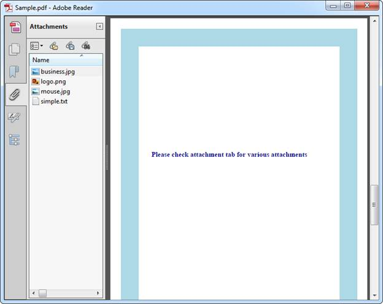

::: {style="DISPLAY: none"}
{#d2h_url_template}{#d2h_package_url style="WIDTH: 0px; DISPLAY: none; HEIGHT: 0px"}
:::

::: {.d2h_secondary_topic style="PADDING-BOTTOM: 10pt; MARGIN: 0pt; PADDING-LEFT: 0pt; PADDING-RIGHT: 0pt; PADDING-TOP: 0pt"}
#### How to set the default view of Navigation Pane in Viewer? {#how-to-set-the-default-view-of-navigation-pane-in-viewer style="tab-stops: 0pt"}

 

When a PDF document is opened in Adobe, by default, any one of the tabs in the Navigation pane can be expanded. It can be set using the PdfPageMode enumeration in Essential PDF. The following code snippet when executed, make Attachments as a default view.

 

+----------------------------------------------------------------------------------------------------------------------------------------------------------------------------------------+
| **[\[C#\]]{style="FONT-FAMILY: 'Courier New'"}**                                                                                                                                       |
|                                                                                                                                                                                        |
| [PdfDocument]{style="FONT-FAMILY: 'Courier New'; COLOR: #2b91af"}[ document = [new]{style="COLOR: blue"} [PdfDocument]{style="COLOR: #2b91af"}();]{style="FONT-FAMILY: 'Courier New'"} |
|                                                                                                                                                                                        |
| [document.ViewerPreferences.PageMode = [PdfPageMode]{style="COLOR: #2b91af"}.UseAttachments;]{style="FONT-FAMILY: 'Courier New'"}                                                      |
+----------------------------------------------------------------------------------------------------------------------------------------------------------------------------------------+

 

+--------------------------------------------------------------------------------------------------------------------------------------------------------------------------+
| **[\[VB.NET\]]{style="FONT-FAMILY: 'Courier New'"}**                                                                                                                     |
|                                                                                                                                                                          |
| [Dim]{style="FONT-FAMILY: 'Courier New'; COLOR: blue"}[ document [As]{style="COLOR: blue"} [New]{style="COLOR: blue"} PdfDocument()]{style="FONT-FAMILY: 'Courier New'"} |
|                                                                                                                                                                          |
| []{style="FONT-FAMILY: 'Courier New'"}                                                                                                                                   |
|                                                                                                                                                                          |
| [document.ViewerPreferences.PageMode = PdfPageMode.UseAttachments]{style="FONT-FAMILY: 'Courier New'"}                                                                   |
+--------------------------------------------------------------------------------------------------------------------------------------------------------------------------+

 

{border="0"}

Figure 65: PDF with default view

 

[]{#related-topics}
:::
