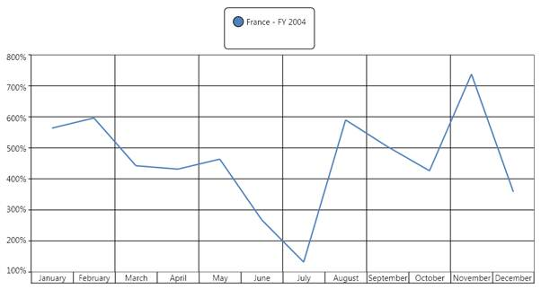
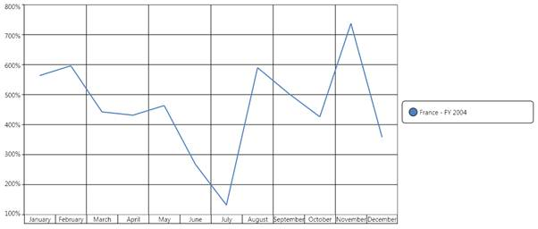
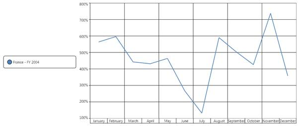
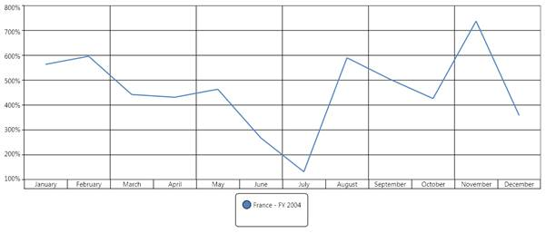

::: {style="DISPLAY: none"}
{#d2h_url_template}{#d2h_package_url style="WIDTH: 0px; DISPLAY: none; HEIGHT: 0px"}
:::

:::: {.d2h_secondary_topic style="PADDING-BOTTOM: 10pt; MARGIN: 0pt; PADDING-LEFT: 0pt; PADDING-RIGHT: 0pt; PADDING-TOP: 0pt"}
##### How to set the rows/columns in a legend? {#how-to-set-the-rowscolumns-in-a-legend style="tab-stops: 0pt"}

[]{style="FONT-FAMILY: 'Calibri','sans-serif'; FONT-SIZE: 11pt"} 

You can use the RowsCount and ColumnsCount property to create the rows or the columns of an OlapChart legend. The RowsCount and ColumnsCount will internally be used to create a Grid layout control to place the legends. The following code snippet shows how to set the number of rows or columns in an OlapLegend:

[]{style="FONT-FAMILY: 'Calibri','sans-serif'; COLOR: black; FONT-SIZE: 11pt"} 

+--------------------------------------------------------------------------------------------------------------------------------------------------------------------------------------------------------------------------------------------------------+
| **\[XAML\]**                                                                                                                                                                                                                                           |
|                                                                                                                                                                                                                                                        |
|                                                                                                                                                                                                                                                        |
|                                                                                                                                                                                                                                                        |
| [\<]{style="COLOR: blue"}[syncfusion]{style="COLOR: #a31515"}[:]{style="COLOR: blue"}[OlapChart.Legend]{style="COLOR: #a31515"}[\>]{style="COLOR: blue"}\                                                                                              |
| [    ]{style="COLOR: #a31515"}[\<]{style="COLOR: blue"}[baseChart]{style="COLOR: #a31515"}[:]{style="COLOR: blue"}[ChartLegend]{style="COLOR: #a31515"}[ Background]{style="COLOR: red"}[=\"Transparent\"]{style="COLOR: blue"}[ ]{style="COLOR: red"} |
|                                                                                                                                                                                                                                                        |
| [                           RowsCount]{style="COLOR: red"}[=\"2\"]{style="COLOR: blue"}[ ColumnsCount]{style="COLOR: red"}[=\"2\" /\>]{style="COLOR: blue"}\                                                                                           |
| [\</]{style="COLOR: blue"}[syncfusion]{style="COLOR: #a31515"}[:]{style="COLOR: blue"}[OlapChart.Legend]{style="COLOR: #a31515"}[\>]{style="COLOR: blue"}                                                                                              |
|                                                                                                                                                                                                                                                        |
|                                                                                                                                                                                                                                                        |
+--------------------------------------------------------------------------------------------------------------------------------------------------------------------------------------------------------------------------------------------------------+

[]{style="FONT-FAMILY: 'Calibri','sans-serif'; FONT-SIZE: 11pt"} 

+-----------------------------------------------------------------------+
| **\[C#\]**                                                            |
|                                                                       |
|                                                                       |
|                                                                       |
| [this]{style="COLOR: blue"}.olapChart.Legend.RowsCount = 2;\          |
| [this]{style="COLOR: blue"}.olapChart.Legend.ColumnsCount = 2;        |
|                                                                       |
|                                                                       |
+-----------------------------------------------------------------------+

[]{style="FONT-FAMILY: 'Calibri','sans-serif'; FONT-SIZE: 11pt"} 

+-----------------------------------------------------------------------+
| **\[VB\]**                                                            |
|                                                                       |
|                                                                       |
|                                                                       |
| [Me]{style="COLOR: blue"}.olapChart.Legend.RowsCount = 2              |
|                                                                       |
| [Me]{style="COLOR: blue"}.olapChart.Legend.ColumnsCount = 2           |
|                                                                       |
|                                                                       |
+-----------------------------------------------------------------------+

::: {style="BORDER-BOTTOM: windowtext 1pt solid; BORDER-LEFT: medium none; PADDING-BOTTOM: 1pt; MARGIN-TOP: 9pt; PADDING-LEFT: 0pt; PADDING-RIGHT: 0pt; MARGIN-BOTTOM: 9pt; BORDER-TOP: windowtext 1pt solid; BORDER-RIGHT: medium none; PADDING-TOP: 1pt"}
 

[{border="0"}]{style="FONT-FAMILY: 'Calibri','sans-serif'; COLOR: black; FONT-SIZE: 11pt"}Note: The RowsCount and the ColumnsCount is used to create the rows and the columns in the Grid layout control, which is used to place the legends. If you give extra row or column count than the legend availability then it will display empty spaces to fill the structure of the grid. The following illustration explains this in detail.
:::

**** 

The following chart has only one legend, but we have set RowsCount = 2 and ColumnsCount = 2. Therefore, the resultant legend will appear as follows:

 

[]{style="FONT-FAMILY: 'Calibri','sans-serif'; COLOR: black; FONT-SIZE: 11pt"} 

{border="0"}

Figure 38: Legend with RowsCount=2, ColumnsCount=2, and ChartDock.Top[]{style="FONT-FAMILY: 'Calibri','sans-serif'; FONT-SIZE: 11pt"}

[]{style="FONT-FAMILY: 'Calibri','sans-serif'; FONT-SIZE: 11pt"} 

***[]{style="FONT-FAMILY: 'Calibri','sans-serif'; FONT-SIZE: 11pt"}*** 

***[]{style="FONT-FAMILY: 'Calibri','sans-serif'; FONT-SIZE: 11pt"}*** 

{border="0"}

Figure 39:  Legend with RowsCount=2, ColumnsCount=2, and ChartDock.Right**[]{style="FONT-STYLE: normal; FONT-FAMILY: 'Calibri','sans-serif'; FONT-SIZE: 11pt"}**

***[]{style="FONT-FAMILY: 'Calibri','sans-serif'; FONT-SIZE: 11pt"}*** 

**[]{style="FONT-FAMILY: 'Calibri','sans-serif'; FONT-SIZE: 11pt"}** 

***[]{style="FONT-FAMILY: 'Calibri','sans-serif'; FONT-SIZE: 11pt"}*** 

***[]{style="FONT-FAMILY: 'Calibri','sans-serif'; FONT-SIZE: 11pt"}*** 

{border="0"}

Figure 40: Legend with RowsCount=2, ColumnsCount=2, and ChartDock.Left**[]{style="FONT-STYLE: normal; FONT-FAMILY: 'Calibri','sans-serif'; FONT-SIZE: 11pt"}**

***[]{style="FONT-FAMILY: 'Calibri','sans-serif'; FONT-SIZE: 11pt"}*** 

***[]{style="FONT-FAMILY: 'Calibri','sans-serif'; FONT-SIZE: 11pt"}*** 

{border="0"}

Figure 41: Legend with RowsCount=2, ColumnsCount=2, and ChartDock.Bottom**[]{style="FONT-STYLE: normal; FONT-FAMILY: 'Calibri','sans-serif'; FONT-SIZE: 11pt"}**

[]{style="FONT-FAMILY: 'Calibri','sans-serif'; FONT-SIZE: 11pt"} 

[]{#related-topics}
::::
