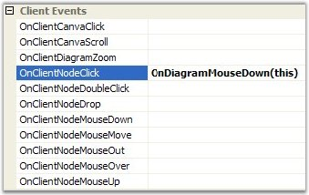

::: {style="DISPLAY: none"}
{#d2h_url_template}{#d2h_package_url style="WIDTH: 0px; DISPLAY: none; HEIGHT: 0px"}
:::

::::: {#nsbanner .d2h_main_nsbanner style="BORDER-BOTTOM: #999999 1px solid; POSITION: relative; PADDING-BOTTOM: 0px; BACKGROUND-COLOR: transparent; PADDING-LEFT: 0px; PADDING-RIGHT: 0px; DISPLAY: none; BORDER-TOP: #999999 1px solid; PADDING-TOP: 0px; LEFT: 0px"}
:::: {#TitleRow .d2h_main_titlerow style="PADDING-BOTTOM: 4px; BACKGROUND-COLOR: transparent; PADDING-LEFT: 22px; WIDTH: 100%; PADDING-RIGHT: 10px; DISPLAY: none; PADDING-TOP: 4px"}
::: {#ienav .d2h_main_ienav style="DISPLAY: none"}
{#D2HPrevious .D2HPreviousEnabled}  {#D2HNext .D2HNextEnabled}
:::
::::
:::::

::::: {#nstext .d2h_main_nstext style="PADDING-BOTTOM: 10px; BACKGROUND-COLOR: transparent; PADDING-LEFT: 22px; PADDING-RIGHT: 10px; HEIGHT: 100%; OVERFLOW: auto; PADDING-TOP: 5px" hasuserbackground="true" valign="bottom"}
::: {#d2h_breadcrumbs .d2h_breadcrumbs}
[Essential Studio User Guide Documentation](ms-xhelp:///?Id=12457748-09e3-4d74-a240-8e049cedf030){.d2h_breadcrumbsNormal}[ \> ]{.d2h_breadcrumbsLinkSeparator}[User Interface Edition](ms-xhelp:///?Id=c29296b7-531c-413b-a0ec-488ca1f7f669){.d2h_breadcrumbsNormal}[ \> ]{.d2h_breadcrumbsLinkSeparator}[Essential ASP.NET](ms-xhelp:///?Id=25c35330-c127-4dad-9a92-ed79dc7261a6){.d2h_breadcrumbsNormal}[ \> ]{.d2h_breadcrumbsLinkSeparator}[Essential Diagram]{.d2h_breadcrumbsContentsOnly}[ \> ]{.d2h_breadcrumbsLinkSeparator}[Frequently Asked Questions](ms-xhelp:///?Id=e48127dc-ac3c-40e3-b966-263e6c8cbb6c){.d2h_breadcrumbsNormal}
:::

## How to show a popup window to display the node\'s information when a node is clicked?[]{style="FONT-SIZE: 10pt"} {#how-to-show-a-popup-window-to-display-the-nodes-information-when-a-node-is-clicked style="tab-stops: 0pt"}

[]{style="FONT-FAMILY: 'Trebuchet MS','sans-serif'; COLOR: #15428b; FONT-SIZE: 9pt"} 

When a node is clicked, the **OnClientNodeClick** public event is handled. Using this event we can display a popup window.

[]{style="FONT-FAMILY: 'Trebuchet MS','sans-serif'; COLOR: #15428b; FONT-SIZE: 9pt"} 

+----------------------------------------------------------------------------------------------------------------------------------------------------------+
| [\<script language=[\"javascript\"]{style="COLOR: maroon"} type=[\"text/javascript\"]{style="COLOR: maroon"}\>]{style="FONT-FAMILY: 'Courier New'"}      |
|                                                                                                                                                          |
| []{style="FONT-FAMILY: 'Courier New'"}                                                                                                                   |
|                                                                                                                                                          |
| [Function]{style="FONT-FAMILY: 'Courier New'; COLOR: blue"}[ OnDiagramMouseDown([ByVal]{style="COLOR: blue"} oData)]{style="FONT-FAMILY: 'Courier New'"} |
|                                                                                                                                                          |
| [{]{style="FONT-FAMILY: 'Courier New'"}                                                                                                                  |
|                                                                                                                                                          |
| [      alert(oData.El.InModelName); // shows alert window [with]{style="COLOR: blue"} node name]{style="FONT-FAMILY: 'Courier New'"}                     |
|                                                                                                                                                          |
| [}]{style="FONT-FAMILY: 'Courier New'"}                                                                                                                  |
|                                                                                                                                                          |
| []{style="FONT-FAMILY: 'Courier New'"}                                                                                                                   |
|                                                                                                                                                          |
| [\</script\>]{style="FONT-FAMILY: 'Courier New'"}                                                                                                        |
+----------------------------------------------------------------------------------------------------------------------------------------------------------+

[]{style="FONT-FAMILY: 'Trebuchet MS','sans-serif'; COLOR: #15428b; FONT-SIZE: 9pt"} 

{border="0"}

 

Figure 76

::: {style="BORDER-BOTTOM: windowtext 1pt solid; BORDER-LEFT: medium none; PADDING-BOTTOM: 1pt; MARGIN-TOP: 9pt; PADDING-LEFT: 0pt; PADDING-RIGHT: 0pt; MARGIN-BOTTOM: 9pt; BORDER-TOP: windowtext 1pt solid; BORDER-RIGHT: medium none; PADDING-TOP: 1pt"}
{border="0"}[Note:]{style="BACKGROUND: white"} Using the OnDiagramMouseDown function, users can write their own code to show the popup window or do some other things. Data.El is an HTML \ element.
:::

[]{#related-topics}
:::::
