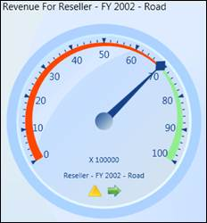
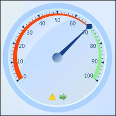

::: {style="DISPLAY: none"}
{#d2h_url_template} {#d2h_package_url style="WIDTH: 0px; DISPLAY: none; HEIGHT: 0px"}
:::

::::: {#nsbanner .d2h_main_nsbanner style="BORDER-BOTTOM: #999999 1px solid; POSITION: relative; PADDING-BOTTOM: 0px; BACKGROUND-COLOR: transparent; PADDING-LEFT: 0px; PADDING-RIGHT: 0px; DISPLAY: none; BORDER-TOP: #999999 1px solid; PADDING-TOP: 0px; LEFT: 0px"}
:::: {#TitleRow .d2h_main_titlerow style="PADDING-BOTTOM: 4px; BACKGROUND-COLOR: transparent; PADDING-LEFT: 22px; WIDTH: 100%; PADDING-RIGHT: 10px; DISPLAY: none; PADDING-TOP: 4px"}
::: {#ienav .d2h_main_ienav style="DISPLAY: none"}
{#D2HPrevious .D2HPreviousEnabled}  {#D2HNext .D2HNextEnabled}
:::
::::
:::::

:::: {#nstext .d2h_main_nstext style="PADDING-BOTTOM: 10px; BACKGROUND-COLOR: transparent; PADDING-LEFT: 22px; PADDING-RIGHT: 10px; HEIGHT: 100%; OVERFLOW: auto; PADDING-TOP: 5px" hasuserbackground="true" valign="bottom"}
::: {#d2h_breadcrumbs .d2h_breadcrumbs}
[Essential Studio User Guide Documentation](ms-xhelp:///?Id=12457748-09e3-4d74-a240-8e049cedf030){.d2h_breadcrumbsNormal} [ \> ]{.d2h_breadcrumbsLinkSeparator} [Business Intelligence Edition](ms-xhelp:///?Id=fdf33dd8-62b2-47b9-ad7b-fc50e590bca5){.d2h_breadcrumbsNormal} [ \> ]{.d2h_breadcrumbsLinkSeparator} [Essential BI WPF](ms-xhelp:///?Id=41e3d586-d922-4a01-8272-679fe4ae7343){.d2h_breadcrumbsNormal} [ \> ]{.d2h_breadcrumbsLinkSeparator} [Essential BI Gauge]{.d2h_breadcrumbsContentsOnly} [ \> ]{.d2h_breadcrumbsLinkSeparator} [Concepts and Features](ms-xhelp:///?Id=b21891c2-ee4b-41e6-a92d-29a3ab4cd8c5){.d2h_breadcrumbsNormal} [ \> ]{.d2h_breadcrumbsLinkSeparator} [Gauge Customization](ms-xhelp:///?Id=165c81e5-a46e-490a-a632-d4dba721805f){.d2h_breadcrumbsNormal}
:::

### How to show as well as hide gauge header, gauge factor and gauge labels? {#how-to-show-as-well-as-hide-gauge-header-gauge-factor-and-gauge-labels style="tab-stops: 0pt"}

The *OLAP Gauge* control provides support to customize the header, which displays the measure and KPI name. The *ShowGaugeHeader* property allows you to show or hide the gauge header. If the property is set to true it displays the gauge header.If it is false, then it hides the gauge header. Similarly *ShowGaugeFactors* and *ShowGaugeLabels* properties are used for showing and hiding the gauge factors and labels. The following is the code snippet.

 

+-----------------------------------------------------------------------+
| **\[C#\]**                                                            |
|                                                                       |
|                                                                       |
|                                                                       |
| [this]{style="COLOR: blue"}.olapGauge1.ShowGaugeHeaders = true;       |
|                                                                       |
| [this]{style="COLOR: blue"}.olapGauge1.ShowGaugeFactors = true;       |
|                                                                       |
| [this]{style="COLOR: blue"}.olapGauge1.ShowGaugeLabels = true;        |
+-----------------------------------------------------------------------+

 

+-----------------------------------------------------------------------+
| **\[VB\]**                                                            |
|                                                                       |
|                                                                       |
|                                                                       |
| [Me]{style="COLOR: blue"}.olapGauge1.ShowGaugeHeaders = True          |
|                                                                       |
| [Me]{style="COLOR: blue"}.olapGauge1.ShowGaugeFactors = True          |
|                                                                       |
| [Me]{style="COLOR: blue"}.olapGauge1.ShowGaugeLabels = True           |
+-----------------------------------------------------------------------+

 

The following screen shot shows the output:

[]{style="FONT-FAMILY: 'Trebuchet MS','sans-serif'; COLOR: #15428b; FONT-SIZE: 9pt"} 

{border="0"}

 

Figure 13:  Showing gauge header, factors and labels

 

+-----------------------------------------------------------------------+
| **\[C#\]**                                                            |
|                                                                       |
|                                                                       |
|                                                                       |
| [this]{style="COLOR: blue"}.olapGauge1.ShowGaugeHeaders = false;      |
|                                                                       |
| [this]{style="COLOR: blue"}.olapGauge1.ShowGaugeFactors = false;      |
|                                                                       |
| [this]{style="COLOR: blue"}.olapGauge1.ShowGaugeLabels = false;       |
+-----------------------------------------------------------------------+

 

+-----------------------------------------------------------------------+
| **\[VB\]**                                                            |
|                                                                       |
|                                                                       |
|                                                                       |
| [Me]{style="COLOR: blue"}.olapGauge1.ShowGaugeHeaders = False         |
|                                                                       |
| [Me]{style="COLOR: blue"}.olapGauge1.ShowGaugeFactors = False         |
|                                                                       |
| [Me]{style="COLOR: blue"}.olapGauge1.ShowGaugeLabels = False          |
+-----------------------------------------------------------------------+

 

The following screen shot shows the output:

 

                       

{border="0"}

 

Figure 14: Hiding gauge header, factors and labels

***[]{style="FONT-FAMILY: 'Cambria','serif'; COLOR: black"}***  

Sample Location

**[]{style="FONT-FAMILY: 'Trebuchet MS','sans-serif'; COLOR: #15428b; FONT-SIZE: 9pt"}**  

A sample demo is available at the following location:

**..\\Syncfusion\\EssentialStudio\\\<Version Number\>\\BI\\WPF\\OLAPGauge.WPF\\Samples\\Product ShowCase\\Product Showcase Demo\\**

 

[]{#related-topics}
::::
