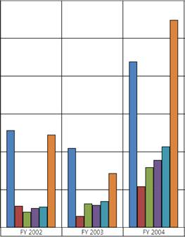

::: {style="DISPLAY: none"}
{#d2h_url_template}{#d2h_package_url style="WIDTH: 0px; DISPLAY: none; HEIGHT: 0px"}
:::

:::: {.d2h_secondary_topic style="PADDING-BOTTOM: 10pt; MARGIN: 0pt; PADDING-LEFT: 0pt; PADDING-RIGHT: 0pt; PADDING-TOP: 0pt"}
##### How to show/hide the expanders in an OlapChart? {#how-to-showhide-the-expanders-in-an-olapchart style="tab-stops: 0pt"}

[]{style="FONT-FAMILY: 'Calibri','sans-serif'; FONT-SIZE: 11pt"} 

The visibility of the expanders in the OlapChart can be toggled by using the ShowExpanders property available in the OlapReport.

The following code snippet describes this in detail:

 

+--------------------------------------------------------------------------------------------------------------------+
| **\[C#\]**                                                                                                         |
|                                                                                                                    |
|                                                                                                                    |
|                                                                                                                    |
| [this]{style="COLOR: blue"}.olapchart1.OlapDataManager.CurrentReport.ShowExpanders = [false]{style="COLOR: blue"}; |
|                                                                                                                    |
|                                                                                                                    |
+--------------------------------------------------------------------------------------------------------------------+

[]{style="FONT-FAMILY: 'Calibri','sans-serif'; FONT-SIZE: 11pt"} 

+------------------------------------------------------------------------------------------------------------------+
| **\[VB\]**                                                                                                       |
|                                                                                                                  |
|                                                                                                                  |
|                                                                                                                  |
| [ Me]{style="COLOR: blue"}.olapchart1.OlapDataManager.CurrentReport.ShowExpanders = [False]{style="COLOR: blue"} |
|                                                                                                                  |
|                                                                                                                  |
+------------------------------------------------------------------------------------------------------------------+

[]{style="FONT-FAMILY: 'Calibri','sans-serif'; FONT-SIZE: 11pt"} 

The following image shows an OlapChart with expanders disabled:

 

{border="0"}

Figure 63: Expanders Disabled in an OlapChart[]{style="FONT-FAMILY: 'Calibri','sans-serif'; FONT-SIZE: 11pt"}

[]{style="FONT-FAMILY: 'Calibri','sans-serif'; FONT-SIZE: 11pt"} 

::: {style="BORDER-BOTTOM: windowtext 1pt solid; BORDER-LEFT: medium none; PADDING-BOTTOM: 1pt; MARGIN-TOP: 9pt; PADDING-LEFT: 0pt; PADDING-RIGHT: 0pt; MARGIN-BOTTOM: 9pt; BORDER-TOP: windowtext 1pt solid; BORDER-RIGHT: medium none; PADDING-TOP: 1pt"}
{border="0"}Note: Since this property interacts with the OlapDataManager you need to assign this property before the call to DataBind() or DataBind() method in the OlapChart and should be invoked after changing this property to see this in effect.
:::

[]{style="FONT-FAMILY: 'Calibri','sans-serif'; COLOR: black; FONT-SIZE: 11pt"} 

[]{#related-topics}
::::
