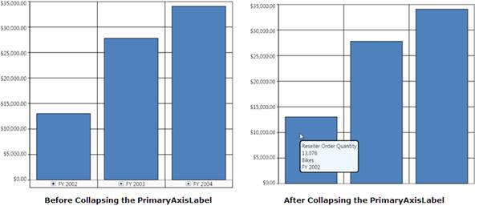

::: {style="DISPLAY: none"}
{#d2h_url_template}{#d2h_package_url style="WIDTH: 0px; DISPLAY: none; HEIGHT: 0px"}
:::

::: {.d2h_secondary_topic style="PADDING-BOTTOM: 10pt; MARGIN: 0pt; PADDING-LEFT: 0pt; PADDING-RIGHT: 0pt; PADDING-TOP: 0pt"}
##### How to toggle the visibility of the PrimaryAxis LabelPanel {#how-to-toggle-the-visibility-of-the-primaryaxis-labelpanel style="tab-stops: 0pt"}

[]{style="FONT-FAMILY: 'Calibri','sans-serif'; FONT-SIZE: 11pt"} 

The PrimaryAxisLabelPanel visibility can be toggled by setting the *PrimaryAxisLabelVisibility* property.

The following code snippet is used to collapse the PrimaryAxis label:

 

+-------------------------------------------------------------------------------------------------------------------------------------------------------------------------------------------------------------------------------------------------------------------------------------+
| **\[XAML\]**                                                                                                                                                                                                                                                                        |
|                                                                                                                                                                                                                                                                                     |
|                                                                                                                                                                                                                                                                                     |
|                                                                                                                                                                                                                                                                                     |
| [\<]{style="COLOR: blue"}[syncfusion]{style="COLOR: #a31515"}[:]{style="COLOR: blue"}[OlapChart]{style="COLOR: #a31515"}[ Name]{style="COLOR: red"}[=\"olapchart1\"]{style="COLOR: blue"}[ PrimaryAxisLabelVisibility]{style="COLOR: red"}[=\"Collapsed\" /\>]{style="COLOR: blue"} |
|                                                                                                                                                                                                                                                                                     |
|                                                                                                                                                                                                                                                                                     |
+-------------------------------------------------------------------------------------------------------------------------------------------------------------------------------------------------------------------------------------------------------------------------------------+

[]{style="FONT-FAMILY: 'Calibri','sans-serif'; FONT-SIZE: 11pt"} 

+------------------------------------------------------------------------------------------------------------------------------------+
| **\[C#\]**                                                                                                                         |
|                                                                                                                                    |
|                                                                                                                                    |
|                                                                                                                                    |
| [this]{style="COLOR: blue"}.olapchart1.PrimaryAxisLabelVisibility = System.Windows.[Visibility]{style="COLOR: #2b91af"}.Collapsed; |
|                                                                                                                                    |
|                                                                                                                                    |
+------------------------------------------------------------------------------------------------------------------------------------+

[]{style="FONT-FAMILY: 'Calibri','sans-serif'; FONT-SIZE: 11pt"} 

+---------------------------------------------------------------------------------------------------------------------------------+
| **\[VB\]**                                                                                                                      |
|                                                                                                                                 |
|                                                                                                                                 |
|                                                                                                                                 |
| [Me]{style="COLOR: blue"}.olapchart1.PrimaryAxisLabelVisibility = System.Windows.[Visibility]{style="COLOR: #2b91af"}.Collapsed |
|                                                                                                                                 |
|                                                                                                                                 |
+---------------------------------------------------------------------------------------------------------------------------------+

 

The following illustration shows how the OlapChart will look after collapsing the PrimaryAxis label.

 

{border="0"}

Figure 37: Before and After collapsing primary axis label

[]{style="FONT-FAMILY: 'Calibri','sans-serif'; FONT-SIZE: 11pt"} 

[]{#related-topics}
:::
