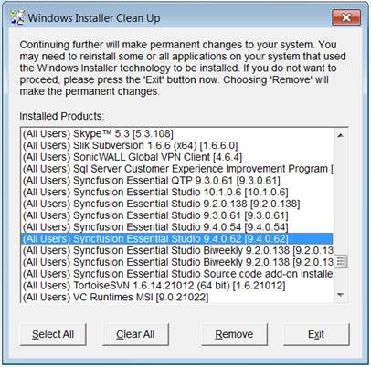

::: {style="DISPLAY: none"}
{#d2h_url_template}{#d2h_package_url style="WIDTH: 0px; DISPLAY: none; HEIGHT: 0px"}
:::

::::: {#nsbanner .d2h_main_nsbanner style="BORDER-BOTTOM: #999999 1px solid; POSITION: relative; PADDING-BOTTOM: 0px; BACKGROUND-COLOR: transparent; PADDING-LEFT: 0px; PADDING-RIGHT: 0px; DISPLAY: none; BORDER-TOP: #999999 1px solid; PADDING-TOP: 0px; LEFT: 0px"}
:::: {#TitleRow .d2h_main_titlerow style="PADDING-BOTTOM: 4px; BACKGROUND-COLOR: transparent; PADDING-LEFT: 22px; WIDTH: 100%; PADDING-RIGHT: 10px; DISPLAY: none; PADDING-TOP: 4px"}
::: {#ienav .d2h_main_ienav style="DISPLAY: none"}
{#D2HPrevious .D2HPreviousEnabled}  {#D2HNext .D2HNextEnabled}
:::
::::
:::::

::::: {#nstext .d2h_main_nstext style="PADDING-BOTTOM: 10px; BACKGROUND-COLOR: transparent; PADDING-LEFT: 22px; PADDING-RIGHT: 10px; HEIGHT: 100%; OVERFLOW: auto; PADDING-TOP: 5px" hasuserbackground="true" valign="bottom"}
::: {#d2h_breadcrumbs .d2h_breadcrumbs}
[Essential Studio User Guide Documentation](ms-xhelp:///?Id=12457748-09e3-4d74-a240-8e049cedf030){.d2h_breadcrumbsNormal}[ \> ]{.d2h_breadcrumbsLinkSeparator}[Essential Common](ms-xhelp:///?Id=2bfe10b6-fac1-4f91-a173-04db314f10c3){.d2h_breadcrumbsNormal}[ \> ]{.d2h_breadcrumbsLinkSeparator}[Frequently Asked Questions](ms-xhelp:///?Id=8c0b82fa-382a-437e-9ce1-9b9ffd3f2ead){.d2h_breadcrumbsNormal}
:::

## How to uninstall Syncfusion Setup manually? {#how-to-uninstall-syncfusion-setup-manually style="tab-stops: 0pt"}

Sometimes installation may crash due to machine got switched off while installation or any other reason. In such case, uninstall utility will not be available. The following are the steps to uninstall the setup manually:

 

1.   Download and install the *Windows Installer cleanup* utility from the following download link:

[[Windows Installer cleanup]{.UGHyperlink}](http://files2.syncfusion.com/installs/Cleanup/msicuu2.exe)[\
\
]{.UGHyperlink}

2.   Remove the Syncfusion product related installers (version you are trying to uninstall) using the **Windows Installer Cleanup** utility.

{border="0"}

Figure 159: Windows Installer Cleanup

 

3.   Manually remove or delete the Syncfusion installed files from the following location (if exists).****

**** 

***Source (Windows XP, Windows Vista, Windows 7):***

***{Installed location}\\ Syncfusion\\Essential Studio\\ {version}***

***Example:*** ***C:\\Program Files\\Syncfusion\\Essential Studio\\9.4.0.62***

***Samples (Windows XP):***

***C:\\Syncfusion\\{version}***

***C:\\Syncfusion\\9.4.0.62***

***Samples (Windows Vista, Windows 7):***

*** C:\\Users\\{user name}\\AppData\\Local\\Syncfusion\\EssentialStudio\\ {version}***

*** Example: C:\\Users\\{user name}\\AppData\\Local\\Syncfusion\\EssentialStudio\\9.4.0.62***

::: {style="BORDER-BOTTOM: windowtext 1pt solid; BORDER-LEFT: medium none; PADDING-BOTTOM: 1pt; MARGIN-TOP: 9pt; PADDING-LEFT: 0pt; PADDING-RIGHT: 0pt; MARGIN-BOTTOM: 9pt; BORDER-TOP: windowtext 1pt solid; BORDER-RIGHT: medium none; PADDING-TOP: 1pt"}
{border="0"}Note: Samples Location above mentioned is default for corresponding OS. If you are installed samples in any other location, Please remove it from that location.
:::

[]{style="FONT-FAMILY: 'Times New Roman','serif'; FONT-SIZE: 12pt"} 

The setup will be uninstalled. You can install it again.

 

 

[]{#related-topics}
:::::
