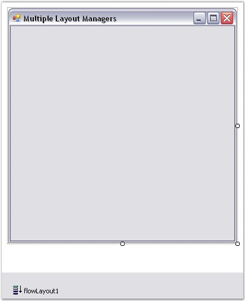
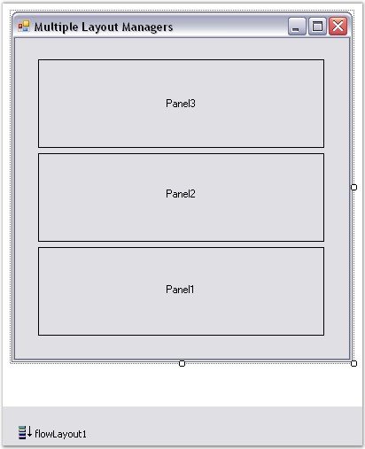
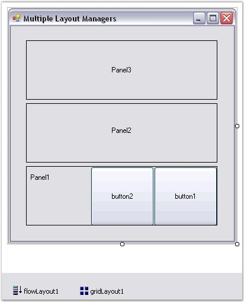
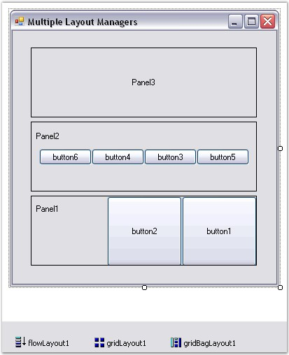
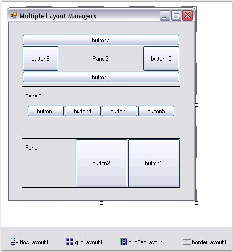
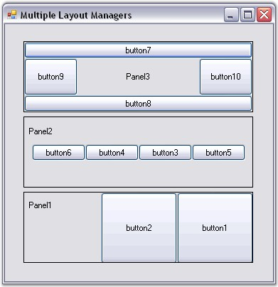

::: {style="DISPLAY: none"}
{#d2h_url_template}{#d2h_package_url style="WIDTH: 0px; DISPLAY: none; HEIGHT: 0px"}
:::

::: {.d2h_secondary_topic style="PADDING-BOTTOM: 10pt; MARGIN: 0pt; PADDING-LEFT: 0pt; PADDING-RIGHT: 0pt; PADDING-TOP: 0pt"}
#### How to use multiple Layout Managers in a single form {#how-to-use-multiple-layout-managers-in-a-single-form style="tab-stops: 0pt"}

[]{style="COLOR: #15428b"} 

It is very simple to use more than one Layout Manager in a single form.

[]{style="COLOR: #15428b"} 

[·      ]{style="FONT-FAMILY: Symbol"}Drag-and-drop the **FlowLayout** Manager from the toolbox onto the form setting it as the Container control.

[]{style="COLOR: #15428b"} 

{border="0"}

[]{style="COLOR: #15428b"} 

Figure 702: FlowLayout in Designer

[]{style="COLOR: #15428b"} 

[·      ]{style="FONT-FAMILY: Symbol"}Add Panels as Child controls onto the form. The FlowLayout Manager will automatically layout the Child components as shown below.

[]{style="COLOR: #15428b"} 

{border="0"}

[]{style="COLOR: #15428b"} 

Figure 703: FlowLayout with Child Controls

[]{style="COLOR: #15428b"} 

[·      ]{style="FONT-FAMILY: Symbol"}Drag and drop the **GridLayout** Manager onto the Panel1 and add Button controls as Child controls. This will be arranged as follows.

[]{style="COLOR: #15428b"} 

{border="0"}

[]{style="COLOR: #15428b"} 

Figure 704: GridLayout with Panel1 as Container Control

[]{style="COLOR: #15428b"} 

[·      ]{style="FONT-FAMILY: Symbol"}We can also make Panel2 as the Container control for **GridBagLayout** Manager. This will arrange it\'s Child controls (Buttons) in a single row as shown below.

**[]{style="COLOR: #15428b"}** 

{border="0"}

[]{style="COLOR: #15428b"} 

Figure 705: GridBagLayout with Panel2 as Container Control

[]{style="COLOR: #15428b"} 

[·      ]{style="FONT-FAMILY: Symbol"}Finally make Panel3 as the Container control for the **BorderLayout** Manager which will arrange the Child controls (Buttons) as follows.

[]{style="COLOR: #15428b"} 

{border="0"}

**[]{style="COLOR: #15428b"}** 

Figure 706: Panel3 as container control with BorderLayout

[]{style="COLOR: #15428b"} 

[·      ]{style="FONT-FAMILY: Symbol"}The final output of the application with all the Layout Managers arranged in the above said fashion is shown below.

[]{style="COLOR: #15428b"} 

{border="0"}

[]{style="COLOR: #15428b"} 

Figure 707: Form with Multiple Layout Managers

[]{style="COLOR: #15428b"} 

See Also

[]{style="COLOR: #15428b"} 

[Creating a Simple Layout]{.UGHyperlink}[, ]{.UGHyperlink}[How to programmatically nest various layouts]{.UGHyperlink}[?]{.UGHyperlink}

[]{#related-topics}
:::
