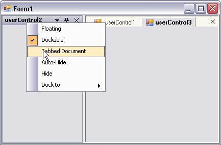

::: {style="DISPLAY: none"}
{#d2h_url_template}{#d2h_package_url style="WIDTH: 0px; DISPLAY: none; HEIGHT: 0px"}
:::

:::: {.d2h_secondary_topic style="PADDING-BOTTOM: 10pt; MARGIN: 0pt; PADDING-LEFT: 0pt; PADDING-RIGHT: 0pt; PADDING-TOP: 0pt"}
##### How to use UserControls as TabbedMDIManager's children? {#how-to-use-usercontrols-as-tabbedmdimanagers-children style="tab-stops: 0pt"}

[]{style="COLOR: #15428b"} 

Normally tabbed-MDI is used in MDI applications where the child forms are the children that get tabbed. But, we could also use tabbed-MDI with UserControls as children and that are also dockable. The sample attached here shows how the UserControls can be used as tabbed-MDI children in association with the DockingManager.

[]{style="COLOR: #15428b"} 

::: {style="BORDER-BOTTOM: windowtext 1pt solid; BORDER-LEFT: medium none; PADDING-BOTTOM: 1pt; MARGIN-TOP: 9pt; PADDING-LEFT: 0pt; PADDING-RIGHT: 0pt; MARGIN-BOTTOM: 9pt; BORDER-TOP: windowtext 1pt solid; BORDER-RIGHT: medium none; PADDING-TOP: 1pt"}
{border="0"} Note:[ ]{style="COLOR: black; FONT-SIZE: 8pt"}Set the IsMdiContainer property of the form to true. Otherwise this will not work.
:::

[]{style="COLOR: #15428b"} 

+--------------------------------------------------------------------------------------------------------------------------------------------------------------------------------------------------------+
| **[\[C#\]]{style="FONT-FAMILY: 'Courier New'; COLOR: black"}**                                                                                                                                         |
|                                                                                                                                                                                                        |
| []{style="FONT-FAMILY: 'Courier New'; COLOR: blue"}                                                                                                                                                    |
|                                                                                                                                                                                                        |
| [this]{style="FONT-FAMILY: 'Courier New'; COLOR: blue"}[.tabbedMDIManager = new TabbedMDIManager();]{style="FONT-FAMILY: 'Courier New'"}                                                               |
|                                                                                                                                                                                                        |
| [this]{style="FONT-FAMILY: 'Courier New'; COLOR: blue"}[.tabbedMDIManager.AttachToMdiContainer(this);]{style="FONT-FAMILY: 'Courier New'"}                                                             |
|                                                                                                                                                                                                        |
| []{style="FONT-FAMILY: 'Courier New'"}                                                                                                                                                                 |
|                                                                                                                                                                                                        |
| [// Dock the User Controls]{style="FONT-FAMILY: 'Courier New'; COLOR: green"}                                                                                                                          |
|                                                                                                                                                                                                        |
| [this]{style="FONT-FAMILY: 'Courier New'; COLOR: blue"}[.dockingManager1.SetEnableDocking([this]{style="COLOR: blue"}.userControl1, [true]{style="COLOR: blue"});]{style="FONT-FAMILY: 'Courier New'"} |
|                                                                                                                                                                                                        |
| [this]{style="FONT-FAMILY: 'Courier New'; COLOR: blue"}[.dockingManager1.SetEnableDocking([this]{style="COLOR: blue"}.userControl2, [true]{style="COLOR: blue"});]{style="FONT-FAMILY: 'Courier New'"} |
|                                                                                                                                                                                                        |
| [this]{style="FONT-FAMILY: 'Courier New'; COLOR: blue"}[.dockingManager1.SetEnableDocking([this]{style="COLOR: blue"}.userControl3, [true]{style="COLOR: blue"});]{style="FONT-FAMILY: 'Courier New'"} |
|                                                                                                                                                                                                        |
| []{style="FONT-FAMILY: 'Courier New'"}                                                                                                                                                                 |
|                                                                                                                                                                                                        |
| [// Set the user controls to MDI mode]{style="FONT-FAMILY: 'Courier New'; COLOR: green"}                                                                                                               |
|                                                                                                                                                                                                        |
| [this]{style="FONT-FAMILY: 'Courier New'; COLOR: blue"}[.dockingManager1.SetAsMDIChild([this]{style="COLOR: blue"}.userControl11,true);]{style="FONT-FAMILY: 'Courier New'"}                           |
|                                                                                                                                                                                                        |
| [this]{style="FONT-FAMILY: 'Courier New'; COLOR: blue"}[.dockingManager1.SetAsMDIChild([this]{style="COLOR: blue"}.userControl21,true);]{style="FONT-FAMILY: 'Courier New'"}                           |
|                                                                                                                                                                                                        |
| [this]{style="FONT-FAMILY: 'Courier New'; COLOR: blue"}[.dockingManager1.SetAsMDIChild([this]{style="COLOR: blue"}.userControl31,true);]{style="FONT-FAMILY: 'Courier New'"}                           |
+--------------------------------------------------------------------------------------------------------------------------------------------------------------------------------------------------------+

[]{style="COLOR: #15428b"} 

+----------------------------------------------------------------------------------------------------------------------------------------------------------------------------------------------------+
| **[\[VB.NET\]]{style="FONT-FAMILY: 'Courier New'; COLOR: black"}**                                                                                                                                 |
|                                                                                                                                                                                                    |
| []{style="FONT-FAMILY: 'Courier New'; COLOR: blue"}                                                                                                                                                |
|                                                                                                                                                                                                    |
| [Me]{style="FONT-FAMILY: 'Courier New'; COLOR: blue"}[.tabbedMDIManager = [New]{style="COLOR: blue"} TabbedMDIManager()]{style="FONT-FAMILY: 'Courier New'"}                                       |
|                                                                                                                                                                                                    |
| [Me]{style="FONT-FAMILY: 'Courier New'; COLOR: blue"}[.tabbedMDIManager.AttachToMdiContainer([Me]{style="COLOR: blue"})]{style="FONT-FAMILY: 'Courier New'"}                                       |
|                                                                                                                                                                                                    |
| []{style="FONT-FAMILY: 'Courier New'"}                                                                                                                                                             |
|                                                                                                                                                                                                    |
| [\' Dock the User Controls]{style="FONT-FAMILY: 'Courier New'; COLOR: green"}                                                                                                                      |
|                                                                                                                                                                                                    |
| [Me]{style="FONT-FAMILY: 'Courier New'; COLOR: blue"}[.dockingManager1.SetEnableDocking([Me]{style="COLOR: blue"}.userControl1, [True]{style="COLOR: blue"});]{style="FONT-FAMILY: 'Courier New'"} |
|                                                                                                                                                                                                    |
| [Me]{style="FONT-FAMILY: 'Courier New'; COLOR: blue"}[.dockingManager1.SetEnableDocking([Me]{style="COLOR: blue"}.userControl2, [True]{style="COLOR: blue"});]{style="FONT-FAMILY: 'Courier New'"} |
|                                                                                                                                                                                                    |
| [Me]{style="FONT-FAMILY: 'Courier New'; COLOR: blue"}[.dockingManager1.SetEnableDocking([Me]{style="COLOR: blue"}.userControl3, [True]{style="COLOR: blue"});]{style="FONT-FAMILY: 'Courier New'"} |
|                                                                                                                                                                                                    |
| []{style="FONT-FAMILY: 'Courier New'"}                                                                                                                                                             |
|                                                                                                                                                                                                    |
| [\' Set the user controls to MDI mode]{style="FONT-FAMILY: 'Courier New'; COLOR: green"}                                                                                                           |
|                                                                                                                                                                                                    |
| [Me]{style="FONT-FAMILY: 'Courier New'; COLOR: blue"}[.dockingManager1.SetAsMDIChild([Me]{style="COLOR: blue"}.userControl11,[True]{style="COLOR: blue"})]{style="FONT-FAMILY: 'Courier New'"}     |
|                                                                                                                                                                                                    |
| [Me]{style="FONT-FAMILY: 'Courier New'; COLOR: blue"}[.dockingManager1.SetAsMDIChild([Me]{style="COLOR: blue"}.userControl21,[True]{style="COLOR: blue"})]{style="FONT-FAMILY: 'Courier New'"}     |
|                                                                                                                                                                                                    |
| [Me]{style="FONT-FAMILY: 'Courier New'; COLOR: blue"}[.dockingManager1.SetAsMDIChild([Me]{style="COLOR: blue"}.userControl31,[True]{style="COLOR: blue"})]{style="FONT-FAMILY: 'Courier New'"}     |
+----------------------------------------------------------------------------------------------------------------------------------------------------------------------------------------------------+

[]{style="COLOR: #15428b"} 

{border="0"}

[]{style="COLOR: #15428b"} 

Figure 105: UserControls used as TabbedMDIManager\'s Children by using the Docking Manager

[]{style="COLOR: #15428b"} 

See Also

[]{style="COLOR: #15428b"} 

[MDI Child Transition]{.UGHyperlink}[]{.UGHyperlink}

[]{#related-topics}
::::
