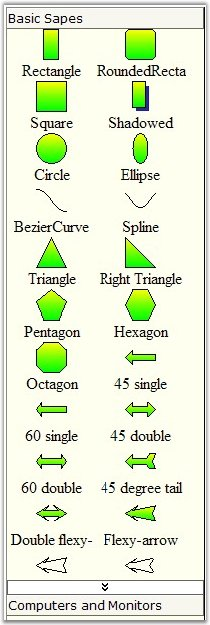
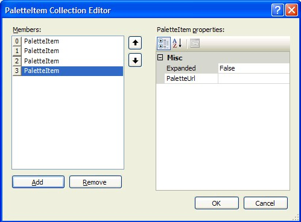

::: {style="DISPLAY: none"}
{#d2h_url_template}{#d2h_package_url style="WIDTH: 0px; DISPLAY: none; HEIGHT: 0px"}
:::

::::: {#nsbanner .d2h_main_nsbanner style="BORDER-BOTTOM: #999999 1px solid; POSITION: relative; PADDING-BOTTOM: 0px; BACKGROUND-COLOR: transparent; PADDING-LEFT: 0px; PADDING-RIGHT: 0px; DISPLAY: none; BORDER-TOP: #999999 1px solid; PADDING-TOP: 0px; LEFT: 0px"}
:::: {#TitleRow .d2h_main_titlerow style="PADDING-BOTTOM: 4px; BACKGROUND-COLOR: transparent; PADDING-LEFT: 22px; WIDTH: 100%; PADDING-RIGHT: 10px; DISPLAY: none; PADDING-TOP: 4px"}
::: {#ienav .d2h_main_ienav style="DISPLAY: none"}
{#D2HPrevious .D2HPreviousEnabled}  {#D2HNext .D2HNextEnabled}
:::
::::
:::::

:::: {#nstext .d2h_main_nstext style="PADDING-BOTTOM: 10px; BACKGROUND-COLOR: transparent; PADDING-LEFT: 22px; PADDING-RIGHT: 10px; HEIGHT: 100%; OVERFLOW: auto; PADDING-TOP: 5px" hasuserbackground="true" valign="bottom"}
::: {#d2h_breadcrumbs .d2h_breadcrumbs}
[Essential Studio User Guide Documentation](ms-xhelp:///?Id=12457748-09e3-4d74-a240-8e049cedf030){.d2h_breadcrumbsNormal}[ \> ]{.d2h_breadcrumbsLinkSeparator}[User Interface Edition](ms-xhelp:///?Id=c29296b7-531c-413b-a0ec-488ca1f7f669){.d2h_breadcrumbsNormal}[ \> ]{.d2h_breadcrumbsLinkSeparator}[Essential ASP.NET](ms-xhelp:///?Id=25c35330-c127-4dad-9a92-ed79dc7261a6){.d2h_breadcrumbsNormal}[ \> ]{.d2h_breadcrumbsLinkSeparator}[Essential Diagram]{.d2h_breadcrumbsContentsOnly}[ \> ]{.d2h_breadcrumbsLinkSeparator}[Frequently Asked Questions](ms-xhelp:///?Id=e48127dc-ac3c-40e3-b966-263e6c8cbb6c){.d2h_breadcrumbsNormal}
:::

## How to work with the Web PaletteGroupBar?[]{style="FONT-SIZE: 10pt"} {#how-to-work-with-the-web-palettegroupbar style="tab-stops: 0pt"}

[]{style="FONT-FAMILY: 'Trebuchet MS','sans-serif'; COLOR: #15428b; FONT-SIZE: 9pt"} 

**PaletteGroupBar** control is very much similar to the Tools.Web GroupBar. But, PaletteGroupBar can render the palette\'s items (Syncfusion.Windows.Forms.Diagram.SymbolPalette).

[]{style="FONT-FAMILY: 'Trebuchet MS','sans-serif'; COLOR: #15428b; FONT-SIZE: 9pt"} 

{border="0"}

Figure 77

[]{style="FONT-FAMILY: 'Trebuchet MS','sans-serif'; COLOR: #15428b; FONT-SIZE: 9pt"} 

PaletteGroupBar will create a separate tab for each palette. Users can specify the items\' layout using the **NodesLayout** property and **ItemsInRow** property.

Possible Layouts are \'Flow\' and \'Vertical\'.

Control is interactive, user can drag nodes from it to any Diagram.Web control on page (if such exists). **DraggingStyle** property specifies the dragging style (works like in Diagram.Web control).

User can add palettes through the Visual Studio designer.

[]{style="FONT-FAMILY: 'Trebuchet MS','sans-serif'; COLOR: #15428b; FONT-SIZE: 9pt"} 

{border="0"}

Figure 78

[]{style="FONT-FAMILY: 'Trebuchet MS','sans-serif'; COLOR: #15428b; FONT-SIZE: 9pt"} 

Also, users can add symbol palettes through code. There is an overload function **AddPalette** which adds a symbol palette to the control.

[]{style="FONT-FAMILY: 'Trebuchet MS','sans-serif'; COLOR: #15428b; FONT-SIZE: 9pt"} 

+------------------------------------------------------------------------------------------------+
| **[\[C#\]]{style="FONT-FAMILY: 'Courier New'; COLOR: black"}**                                 |
|                                                                                                |
| []{style="FONT-FAMILY: 'Courier New'; COLOR: blue"}                                            |
|                                                                                                |
| [AddPalette([string]{style="COLOR: blue"} sFullPath)]{style="FONT-FAMILY: 'Courier New'"}      |
|                                                                                                |
| [AddPalette([SymbolPalette]{style="COLOR: teal"} Palette)]{style="FONT-FAMILY: 'Courier New'"} |
|                                                                                                |
| [AddPalette(Stream strmPalette)]{style="FONT-FAMILY: 'Courier New'"}                           |
+------------------------------------------------------------------------------------------------+

[]{style="FONT-FAMILY: 'Trebuchet MS','sans-serif'; COLOR: #15428b; FONT-SIZE: 9pt"} 

+-------------------------------------------------------------------------------------------+
| **[\[VB.NET\]]{style="FONT-FAMILY: 'Courier New'; COLOR: black"}**                        |
|                                                                                           |
| []{style="FONT-FAMILY: 'Courier New'; COLOR: blue"}                                       |
|                                                                                           |
| [AddPalette([String]{style="COLOR: blue"} sFullPath)]{style="FONT-FAMILY: 'Courier New'"} |
|                                                                                           |
| [AddPalette(SymbolPalette Palette)]{style="FONT-FAMILY: 'Courier New'"}                   |
|                                                                                           |
| [AddPalette(Stream strmPalette)]{style="FONT-FAMILY: 'Courier New'"}                      |
+-------------------------------------------------------------------------------------------+

[]{style="FONT-FAMILY: 'Trebuchet MS','sans-serif'; COLOR: #15428b; FONT-SIZE: 9pt"} 

Here is an example to add a symbol palette.

[]{style="FONT-FAMILY: 'Trebuchet MS','sans-serif'; COLOR: #15428b; FONT-SIZE: 9pt"} 

+--------------------------------------------------------------------------------------------------------------------+
| **[\[C#\]]{style="FONT-FAMILY: 'Courier New'; COLOR: black"}**                                                     |
|                                                                                                                    |
| []{style="FONT-FAMILY: 'Courier New'; COLOR: blue"}                                                                |
|                                                                                                                    |
| [PaletteGroupBarCtrl.AddPalette([@\"D:\\Comps.edp\"]{style="COLOR: maroon"});]{style="FONT-FAMILY: 'Courier New'"} |
+--------------------------------------------------------------------------------------------------------------------+

[]{style="FONT-FAMILY: 'Trebuchet MS','sans-serif'; COLOR: #15428b; FONT-SIZE: 9pt"} 

+------------------------------------------------------------------------------------------------------------------+
| **[\[VB.NET\]]{style="FONT-FAMILY: 'Courier New'; COLOR: black"}**                                               |
|                                                                                                                  |
| []{style="FONT-FAMILY: 'Courier New'; COLOR: blue"}                                                              |
|                                                                                                                  |
| [PaletteGroupBarCtrl.AddPalette([\"D:\\Comps.edp\"]{style="COLOR: maroon"})]{style="FONT-FAMILY: 'Courier New'"} |
+------------------------------------------------------------------------------------------------------------------+

[]{#related-topics}
::::
