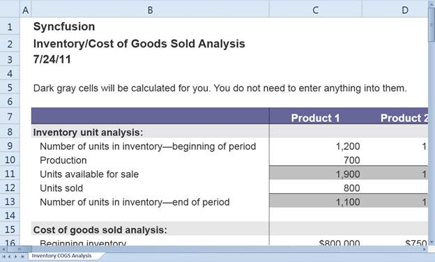
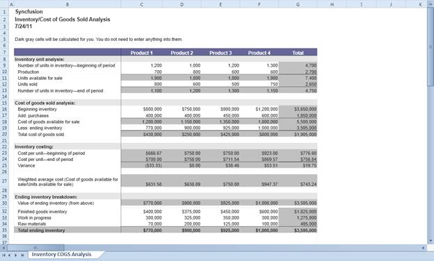

::: {style="DISPLAY: none"}
{#d2h_url_template}{#d2h_package_url style="WIDTH: 0px; DISPLAY: none; HEIGHT: 0px"}
:::

::::: {#nsbanner .d2h_main_nsbanner style="BORDER-BOTTOM: #999999 1px solid; POSITION: relative; PADDING-BOTTOM: 0px; BACKGROUND-COLOR: transparent; PADDING-LEFT: 0px; PADDING-RIGHT: 0px; DISPLAY: none; BORDER-TOP: #999999 1px solid; PADDING-TOP: 0px; LEFT: 0px"}
:::: {#TitleRow .d2h_main_titlerow style="PADDING-BOTTOM: 4px; BACKGROUND-COLOR: transparent; PADDING-LEFT: 22px; WIDTH: 100%; PADDING-RIGHT: 10px; DISPLAY: none; PADDING-TOP: 4px"}
::: {#ienav .d2h_main_ienav style="DISPLAY: none"}
{#D2HPrevious .D2HPreviousEnabled}  {#D2HNext .D2HNextEnabled}
:::
::::
:::::

::: {#nstext .d2h_main_nstext style="PADDING-BOTTOM: 10px; BACKGROUND-COLOR: transparent; PADDING-LEFT: 22px; PADDING-RIGHT: 10px; HEIGHT: 100%; OVERFLOW: auto; PADDING-TOP: 5px" hasuserbackground="true" valign="bottom"}
## How to Zoom in the Spreadsheet Control {#how-to-zoom-in-the-spreadsheet-control style="TEXT-ALIGN: justify; tab-stops: 0pt"}

You can access all grid control-related properties by using the **ActiveSpreadsheetGrid** property in the **SpreadsheetControl.GridProperties** class. By using that you can also change the zoom level of the active spreadsheet grid. The **ZoomScale** property is used to change the zoom level of the grid control. By increasing the **ZoomScale** of the spreadsheet grid, you can see the close-up view of the cells. By decreasing the **ZoomScale**, you can view more of the cells in the grid.

 

The following code shows how to change the zoom scale of the active grid.

+------------------------------------------------------------------------------------------------------------------------------------------------------------------------+
| **[\[C#\]]{style="FONT-FAMILY: 'Courier New'"}**                                                                                                                       |
|                                                                                                                                                                        |
| [this]{style="FONT-FAMILY: 'Courier New'; COLOR: blue"}[.spreadsheetControl.GridProperties.ActiveSpreadsheetGrid.ZoomScale = 1.5;]{style="FONT-FAMILY: 'Courier New'"} |
+------------------------------------------------------------------------------------------------------------------------------------------------------------------------+

 

{border="0"}

Figure 48: Zoom In

 

{border="0"}

Figure 49: Zoom Out

 

[]{#related-topics}
:::
