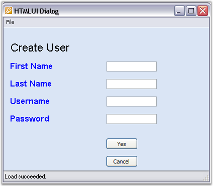

::: {style="DISPLAY: none"}
{#d2h_url_template}{#d2h_package_url style="WIDTH: 0px; DISPLAY: none; HEIGHT: 0px"}
:::

::::: {#nsbanner .d2h_main_nsbanner style="BORDER-BOTTOM: #999999 1px solid; POSITION: relative; PADDING-BOTTOM: 0px; BACKGROUND-COLOR: transparent; PADDING-LEFT: 0px; PADDING-RIGHT: 0px; DISPLAY: none; BORDER-TOP: #999999 1px solid; PADDING-TOP: 0px; LEFT: 0px"}
:::: {#TitleRow .d2h_main_titlerow style="PADDING-BOTTOM: 4px; BACKGROUND-COLOR: transparent; PADDING-LEFT: 22px; WIDTH: 100%; PADDING-RIGHT: 10px; DISPLAY: none; PADDING-TOP: 4px"}
::: {#ienav .d2h_main_ienav style="DISPLAY: none"}
{#D2HPrevious .D2HPreviousEnabled}  {#D2HNext .D2HNextEnabled}
:::
::::
:::::

:::: {#nstext .d2h_main_nstext style="PADDING-BOTTOM: 10px; BACKGROUND-COLOR: transparent; PADDING-LEFT: 22px; PADDING-RIGHT: 10px; HEIGHT: 100%; OVERFLOW: auto; PADDING-TOP: 5px" hasuserbackground="true" valign="bottom"}
::: {#d2h_breadcrumbs .d2h_breadcrumbs}
[Essential Studio User Guide Documentation](ms-xhelp:///?Id=12457748-09e3-4d74-a240-8e049cedf030){.d2h_breadcrumbsNormal}[ \> ]{.d2h_breadcrumbsLinkSeparator}[User Interface Edition](ms-xhelp:///?Id=c29296b7-531c-413b-a0ec-488ca1f7f669){.d2h_breadcrumbsNormal}[ \> ]{.d2h_breadcrumbsLinkSeparator}[Essential Windows](ms-xhelp:///?Id=e60759d8-47a4-4570-9d7a-16a68d63f2ea){.d2h_breadcrumbsNormal}[ \> ]{.d2h_breadcrumbsLinkSeparator}[Essential HTML UI]{.d2h_breadcrumbsContentsOnly}[ \> ]{.d2h_breadcrumbsLinkSeparator}[Concepts And Features](ms-xhelp:///?Id=fcb5d682-601f-4d1c-ae54-299d1cc60ad8){.d2h_breadcrumbsNormal}
:::

## HTML Layout {#html-layout style="tab-stops: 0pt"}

[[[]{style="TEXT-DECORATION: none"}]{style="FONT-FAMILY: 'Trebuchet MS','sans-serif'; COLOR: #15428b; FONT-SIZE: 14pt"}]{.underline} 

HTMLUI can be used as a HTML viewer in two ways.

[·      ]{style="FONT-FAMILY: Symbol"}Display Engine

[·      ]{style="FONT-FAMILY: Symbol"}Layout Engine

[]{style="FONT-FAMILY: 'Trebuchet MS','sans-serif'; COLOR: #15428b; FONT-SIZE: 9pt"} 

The display purposes involve the functionality similar to Web browsers in displaying the contents of the HTML document. In the Layout purpose, it is used to layout and customize rich user-interactive interfaces.

HTMLUI control can be used in a variety of applications which are common in our day-to-day life.

[]{style="FONT-FAMILY: 'Trebuchet MS','sans-serif'; COLOR: #15428b; FONT-SIZE: 9pt"} 

With HTMLUI control\'s support to images and animated images, Chat applications can be developed. The form based dialog box applications used in the office desks can also be developed at ease by simply changing different HTML documents as per the needs. The other interesting applications that can be developed using HTMLUI include games, animations, user blogs, and so on.

The following figure shows a form based dialog that illustrates HTMLUI as a Layout Engine.

 

                    {border="0"}

 

Figure 35: HTMLUI Control functioning as a Layout Engine

 

More:

[ ]{#related-topics}

[{border="0" align="absMiddle"}HTMLUI Chat Sample](ms-xhelp:///?Id=1b721726-ad6b-4e1f-9770-2777d378cbcd){style="TEXT-DECORATION: none"}
::::
