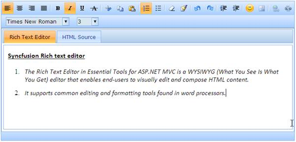
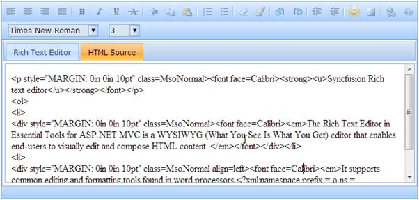

::: {style="DISPLAY: none"}
{#d2h_url_template}{#d2h_package_url style="WIDTH: 0px; DISPLAY: none; HEIGHT: 0px"}
:::

::: {.d2h_secondary_topic style="PADDING-BOTTOM: 10pt; MARGIN: 0pt; PADDING-LEFT: 0pt; PADDING-RIGHT: 0pt; PADDING-TOP: 0pt"}
#### HTML Source {#html-source style="tab-stops: 0pt"}

 

Rich text editor supports accessing the contents of the editor in the form of raw HTML.

The following screen shots show the two different views of the rich text editor viz., design view and HTML view.

{border="0"}

Figure 205: Rich text editor -- Design view

***[]{style="FONT-FAMILY: 'Calibri','sans-serif'"}*** 

{border="0"}

Figure 206: Rich text editor - HTML view

More:

[ ]{#related-topics}

[{border="0" align="absMiddle"}Disabling the HTML Source tab](ms-xhelp:///?Id=d4a5d22a-70c6-4bdd-a9a5-0a46a2e400cc){style="TEXT-DECORATION: none"}

[{border="0" align="absMiddle"}Setting the Default Text](ms-xhelp:///?Id=bb4ec8af-09fc-4aa6-a69a-1bb6336e54de){style="TEXT-DECORATION: none"}
:::
