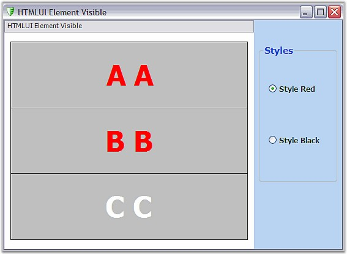

::: {style="DISPLAY: none"}
{#d2h_url_template}{#d2h_package_url style="WIDTH: 0px; DISPLAY: none; HEIGHT: 0px"}
:::

::: {.d2h_secondary_topic style="PADDING-BOTTOM: 10pt; MARGIN: 0pt; PADDING-LEFT: 0pt; PADDING-RIGHT: 0pt; PADDING-TOP: 0pt"}
#### HTMLUIElementsCSS Sample {#htmluielementscss-sample style="tab-stops: 0pt"}

[]{style="FONT-FAMILY: 'Trebuchet MS','sans-serif'; COLOR: #15428b; FONT-SIZE: 9pt"} 

This sample demonstrates the implementation of Internal Style Sheets on HTML Elements.

[]{style="FONT-FAMILY: 'Trebuchet MS','sans-serif'; COLOR: #15428b; FONT-SIZE: 9pt"} 

{border="0"}

[]{style="FONT-FAMILY: 'Trebuchet MS','sans-serif'; COLOR: #15428b; FONT-SIZE: 9pt"} 

Figure 41: HTMLUIElementCSS Sample

[]{style="FONT-FAMILY: 'Trebuchet MS','sans-serif'; COLOR: #15428b; FONT-SIZE: 9pt"} 

By default, this sample can be found under the following location:

***C:\\Documents and Settings\\username\\My Documents\\Syncfusion\\EssentialStudio\\Version Number\\Windows\\HTMLUI.Windows\\ Samples\\2.0\\HTMLUI Appearance\\HTMLUIElementCSS***

 

[]{#related-topics}
:::
