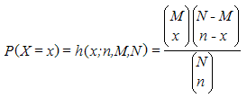

::: {style="DISPLAY: none"}
{#d2h_url_template}{#d2h_package_url style="WIDTH: 0px; DISPLAY: none; HEIGHT: 0px"}
:::

::::: {#nsbanner .d2h_main_nsbanner style="BORDER-BOTTOM: #999999 1px solid; POSITION: relative; PADDING-BOTTOM: 0px; BACKGROUND-COLOR: transparent; PADDING-LEFT: 0px; PADDING-RIGHT: 0px; DISPLAY: none; BORDER-TOP: #999999 1px solid; PADDING-TOP: 0px; LEFT: 0px"}
:::: {#TitleRow .d2h_main_titlerow style="PADDING-BOTTOM: 4px; BACKGROUND-COLOR: transparent; PADDING-LEFT: 22px; WIDTH: 100%; PADDING-RIGHT: 10px; DISPLAY: none; PADDING-TOP: 4px"}
::: {#ienav .d2h_main_ienav style="DISPLAY: none"}
{#D2HPrevious .D2HPreviousEnabled}  {#D2HNext .D2HNextEnabled}
:::
::::
:::::

:::: {#nstext .d2h_main_nstext style="PADDING-BOTTOM: 10px; BACKGROUND-COLOR: transparent; PADDING-LEFT: 22px; PADDING-RIGHT: 10px; HEIGHT: 100%; OVERFLOW: auto; PADDING-TOP: 5px" hasuserbackground="true" valign="bottom"}
::: {#d2h_breadcrumbs .d2h_breadcrumbs}
[Essential Studio User Guide Documentation](ms-xhelp:///?Id=12457748-09e3-4d74-a240-8e049cedf030){.d2h_breadcrumbsNormal}[ \> ]{.d2h_breadcrumbsLinkSeparator}[Reporting Edition](ms-xhelp:///?Id=027aa5b6-6676-4f93-ad23-c20e8c45792e){.d2h_breadcrumbsNormal}[ \> ]{.d2h_breadcrumbsLinkSeparator}[Essential Calculate](ms-xhelp:///?Id=2ea52c7f-a332-43bd-9ca7-2ea0898ff54e){.d2h_breadcrumbsNormal}[ \> ]{.d2h_breadcrumbsLinkSeparator}[Concepts and Features](ms-xhelp:///?Id=91222e44-d3ca-4392-8f0f-41bd2ae3dd3f){.d2h_breadcrumbsNormal}[ \> ]{.d2h_breadcrumbsLinkSeparator}[Function Reference Section](ms-xhelp:///?Id=64c2cb3d-2548-4fe4-b0d1-0c2249ee26c8){.d2h_breadcrumbsNormal}
:::

### HYPEGEOMDIST {#hypegeomdist style="tab-stops: 0pt"}

 

Returns the hypergeometric distribution. HYPGEOMDIST returns the probability of a given number of sample successes, given the sample size, population successes and population size.

 

**Syntax**

 

**HYPGEOMDIST(sample_s, number_sample, population_s, number_population)**

 

where:

**sample_s** is the number of successes in the sample.

**number_sample** is the size of the sample.

**population_s** is the number of successes in the population.

**number_population** is the population size.

 

**Remarks**

 

[·      ]{style="FONT-FAMILY: Symbol"}All arguments are truncated to integers.

[·      ]{style="FONT-FAMILY: Symbol"}sample_s must be \>= 0 less than both  number_sample and population_s.

[·      ]{style="FONT-FAMILY: Symbol"}number_sample must be \>= 0 and \<  number_population.

[·      ]{style="FONT-FAMILY: Symbol"}population_s must be \>= 0 and \<  number_population.

[·      ]{style="FONT-FAMILY: Symbol"}number_population must b \>= 0.

[·      ]{style="FONT-FAMILY: Symbol"}The equation for the hypergeometric distribution is:

[]{style="FONT-FAMILY: 'Trebuchet MS','sans-serif'; COLOR: #15428b; FONT-SIZE: 9pt"} 

{border="0"}

 

where:

**x** = sample_s

**n** = number_sample

**M** = population_s

**N** = number_population

 

[]{#related-topics}
::::
