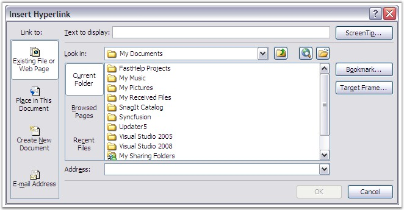

::: {style="DISPLAY: none"}
{#d2h_url_template}{#d2h_package_url style="WIDTH: 0px; DISPLAY: none; HEIGHT: 0px"}
:::

::::: {.d2h_secondary_topic style="PADDING-BOTTOM: 10pt; MARGIN: 0pt; PADDING-LEFT: 0pt; PADDING-RIGHT: 0pt; PADDING-TOP: 0pt"}
##### Hyperlink {#hyperlink style="tab-stops: 0pt"}

 

A hyperlink is a colored and underlined text or a graphic, which when clicked, directs to a file, or a location in a file, or an HTML page on the World Wide Web, or an HTML page on an Intranet. It includes the path information to another object. The object can be a target on the same document, a file on the same computer, or a uniform resource locator, giving the location of a web page halfway around the world. The process is exactly the same in all cases. Some point on the document is turned into an active spot, which includes the path information.

 

{border="0"}

Figure 54: Insert Hyperlink Dialog Box in MS Word

 

 

Essential DocIO allows to insert, edit and replace hyperlinks as fields by using the **Hyperlink** class. **HyperlinkType** enumerator specifies the type of the link in use.

 

**Public Constructor**

 

::: {align="center"}
  -------------------------------- ----------------------------------------------------
  Name                             Description
  Hyperlink( WField hyperlink )    Initializes a new instance of the Hyperlink class.
  -------------------------------- ----------------------------------------------------
:::

 

Public Properties

 

::: {align="center"}
+-----------------------------------+--------------------------------------------------------------------------------------------------------------------+
| **Name**                          | **Description**                                                                                                    |
+-----------------------------------+--------------------------------------------------------------------------------------------------------------------+
| FilePath                          | Gets / sets file path.                                                                                             |
+-----------------------------------+--------------------------------------------------------------------------------------------------------------------+
| Uri                               | Gets / sets url link.                                                                                              |
+-----------------------------------+--------------------------------------------------------------------------------------------------------------------+
| BookmarkName                      | Get/sets Bookmark.                                                                                                 |
+-----------------------------------+--------------------------------------------------------------------------------------------------------------------+
| HyperlinkType                     | Gets / sets a HyperlinkType object that indicates the link type. Below are the Hyperlink types supported by DocIO. |
|                                   |                                                                                                                    |
|                                   |                                                                                                                    |
|                                   |                                                                                                                    |
|                                   | WebLink - Sets the URI                                                                                             |
|                                   |                                                                                                                    |
|                                   | EMailLink - Sets the URI                                                                                           |
|                                   |                                                                                                                    |
|                                   | Bookmark - Sets the name of the bookmark                                                                           |
|                                   |                                                                                                                    |
|                                   | FileLink - Sets the file path                                                                                      |
+-----------------------------------+--------------------------------------------------------------------------------------------------------------------+
| TextToDisplay                     | Gets or sets the text, which will be displayed on the place of hyperlink.                                          |
+-----------------------------------+--------------------------------------------------------------------------------------------------------------------+
:::

 

The following code illustrates how to find and replace the web hyperlinks.

*[]{style="COLOR: red"}* 

+----------------------------------------------------------------------------------------------------------------------------------------------------------------------------------------------------------------------------------------------------------------------------+
| **[\[C#\]]{style="FONT-FAMILY: 'Courier New'; COLOR: black"}**                                                                                                                                                                                                             |
|                                                                                                                                                                                                                                                                            |
| []{style="FONT-FAMILY: 'Courier New'; COLOR: black"}                                                                                                                                                                                                                       |
|                                                                                                                                                                                                                                                                            |
| [WordDocument]{style="FONT-FAMILY: 'Courier New'; COLOR: #2b91af"}[ doc = [new]{style="COLOR: blue"} [WordDocument]{style="COLOR: #2b91af"}();]{style="FONT-FAMILY: 'Courier New'"}                                                                                        |
|                                                                                                                                                                                                                                                                            |
| [doc.Open([\"WebLink_1.doc\"]{style="COLOR: #a31515"});]{style="FONT-FAMILY: 'Courier New'"}                                                                                                                                                                               |
|                                                                                                                                                                                                                                                                            |
| [Hyperlink]{style="FONT-FAMILY: 'Courier New'; COLOR: #2b91af"}[ hlink = [null]{style="COLOR: blue"};]{style="FONT-FAMILY: 'Courier New'"}                                                                                                                                 |
|                                                                                                                                                                                                                                                                            |
| []{style="FONT-FAMILY: 'Courier New'"}                                                                                                                                                                                                                                     |
|                                                                                                                                                                                                                                                                            |
| [foreach]{style="FONT-FAMILY: 'Courier New'; COLOR: blue"}[ ([ParagraphItem]{style="COLOR: #2b91af"} item [in]{style="COLOR: blue"} doc.LastParagraph.Items)]{style="FONT-FAMILY: 'Courier New'"}                                                                          |
|                                                                                                                                                                                                                                                                            |
| [{]{style="FONT-FAMILY: 'Courier New'"}                                                                                                                                                                                                                                    |
|                                                                                                                                                                                                                                                                            |
| [    [if]{style="COLOR: blue"} (item [is]{style="COLOR: blue"} [WField]{style="COLOR: #2b91af"} && (item [as]{style="COLOR: blue"} [WField]{style="COLOR: #2b91af"}).FieldType == [FieldType]{style="COLOR: #2b91af"}.FieldHyperlink)]{style="FONT-FAMILY: 'Courier New'"} |
|                                                                                                                                                                                                                                                                            |
| [    {]{style="FONT-FAMILY: 'Courier New'"}                                                                                                                                                                                                                                |
|                                                                                                                                                                                                                                                                            |
| [        hlink = [new]{style="COLOR: blue"} [Hyperlink]{style="COLOR: #2b91af"}(item [as]{style="COLOR: blue"} [WField]{style="COLOR: #2b91af"});]{style="FONT-FAMILY: 'Courier New'"}                                                                                     |
|                                                                                                                                                                                                                                                                            |
| [        [if]{style="COLOR: blue"} (hlink.Type == [HyperlinkType]{style="COLOR: #2b91af"}.EMailLink)]{style="FONT-FAMILY: 'Courier New'"}                                                                                                                                  |
|                                                                                                                                                                                                                                                                            |
| [        {]{style="FONT-FAMILY: 'Courier New'"}                                                                                                                                                                                                                            |
|                                                                                                                                                                                                                                                                            |
| [            hlink.Type = [HyperlinkType]{style="COLOR: #2b91af"}.WebLink;]{style="FONT-FAMILY: 'Courier New'"}                                                                                                                                                            |
|                                                                                                                                                                                                                                                                            |
| [            hlink.TextToDisplay = [\"Football\"]{style="COLOR: #a31515"};]{style="FONT-FAMILY: 'Courier New'"}                                                                                                                                                            |
|                                                                                                                                                                                                                                                                            |
| [            hlink.Uri = [\"\\\"http://www.football.ua/\\\"\"]{style="COLOR: #a31515"};]{style="FONT-FAMILY: 'Courier New'"}                                                                                                                                               |
|                                                                                                                                                                                                                                                                            |
| [        }]{style="FONT-FAMILY: 'Courier New'"}                                                                                                                                                                                                                            |
|                                                                                                                                                                                                                                                                            |
| [    }]{style="FONT-FAMILY: 'Courier New'"}                                                                                                                                                                                                                                |
|                                                                                                                                                                                                                                                                            |
| [}]{style="FONT-FAMILY: 'Courier New'"}                                                                                                                                                                                                                                    |
|                                                                                                                                                                                                                                                                            |
| [doc.Save([\"WebLink_modified.doc\"]{style="COLOR: #a31515"});]{style="FONT-FAMILY: 'Courier New'"}                                                                                                                                                                        |
+----------------------------------------------------------------------------------------------------------------------------------------------------------------------------------------------------------------------------------------------------------------------------+

 

+---------------------------------------------------------------------------------------------------------------------------------------------------------------------------------------------------------------------------------------------------------------------------------------+
| **[\[VB.NET\]]{style="FONT-FAMILY: 'Courier New'; COLOR: black"}**                                                                                                                                                                                                                    |
|                                                                                                                                                                                                                                                                                       |
| []{style="COLOR: black"}                                                                                                                                                                                                                                                              |
|                                                                                                                                                                                                                                                                                       |
| [Dim]{style="FONT-FAMILY: 'Courier New'; COLOR: blue"}[ doc [As]{style="COLOR: blue"} [New]{style="COLOR: blue"} WordDocument()]{style="FONT-FAMILY: 'Courier New'"}                                                                                                                  |
|                                                                                                                                                                                                                                                                                       |
| [doc.Open([\"WebLink_1.doc\"]{style="COLOR: maroon"}) ]{style="FONT-FAMILY: 'Courier New'"}                                                                                                                                                                                           |
|                                                                                                                                                                                                                                                                                       |
| [Dim]{style="FONT-FAMILY: 'Courier New'; COLOR: blue"}[ hlink [As]{style="COLOR: blue"} Hyperlink = [Nothing]{style="COLOR: blue"}]{style="FONT-FAMILY: 'Courier New'"}                                                                                                               |
|                                                                                                                                                                                                                                                                                       |
| [For]{style="FONT-FAMILY: 'Courier New'; COLOR: blue"}[ [Each]{style="COLOR: blue"} item [As]{style="COLOR: blue"} ParagraphItem [In]{style="COLOR: blue"} doc.LastParagraph.Items ]{style="FONT-FAMILY: 'Courier New'"}                                                              |
|                                                                                                                                                                                                                                                                                       |
| [    [If]{style="COLOR: blue"} [TypeOf]{style="COLOR: blue"} item [Is]{style="COLOR: blue"} WField [AndAlso]{style="COLOR: blue"} [TryCast]{style="COLOR: blue"}(item, WField).FieldType = FieldType.FieldHyperlink [Then]{style="COLOR: blue"} ]{style="FONT-FAMILY: 'Courier New'"} |
|                                                                                                                                                                                                                                                                                       |
| [        hlink = [New]{style="COLOR: blue"} Hyperlink([TryCast]{style="COLOR: blue"}(item, WField)) ]{style="FONT-FAMILY: 'Courier New'"}                                                                                                                                             |
|                                                                                                                                                                                                                                                                                       |
| [        [If]{style="COLOR: blue"} hlink.Type = HyperlinkType.EMailLink [Then]{style="COLOR: blue"} ]{style="FONT-FAMILY: 'Courier New'"}                                                                                                                                             |
|                                                                                                                                                                                                                                                                                       |
| [            hlink.Type = HyperlinkType.WebLink ]{style="FONT-FAMILY: 'Courier New'"}                                                                                                                                                                                                 |
|                                                                                                                                                                                                                                                                                       |
| [            hlink.TextToDisplay = [\"Football\"]{style="COLOR: maroon"} ]{style="FONT-FAMILY: 'Courier New'"}                                                                                                                                                                        |
|                                                                                                                                                                                                                                                                                       |
| [            hlink.Uri = [\"\"\"http://www.football.ua/\"\"\"]{style="COLOR: maroon"} ]{style="FONT-FAMILY: 'Courier New'"}                                                                                                                                                           |
|                                                                                                                                                                                                                                                                                       |
| [        [End]{style="COLOR: blue"} [If]{style="COLOR: blue"} ]{style="FONT-FAMILY: 'Courier New'"}                                                                                                                                                                                   |
|                                                                                                                                                                                                                                                                                       |
| [    [End]{style="COLOR: blue"} [If]{style="COLOR: blue"} ]{style="FONT-FAMILY: 'Courier New'"}                                                                                                                                                                                       |
|                                                                                                                                                                                                                                                                                       |
| [Next]{style="FONT-FAMILY: 'Courier New'; COLOR: blue"}[ ]{style="FONT-FAMILY: 'Courier New'"}                                                                                                                                                                                        |
|                                                                                                                                                                                                                                                                                       |
| [doc.Save([\"WebLink_modified.doc\"]{style="COLOR: maroon"})]{style="FONT-FAMILY: 'Courier New'"}                                                                                                                                                                                     |
+---------------------------------------------------------------------------------------------------------------------------------------------------------------------------------------------------------------------------------------------------------------------------------------+

 

**Hyperlink for Images**

 

The following code illustrates how to set hyperlinks for images.

[]{style="FONT-FAMILY: 'Verdana','sans-serif'; COLOR: black"} 

+-------------------------------------------------------------------------------------------------------------------------------------------------------------------------------------------------------------------------------------------------+
| **[\[C#\]]{style="FONT-FAMILY: 'Courier New'; COLOR: black"}**                                                                                                                                                                                  |
|                                                                                                                                                                                                                                                 |
| []{style="FONT-FAMILY: 'Courier New'"}                                                                                                                                                                                                          |
|                                                                                                                                                                                                                                                 |
| [IWParagraph]{style="FONT-FAMILY: 'Courier New'; COLOR: #2b91af"}[ para = doc.Sections\[0\].AddParagraph();]{style="FONT-FAMILY: 'Courier New'"}                                                                                                |
|                                                                                                                                                                                                                                                 |
| [WPicture]{style="FONT-FAMILY: 'Courier New'; COLOR: #2b91af"}[ mImage = [new]{style="COLOR: blue"} [WPicture]{style="COLOR: #2b91af"}(doc);]{style="FONT-FAMILY: 'Courier New'"}                                                               |
|                                                                                                                                                                                                                                                 |
| [mImage.LoadImage([Image]{style="COLOR: #2b91af"}.FromFile([@\"..\\..\\Nature.jpg\"]{style="COLOR: #a31515"}));]{style="FONT-FAMILY: 'Courier New'"}                                                                                            |
|                                                                                                                                                                                                                                                 |
| []{style="FONT-FAMILY: 'Courier New'"}                                                                                                                                                                                                          |
|                                                                                                                                                                                                                                                 |
| [// Scaling Image.]{style="FONT-FAMILY: 'Courier New'; COLOR: green"}                                                                                                                                                                           |
|                                                                                                                                                                                                                                                 |
| [mImage.HeightScale = 50f;]{style="FONT-FAMILY: 'Courier New'"}                                                                                                                                                                                 |
|                                                                                                                                                                                                                                                 |
| [mImage.WidthScale = 50f;]{style="FONT-FAMILY: 'Courier New'"}                                                                                                                                                                                  |
|                                                                                                                                                                                                                                                 |
| [IWField]{style="FONT-FAMILY: 'Courier New'; COLOR: #2b91af"}[ field = para.AppendField([\"Hyperlink\"]{style="COLOR: #a31515"}, [FieldType]{style="COLOR: #2b91af"}.FieldHyperlink);]{style="FONT-FAMILY: 'Courier New'"}                      |
|                                                                                                                                                                                                                                                 |
| [Hyperlink]{style="FONT-FAMILY: 'Courier New'; COLOR: #2b91af"}[ hlink = [new]{style="COLOR: blue"} [Hyperlink]{style="COLOR: #2b91af"}(field [as]{style="COLOR: blue"} [WField]{style="COLOR: #2b91af"});]{style="FONT-FAMILY: 'Courier New'"} |
|                                                                                                                                                                                                                                                 |
| [hlink.Type = [HyperlinkType]{style="COLOR: #2b91af"}.WebLink;]{style="FONT-FAMILY: 'Courier New'"}                                                                                                                                             |
|                                                                                                                                                                                                                                                 |
| [hlink.Uri = [\"http://www.syncfusion.com\"]{style="COLOR: #a31515"};]{style="FONT-FAMILY: 'Courier New'"}                                                                                                                                      |
|                                                                                                                                                                                                                                                 |
| [hlink.PictureToDisplay = mImage;]{style="FONT-FAMILY: 'Courier New'"}                                                                                                                                                                          |
+-------------------------------------------------------------------------------------------------------------------------------------------------------------------------------------------------------------------------------------------------+

 

+---------------------------------------------------------------------------------------------------------------------------------------------------------------------------------------------------------------------------+
| **[\[VB.NET\]]{style="FONT-FAMILY: 'Courier New'; COLOR: black"}**                                                                                                                                                        |
|                                                                                                                                                                                                                           |
| []{style="COLOR: black"}                                                                                                                                                                                                  |
|                                                                                                                                                                                                                           |
| [Dim]{style="FONT-FAMILY: 'Courier New'; COLOR: blue"}[ para [As]{style="COLOR: blue"} IWParagraph = doc.Sections(0).AddParagraph()]{style="FONT-FAMILY: 'Courier New'"}                                                  |
|                                                                                                                                                                                                                           |
| [Dim]{style="FONT-FAMILY: 'Courier New'; COLOR: blue"}[ mImage [As]{style="COLOR: blue"} [New]{style="COLOR: blue"} WPicture(doc)]{style="FONT-FAMILY: 'Courier New'"}                                                    |
|                                                                                                                                                                                                                           |
| [mImage.LoadImage(Image.FromFile([\"..\\..\\Nature.jpg\"]{style="COLOR: maroon"})) ]{style="FONT-FAMILY: 'Courier New'"}                                                                                                  |
|                                                                                                                                                                                                                           |
| []{style="FONT-FAMILY: 'Courier New'; COLOR: green"}                                                                                                                                                                      |
|                                                                                                                                                                                                                           |
| [\' Scaling Image. ]{style="FONT-FAMILY: 'Courier New'; COLOR: green"}                                                                                                                                                    |
|                                                                                                                                                                                                                           |
| [mImage.HeightScale = 50F ]{style="FONT-FAMILY: 'Courier New'"}                                                                                                                                                           |
|                                                                                                                                                                                                                           |
| [mImage.WidthScale = 50F ]{style="FONT-FAMILY: 'Courier New'"}                                                                                                                                                            |
|                                                                                                                                                                                                                           |
| [Dim]{style="FONT-FAMILY: 'Courier New'; COLOR: blue"}[ field [As]{style="COLOR: blue"} IWField = para.AppendField([\"Hyperlink\"]{style="COLOR: maroon"}, FieldType.FieldHyperlink)]{style="FONT-FAMILY: 'Courier New'"} |
|                                                                                                                                                                                                                           |
| [Dim]{style="FONT-FAMILY: 'Courier New'; COLOR: blue"}[ hlink [As]{style="COLOR: blue"} [New]{style="COLOR: blue"} Hyperlink([TryCast]{style="COLOR: blue"}(field, WField))]{style="FONT-FAMILY: 'Courier New'"}          |
|                                                                                                                                                                                                                           |
| [hlink.Type = HyperlinkType.WebLink ]{style="FONT-FAMILY: 'Courier New'"}                                                                                                                                                 |
|                                                                                                                                                                                                                           |
| [hlink.Uri = [\"http://www.syncfusion.com\"]{style="COLOR: maroon"} ]{style="FONT-FAMILY: 'Courier New'"}                                                                                                                 |
|                                                                                                                                                                                                                           |
| [hlink.PictureToDisplay = mImage ]{style="FONT-FAMILY: 'Courier New'"}                                                                                                                                                    |
+---------------------------------------------------------------------------------------------------------------------------------------------------------------------------------------------------------------------------+

 

[]{#related-topics}
:::::
