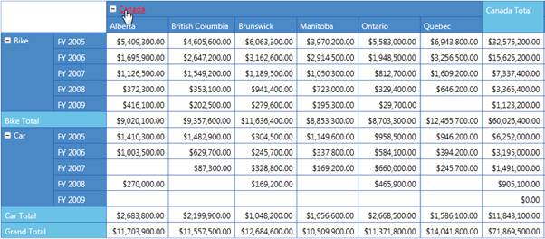
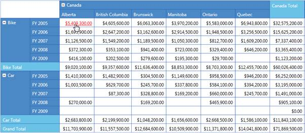

::: {style="DISPLAY: none"}
{#d2h_url_template}{#d2h_package_url style="WIDTH: 0px; DISPLAY: none; HEIGHT: 0px"}
:::

::::: {#nsbanner .d2h_main_nsbanner style="BORDER-BOTTOM: #999999 1px solid; POSITION: relative; PADDING-BOTTOM: 0px; BACKGROUND-COLOR: transparent; PADDING-LEFT: 0px; PADDING-RIGHT: 0px; DISPLAY: none; BORDER-TOP: #999999 1px solid; PADDING-TOP: 0px; LEFT: 0px"}
:::: {#TitleRow .d2h_main_titlerow style="PADDING-BOTTOM: 4px; BACKGROUND-COLOR: transparent; PADDING-LEFT: 22px; WIDTH: 100%; PADDING-RIGHT: 10px; DISPLAY: none; PADDING-TOP: 4px"}
::: {#ienav .d2h_main_ienav style="DISPLAY: none"}
{#D2HPrevious .D2HPreviousEnabled}  {#D2HNext .D2HNextEnabled}
:::
::::
:::::

:::: {#nstext .d2h_main_nstext style="PADDING-BOTTOM: 10px; BACKGROUND-COLOR: transparent; PADDING-LEFT: 22px; PADDING-RIGHT: 10px; HEIGHT: 100%; OVERFLOW: auto; PADDING-TOP: 5px" hasuserbackground="true" valign="bottom"}
::: {#d2h_breadcrumbs .d2h_breadcrumbs}
[Essential Studio User Guide Documentation](ms-xhelp:///?Id=12457748-09e3-4d74-a240-8e049cedf030){.d2h_breadcrumbsNormal}[ \> ]{.d2h_breadcrumbsLinkSeparator}[Business Intelligence Edition](ms-xhelp:///?Id=fdf33dd8-62b2-47b9-ad7b-fc50e590bca5){.d2h_breadcrumbsNormal}[ \> ]{.d2h_breadcrumbsLinkSeparator}[Essential BI Silverlight](ms-xhelp:///?Id=c006b39c-6aa2-4637-b7de-3e7b6cb3f9f9){.d2h_breadcrumbsNormal}[ \> ]{.d2h_breadcrumbsLinkSeparator}[Essential Pivot Grid]{.d2h_breadcrumbsContentsOnly}[ \> ]{.d2h_breadcrumbsLinkSeparator}[Features](ms-xhelp:///?Id=9d7968f1-d52c-4e79-a6ae-fb01305e9f98){.d2h_breadcrumbsNormal}
:::

## Hyperlink Cells {#hyperlink-cells style="tab-stops: 0pt"}

 

The PivotGrid for Silverlight allows Hyperlinking of cells to retrieve a detailed description about a particular cell. The Hyperlink Cells property of PivotGrid generates a separate event called **HyperLinkCellClick** for the clicked cell and the **HyperLinkCellClickEventArgs** will return the clicked **PivotCellInfo**.

Hyperlink Cell's property can be applied to the following cells.

[·      ]{style="FONT-FAMILY: Symbol"}Column Header

[·      ]{style="FONT-FAMILY: Symbol"}Row Header

[·      ]{style="FONT-FAMILY: Symbol"}Summary Header

[·      ]{style="FONT-FAMILY: Symbol"}Summary Cell

[·      ]{style="FONT-FAMILY: Symbol"}Value Cell

 

Adding Hyperlink Cells

You can enable a cell present in the Grid as a Hyperlink by setting the IsHyperlinkCell property of that cell style to True.

Example: To make a column header cell as a hyperlink, set **PivotGrid.ColumnHeaderStyle.IsHyperlinkCell** = True.

The property usage is illustrated in the code given below.

 

+---------------------------------------------------------------------------------------------------------------------------------------------------------------------------------------------------------------------------------------------+
| **[\[C#\]]{style="FONT-FAMILY: 'Courier New'"}**                                                                                                                                                                                            |
|                                                                                                                                                                                                                                             |
| [// Instantiating PivotGridControl.]{style="FONT-FAMILY: 'Courier New'"}                                                                                                                                                                    |
|                                                                                                                                                                                                                                             |
| [PivotGridControl ]{style="FONT-FAMILY: 'Courier New'"}[PivotGrid1 ]{style="FONT-FAMILY: 'Courier New'"}[= [new]{style="COLOR: blue"} PivotGridControl();]{style="FONT-FAMILY: 'Courier New'"}                                              |
|                                                                                                                                                                                                                                             |
| [// Adding PivotRows.]{style="FONT-FAMILY: 'Courier New'"}                                                                                                                                                                                  |
|                                                                                                                                                                                                                                             |
| [PivotGrid1]{style="FONT-FAMILY: 'Courier New'"}[.PivotRows.Add([new]{style="COLOR: blue"} [PivotItem]{style="COLOR: #2b91af"} { FieldHeader = [\"Product\"]{style="COLOR: #a31515"} });]{style="FONT-FAMILY: 'Courier New'"}               |
|                                                                                                                                                                                                                                             |
| [// Adding PivotColumns.]{style="FONT-FAMILY: 'Courier New'"}                                                                                                                                                                               |
|                                                                                                                                                                                                                                             |
| [PivotGrid1]{style="FONT-FAMILY: 'Courier New'"}[.PivotColumns.Add([new]{style="COLOR: blue"} [PivotItem]{style="COLOR: #2b91af"} { FieldHeader = [\"Date\"]{style="COLOR: #a31515"} });]{style="FONT-FAMILY: 'Courier New'"}               |
|                                                                                                                                                                                                                                             |
| [// Adding PivotCalculations.]{style="FONT-FAMILY: 'Courier New'"}                                                                                                                                                                          |
|                                                                                                                                                                                                                                             |
| [PivotGrid1]{style="FONT-FAMILY: 'Courier New'"}[.PivotCalculations.Add([new]{style="COLOR: blue"} [PivotComputationInfo]{style="COLOR: #2b91af"} { FieldName=[\"Amount\"]{style="COLOR: #a31515"} });]{style="FONT-FAMILY: 'Courier New'"} |
|                                                                                                                                                                                                                                             |
| []{style="FONT-FAMILY: 'Courier New'; COLOR: green"}                                                                                                                                                                                        |
|                                                                                                                                                                                                                                             |
| [// To Enable Hyperlink for Column Header.]{style="FONT-FAMILY: 'Courier New'"}                                                                                                                                                             |
|                                                                                                                                                                                                                                             |
| [this]{style="FONT-FAMILY: 'Courier New'; COLOR: blue"}[.PivotGrid1.ColumnHeaderCellStyle.IsHyperlinkCell = [true]{style="COLOR: blue"};]{style="FONT-FAMILY: 'Courier New'"}                                                               |
|                                                                                                                                                                                                                                             |
| [// To Enable Hyperlink for Row Header.]{style="FONT-FAMILY: 'Courier New'"}                                                                                                                                                                |
|                                                                                                                                                                                                                                             |
| [this]{style="FONT-FAMILY: 'Courier New'; COLOR: blue"}[.PivotGrid1.RowHeaderCellStyle.IsHyperlinkCell = [true]{style="COLOR: blue"};]{style="FONT-FAMILY: 'Courier New'"}                                                                  |
|                                                                                                                                                                                                                                             |
| [// To Enable Hyperlink for Summary Header.]{style="FONT-FAMILY: 'Courier New'"}                                                                                                                                                            |
|                                                                                                                                                                                                                                             |
| [this]{style="FONT-FAMILY: 'Courier New'; COLOR: blue"}[.PivotGrid1.SummaryHeaderStyle.IsHyperlinkCell = [true]{style="COLOR: blue"};]{style="FONT-FAMILY: 'Courier New'"}                                                                  |
|                                                                                                                                                                                                                                             |
| [// To Enable Hyperlink for Summary Cell.]{style="FONT-FAMILY: 'Courier New'"}                                                                                                                                                              |
|                                                                                                                                                                                                                                             |
| [this]{style="FONT-FAMILY: 'Courier New'; COLOR: blue"}[.PivotGrid1.SummaryCellStyle.IsHyperlinkCell = [true]{style="COLOR: blue"};]{style="FONT-FAMILY: 'Courier New'"}                                                                    |
|                                                                                                                                                                                                                                             |
| [// To Enable Hyperlink for Value Cell.]{style="FONT-FAMILY: 'Courier New'"}                                                                                                                                                                |
|                                                                                                                                                                                                                                             |
| [this]{style="FONT-FAMILY: 'Courier New'; COLOR: blue"}[.PivotGrid1.ValueCellStyle.IsHyperlinkCell = [true]{style="COLOR: blue"};]{style="FONT-FAMILY: 'Courier New'"}                                                                      |
|                                                                                                                                                                                                                                             |
| []{style="FONT-FAMILY: 'Courier New'"}                                                                                                                                                                                                      |
+---------------------------------------------------------------------------------------------------------------------------------------------------------------------------------------------------------------------------------------------+

 

+----------------------------------------------------------------------------------------------------------------------------------------------------------------------------------------------------+
| **[\[VB\]]{style="FONT-FAMILY: 'Courier New'"}**                                                                                                                                                   |
|                                                                                                                                                                                                    |
| []{style="FONT-FAMILY: 'Courier New'"}                                                                                                                                                             |
|                                                                                                                                                                                                    |
| [\' Instantiating PivotGridControl.]{style="FONT-FAMILY: 'Courier New'"}                                                                                                                           |
|                                                                                                                                                                                                    |
| [Dim]{style="FONT-FAMILY: 'Courier New'; COLOR: blue"}[ PivotGrid1 [As]{style="COLOR: blue"} PivotGridControl = [New]{style="COLOR: blue"} PivotGridControl()]{style="FONT-FAMILY: 'Courier New'"} |
|                                                                                                                                                                                                    |
| [\' Adding PivotRows.]{style="FONT-FAMILY: 'Courier New'"}                                                                                                                                         |
|                                                                                                                                                                                                    |
| [PivotGrid1.PivotRows.Add([New]{style="COLOR: blue"} PivotItem [With]{style="COLOR: blue"} {.FieldHeader = \"Product\"})]{style="FONT-FAMILY: 'Courier New'"}                                      |
|                                                                                                                                                                                                    |
| [\' Adding PivotColumns.]{style="FONT-FAMILY: 'Courier New'"}                                                                                                                                      |
|                                                                                                                                                                                                    |
| [PivotGrid1.PivotColumns.Add([New]{style="COLOR: blue"} PivotItem [With]{style="COLOR: blue"} {.FieldHeader = \"Date\"})]{style="FONT-FAMILY: 'Courier New'"}                                      |
|                                                                                                                                                                                                    |
| [\' Adding PivotCalculations.]{style="FONT-FAMILY: 'Courier New'"}                                                                                                                                 |
|                                                                                                                                                                                                    |
| [PivotGrid1.PivotCalculations.Add([New]{style="COLOR: blue"} PivotComputationInfo [With]{style="COLOR: blue"} {.FieldName=\"Amount\"})]{style="FONT-FAMILY: 'Courier New'"}                        |
|                                                                                                                                                                                                    |
| []{style="FONT-FAMILY: 'Courier New'"}                                                                                                                                                             |
|                                                                                                                                                                                                    |
| [\' To Enable Hyperlink for Column Header.]{style="FONT-FAMILY: 'Courier New'"}                                                                                                                    |
|                                                                                                                                                                                                    |
| [Me]{style="FONT-FAMILY: 'Courier New'; COLOR: blue"}[.PivotGrid1.ColumnHeaderCellStyle.IsHyperlinkCell = [True]{style="COLOR: blue"}]{style="FONT-FAMILY: 'Courier New'"}                         |
|                                                                                                                                                                                                    |
| [\' To Enable Hyperlink for Row Header.]{style="FONT-FAMILY: 'Courier New'"}                                                                                                                       |
|                                                                                                                                                                                                    |
| [Me]{style="FONT-FAMILY: 'Courier New'; COLOR: blue"}[.PivotGrid1.RowHeaderCellStyle.IsHyperlinkCell = [True]{style="COLOR: blue"}]{style="FONT-FAMILY: 'Courier New'"}                            |
|                                                                                                                                                                                                    |
| [\' To Enable Hyperlink for Summary Header.]{style="FONT-FAMILY: 'Courier New'"}                                                                                                                   |
|                                                                                                                                                                                                    |
| [Me]{style="FONT-FAMILY: 'Courier New'; COLOR: blue"}[PivotGrid1.SummaryHeaderStyle.IsHyperlinkCell = [True]{style="COLOR: blue"}]{style="FONT-FAMILY: 'Courier New'"}                             |
|                                                                                                                                                                                                    |
| [\' To Enable Hyperlink for Summary Cell.]{style="FONT-FAMILY: 'Courier New'"}                                                                                                                     |
|                                                                                                                                                                                                    |
| [Me]{style="FONT-FAMILY: 'Courier New'; COLOR: blue"}[. PivotGrid1.SummaryCellStyle.IsHyperlinkCell = [True]{style="COLOR: blue"}]{style="FONT-FAMILY: 'Courier New'"}                             |
|                                                                                                                                                                                                    |
| [\' To Enable Hyperlink for Value Cell.]{style="FONT-FAMILY: 'Courier New'"}                                                                                                                       |
|                                                                                                                                                                                                    |
| [Me]{style="FONT-FAMILY: 'Courier New'; COLOR: blue"}[.PivotGrid1.ValueCellStyle.IsHyperlinkCell = [True]{style="COLOR: blue"}]{style="FONT-FAMILY: 'Courier New'"}                                |
+----------------------------------------------------------------------------------------------------------------------------------------------------------------------------------------------------+

 

{border="0"}

Figure 13: PivotGrid with Hyperlink Column Header

 

{border="0"}

Figure 14: Pivot Grid with Hyperlink Row Header

 

{border="0"}

Figure 15: PivotGrid with Hyperlink Value Cell

Sample Link

[]{#_Sample_IList_Data}***..\\..\\ Syncfusion\\BI\\Silverlight\\Syncfusion.PivotGrid.Silverlight.Samples\\Syncfusion.PivotGrid.Silverlight.Samples\\Samples\\HyperlinkCellDemo***

 

[]{#related-topics}
::::
