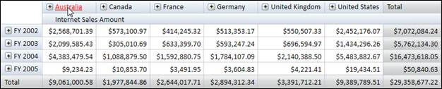
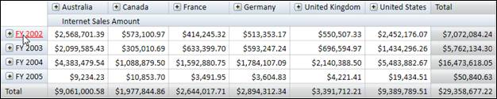
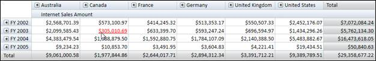

::: {style="DISPLAY: none"}
{#d2h_url_template} {#d2h_package_url style="WIDTH: 0px; DISPLAY: none; HEIGHT: 0px"}
:::

::::: {#nsbanner .d2h_main_nsbanner style="BORDER-BOTTOM: #999999 1px solid; POSITION: relative; PADDING-BOTTOM: 0px; BACKGROUND-COLOR: transparent; PADDING-LEFT: 0px; PADDING-RIGHT: 0px; DISPLAY: none; BORDER-TOP: #999999 1px solid; PADDING-TOP: 0px; LEFT: 0px"}
:::: {#TitleRow .d2h_main_titlerow style="PADDING-BOTTOM: 4px; BACKGROUND-COLOR: transparent; PADDING-LEFT: 22px; WIDTH: 100%; PADDING-RIGHT: 10px; DISPLAY: none; PADDING-TOP: 4px"}
::: {#ienav .d2h_main_ienav style="DISPLAY: none"}
{#D2HPrevious .D2HPreviousEnabled}  {#D2HNext .D2HNextEnabled}
:::
::::
:::::

:::: {#nstext .d2h_main_nstext style="PADDING-BOTTOM: 10px; BACKGROUND-COLOR: transparent; PADDING-LEFT: 22px; PADDING-RIGHT: 10px; HEIGHT: 100%; OVERFLOW: auto; PADDING-TOP: 5px" hasuserbackground="true" valign="bottom"}
::: {#d2h_breadcrumbs .d2h_breadcrumbs}
[Essential Studio User Guide Documentation](ms-xhelp:///?Id=12457748-09e3-4d74-a240-8e049cedf030){.d2h_breadcrumbsNormal} [ \> ]{.d2h_breadcrumbsLinkSeparator} [Business Intelligence Edition](ms-xhelp:///?Id=fdf33dd8-62b2-47b9-ad7b-fc50e590bca5){.d2h_breadcrumbsNormal} [ \> ]{.d2h_breadcrumbsLinkSeparator} [Essential BI WPF](ms-xhelp:///?Id=41e3d586-d922-4a01-8272-679fe4ae7343){.d2h_breadcrumbsNormal} [ \> ]{.d2h_breadcrumbsLinkSeparator} [Essential BI Grid]{.d2h_breadcrumbsContentsOnly} [ \> ]{.d2h_breadcrumbsLinkSeparator} [Concepts and Features](ms-xhelp:///?Id=ea758680-939d-4d65-8abe-8c3be198af29){.d2h_breadcrumbsNormal}
:::

## Hyperlink Cells {#hyperlink-cells style="tab-stops: 0pt"}

 

Definition

The **OlapGrid** allows hyper linking of cells to retrieve a detailed description about a particular cell. The **Hyperlink Cells** property of OlapGrid generates a separate event for the clicked cell to retrieve a detailed description about that cell that can be retrieved.

**Hyperlink Cell's** property can be applied to the following cells:

[·      ]{style="FONT-FAMILY: Symbol"}Column Header

[·      ]{style="FONT-FAMILY: Symbol"}Row Header and

[·      ]{style="FONT-FAMILY: Symbol"}Value Cell

 

Enabling hyperlink cells

The Hyperlink cells can be enabled by the following property of OlapGrid such as:

+---------------------------------------------------------------------------------------------------------+
| \[C#\]                                                                                                  |
|                                                                                                         |
|                                                                                                         |
|                                                                                                         |
| [// To Enable Hyperlink for Column Header]{style="COLOR: green"} []{style="COLOR: blue"}                |
|                                                                                                         |
| [this]{style="COLOR: blue"}.OlapGrid1.ColumnHeaderStyle.IsHyperlinkCell = [true]{style="COLOR: blue"};  |
|                                                                                                         |
| [// To Enable Hyperlink for Row Header]{style="COLOR: green"}                                           |
|                                                                                                         |
| [this]{style="COLOR: blue"}.OlapGrid1.RowHeaderStyle.IsHyperlinkCell = [true]{style="COLOR: blue"};     |
|                                                                                                         |
| [// To Enable Hyperlink for Value Cell]{style="COLOR: green"}                                           |
|                                                                                                         |
| [this]{style="COLOR: blue"}.OlapGrid1.ValueCellsStyle.IsHyperlinkCell = [true]{style="COLOR: blue"};    |
|                                                                                                         |
| [// To Enable Hyperlink for Summary Column]{style="COLOR: green"}                                       |
|                                                                                                         |
| [this]{style="COLOR: blue"}.OlapGrid1.SummaryColumnStyle.IsHyperlinkCell = [true]{style="COLOR: blue"}; |
|                                                                                                         |
| [// To Enable Hyperlink for Summary Row]{style="COLOR: green"}                                          |
|                                                                                                         |
| [this]{style="COLOR: blue"}.OlapGrid1.SummaryRowStyle.IsHyperlinkCell = [true]{style="COLOR: blue"};    |
|                                                                                                         |
|                                                                                                         |
+---------------------------------------------------------------------------------------------------------+

[]{style="FONT-SIZE: 11pt"} 

+------------------------------------------------------------------------------------------------------+
| \[VB\]                                                                                               |
|                                                                                                      |
|                                                                                                      |
|                                                                                                      |
| [\' To Enable Hyperlink for Column Header]{style="COLOR: green"}                                     |
|                                                                                                      |
| [Me]{style="COLOR: blue"}.OlapGrid1.ColumnHeaderStyle.IsHyperlinkCell = [True]{style="COLOR: blue"}  |
|                                                                                                      |
| [\' To Enable Hyperlink for Row Header]{style="COLOR: green"}                                        |
|                                                                                                      |
| [Me]{style="COLOR: blue"}.OlapGrid1.RowHeaderStyle.IsHyperlinkCell = [True]{style="COLOR: blue"}     |
|                                                                                                      |
| [\' To Enable Hyperlink for Value Cell]{style="COLOR: green"}                                        |
|                                                                                                      |
| [Me]{style="COLOR: blue"}.OlapGrid1.ValueCellsStyle.IsHyperlinkCell = [True]{style="COLOR: blue"}    |
|                                                                                                      |
| [\' To Enable Hyperlink for Summary Column]{style="COLOR: green"}                                    |
|                                                                                                      |
| [Me]{style="COLOR: blue"}.OlapGrid1.SummaryColumnStyle.IsHyperlinkCell = [True]{style="COLOR: blue"} |
|                                                                                                      |
| [\' To Enable Hyperlink for Summary Row]{style="COLOR: green"}                                       |
|                                                                                                      |
| [Me]{style="COLOR: blue"}.OlapGrid1.SummaryRowStyle.IsHyperlinkCell = [True]{style="COLOR: blue"}    |
|                                                                                                      |
|                                                                                                      |
+------------------------------------------------------------------------------------------------------+

[]{style="FONT-SIZE: 11pt"} 

The Hyperlink Click event can be tagged by the following way:

+--------------------------------------------------------------------------------------------------------------------------------------------------------------------------------------+
| \[C#\]                                                                                                                                                                               |
|                                                                                                                                                                                      |
|                                                                                                                                                                                      |
|                                                                                                                                                                                      |
| [// Tag Hyperlink Cell Click Event]{style="COLOR: green"}                                                                                                                            |
|                                                                                                                                                                                      |
| [this]{style="COLOR: blue"}.OlapGrid1.LinkClick += [new]{style="COLOR: blue"} Syncfusion.Windows.Grid.Olap.[LinkLabelClickEventHander]{style="COLOR: #2b91af"}(OlapGrid1_LinkClick); |
|                                                                                                                                                                                      |
|                                                                                                                                                                                      |
+--------------------------------------------------------------------------------------------------------------------------------------------------------------------------------------+

[]{style="FONT-SIZE: 11pt"} 

+----------------------------------------------------------------------------------------------------------------------------------------------------------------------------------+
| \[VB\]                                                                                                                                                                           |
|                                                                                                                                                                                  |
|                                                                                                                                                                                  |
|                                                                                                                                                                                  |
| [\' Tag Hyperlink Cell Click Event]{style="COLOR: green"}                                                                                                                        |
|                                                                                                                                                                                  |
| [Me]{style="COLOR: blue"}.OlapGrid1.LinkClick += [New]{style="COLOR: blue"} Syncfusion.Windows.Grid.Olap.[LinkLabelClickEventHander]{style="COLOR: black"}(OlapGrid1_LinkClick); |
|                                                                                                                                                                                  |
|                                                                                                                                                                                  |
+----------------------------------------------------------------------------------------------------------------------------------------------------------------------------------+

[]{style="FONT-SIZE: 11pt"} 

The [LinkClick ]{style="COLOR: #2b91af; FONT-SIZE: 11pt"}event will return the clicked Cell Descriptor.

+--------------------------------------------------------------------------------------------------------------------------------------------------------------------+
| \[C#\]                                                                                                                                                             |
|                                                                                                                                                                    |
|                                                                                                                                                                    |
|                                                                                                                                                                    |
| [void]{style="COLOR: blue"} OlapGrid1_LinkClick([object]{style="COLOR: blue"} sender, Syncfusion.Windows.Grid.Olap.[LinkLabelEventArgs]{style="COLOR: #2b91af"} e) |
|                                                                                                                                                                    |
| {                                                                                                                                                                  |
|                                                                                                                                                                    |
|    [string]{style="COLOR: blue"} uniqueName = e.PivotCellDescriptor.UniqueName;                                                                                    |
|                                                                                                                                                                    |
| }                                                                                                                                                                  |
|                                                                                                                                                                    |
|                                                                                                                                                                    |
+--------------------------------------------------------------------------------------------------------------------------------------------------------------------+

[]{style="FONT-SIZE: 11pt"} 

+-------------------------------------------------------------------------------------------------------------------------------------------------------------------------------------------------------------------------------------------------------------------------------------+
| \[VB\]                                                                                                                                                                                                                                                                              |
|                                                                                                                                                                                                                                                                                     |
|                                                                                                                                                                                                                                                                                     |
|                                                                                                                                                                                                                                                                                     |
| [Private]{style="COLOR: blue"} [Sub]{style="COLOR: blue"} OlapGrid1_LinkClick([ByVal]{style="COLOR: blue"} sender [As]{style="COLOR: blue"}[Object]{style="COLOR: blue"}, [ByVal]{style="COLOR: blue"} e [As]{style="COLOR: blue"} Syncfusion.Windows.Grid.Olap.LinkLabelEventArgs) |
|                                                                                                                                                                                                                                                                                     |
| [Dim]{style="COLOR: blue"} uniqueName [As]{style="COLOR: blue"}[String]{style="COLOR: blue"} = e.PivotCellDescriptor.UniqueName                                                                                                                                                     |
|                                                                                                                                                                                                                                                                                     |
| [End]{style="COLOR: blue"} [Sub]{style="COLOR: blue"}                                                                                                                                                                                                                               |
|                                                                                                                                                                                                                                                                                     |
|                                                                                                                                                                                                                                                                                     |
+-------------------------------------------------------------------------------------------------------------------------------------------------------------------------------------------------------------------------------------------------------------------------------------+

[]{style="FONT-SIZE: 11pt"} 

{border="0"}

 

Figure 15: OlapGrid with Hyperlink Column Header

 

{border="0"}

Figure 16: OlapGrid with Hyperlink Row Header

 

{border="0"}

Figure 17: OlapGrid with Hyperlink Value Cell

 

Sample Location

A sample demo is available at the following location:

**..\\Syncfusion\\EssentialStudio\\\<Versionnumber\>\\BI\\WPF\\OlapGrid.WPF\\Samples\\Appearance\\Hyperlink Header Demo**

[]{#related-topics}
::::
