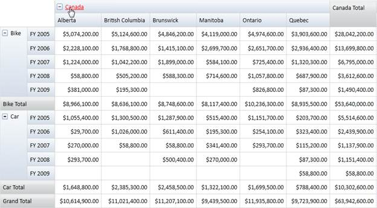
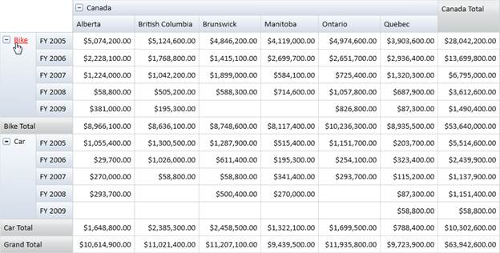

::: {style="DISPLAY: none"}
{#d2h_url_template} {#d2h_package_url style="WIDTH: 0px; DISPLAY: none; HEIGHT: 0px"}
:::

::: {.d2h_secondary_topic style="PADDING-BOTTOM: 10pt; MARGIN: 0pt; PADDING-LEFT: 0pt; PADDING-RIGHT: 0pt; PADDING-TOP: 0pt"}
#### Hyperlink Cells {#hyperlink-cells style="tab-stops: 0pt"}

The PivotGrid for WPF allows Hyperlinking of cells to retrieve a detailed description about a particular cell. The Hyperlink Cells property of PivotGrid generates a separate event called **HyperLinkCellClick** for the clicked cell and the **HyperLinkCellClickEventArgs** will return the clicked PivotCellInfo.

Hyperlink Cell's property can be applied to the following cells:

[·      ]{style="FONT-FAMILY: Symbol"}Column Header

[·      ]{style="FONT-FAMILY: Symbol"}Row Header

[·      ]{style="FONT-FAMILY: Symbol"}Summary Header

[·      ]{style="FONT-FAMILY: Symbol"}Summary Cell

[·      ]{style="FONT-FAMILY: Symbol"}Value Cell

**[]{style="FONT-FAMILY: 'Trebuchet MS','sans-serif'; COLOR: #15428b; FONT-SIZE: 9pt"}**  

Use Case Scenarios

You can Hyperlink cells and can perform some custom operation on a Cell click. While doing so, you can get the complete information of the Cell like its Type, Range etc.

**[]{style="FONT-FAMILY: 'Trebuchet MS','sans-serif'; COLOR: #15428b; FONT-SIZE: 9pt"}**  

Enabling Hyperlink Cells

You can enable a cell present in the Grid as a Hyperlink by setting the IsHyperlinkCell property of that cell style to True.

**Example:** To make a column header cell as a hyperlink, set PivotGrid.ColumnHeaderStyle.IsHyperlinkCell = True.

The property usage is illustrated in the code given below.

 

+------------------------------------------------------------------------------------------------------------------------------------------------------------------------------------------------------+
| **[\[C#\]]{style="FONT-FAMILY: 'Courier New'"}**                                                                                                                                                     |
|                                                                                                                                                                                                      |
| [// Instantiating PivotGridControl.]{style="FONT-FAMILY: 'Courier New'; COLOR: green"} []{style="FONT-FAMILY: 'Courier New'"}                                                                        |
|                                                                                                                                                                                                      |
| [PivotGridControl]{style="FONT-FAMILY: 'Courier New'; COLOR: #2b91af"} [ PivotGrid1 = [new]{style="COLOR: blue"}[PivotGridControl]{style="COLOR: #2b91af"}();]{style="FONT-FAMILY: 'Courier New'"}   |
|                                                                                                                                                                                                      |
| [// Adding PivotRows.]{style="FONT-FAMILY: 'Courier New'; COLOR: green"} []{style="FONT-FAMILY: 'Courier New'"}                                                                                      |
|                                                                                                                                                                                                      |
| [PivotGrid1.PivotRows.Add([new]{style="COLOR: blue"}[PivotItem]{style="COLOR: #2b91af"} { FieldHeader = [\"Product\"]{style="COLOR: #a31515"} });]{style="FONT-FAMILY: 'Courier New'"}               |
|                                                                                                                                                                                                      |
| [// Adding PivotColumns.]{style="FONT-FAMILY: 'Courier New'; COLOR: green"} []{style="FONT-FAMILY: 'Courier New'"}                                                                                   |
|                                                                                                                                                                                                      |
| [PivotGrid1.PivotColumns.Add([new]{style="COLOR: blue"}[PivotItem]{style="COLOR: #2b91af"} { FieldHeader = [\"Date\"]{style="COLOR: #a31515"} });]{style="FONT-FAMILY: 'Courier New'"}               |
|                                                                                                                                                                                                      |
| [// Adding PivotCalculations.]{style="FONT-FAMILY: 'Courier New'; COLOR: green"} []{style="FONT-FAMILY: 'Courier New'"}                                                                              |
|                                                                                                                                                                                                      |
| [PivotGrid1.PivotCalculations.Add([new]{style="COLOR: blue"}[PivotComputationInfo]{style="COLOR: #2b91af"} { FieldName=[\"Amount\"]{style="COLOR: #a31515"} });]{style="FONT-FAMILY: 'Courier New'"} |
|                                                                                                                                                                                                      |
| []{style="FONT-FAMILY: 'Courier New'; COLOR: green"}                                                                                                                                                 |
|                                                                                                                                                                                                      |
| [// To Enable Hyperlink for Column Header.]{style="FONT-FAMILY: 'Courier New'; COLOR: green"} []{style="FONT-FAMILY: 'Courier New'"}                                                                 |
|                                                                                                                                                                                                      |
| [this]{style="FONT-FAMILY: 'Courier New'; COLOR: blue"} [.PivotGrid1.ColumnHeaderCellStyle.IsHyperlinkCell = [true]{style="COLOR: blue"};]{style="FONT-FAMILY: 'Courier New'"}                       |
|                                                                                                                                                                                                      |
| [// To Enable Hyperlink for Row Header.]{style="FONT-FAMILY: 'Courier New'; COLOR: green"} []{style="FONT-FAMILY: 'Courier New'"}                                                                    |
|                                                                                                                                                                                                      |
| [this]{style="FONT-FAMILY: 'Courier New'; COLOR: blue"} [.PivotGrid1.RowHeaderCellStyle.IsHyperlinkCell = [true]{style="COLOR: blue"};]{style="FONT-FAMILY: 'Courier New'"}                          |
|                                                                                                                                                                                                      |
| [// To Enable Hyperlink for Summary Header.]{style="FONT-FAMILY: 'Courier New'; COLOR: green"} []{style="FONT-FAMILY: 'Courier New'"}                                                                |
|                                                                                                                                                                                                      |
| [this]{style="FONT-FAMILY: 'Courier New'; COLOR: blue"} [.PivotGrid1.SummaryHeaderStyle.IsHyperlinkCell = [true]{style="COLOR: blue"};]{style="FONT-FAMILY: 'Courier New'"}                          |
|                                                                                                                                                                                                      |
| [// To Enable Hyperlink for Summary Cell.]{style="FONT-FAMILY: 'Courier New'; COLOR: green"} []{style="FONT-FAMILY: 'Courier New'"}                                                                  |
|                                                                                                                                                                                                      |
| [this]{style="FONT-FAMILY: 'Courier New'; COLOR: blue"} [.PivotGrid1.SummaryCellStyle.IsHyperlinkCell = [true]{style="COLOR: blue"};]{style="FONT-FAMILY: 'Courier New'"}                            |
|                                                                                                                                                                                                      |
| [// To Enable Hyperlink for Value Cell.]{style="FONT-FAMILY: 'Courier New'; COLOR: green"} []{style="FONT-FAMILY: 'Courier New'"}                                                                    |
|                                                                                                                                                                                                      |
| [this]{style="FONT-FAMILY: 'Courier New'; COLOR: blue"} [.PivotGrid1.ValueCellStyle.IsHyperlinkCell = [true]{style="COLOR: blue"};]{style="FONT-FAMILY: 'Courier New'"}                              |
|                                                                                                                                                                                                      |
| []{style="FONT-FAMILY: 'Courier New'"}                                                                                                                                                               |
+------------------------------------------------------------------------------------------------------------------------------------------------------------------------------------------------------+

[]{style="COLOR: #c00000"} 

+-----------------------------------------------------------------------------------------------------------------------------------------------------------------------------------------------------+
| **[\[VB\]]{style="FONT-FAMILY: 'Courier New'"}**                                                                                                                                                    |
|                                                                                                                                                                                                     |
| []{style="FONT-FAMILY: 'Courier New'"}                                                                                                                                                              |
|                                                                                                                                                                                                     |
| [\' Instantiating PivotGridControl.]{style="FONT-FAMILY: 'Courier New'; COLOR: green"} []{style="FONT-FAMILY: 'Courier New'"}                                                                       |
|                                                                                                                                                                                                     |
| [Dim]{style="FONT-FAMILY: 'Courier New'; COLOR: blue"} [ PivotGrid1 [As]{style="COLOR: blue"} PivotGridControl = [New]{style="COLOR: blue"} PivotGridControl()]{style="FONT-FAMILY: 'Courier New'"} |
|                                                                                                                                                                                                     |
| [\' Adding PivotRows.]{style="FONT-FAMILY: 'Courier New'; COLOR: green"} []{style="FONT-FAMILY: 'Courier New'"}                                                                                     |
|                                                                                                                                                                                                     |
| [PivotGrid1.PivotRows.Add([New]{style="COLOR: blue"} PivotItem [With]{style="COLOR: blue"} {.FieldHeader = \"Product\"})]{style="FONT-FAMILY: 'Courier New'"}                                       |
|                                                                                                                                                                                                     |
| [\' Adding PivotColumns.]{style="FONT-FAMILY: 'Courier New'; COLOR: green"} []{style="FONT-FAMILY: 'Courier New'"}                                                                                  |
|                                                                                                                                                                                                     |
| [PivotGrid1.PivotColumns.Add([New]{style="COLOR: blue"} PivotItem [With]{style="COLOR: blue"} {.FieldHeader = \"Date\"})]{style="FONT-FAMILY: 'Courier New'"}                                       |
|                                                                                                                                                                                                     |
| [\' Adding PivotCalculations.]{style="FONT-FAMILY: 'Courier New'; COLOR: green"} []{style="FONT-FAMILY: 'Courier New'"}                                                                             |
|                                                                                                                                                                                                     |
| [PivotGrid1.PivotCalculations.Add([New]{style="COLOR: blue"} PivotComputationInfo [With]{style="COLOR: blue"} {.FieldName=\"Amount\"})]{style="FONT-FAMILY: 'Courier New'"}                         |
|                                                                                                                                                                                                     |
| []{style="FONT-FAMILY: 'Courier New'"}                                                                                                                                                              |
|                                                                                                                                                                                                     |
| [\' To Enable Hyperlink for Column Header.]{style="FONT-FAMILY: 'Courier New'; COLOR: green"} []{style="FONT-FAMILY: 'Courier New'"}                                                                |
|                                                                                                                                                                                                     |
| [Me]{style="FONT-FAMILY: 'Courier New'; COLOR: blue"} [.PivotGrid1.ColumnHeaderCellStyle.IsHyperlinkCell = [True]{style="COLOR: blue"}]{style="FONT-FAMILY: 'Courier New'"}                         |
|                                                                                                                                                                                                     |
| [\' To Enable Hyperlink for Row Header.]{style="FONT-FAMILY: 'Courier New'; COLOR: green"} []{style="FONT-FAMILY: 'Courier New'"}                                                                   |
|                                                                                                                                                                                                     |
| [Me]{style="FONT-FAMILY: 'Courier New'; COLOR: blue"} [.PivotGrid1.RowHeaderCellStyle.IsHyperlinkCell = [True]{style="COLOR: blue"}]{style="FONT-FAMILY: 'Courier New'"}                            |
|                                                                                                                                                                                                     |
| [\' To Enable Hyperlink for Summary Header.]{style="FONT-FAMILY: 'Courier New'; COLOR: green"} []{style="FONT-FAMILY: 'Courier New'"}                                                               |
|                                                                                                                                                                                                     |
| [Me]{style="FONT-FAMILY: 'Courier New'; COLOR: blue"} [PivotGrid1.SummaryHeaderStyle.IsHyperlinkCell = [True]{style="COLOR: blue"}]{style="FONT-FAMILY: 'Courier New'"}                             |
|                                                                                                                                                                                                     |
| [\' To Enable Hyperlink for Summary Cell.]{style="FONT-FAMILY: 'Courier New'; COLOR: green"} []{style="FONT-FAMILY: 'Courier New'"}                                                                 |
|                                                                                                                                                                                                     |
| [Me]{style="FONT-FAMILY: 'Courier New'; COLOR: blue"} [. PivotGrid1.SummaryCellStyle.IsHyperlinkCell = [True]{style="COLOR: blue"}]{style="FONT-FAMILY: 'Courier New'"}                             |
|                                                                                                                                                                                                     |
| [\' To Enable Hyperlink for Value Cell.]{style="FONT-FAMILY: 'Courier New'; COLOR: green"} []{style="FONT-FAMILY: 'Courier New'"}                                                                   |
|                                                                                                                                                                                                     |
| [Me]{style="FONT-FAMILY: 'Courier New'; COLOR: blue"} [.PivotGrid1.ValueCellStyle.IsHyperlinkCell = [True]{style="COLOR: blue"}]{style="FONT-FAMILY: 'Courier New'"}                                |
|                                                                                                                                                                                                     |
| **[]{style="FONT-FAMILY: 'Courier New'"}**                                                                                                                                                          |
+-----------------------------------------------------------------------------------------------------------------------------------------------------------------------------------------------------+

[]{style="COLOR: #c00000"} 

The below screen shot shows how the Column Header is hyperlinked.

[]{style="COLOR: black"} 

{border="0"}

 

Figure 15: PivotGrid with Hyperlink Column Header

*[]{style="COLOR: black; FONT-SIZE: 9pt"}*  

The below screen shot shows how the Row Header is hyperlinked.

*[]{style="FONT-SIZE: 9pt"}*  

{border="0"}

 

Figure 16: [Pivot Grid with Hyperlink Row Header]{style="COLOR: black"}

**[]{style="FONT-FAMILY: 'Myriad Pro','sans-serif'; COLOR: black"}**  

The below screen shot shows how the value in a cell is hyperlinked.

**[]{style="FONT-FAMILY: 'Myriad Pro','sans-serif'; COLOR: black"}**  

{border="0"}

 

Figure 17: Pivot[Grid with Hyperlink Value Cell]{style="COLOR: black"}

 

Sample Link

..\\..\\ Syncfusion\\BI\\WPF\\PivotAnalysis.WPF\\Samples\\Appearance\\Hyperlink Cell Demo

 

[]{#related-topics}
:::
