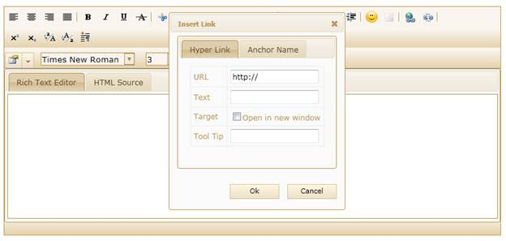
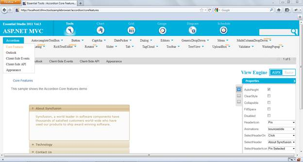

::: {style="DISPLAY: none"}
{#d2h_url_template}{#d2h_package_url style="WIDTH: 0px; DISPLAY: none; HEIGHT: 0px"}
:::

::: {.d2h_secondary_topic style="PADDING-BOTTOM: 10pt; MARGIN: 0pt; PADDING-LEFT: 0pt; PADDING-RIGHT: 0pt; PADDING-TOP: 0pt"}
#### Hyperlink Enhancement in RTE {#hyperlink-enhancement-in-rte style="tab-stops: 0pt"}

RTE allows you to add the hyperlink text by using the hyperlink manager. This allows you to insert hyperlinks without selecting the text in the document.

 

**Use Case Scenario**

The user can now hyperlink with ease, without selecting text in the document. The hyperlink manager contains the below arguments for this purpose:

[·      ]{style="FONT-FAMILY: Symbol"}**URL**      - Specifies the URL for the hyperlink text

[·      ]{style="FONT-FAMILY: Symbol"}**Name**   - Specifies the name for an anchor tag.

[·      ]{style="FONT-FAMILY: Symbol"}**Link** **Text**- Specifies the text for the hyperlink.

[·      ]{style="FONT-FAMILY: Symbol"}**Target ** - Specifies where to open the linked URL. The target attribute contains the list given below:

[·      ]{style="FONT-FAMILY: Symbol"}**\_blank** - opens the URL in the new blank window.

[·      ]{style="FONT-FAMILY: Symbol"}**\_self    ** - opens the URL in the same frame.

[·      ]{style="FONT-FAMILY: Symbol"}**Tool tip** -Specifies the tool tip for the anchor tag.

 

{border="0"}

Figure 218: Anchor Tag

 

Source Code Location

The full source code of the RTE will be available on the purchase of the product.

The default location of the Essential Tools MVC source code is:

\[System Drive\]:\\Program Files\\Syncfusion\\Essential Studio\\\[Version Number\]\\MVC\\Tools.MVC\\Src

 

Viewing Samples

To view the samples:

1.   Click Dashboard.

2.   Click the drop-down button of MVC platform.

3.   Click the Run Locally Installed Samples link. The Essential Studio MVC Edition sample browser is displayed.

4.   Select Tools from the drop-down.

 

 {border="0"}

Figure 219: MVC Tools Sample browser

 

5.   Select any sample from the Core features under the Rich Text Editor tab and browse through the features.

 

More:

[ ]{#related-topics}

[{border="0" align="absMiddle"}Adding Hyperlink Enhancement to Rich Text Editor](ms-xhelp:///?Id=7186e45d-ccd6-4597-b943-b01a75855fc4){style="TEXT-DECORATION: none"}
:::
