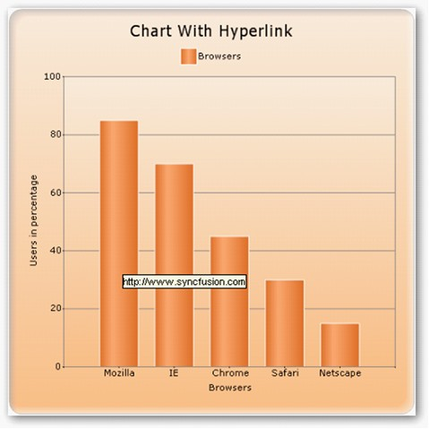
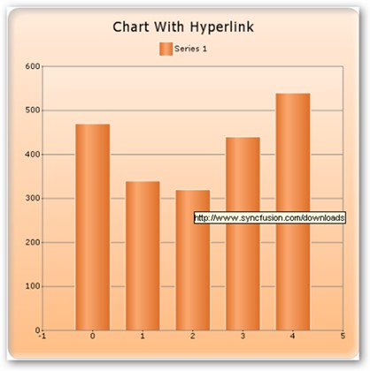

::: {style="DISPLAY: none"}
{#d2h_url_template}{#d2h_package_url style="WIDTH: 0px; DISPLAY: none; HEIGHT: 0px"}
:::

:::: {.d2h_secondary_topic style="PADDING-BOTTOM: 10pt; MARGIN: 0pt; PADDING-LEFT: 0pt; PADDING-RIGHT: 0pt; PADDING-TOP: 0pt"}
#### Hyperlink for chart series {#hyperlink-for-chart-series style="tab-stops: 0pt"}

**[]{style="FONT-FAMILY: 'Times New Roman','serif'; FONT-SIZE: 14pt"}** 

Series Wide Setting

Specify hyperlink for a series using **Series.Style.Url** property.

[]{style="FONT-FAMILY: 'Trebuchet MS','sans-serif'; FONT-SIZE: 9pt"} 

+----------------------------------------------------------------------------------------------------------------------------------------------------------------------------------------------------------------+
| **[\[CS\]]{style="FONT-FAMILY: 'Times New Roman','serif'"}**                                                                                                                                                   |
|                                                                                                                                                                                                                |
| **[]{style="FONT-FAMILY: 'Times New Roman','serif'"}**                                                                                                                                                         |
|                                                                                                                                                                                                                |
| [this]{style="FONT-FAMILY: 'Courier New'; COLOR: blue"}[.ChartWebControl1.EnableUrl = [true]{style="COLOR: blue"};]{style="FONT-FAMILY: 'Courier New'"}                                                        |
|                                                                                                                                                                                                                |
| [this]{style="FONT-FAMILY: 'Courier New'; COLOR: blue"}[.ChartWebControl1.CalcRegions = [true]{style="COLOR: blue"};]{style="FONT-FAMILY: 'Courier New'"}                                                      |
|                                                                                                                                                                                                                |
| [this]{style="FONT-FAMILY: 'Courier New'; COLOR: blue"}[.ChartWebControl1.Series\[0\].Style.Url = "[www.Syncfusion.com]{style="COLOR: black"}["]{style="COLOR: #a31515"};]{style="FONT-FAMILY: 'Courier New'"} |
+----------------------------------------------------------------------------------------------------------------------------------------------------------------------------------------------------------------+

[]{style="FONT-FAMILY: 'Times New Roman','serif'; FONT-SIZE: 12pt"} 

+---------------------------------------------------------------------------------------------------------------------------------------------------------+
| **[\[VB\]]{style="FONT-FAMILY: 'Times New Roman','serif'"}**                                                                                            |
|                                                                                                                                                         |
| **[]{style="FONT-FAMILY: 'Times New Roman','serif'"}**                                                                                                  |
|                                                                                                                                                         |
| [Me]{style="FONT-FAMILY: 'Courier New'; COLOR: blue"}[.ChartWebControl1.EnableUrl = [True]{style="COLOR: blue"}]{style="FONT-FAMILY: 'Courier New'"}    |
|                                                                                                                                                         |
| [Me]{style="FONT-FAMILY: 'Courier New'; COLOR: blue"}[.ChartWebControl1.CalcRegions = [True]{style="COLOR: blue"}]{style="FONT-FAMILY: 'Courier New'"}  |
|                                                                                                                                                         |
| [Me]{style="FONT-FAMILY: 'Courier New'; COLOR: blue"}[.ChartWebControl1.Series(0).Style.Url = "www.Syncfusion.com"]{style="FONT-FAMILY: 'Courier New'"} |
+---------------------------------------------------------------------------------------------------------------------------------------------------------+

[]{style="FONT-FAMILY: 'Calibri','sans-serif'; FONT-SIZE: 12pt"} 

[]{style="FONT-FAMILY: 'Calibri','sans-serif'; FONT-SIZE: 12pt"} 

{border="0"}

***[]{style="FONT-FAMILY: 'Trebuchet MS','sans-serif'; FONT-SIZE: 9pt"}*** 

Figure 227: Hyperlink Support for the Series

[]{style="FONT-FAMILY: 'Calibri','sans-serif'; FONT-SIZE: 12pt"} 

Specific Data Point Setting

**[]{style="FONT-FAMILY: 'Trebuchet MS','sans-serif'; FONT-SIZE: 9pt"}** 

Specify hyperlink for a data points using **Series.Styles\[0\].Url** property.

[]{style="FONT-FAMILY: 'Trebuchet MS','sans-serif'; FONT-SIZE: 9pt"} 

+----------------------------------------------------------------------------------------------------------------------------------------------------------------------------------------------------+
| **[\[CS\]]{style="FONT-FAMILY: 'Times New Roman','serif'"}**                                                                                                                                       |
|                                                                                                                                                                                                    |
| **[]{style="FONT-FAMILY: 'Times New Roman','serif'"}**                                                                                                                                             |
|                                                                                                                                                                                                    |
| [this]{style="FONT-FAMILY: 'Courier New'; COLOR: blue"}[.ChartWebControl1.EnableUrl = [true]{style="COLOR: blue"};]{style="FONT-FAMILY: 'Courier New'"}                                            |
|                                                                                                                                                                                                    |
| [            [this]{style="COLOR: blue"}.ChartWebControl1.CalcRegions = [true]{style="COLOR: blue"};]{style="FONT-FAMILY: 'Courier New'"}                                                          |
|                                                                                                                                                                                                    |
| [            [this]{style="COLOR: blue"}.ChartWebControl1.Series\[0\].Styles\[0\].Url = [\"http://www.syncfusion.com/developments\"]{style="COLOR: #a31515"};]{style="FONT-FAMILY: 'Courier New'"} |
|                                                                                                                                                                                                    |
| [            [this]{style="COLOR: blue"}.ChartWebControl1.Series\[0\].Styles\[1\].Url = [\"http://www.syncfusion.com/downloads\"]{style="COLOR: #a31515"};]{style="FONT-FAMILY: 'Courier New'"}    |
|                                                                                                                                                                                                    |
| [            [this]{style="COLOR: blue"}.ChartWebControl1.Series\[0\].Styles\[2\].Url = [\"http://www.syncfusion.com/support\"]{style="COLOR: #a31515"};]{style="FONT-FAMILY: 'Courier New'"}      |
+----------------------------------------------------------------------------------------------------------------------------------------------------------------------------------------------------+

[]{style="FONT-FAMILY: 'Times New Roman','serif'; FONT-SIZE: 12pt"} 

+-----------------------------------------------------------------------------------------------------------------------------------------------------------------------------------+
| **[\[VB\]]{style="FONT-FAMILY: 'Times New Roman','serif'"}**                                                                                                                      |
|                                                                                                                                                                                   |
| **[]{style="FONT-FAMILY: 'Times New Roman','serif'"}**                                                                                                                            |
|                                                                                                                                                                                   |
| [Me]{style="FONT-FAMILY: 'Courier New'; COLOR: blue"}[.ChartWebControl1.EnableUrl = [True]{style="COLOR: blue"}]{style="FONT-FAMILY: 'Courier New'"}                              |
|                                                                                                                                                                                   |
| [Me]{style="FONT-FAMILY: 'Courier New'; COLOR: blue"}[.ChartWebControl1.CalcRegions = [True]{style="COLOR: blue"}]{style="FONT-FAMILY: 'Courier New'"}                            |
|                                                                                                                                                                                   |
| [Me]{style="FONT-FAMILY: 'Courier New'; COLOR: blue"}[.ChartWebControl1.Series(0).Styles(0).Url = \"http://www.syncfusion.com/developments\"]{style="FONT-FAMILY: 'Courier New'"} |
|                                                                                                                                                                                   |
| [Me]{style="FONT-FAMILY: 'Courier New'; COLOR: blue"}[.ChartWebControl1.Series(0).Styles(1).Url =]{style="FONT-FAMILY: 'Courier New'"}                                            |
|                                                                                                                                                                                   |
| ["[http://www.syncfusion.com/downloads]{style="COLOR: black"}"]{style="FONT-FAMILY: 'Courier New'"}                                                                               |
|                                                                                                                                                                                   |
| [Me]{style="FONT-FAMILY: 'Courier New'; COLOR: blue"}[.ChartWebControl1.Series(0).Styles(2).Url = \"http://www.syncfusion.com/support\"]{style="FONT-FAMILY: 'Courier New'"}      |
+-----------------------------------------------------------------------------------------------------------------------------------------------------------------------------------+

[]{style="FONT-FAMILY: 'Calibri','sans-serif'; FONT-SIZE: 12pt"} 

{border="0"}

***[]{style="FONT-FAMILY: 'Trebuchet MS','sans-serif'; FONT-SIZE: 9pt"}*** 

Figure 228: Hyperlink support for specific data points

***[]{style="FONT-FAMILY: 'Trebuchet MS','sans-serif'; FONT-SIZE: 9pt"}*** 

::: {style="BORDER-BOTTOM: windowtext 1pt solid; BORDER-LEFT: medium none; PADDING-BOTTOM: 1pt; MARGIN-TOP: 9pt; PADDING-LEFT: 0pt; PADDING-RIGHT: 0pt; MARGIN-BOTTOM: 9pt; BORDER-TOP: windowtext 1pt solid; BORDER-RIGHT: medium none; PADDING-TOP: 1pt"}
{border="0"}Note: This Url property suppports only for chart web.
:::

[]{#p171} 

[]{#related-topics}
::::
