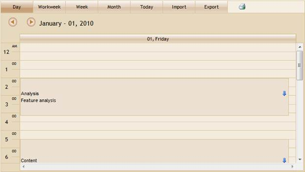
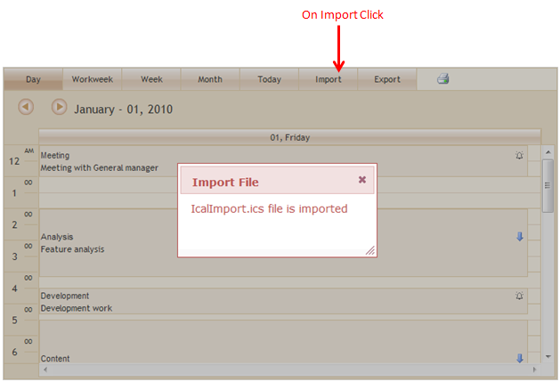
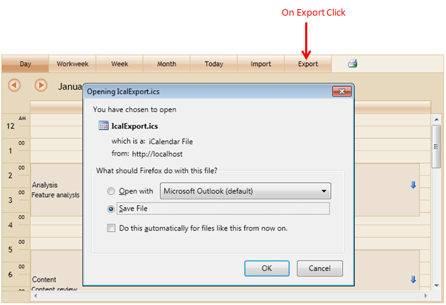

::: {style="DISPLAY: none"}
{#d2h_url_template}{#d2h_package_url style="WIDTH: 0px; DISPLAY: none; HEIGHT: 0px"}
:::

::::: {#nsbanner .d2h_main_nsbanner style="BORDER-BOTTOM: #999999 1px solid; POSITION: relative; PADDING-BOTTOM: 0px; BACKGROUND-COLOR: transparent; PADDING-LEFT: 0px; PADDING-RIGHT: 0px; DISPLAY: none; BORDER-TOP: #999999 1px solid; PADDING-TOP: 0px; LEFT: 0px"}
:::: {#TitleRow .d2h_main_titlerow style="PADDING-BOTTOM: 4px; BACKGROUND-COLOR: transparent; PADDING-LEFT: 22px; WIDTH: 100%; PADDING-RIGHT: 10px; DISPLAY: none; PADDING-TOP: 4px"}
::: {#ienav .d2h_main_ienav style="DISPLAY: none"}
{#D2HPrevious .D2HPreviousEnabled}  {#D2HNext .D2HNextEnabled}
:::
::::
:::::

::::: {#nstext .d2h_main_nstext style="PADDING-BOTTOM: 10px; BACKGROUND-COLOR: transparent; PADDING-LEFT: 22px; PADDING-RIGHT: 10px; HEIGHT: 100%; OVERFLOW: auto; PADDING-TOP: 5px" hasuserbackground="true" valign="bottom"}
::: {#d2h_breadcrumbs .d2h_breadcrumbs}
[Essential Studio User Guide Documentation](ms-xhelp:///?Id=12457748-09e3-4d74-a240-8e049cedf030){.d2h_breadcrumbsNormal}[ \> ]{.d2h_breadcrumbsLinkSeparator}[User Interface Edition](ms-xhelp:///?Id=c29296b7-531c-413b-a0ec-488ca1f7f669){.d2h_breadcrumbsNormal}[ \> ]{.d2h_breadcrumbsLinkSeparator}[Essential ASP.NET MVC](ms-xhelp:///?Id=4b14e7d1-65c4-4f67-b1aa-2c37709905a5){.d2h_breadcrumbsNormal}[ \> ]{.d2h_breadcrumbsLinkSeparator}[Essential Schedule]{.d2h_breadcrumbsContentsOnly}[ \> ]{.d2h_breadcrumbsLinkSeparator}[Concepts and Features](ms-xhelp:///?Id=150b7e3e-75c6-4609-ab78-cdde2bca2b16){.d2h_breadcrumbsNormal}
:::

## ICal Import and Export {#ical-import-and-export style="tab-stops: 0pt"}

Appointments can be exported from and imported to Schedule, in an internet calendar file (\*.ics) format using this feature.[ ]{style="FONT-FAMILY: 'Times New Roman','serif'; FONT-SIZE: 12pt"}This way the portability of appointments is enhanced.

The following figure gives you an overview of imported appointments in Schedule:

{border="0"}

Figure 144: Schedule with ICal import and export

The following figures give you a basic idea of the appearance of the output of the feature.

{border="0"}

Figure 145: Import Appointment

 

{border="0"}

Figure 146: Appointment Export

Use Case Scenarios

This feature allows you to share your appointments by enabling you to import and export appointment files.

You can also import appointments on loading Schedule.

 

[]{#_Constructors_for_PDF}Properties

 

+----------------------+------------------------------------------------------------------+---------------------------------------------+----------------------------------------------------+---------------------------------------------------------+
| **Property**         | **Description**                                                  | **Type of property**                        | **Value it accepts**                               | **Dependencies**                                        |
+----------------------+------------------------------------------------------------------+---------------------------------------------+----------------------------------------------------+---------------------------------------------------------+
| ShowImport           | This property is used to show the import icon in Schedule        | bool                                        | True                                               | NA                                                      |
|                      |                                                                  |                                             |                                                    |                                                         |
|                      |                                                                  |                                             | False                                              |                                                         |
+----------------------+------------------------------------------------------------------+---------------------------------------------+----------------------------------------------------+---------------------------------------------------------+
| ShowExport           | This property is used to show the export icon in Schedule        | bool                                        | True                                               | NA                                                      |
|                      |                                                                  |                                             |                                                    |                                                         |
|                      |                                                                  |                                             | False                                              |                                                         |
+----------------------+------------------------------------------------------------------+---------------------------------------------+----------------------------------------------------+---------------------------------------------------------+
| ImportFile           | This property is used to get the file name to import on load.    | string                                      | File name                                          | NA                                                      |
+----------------------+------------------------------------------------------------------+---------------------------------------------+----------------------------------------------------+---------------------------------------------------------+
| ImportedAppointments | This property returns the List of Imported schedule appointments | List\<ScheduleAppointment\>  (i.e. AppList) | Function with argument List\<ScheduleAppointment\> | Depends on the Controller method---                     |
|                      |                                                                  |                                             |                                                    |                                                         |
|                      |                                                                  |                                             |                                                    | The AppList returns its values to the Controller method |
+----------------------+------------------------------------------------------------------+---------------------------------------------+----------------------------------------------------+---------------------------------------------------------+

 

 

Methods

 

::: {align="center"}
  **Name of the method**       **Parameters of the method**   **Return type**   **Descriptions**
  ---------------------------- ------------------------------ ----------------- -------------------------------------------------------------------------
  ScheduleImportActions\<T\>   Import FileName                ActionResult      This method Import all appointment from the given file name
  ScheduleExportActions\<T\>   Export FileName                ActionResult      This method Export all appointment from the schedule to given file name
:::

 

 

Events

 

  --------------- ------------------------------------------------------ --------------- ---------------------
  **Name**        **Description**                                        **Arguments**   **Reference Links**
  ActionBegin     This event is triggered when an action begins.         Events          NA
  ActionSuccess   This event is triggered on the success of an action.   Events          NA
  --------------- ------------------------------------------------------ --------------- ---------------------

 

More:

[ ]{#related-topics}

[{border="0" align="absMiddle"}Adding ICal Export and Import Support to Schedule](ms-xhelp:///?Id=cf3c30a1-a36e-48a5-b30c-31198414827a){style="TEXT-DECORATION: none"}

[{border="0" align="absMiddle"}How to import appointments OnLoad?](ms-xhelp:///?Id=a0488013-0a24-48a5-b52d-c139b1c8c30d){style="TEXT-DECORATION: none"}
:::::
