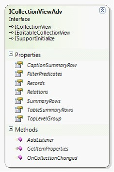
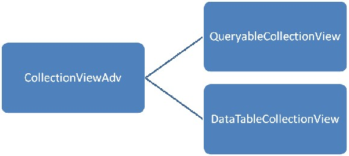

::: {style="DISPLAY: none"}
{#d2h_url_template}{#d2h_package_url style="WIDTH: 0px; DISPLAY: none; HEIGHT: 0px"}
:::

::: {.d2h_secondary_topic style="PADDING-BOTTOM: 10pt; MARGIN: 0pt; PADDING-LEFT: 0pt; PADDING-RIGHT: 0pt; PADDING-TOP: 0pt"}
#### ICollectionViewAdv {#icollectionviewadv style="tab-stops: 0pt"}

[]{style="FONT-FAMILY: 'Trebuchet MS','sans-serif'; COLOR: #15428b; FONT-SIZE: 9pt"} 

The ICollectionViewAdv interface is an extended ICollectionView interface that includes support for the following:

[]{style="FONT-FAMILY: 'Trebuchet MS','sans-serif'; COLOR: #15428b; FONT-SIZE: 9pt"} 

[·      ]{style="FONT-FAMILY: Symbol"}Grouping structure -- Binary tree data structure to maintain the groups.

[·      ]{style="FONT-FAMILY: Symbol"}Group summaries -- Collection to specify group summaries.

[·      ]{style="FONT-FAMILY: Symbol"}Caption summary -- Specifies caption summary row.

[·      ]{style="FONT-FAMILY: Symbol"}Records structure -- Flat data structure to maintain the list of internal records.

[·      ]{style="FONT-FAMILY: Symbol"}Table summaries -- Collection to specify table summaries.

[·      ]{style="FONT-FAMILY: Symbol"}Filter definitions -- Collection to specify filter descriptors.

[]{style="FONT-FAMILY: 'Trebuchet MS','sans-serif'; COLOR: #15428b; FONT-SIZE: 9pt"} 

ICollectionViewAdv interface implements the following:

[]{style="FONT-FAMILY: 'Trebuchet MS','sans-serif'; COLOR: #15428b; FONT-SIZE: 9pt"} 

{border="0"}

[]{style="FONT-FAMILY: 'Trebuchet MS','sans-serif'; COLOR: #15428b; FONT-SIZE: 9pt"} 

Figure 91: ICollectionViewAdv Interface

[]{style="FONT-FAMILY: 'Trebuchet MS','sans-serif'; COLOR: #15428b; FONT-SIZE: 9pt"} 

ICollectionViewAdv is implemented as two parts in Syncfusion.Linq.Base library, as shown below:

[]{style="FONT-FAMILY: 'Trebuchet MS','sans-serif'; COLOR: #15428b; FONT-SIZE: 9pt"} 

{border="0"}

 

Figure 92: CollectionViewAdv

[]{style="FONT-FAMILY: 'Trebuchet MS','sans-serif'; COLOR: #15428b; FONT-SIZE: 9pt"} 

The CollectionViewAdv is an abstract class implementing ICollectionViewAdv. By sub-classing the CollectionViewAdv, the specific actions for the following can be defined:

[]{style="FONT-FAMILY: 'Trebuchet MS','sans-serif'; COLOR: #15428b; FONT-SIZE: 9pt"} 

[·      ]{style="FONT-FAMILY: Symbol"}Sorting

[·      ]{style="FONT-FAMILY: Symbol"}Filtering

[·      ]{style="FONT-FAMILY: Symbol"}Grouping

[·      ]{style="FONT-FAMILY: Symbol"}Summaries

[]{style="FONT-FAMILY: 'Trebuchet MS','sans-serif'; COLOR: #15428b; FONT-SIZE: 9pt"} 

**QueryableCollectionView** - Implements an IQueryable way to provide Sorting, Filtering, Grouping and Summaries.

**DataTableCollectionView** -- Uses the DataView to provide Sorting/Filtering and uses custom logics to implement grouping and calculating summaries.

[]{#p225} 

 

More:

[ ]{#related-topics}

[{border="0" align="absMiddle"}Grouping in ICollectionViewAdv](ms-xhelp:///?Id=02981ac0-af95-4437-ba2b-775d8948634d){style="TEXT-DECORATION: none"}

[{border="0" align="absMiddle"}Summaries in Grouping](ms-xhelp:///?Id=3987ff36-0818-4381-b7f3-61014135615e){style="TEXT-DECORATION: none"}

[{border="0" align="absMiddle"}Sorting in ICollectionViewAdv](ms-xhelp:///?Id=ae4cdd80-75cc-4554-96f5-3662e2183262){style="TEXT-DECORATION: none"}
:::
