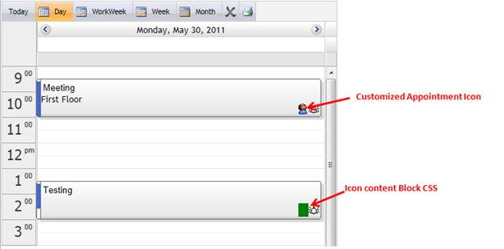

::: {style="DISPLAY: none"}
{#d2h_url_template}{#d2h_package_url style="WIDTH: 0px; DISPLAY: none; HEIGHT: 0px"}
:::

::::: {#nsbanner .d2h_main_nsbanner style="BORDER-BOTTOM: #999999 1px solid; POSITION: relative; PADDING-BOTTOM: 0px; BACKGROUND-COLOR: transparent; PADDING-LEFT: 0px; PADDING-RIGHT: 0px; DISPLAY: none; BORDER-TOP: #999999 1px solid; PADDING-TOP: 0px; LEFT: 0px"}
:::: {#TitleRow .d2h_main_titlerow style="PADDING-BOTTOM: 4px; BACKGROUND-COLOR: transparent; PADDING-LEFT: 22px; WIDTH: 100%; PADDING-RIGHT: 10px; DISPLAY: none; PADDING-TOP: 4px"}
::: {#ienav .d2h_main_ienav style="DISPLAY: none"}
{#D2HPrevious .D2HPreviousEnabled}  {#D2HNext .D2HNextEnabled}
:::
::::
:::::

:::: {#nstext .d2h_main_nstext style="PADDING-BOTTOM: 10px; BACKGROUND-COLOR: transparent; PADDING-LEFT: 22px; PADDING-RIGHT: 10px; HEIGHT: 100%; OVERFLOW: auto; PADDING-TOP: 5px" hasuserbackground="true" valign="bottom"}
::: {#d2h_breadcrumbs .d2h_breadcrumbs}
[Essential Studio User Guide Documentation](ms-xhelp:///?Id=12457748-09e3-4d74-a240-8e049cedf030){.d2h_breadcrumbsNormal}[ \> ]{.d2h_breadcrumbsLinkSeparator}[User Interface Edition](ms-xhelp:///?Id=c29296b7-531c-413b-a0ec-488ca1f7f669){.d2h_breadcrumbsNormal}[ \> ]{.d2h_breadcrumbsLinkSeparator}[Essential ASP.NET](ms-xhelp:///?Id=25c35330-c127-4dad-9a92-ed79dc7261a6){.d2h_breadcrumbsNormal}[ \> ]{.d2h_breadcrumbsLinkSeparator}[Essential Schedule]{.d2h_breadcrumbsContentsOnly}[ \> ]{.d2h_breadcrumbsLinkSeparator}[Concepts and Features](ms-xhelp:///?Id=64869483-f57f-4838-b322-b1a3d1ce8e40){.d2h_breadcrumbsNormal}
:::

## Icon Customization {#icon-customization style="tab-stops: 0pt"}

You can add new appointment icons using this feature. It also allows you to customize the icons and icon content blocks for both- Reminders and Appointments, using the Css Class and the Icon URLs,.

Use Case Scenarios

You can-

[·      ]{style="FONT-FAMILY: Symbol"}Customize the appearance of the icon content blocks and of the icons used in your appointments.

[·      ]{style="FONT-FAMILY: Symbol"}Choose which appointments to add reminder icons.

[·      ]{style="FONT-FAMILY: Symbol"}Choose the icon you would like to use by specifying its URL.

 

Appearance and Structure

{border="0"}

Figure 109: Customized Reminder icon and Icon Content block**[]{style="FONT-STYLE: normal"}**

 

{border="0"}

Figure 110: Customized Appointment Icon and Icon content block**[]{style="FONT-STYLE: normal"}**

More:

[ ]{#related-topics}

[{border="0" align="absMiddle"}Property tables](ms-xhelp:///?Id=391d37e8-d29b-4750-acb8-3dbc6f439f9f){style="TEXT-DECORATION: none"}

[{border="0" align="absMiddle"}Reminder Icon Customization](ms-xhelp:///?Id=142eb1a4-9735-4616-93c6-ce5123768953){style="TEXT-DECORATION: none"}

[{border="0" align="absMiddle"}Appointment Icon Customization](ms-xhelp:///?Id=851b6343-a45a-4e46-9abd-f69f43ed1063){style="TEXT-DECORATION: none"}

[{border="0" align="absMiddle"}Where do I find Installed samples?](ms-xhelp:///?Id=c6b66870-e971-43e1-9dd3-c33b337949c8){style="TEXT-DECORATION: none"}
::::
