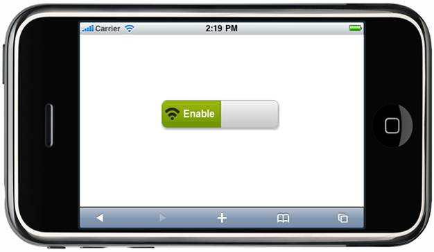

::: {style="DISPLAY: none"}
{#d2h_url_template} {#d2h_package_url style="WIDTH: 0px; DISPLAY: none; HEIGHT: 0px"}
:::

::: {.d2h_secondary_topic style="PADDING-BOTTOM: 10pt; MARGIN: 0pt; PADDING-LEFT: 0pt; PADDING-RIGHT: 0pt; PADDING-TOP: 0pt"}
##### Icons {#icons style="tab-stops: 0pt"}

The user can give images for On and Off state along with the **Text** property of the ToggleButton control. The image can be set for the states with the **ImageURL** property.

 

Table 2 Icons Properties Table

  ------------------ ------------------------------------------------------ ------------------ ------------------ ------------
  Name               Description                                            Type of Property   Value it Accepts   Dependency
  OnStateImageUrl    Sets the image for the enable state of the control.    String             Any string         \-
  OffStateImageUrl   Sets the image for the disable state of the control.   String             Any string         \-
  ------------------ ------------------------------------------------------ ------------------ ------------------ ------------

 

Using Builder

The following steps explain how to set the image settings in the ToggleButton control using Builder:

3.   In the **view**, invoke the **ToggleButton** helper with the control ID as the first argument followed by the **AutoFormat**, **OnText**, **OffText**, **OnStateImageUrl**, and **OffStateImageUrl** methods with its respective text and images.

 

+------------------------------------------------------------------------------------------------------------------------------------------------------------+
| **[\[ASPX\]]{style="FONT-FAMILY: 'Courier New'"}**                                                                                                         |
|                                                                                                                                                            |
| [        [\<%]{style="BACKGROUND: yellow"}[=]{style="COLOR: blue"}\                                                                                        |
|         Html.MobSyncfusion().ToggleButton([\"Togg\"]{style="COLOR: #a31515"})\                                                                             |
|                             .OnText([\"Enable\"]{style="COLOR: #a31515"})\                                                                                 |
|                             .OffText([\"Disable]{style="COLOR: #a31515"})\                                                                                 |
|                             .OnStateImageUrl([\"Wifi.png\"]{style="COLOR: #a31515"})\                                                                      |
|                             .OffStateImageUrl([\"Bluetooth.png\"]{style="COLOR: #a31515"})\                                                                |
|                             .AutoFormat([MobSkins]{style="COLOR: #2b91af"}.Spinach) [%\>]{style="BACKGROUND: yellow"}]{style="FONT-FAMILY: 'Courier New'"} |
|                                                                                                                                                            |
| **[\[Razor\]]{style="FONT-FAMILY: 'Courier New'"}**                                                                                                        |
|                                                                                                                                                            |
| [        ]{style="FONT-FAMILY: 'Courier New'; COLOR: blue"} [\@{]{style="FONT-FAMILY: 'Courier New'; BACKGROUND: yellow"} [\                               |
| ]{style="FONT-FAMILY: 'Courier New'"} [        Html.MobSyncfusion().ToggleButton([\"Togg\"]{style="COLOR: #a31515"})\                                      |
|                             .OnText([\"Enable\"]{style="COLOR: #a31515"})\                                                                                 |
|                             .OffText([\"Disable]{style="COLOR: #a31515"})\                                                                                 |
|                             .OnStateImageUrl([\"Wifi.png\"]{style="COLOR: #a31515"})\                                                                      |
|                             .OffStateImageUrl([\"Bluetooth.png\"]{style="COLOR: #a31515"})\                                                                |
|                             .AutoFormat([MobSkins]{style="COLOR: #2b91af"}.Spinach)\                                                                       |
|                             .Render(); ]{style="FONT-FAMILY: 'Courier New'"} [}]{style="FONT-FAMILY: 'Courier New'; BACKGROUND: yellow"}                   |
+------------------------------------------------------------------------------------------------------------------------------------------------------------+

 

4.   Build and run the application.

 

Using Properties Model

The following steps explain how to set the image settings in the ToggleButton control using the properties model:

 

4.   In the **Controller**, create an instance of **MobToggleButtonModel**, define the **OnStateImageUrl** and **OffStateImageUrl** properties and pass the instance through **ViewData** to **View** as given below.**

*[[]{style="TEXT-DECORATION: none"}]{.underline}*  

+-------------------------------------------------------------------------------------------------------------------------------------------------------------------------------------+
| **[Controller]{style="FONT-FAMILY: 'Courier New'"}**                                                                                                                                |
|                                                                                                                                                                                     |
| [        [public]{style="COLOR: blue"}[ActionResult]{style="COLOR: #2b91af"} ToggleButton()]{style="FONT-FAMILY: 'Courier New'"}                                                    |
|                                                                                                                                                                                     |
| [        {]{style="FONT-FAMILY: 'Courier New'"}                                                                                                                                     |
|                                                                                                                                                                                     |
| [            [MobToggleButtonModel]{style="COLOR: #2b91af"} model = [new]{style="COLOR: blue"}[MobToggleButtonModel]{style="COLOR: #2b91af"}()]{style="FONT-FAMILY: 'Courier New'"} |
|                                                                                                                                                                                     |
| [            {]{style="FONT-FAMILY: 'Courier New'"}                                                                                                                                 |
|                                                                                                                                                                                     |
| [                ]{style="FONT-FAMILY: 'Courier New'"} [OnText=[\"Enable\"]{style="COLOR: #a31515"},]{style="FONT-FAMILY: 'Courier New'"}                                           |
|                                                                                                                                                                                     |
| [                OffText=[\"Disable\"]{style="COLOR: #a31515"},]{style="FONT-FAMILY: 'Courier New'"}                                                                                |
|                                                                                                                                                                                     |
| [                OnStateImageUrl=[\"Wifi.png\"]{style="COLOR: #a31515"},[]{style="COLOR: #a31515"}]{style="FONT-FAMILY: 'Courier New'"}                                             |
|                                                                                                                                                                                     |
| [                OffStateImageUrl=[\"Bluetooth.png\"]{style="COLOR: #a31515"},]{style="FONT-FAMILY: 'Courier New'"}                                                                 |
|                                                                                                                                                                                     |
| [                AutoFormat=[MobSkins]{style="COLOR: #2b91af"}.Spinach]{style="FONT-FAMILY: 'Courier New'"}                                                                         |
|                                                                                                                                                                                     |
| [            };]{style="FONT-FAMILY: 'Courier New'"}                                                                                                                                |
|                                                                                                                                                                                     |
| [            ViewData\[[\"Toggle\"]{style="COLOR: #a31515"}\] = model;]{style="FONT-FAMILY: 'Courier New'"}                                                                         |
|                                                                                                                                                                                     |
| [            [return]{style="COLOR: blue"} View();]{style="FONT-FAMILY: 'Courier New'"}                                                                                             |
|                                                                                                                                                                                     |
| [        }]{style="FONT-FAMILY: 'Courier New'"}                                                                                                                                     |
+-------------------------------------------------------------------------------------------------------------------------------------------------------------------------------------+

 

5.   In the **view**, invoke the **ToggleButton** helper with the **ViewData** key as the first argument.

 

+-------------------------------------------------------------------------------------------------------------------------------------------------------------------------------------------------------------------------------------------------------------------------------------------------------------------------------------+
| **[\[ASPX\]]{style="FONT-FAMILY: 'Courier New'"}**                                                                                                                                                                                                                                                                                  |
|                                                                                                                                                                                                                                                                                                                                     |
| [       [\<%]{style="BACKGROUND: yellow"}[=]{style="COLOR: blue"}Html.MobSyncfusion().ToggleButton]{style="FONT-FAMILY: 'Courier New'"} [([\"Toggle\"]{style="COLOR: #a31515"}]{style="FONT-FAMILY: 'Courier New'"} [)[%\>]{style="BACKGROUND: yellow"}]{style="FONT-FAMILY: 'Courier New'"} []{style="FONT-FAMILY: 'Courier New'"} |
|                                                                                                                                                                                                                                                                                                                                     |
| []{style="FONT-FAMILY: 'Courier New'"}                                                                                                                                                                                                                                                                                              |
|                                                                                                                                                                                                                                                                                                                                     |
| **[\[Razor\]]{style="FONT-FAMILY: 'Courier New'"}**                                                                                                                                                                                                                                                                                 |
|                                                                                                                                                                                                                                                                                                                                     |
| [       [\@{]{style="BACKGROUND: yellow"}Html.MobSyncfusion().ToggleButton([\"Toggle\"]{style="COLOR: #a31515"}).Render();[}]{style="BACKGROUND: yellow"}]{style="FONT-FAMILY: 'Courier New'"}                                                                                                                                      |
+-------------------------------------------------------------------------------------------------------------------------------------------------------------------------------------------------------------------------------------------------------------------------------------------------------------------------------------+

[]{style="BACKGROUND: yellow"} 

6.   Build and run the application.

 

The output is shown in the following screenshot.

{border="0"} 

Figure 166: ToggleButton---ImageUrl Property

[]{#related-topics}
:::
