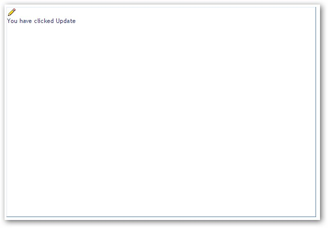
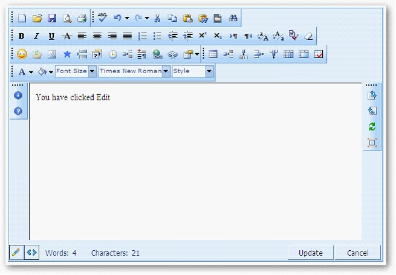

::: {style="DISPLAY: none"}
{#d2h_url_template}{#d2h_package_url style="WIDTH: 0px; DISPLAY: none; HEIGHT: 0px"}
:::

:::: {.d2h_secondary_topic style="PADDING-BOTTOM: 10pt; MARGIN: 0pt; PADDING-LEFT: 0pt; PADDING-RIGHT: 0pt; PADDING-TOP: 0pt"}
##### Identifying the Button that Triggers the UpdateClick event {#identifying-the-button-that-triggers-the-updateclick-event style="tab-stops: 0pt"}

[]{style="FONT-FAMILY: 'Trebuchet MS','sans-serif'; COLOR: #15428b; FONT-SIZE: 9pt"} 

The UpdateClick event can either be triggered by Update button in the **edit** mode or the Edit button in **preview** mode. The button which triggers the UpdateClick event can be identified by using the **ClickedButtonType** property of the RichTextEditor event args. This property returns either *Update* or *Edit* of string type.

The following table provides details on the property and its description:

[]{style="FONT-FAMILY: 'Trebuchet MS','sans-serif'; COLOR: #15428b; FONT-SIZE: 9pt"} 

::: {align="center"}
+-----------------------------------+-------------------------------------------------------------------------------------+
| Property                          | Description                                                                         |
+-----------------------------------+-------------------------------------------------------------------------------------+
| ClickedButtonType                 | Returns a string to identify the button which invokes UpdateClick serverside event: |
|                                   |                                                                                     |
|                                   | [·      ]{style="FONT-FAMILY: Symbol"}Update                                        |
|                                   |                                                                                     |
|                                   | [·      ]{style="FONT-FAMILY: Symbol"}Edit                                          |
+-----------------------------------+-------------------------------------------------------------------------------------+
:::

[]{style="FONT-FAMILY: 'Trebuchet MS','sans-serif'; COLOR: black"} 

Add the following code to identify the button:

[]{style="FONT-FAMILY: 'Times New Roman','serif'"} 

+------------------------------------------------------------------------------------------------------------------------------------------------------------------------------------------------------------------------------------------------------------------------------------------------------------------------------------------------------------------------------------------------------------------------------------------------------------------------------------------------------------------------------------------------------------------------------+
| **[\[ASPX\]]{style="FONT-FAMILY: 'Courier New'; FONT-SIZE: 9pt"}**                                                                                                                                                                                                                                                                                                                                                                                                                                                                                                           |
|                                                                                                                                                                                                                                                                                                                                                                                                                                                                                                                                                                              |
| **[]{style="FONT-FAMILY: 'Courier New'; FONT-SIZE: 9pt"}**                                                                                                                                                                                                                                                                                                                                                                                                                                                                                                                   |
|                                                                                                                                                                                                                                                                                                                                                                                                                                                                                                                                                                              |
| [\<]{style="FONT-FAMILY: 'Courier New'; COLOR: blue; FONT-SIZE: 9pt"}[Syncfusion]{style="FONT-FAMILY: 'Courier New'; COLOR: #a31515; FONT-SIZE: 9pt"}[:]{style="FONT-FAMILY: 'Courier New'; COLOR: blue; FONT-SIZE: 9pt"}[RichTextEditor]{style="FONT-FAMILY: 'Courier New'; COLOR: #a31515; FONT-SIZE: 9pt"}[ [id]{style="COLOR: red"}[=\"RichTextEditor1\"]{style="COLOR: blue"} [runat]{style="COLOR: red"}[=\"server\"]{style="COLOR: blue"} [ShowHelpToolbar]{style="COLOR: red"}[=\"True\"]{style="COLOR: blue"} ]{style="FONT-FAMILY: 'Courier New'; FONT-SIZE: 9pt"} |
|                                                                                                                                                                                                                                                                                                                                                                                                                                                                                                                                                                              |
| [                    [ShowStandardToolbar]{style="COLOR: red"}[=\"True\"]{style="COLOR: blue"} [ShowTableToolbar]{style="COLOR: red"}[=\"True\"]{style="COLOR: blue"} [ShowToolsToolbar]{style="COLOR: red"}[=\"True\"]{style="COLOR: blue"} ]{style="FONT-FAMILY: 'Courier New'; FONT-SIZE: 9pt"}                                                                                                                                                                                                                                                                           |
|                                                                                                                                                                                                                                                                                                                                                                                                                                                                                                                                                                              |
| [                    [onupdateclick]{style="COLOR: red"}[=\"RichTextEditor1_UpdateClick1\"]{style="COLOR: blue"} [UpdateButtonText]{style="COLOR: red"}[=\"Click Here\" ]{style="COLOR: blue"}[AutoFormat]{style="COLOR: red"}[=\"Office2007 Blue\"\>\</]{style="COLOR: blue"}[cc1]{style="COLOR: #a31515"}[:]{style="COLOR: blue"}[RichTextEditor]{style="COLOR: #a31515"}[\>]{style="COLOR: blue"}]{style="FONT-FAMILY: 'Courier New'; FONT-SIZE: 9pt"}                                                                                                                    |
+------------------------------------------------------------------------------------------------------------------------------------------------------------------------------------------------------------------------------------------------------------------------------------------------------------------------------------------------------------------------------------------------------------------------------------------------------------------------------------------------------------------------------------------------------------------------------+

[]{style="FONT-FAMILY: 'Calibri','sans-serif'"} 

+--------------------------------------------------------------------------------------------------------------------------------------------------------------------------------------------------------------------------------------------------------------------------------------------------------------------------+
| **[\[C#\]]{style="FONT-FAMILY: 'Courier New'; FONT-SIZE: 9pt"}**                                                                                                                                                                                                                                                         |
|                                                                                                                                                                                                                                                                                                                          |
| **[]{style="FONT-FAMILY: 'Courier New'; FONT-SIZE: 9pt"}**                                                                                                                                                                                                                                                               |
|                                                                                                                                                                                                                                                                                                                          |
| [protected]{style="FONT-FAMILY: 'Courier New'; COLOR: blue; FONT-SIZE: 9pt"}[ [void]{style="COLOR: blue"} RichTextEditor1_UpdateClick([object]{style="COLOR: blue"} sender, Syncfusion.Web.UI.WebControls.Tools.[RichTextEditorEventArg]{style="COLOR: #2b91af"} e)]{style="FONT-FAMILY: 'Courier New'; FONT-SIZE: 9pt"} |
|                                                                                                                                                                                                                                                                                                                          |
| [    {]{style="FONT-FAMILY: 'Courier New'; FONT-SIZE: 9pt"}                                                                                                                                                                                                                                                              |
|                                                                                                                                                                                                                                                                                                                          |
| [        [this]{style="COLOR: blue"}.RichTextEditor1.Text = [\"You have clicked \"]{style="COLOR: #a31515"} + e.ClickedButtonType.ToString();]{style="FONT-FAMILY: 'Courier New'; FONT-SIZE: 9pt"}                                                                                                                       |
|                                                                                                                                                                                                                                                                                                                          |
| [    }]{style="FONT-FAMILY: 'Courier New'; FONT-SIZE: 9pt"}                                                                                                                                                                                                                                                              |
+--------------------------------------------------------------------------------------------------------------------------------------------------------------------------------------------------------------------------------------------------------------------------------------------------------------------------+

[]{style="FONT-FAMILY: 'Calibri','sans-serif'"} 

+-------------------------------------------------------------------------------------------------------------------------------------------------------------------------------------------------------------------------------------------------------------------------------------------------------------------------------------------------------------------------------------------------------------+
| **[\[C#\]]{style="FONT-FAMILY: 'Courier New'; FONT-SIZE: 9pt"}**                                                                                                                                                                                                                                                                                                                                            |
|                                                                                                                                                                                                                                                                                                                                                                                                             |
| **[]{style="FONT-FAMILY: 'Courier New'; FONT-SIZE: 9pt"}**                                                                                                                                                                                                                                                                                                                                                  |
|                                                                                                                                                                                                                                                                                                                                                                                                             |
| [Protected]{style="FONT-FAMILY: 'Courier New'; COLOR: blue; FONT-SIZE: 9pt"}[ [Sub]{style="COLOR: blue"} RichTextEditor1_UpdateClick([ByVal]{style="COLOR: blue"} sender [As]{style="COLOR: blue"} [Object]{style="COLOR: blue"}, [ByVal]{style="COLOR: blue"} e [As]{style="COLOR: blue"} Syncfusion.Web.UI.WebControls.Tools.RichTextEditorEventArg)]{style="FONT-FAMILY: 'Courier New'; FONT-SIZE: 9pt"} |
|                                                                                                                                                                                                                                                                                                                                                                                                             |
| [              [Me]{style="COLOR: blue"}.RichTextEditor1.Text = \"You have clicked \" & e.ClickedButtonType.ToString()]{style="FONT-FAMILY: 'Courier New'; FONT-SIZE: 9pt"}                                                                                                                                                                                                                                 |
|                                                                                                                                                                                                                                                                                                                                                                                                             |
| [End]{style="FONT-FAMILY: 'Courier New'; COLOR: blue; FONT-SIZE: 9pt"}[ [Sub]{style="COLOR: blue"}]{style="FONT-FAMILY: 'Courier New'; FONT-SIZE: 9pt"}                                                                                                                                                                                                                                                     |
+-------------------------------------------------------------------------------------------------------------------------------------------------------------------------------------------------------------------------------------------------------------------------------------------------------------------------------------------------------------------------------------------------------------+

[]{style="FONT-FAMILY: 'Courier New'"} 

Run the program. The following output is displayed.

[]{style="FONT-FAMILY: 'Courier New'"} 

{border="0"}

Figure 86

 

{border="0"}

 Figure 87

[]{#related-topics}
::::
