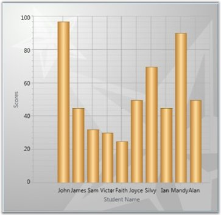

::: {style="DISPLAY: none"}
{#d2h_url_template}{#d2h_package_url style="WIDTH: 0px; DISPLAY: none; HEIGHT: 0px"}
:::

::: {.d2h_secondary_topic style="PADDING-BOTTOM: 10pt; MARGIN: 0pt; PADDING-LEFT: 0pt; PADDING-RIGHT: 0pt; PADDING-TOP: 0pt"}
##### IList Data Source {#ilist-data-source style="tab-stops: 0pt"}

Simple IList-based instances can be easily bound to the Chart. The following code example illustrates how to bind IList-based instances as the data source to Chart.

[]{style="FONT-FAMILY: 'Trebuchet MS','sans-serif'; COLOR: #15428b; FONT-SIZE: 9pt"} 

+-------------------------------------------------------------------------------------------------------------------------------------------------------------------------------------------------------------------------------------+
| **[\[C#\]]{style="FONT-FAMILY: 'Courier New'; COLOR: black"}**                                                                                                                                                                      |
|                                                                                                                                                                                                                                     |
| []{style="FONT-FAMILY: 'Courier New'; COLOR: blue"}                                                                                                                                                                                 |
|                                                                                                                                                                                                                                     |
| [public]{style="FONT-FAMILY: 'Courier New'; COLOR: blue"}[ [IList]{style="COLOR: #2b91af"} marks()]{style="FONT-FAMILY: 'Courier New'"}                                                                                             |
|                                                                                                                                                                                                                                     |
| [{]{style="FONT-FAMILY: 'Courier New'"}                                                                                                                                                                                             |
|                                                                                                                                                                                                                                     |
| [            [List]{style="COLOR: #2b91af"}\<[mark]{style="COLOR: #2b91af"}\> markList = [new]{style="COLOR: blue"} [List]{style="COLOR: #2b91af"}\<[mark]{style="COLOR: #2b91af"}\>();]{style="FONT-FAMILY: 'Courier New'"}        |
|                                                                                                                                                                                                                                     |
| [            markList.Add([new]{style="COLOR: blue"} [mark]{style="COLOR: #2b91af"}() { ID = 0, Name = [\"John\"]{style="COLOR: #a31515"}, Mark1 = 97, Mark2 = 99, Mark3 = 85, Mark4 = 92 });]{style="FONT-FAMILY: 'Courier New'"}  |
|                                                                                                                                                                                                                                     |
| [            markList.Add([new]{style="COLOR: blue"} [mark]{style="COLOR: #2b91af"}() { ID = 1, Name = [\"James\"]{style="COLOR: #a31515"},Mark1 = 45, Mark2 = 35, Mark3 = 48, Mark4 = 42 });]{style="FONT-FAMILY: 'Courier New'"}  |
|                                                                                                                                                                                                                                     |
| [            markList.Add([new]{style="COLOR: blue"} [mark]{style="COLOR: #2b91af"}() { ID = 2, Name = [\"Sam\"]{style="COLOR: #a31515"},Mark1 = 32, Mark2 = 65,Mark3 = 67,Mark4 = 78});]{style="FONT-FAMILY: 'Courier New'"}       |
|                                                                                                                                                                                                                                     |
| [            markList.Add([new]{style="COLOR: blue"} [mark]{style="COLOR: #2b91af"}() { ID = 3, Name = [\"Victor\"]{style="COLOR: #a31515"},Mark1 = 30, Mark2 = 39,Mark3 = 38,Mark4 = 56});]{style="FONT-FAMILY: 'Courier New'"}    |
|                                                                                                                                                                                                                                     |
| [            markList.Add([new]{style="COLOR: blue"} [mark]{style="COLOR: #2b91af"}() { ID = 4, Name = [\"Faith\"]{style="COLOR: #a31515"}, Mark1= 25,Mark2 = 45,Mark3 = 77,Mark4 = 19});]{style="FONT-FAMILY: 'Courier New'"}      |
|                                                                                                                                                                                                                                     |
| [            markList.Add([new]{style="COLOR: blue"} [mark]{style="COLOR: #2b91af"}() { ID = 5, Name =[\"Joyce\"]{style="COLOR: #a31515"}, Mark1= 50,Mark2 = 35,Mark3 = 54,Mark4 = 55});]{style="FONT-FAMILY: 'Courier New'"}       |
|                                                                                                                                                                                                                                     |
| [            markList.Add([new]{style="COLOR: blue"} [mark]{style="COLOR: #2b91af"}() { ID = 6, Name = [\"Silvy\"]{style="COLOR: #a31515"},Mark1 = 70, Mark2 = 28, Mark3 = 35, Mark4 = 45 });]{style="FONT-FAMILY: 'Courier New'"}  |
|                                                                                                                                                                                                                                     |
| [            markList.Add([new]{style="COLOR: blue"} [mark]{style="COLOR: #2b91af"}() { ID = 7, Name = [\"Ian\"]{style="COLOR: #a31515"},Mark1 = 45,Mark2 = 85,Mark3 = 77,Mark4 =19});]{style="FONT-FAMILY: 'Courier New'"}         |
|                                                                                                                                                                                                                                     |
| [            markList.Add([new]{style="COLOR: blue"} [mark]{style="COLOR: #2b91af"}() { ID = 8, Name = [\"Mandy\"]{style="COLOR: #a31515"}, Mark1 = 90, Mark2 = 45, Mark3 = 54, Mark4 = 55 });]{style="FONT-FAMILY: 'Courier New'"} |
|                                                                                                                                                                                                                                     |
| [            markList.Add([new]{style="COLOR: blue"} [mark]{style="COLOR: #2b91af"}() { ID = 9, Name = [\"Alan\"]{style="COLOR: #a31515"},  Mark1 = 50, Mark2 = 28, Mark3 = 25, Mark4 = 45 });]{style="FONT-FAMILY: 'Courier New'"} |
|                                                                                                                                                                                                                                     |
| [            [return]{style="COLOR: blue"} markList;]{style="FONT-FAMILY: 'Courier New'"}                                                                                                                                           |
|                                                                                                                                                                                                                                     |
| [}]{style="FONT-FAMILY: 'Courier New'"}                                                                                                                                                                                             |
+-------------------------------------------------------------------------------------------------------------------------------------------------------------------------------------------------------------------------------------+

**[]{style="FONT-FAMILY: 'Trebuchet MS','sans-serif'; COLOR: #15428b; FONT-SIZE: 9pt"}** 

 The following screen shot illustrates how a Chart Series is associated to the Chart by using IList-based instances.

**[]{style="FONT-FAMILY: 'Trebuchet MS','sans-serif'; COLOR: #15428b; FONT-SIZE: 9pt"}** 

{border="0"}

Figure 55: Chart Series bound to IList Data Source

[]{style="FONT-FAMILY: 'Trebuchet MS','sans-serif'; COLOR: #15428b; FONT-SIZE: 9pt"} 

See Also

[]{style="FONT-FAMILY: 'Trebuchet MS','sans-serif'; BACKGROUND: yellow; COLOR: #15428b; FONT-SIZE: 9pt"} 

[[XML Data Source]{.UGHyperlink}](ms-xhelp:///?Id=d834657a-72d4-4708-ba64-765b92f7c9ea)[]{.UGHyperlink}

[[ObservableCollection Data Source]{.UGHyperlink}](ms-xhelp:///?Id=d834657a-72d4-4708-ba64-765b92f7c9ea)[ ]{.UGHyperlink}

[[CollectionViewSource Data Source]{.UGHyperlink}](ms-xhelp:///?Id=dc49e876-360c-4b3e-bf87-688523008727)[ ]{.UGHyperlink}

[[LINQ Data Source]{.UGHyperlink}](ms-xhelp:///?Id=e00c01e2-54ec-409e-ae1b-ed46f9d987ab)[ ]{.UGHyperlink}

[[Data Binding for Child Level Properties]{.UGHyperlink}](ms-xhelp:///?Id=5776d24e-f729-4ece-9a96-efb7b05943ec)[]{.UGHyperlink}

[]{#p26} 

[]{#related-topics}
:::
