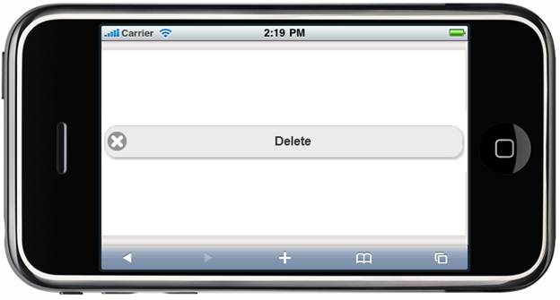

::: {style="DISPLAY: none"}
{#d2h_url_template} {#d2h_package_url style="WIDTH: 0px; DISPLAY: none; HEIGHT: 0px"}
:::

::: {.d2h_secondary_topic style="PADDING-BOTTOM: 10pt; MARGIN: 0pt; PADDING-LEFT: 0pt; PADDING-RIGHT: 0pt; PADDING-TOP: 0pt"}
##### Image {#image style="tab-stops: 0pt"}

The Form Button control can render an icon along with the text property. The icon can be set for a button with the **ImageURL** property.

 

Properties

  ---------- ---------------------------------------- ------------------ ------------------ ------------
  Name       Description                              Type of Property   Value it Accepts   Dependency
  ImageUrl   Sets the image for the button control.   String             ActionBuilder      \-
  ---------- ---------------------------------------- ------------------ ------------------ ------------

 

Using Builder

The following steps explain how to set the icon settings in the Form Button control using Builder:

1.   In the **view**, invoke the **Button** helper with the control ID as the first argument followed by the **ImageUrl**, **AutoFormat**, and **Text** methods with their respective text and images as desired by the user.

 

+-------------------------------------------------------------------------------------------------------------------------------------------------------------------------------------------------------------------------------------------------------------------------------------------------------------------------------------------------------------------------------------------------------------------------------------------------------+
| **[\[ASPX\]]{style="FONT-FAMILY: 'Courier New'"}**                                                                                                                                                                                                                                                                                                                                                                                                    |
|                                                                                                                                                                                                                                                                                                                                                                                                                                                       |
| [\<%]{style="FONT-FAMILY: 'Courier New'; BACKGROUND: yellow"} [=]{style="FONT-FAMILY: 'Courier New'; COLOR: blue"} [Html.MobSyncfusion().Button([\"Button\"]{style="COLOR: #a31515"}).ImageUrl([\"../Content/Button/Images/Delete.png\"]{style="COLOR: #a31515"}).Text([\"Delete\"]{style="COLOR: #a31515"}).AutoFormat([MobSkins]{style="COLOR: #2b91af"}.Spinach) [%\>]{style="BACKGROUND: yellow"}]{style="FONT-FAMILY: 'Courier New'"}            |
|                                                                                                                                                                                                                                                                                                                                                                                                                                                       |
| **[\[Razor\]]{style="FONT-FAMILY: 'Courier New'"}**                                                                                                                                                                                                                                                                                                                                                                                                   |
|                                                                                                                                                                                                                                                                                                                                                                                                                                                       |
| [   ]{style="FONT-FAMILY: 'Courier New'; COLOR: blue"} [\@{]{style="FONT-FAMILY: 'Courier New'; BACKGROUND: yellow"} [ Html.MobSyncfusion().Button([\"Button\"]{style="COLOR: #a31515"}).ImageUrl([\"../Content/Button/Images/Delete.png\"]{style="COLOR: #a31515"}).Text([\"Delete\"]{style="COLOR: #a31515"}).AutoFormat([MobSkins]{style="COLOR: #2b91af"}.Spinach).Render(); [}]{style="BACKGROUND: yellow"}]{style="FONT-FAMILY: 'Courier New'"} |
+-------------------------------------------------------------------------------------------------------------------------------------------------------------------------------------------------------------------------------------------------------------------------------------------------------------------------------------------------------------------------------------------------------------------------------------------------------+

 

2.   Build and run the application.

 

Using Properties Model

The following steps explain how to set the image settings in the Form Button control using the properties model:

 

1.   In the **controller**, create an instance of **MobButtonModel**, define the **ImageUrl** property, and pass the instance through **ViewData** to the **view** as given below:**

*[[]{style="TEXT-DECORATION: none"}]{.underline}*  

+--------------------------------------------------------------------------------------------------------------------------------------------------------------------------------------------------------------------------------------------------------------------------------------------------+
| **[Controller]{style="FONT-FAMILY: 'Courier New'"}**                                                                                                                                                                                                                                             |
|                                                                                                                                                                                                                                                                                                  |
| [        [public]{style="COLOR: blue"}[ActionResult]{style="COLOR: #2b91af"} Button()]{style="FONT-FAMILY: 'Courier New'"}                                                                                                                                                                       |
|                                                                                                                                                                                                                                                                                                  |
| [        {]{style="FONT-FAMILY: 'Courier New'"}                                                                                                                                                                                                                                                  |
|                                                                                                                                                                                                                                                                                                  |
| [            [MobButtonModel]{style="COLOR: #2b91af"} model = [new]{style="COLOR: blue"}[MobButtonModel]{style="COLOR: #2b91af"}()]{style="FONT-FAMILY: 'Courier New'"}                                                                                                                          |
|                                                                                                                                                                                                                                                                                                  |
| [            {]{style="FONT-FAMILY: 'Courier New'"}                                                                                                                                                                                                                                              |
|                                                                                                                                                                                                                                                                                                  |
| [                ]{style="FONT-FAMILY: 'Courier New'"} [Text=[\"Delete\"]{style="COLOR: #a31515"},]{style="FONT-FAMILY: 'Courier New'"}                                                                                                                                                          |
|                                                                                                                                                                                                                                                                                                  |
| [                ImageUrl]{style="FONT-FAMILY: 'Courier New'"} [([\"../Content/Button/Images/Delete.png]{style="COLOR: #a31515"}]{style="FONT-FAMILY: 'Courier New'"} [\"]{style="FONT-FAMILY: 'Courier New'; COLOR: #a31515"} [,[]{style="COLOR: #a31515"}]{style="FONT-FAMILY: 'Courier New'"} |
|                                                                                                                                                                                                                                                                                                  |
| [                AutoFormat=[MobSkins]{style="COLOR: #2b91af"}.Spinach]{style="FONT-FAMILY: 'Courier New'"}                                                                                                                                                                                      |
|                                                                                                                                                                                                                                                                                                  |
| [            };]{style="FONT-FAMILY: 'Courier New'"}                                                                                                                                                                                                                                             |
|                                                                                                                                                                                                                                                                                                  |
| [            ViewData\[[\"button\"]{style="COLOR: #a31515"}\] = model;]{style="FONT-FAMILY: 'Courier New'"}                                                                                                                                                                                      |
|                                                                                                                                                                                                                                                                                                  |
| [            [return]{style="COLOR: blue"} View();]{style="FONT-FAMILY: 'Courier New'"}                                                                                                                                                                                                          |
|                                                                                                                                                                                                                                                                                                  |
| [        }]{style="FONT-FAMILY: 'Courier New'"}                                                                                                                                                                                                                                                  |
+--------------------------------------------------------------------------------------------------------------------------------------------------------------------------------------------------------------------------------------------------------------------------------------------------+

 

2.   In the **view**, invoke the **Button** helper with the **ViewData** key as the first argument.

 

+-------------------------------------------------------------------------------------------------------------------------------------------------------------------------------------------------------------------------------------------------------------------------------------------------------------------------------+
| **[\[ASPX\]]{style="FONT-FAMILY: 'Courier New'"}**                                                                                                                                                                                                                                                                            |
|                                                                                                                                                                                                                                                                                                                               |
| [       [\<%]{style="BACKGROUND: yellow"}[=]{style="COLOR: blue"}Html.MobSyncfusion().Button]{style="FONT-FAMILY: 'Courier New'"} [([\"button\"]{style="COLOR: #a31515"}]{style="FONT-FAMILY: 'Courier New'"} [)[%\>]{style="BACKGROUND: yellow"}]{style="FONT-FAMILY: 'Courier New'"} []{style="FONT-FAMILY: 'Courier New'"} |
|                                                                                                                                                                                                                                                                                                                               |
| []{style="FONT-FAMILY: 'Courier New'"}                                                                                                                                                                                                                                                                                        |
|                                                                                                                                                                                                                                                                                                                               |
| **[\[Razor\]]{style="FONT-FAMILY: 'Courier New'"}**                                                                                                                                                                                                                                                                           |
|                                                                                                                                                                                                                                                                                                                               |
| [       [\@{]{style="BACKGROUND: yellow"}Html.MobSyncfusion().Button([\"button\"]{style="COLOR: #a31515"}).Render();[}]{style="BACKGROUND: yellow"}]{style="FONT-FAMILY: 'Courier New'"}                                                                                                                                      |
+-------------------------------------------------------------------------------------------------------------------------------------------------------------------------------------------------------------------------------------------------------------------------------------------------------------------------------+

[]{style="BACKGROUND: yellow"} 

3.   Build and run the application.

 

The output is shown in the following screenshot.

 

{border="0"}

Figure 6: Button---ImageUrl Property

 

[]{#related-topics}
:::
