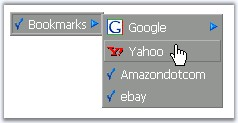

::: {style="DISPLAY: none"}
{#d2h_url_template}{#d2h_package_url style="WIDTH: 0px; DISPLAY: none; HEIGHT: 0px"}
:::

::::::: {.d2h_secondary_topic style="PADDING-BOTTOM: 10pt; MARGIN: 0pt; PADDING-LEFT: 0pt; PADDING-RIGHT: 0pt; PADDING-TOP: 0pt"}
##### Image Settings {#image-settings style="tab-stops: 0pt"}

[]{style="FONT-FAMILY: 'Trebuchet MS','sans-serif'; COLOR: #15428b; FONT-SIZE: 9pt"} 

Check image

[]{style="FONT-FAMILY: 'Trebuchet MS','sans-serif'; COLOR: #15428b; FONT-SIZE: 9pt"} 

The **Checked** property when set displays a check mark to the left of the text. This property can be individually set for the items in the designer dialog.

 

The check image can be customized by assigning the image to the **ImageCheck** property. This replaces the default image with the custom image.

[]{style="FONT-FAMILY: 'Trebuchet MS','sans-serif'; COLOR: #15428b; FONT-SIZE: 9pt"} 

::: {align="center"}
+-----------------------------------+--------------------------------------------------------------------------------------------------------------+
|                                   |                                                                                                              |
|                                   |                                                                                                              |
| Property                          | Description                                                                                                  |
+-----------------------------------+--------------------------------------------------------------------------------------------------------------+
| Checked                           | Gets / sets the boolean value, whether a checkmark image should be shown by default. Default value is False. |
+-----------------------------------+--------------------------------------------------------------------------------------------------------------+
| ImageCheck                        | Path of the check image to be used.                                                                          |
+-----------------------------------+--------------------------------------------------------------------------------------------------------------+
:::

[]{style="FONT-FAMILY: 'Trebuchet MS','sans-serif'; COLOR: #15428b; FONT-SIZE: 9pt"} 

Arrow image

[]{style="FONT-FAMILY: 'Trebuchet MS','sans-serif'; COLOR: #15428b; FONT-SIZE: 9pt"} 

The arrows which appears to the right of the text will be displayed for parent menu items by default. This arrow image can be customized by assigning the image to be used to the **ImageArrow** property.

[]{style="FONT-FAMILY: 'Trebuchet MS','sans-serif'; COLOR: #15428b; FONT-SIZE: 9pt"} 

::: {align="center"}
+-----------------------------------+---------------------------------------+
|                                   |                                       |
|                                   |                                       |
| Menu Property                     | Description                           |
+-----------------------------------+---------------------------------------+
| ImageArrow                        | Specifies the arrow image to be used. |
+-----------------------------------+---------------------------------------+
:::

[]{style="FONT-FAMILY: 'Trebuchet MS','sans-serif'; COLOR: #15428b; FONT-SIZE: 9pt"} 

{border="0"}

**[]{style="FONT-FAMILY: 'Trebuchet MS','sans-serif'; COLOR: #15428b; FONT-SIZE: 9pt"}** 

Figure 217: Menu with custom Check and Arrow images

[]{style="FONT-FAMILY: 'Trebuchet MS','sans-serif'; COLOR: #15428b; FONT-SIZE: 9pt"} 

Image Settings

[]{style="FONT-FAMILY: 'Trebuchet MS','sans-serif'; COLOR: #15428b; FONT-SIZE: 9pt"} 

The **ImageBaseUrl** allows you to specify the path from where the images have to be obtained. By default it is set to \'images\' folder.

 

**ImagePath** can be used to set the left image for an item. **ImageHoverPath** can be used to set the image during mouse over action for an item. Both these properties should be set for individual items in the Designer dialog. 

 

::: {align="center"}
+-----------------------------------+----------------------------------------------------------------------------------------------------------------+
|                                   |                                                                                                                |
|                                   |                                                                                                                |
|          Item Property            | Description                                                                                                    |
+-----------------------------------+----------------------------------------------------------------------------------------------------------------+
| ImageBaseURL                      | Specifies the relative path of the folder containing images used by the menu control. Default value is Images. |
+-----------------------------------+----------------------------------------------------------------------------------------------------------------+
| ImageHoverPath                    | Specifies the path of the image to be used for an item, in hover state.                                        |
+-----------------------------------+----------------------------------------------------------------------------------------------------------------+
| ImagePath                         | Specifies the path of the image to be used for an item.                                                        |
+-----------------------------------+----------------------------------------------------------------------------------------------------------------+
:::

[]{style="FONT-FAMILY: 'Trebuchet MS','sans-serif'; COLOR: black"} 

Setting Left and Right images through ItemLooks

[]{style="FONT-FAMILY: 'Trebuchet MS','sans-serif'; COLOR: #15428b; FONT-SIZE: 9pt"} 

The left and right images can be set for an item through ItemLooks, by setting the **LeftImageUrl** and **RightImageUrl** properties to the images respectively.

[]{style="FONT-FAMILY: 'Trebuchet MS','sans-serif'; COLOR: #15428b; FONT-SIZE: 9pt"} 

::: {align="center"}
+-----------------------------------+----------------------------------------------------------------+
|                                   |                                                                |
|                                   |                                                                |
| ItemLook Property                 | Description                                                    |
+-----------------------------------+----------------------------------------------------------------+
| LeftImageUrl                      | Specifies the path of the left image to be used for the node.  |
+-----------------------------------+----------------------------------------------------------------+
| RightImageUrl                     | Specifies the path of the right image to be used for the node. |
+-----------------------------------+----------------------------------------------------------------+
:::

 

[]{#related-topics}
:::::::
