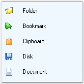
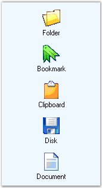
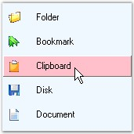
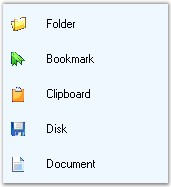

::: {style="DISPLAY: none"}
{#d2h_url_template}{#d2h_package_url style="WIDTH: 0px; DISPLAY: none; HEIGHT: 0px"}
:::

::::::::: {.d2h_secondary_topic style="PADDING-BOTTOM: 10pt; MARGIN: 0pt; PADDING-LEFT: 0pt; PADDING-RIGHT: 0pt; PADDING-TOP: 0pt"}
##### Image Settings of GroupView {#image-settings-of-groupview style="MARGIN-LEFT: 18pt; tab-stops: 18.0pt"}

[]{style="COLOR: #4a5c8c; FONT-SIZE: 8pt"} 

This section describes the image options available for GroupView.

[]{style="COLOR: #4a5c8c; FONT-SIZE: 8pt"} 

To add images to the GroupView, **ImageList** **control** must be added to the form with images. ImageList control containing large or small images can be set using the properties given below.

[]{style="COLOR: #15428b"} 

::: {style="BORDER-BOTTOM: windowtext 1pt solid; BORDER-LEFT: medium none; PADDING-BOTTOM: 1pt; MARGIN: 9pt 0pt 9pt 18pt; PADDING-LEFT: 0pt; PADDING-RIGHT: 0pt; BORDER-TOP: windowtext 1pt solid; BORDER-RIGHT: medium none; PADDING-TOP: 1pt"}
{border="0"} Note: If the application requirements deem that the GroupView will always display the same-sized image, then it is sufficient to assign just one ImageList. For the VS.NET toolbox interface, the GroupView will use only a single 16\*16-sized small image list.
:::

[]{style="COLOR: black; FONT-SIZE: 8pt"} 

::: {align="center"}
  ---------------------- -------------------------------------------------------------------------------------------------------------------------------------------------------------------------------------------------------------------------------------------------------------------------------------------------------------------------------
  GroupView Properties   Description
  LargeImageList         It contains large images (32\*32) to associate with the control.
  SmallImageView         In SmallImageView mode, the GroupView items are displayed using the small 16x16 images and are right-aligned with the text drawn alongside the image. When the SmallImageView property is set to \'False\', items are displayed using the larger 32x32 images and will be center-aligned with the text drawn below the image.
  SmallImageList         It contains small images (16\*16) to associate with the control. SmallImageView must be set to \'True\' to associate small images with the control.
  ---------------------- -------------------------------------------------------------------------------------------------------------------------------------------------------------------------------------------------------------------------------------------------------------------------------------------------------------------------------
:::

[]{style="COLOR: #15428b"} 

+-------------------------------------------------------------------------------------------------------------------------------------------------------------------+
| **[\[C#\]]{style="FONT-FAMILY: 'Courier New'; COLOR: black"}**                                                                                                    |
|                                                                                                                                                                   |
| []{style="FONT-FAMILY: 'Courier New'; COLOR: black"}                                                                                                              |
|                                                                                                                                                                   |
| [this]{style="FONT-FAMILY: 'Courier New'; COLOR: blue"}[.groupView1.LargeImageList = [this]{style="COLOR: blue"}.imageList2;]{style="FONT-FAMILY: 'Courier New'"} |
|                                                                                                                                                                   |
| [this]{style="FONT-FAMILY: 'Courier New'; COLOR: blue"}[.groupView1.SmallImageView = [true]{style="COLOR: blue"};]{style="FONT-FAMILY: 'Courier New'"}            |
|                                                                                                                                                                   |
| [this]{style="FONT-FAMILY: 'Courier New'; COLOR: blue"}[.groupView1.SmallImageList = [this]{style="COLOR: blue"}.imageList1;]{style="FONT-FAMILY: 'Courier New'"} |
+-------------------------------------------------------------------------------------------------------------------------------------------------------------------+

[]{style="COLOR: #15428b"} 

+--------------------------------------------------------------------------------------------------------------------------------------------------------------+
| **[\[VB.NET\]]{style="FONT-FAMILY: 'Courier New'; COLOR: black"}**                                                                                           |
|                                                                                                                                                              |
| []{style="FONT-FAMILY: 'Courier New'; COLOR: black"}                                                                                                         |
|                                                                                                                                                              |
| [Me]{style="FONT-FAMILY: 'Courier New'; COLOR: blue"}[.groupView1.LargeImageList = [Me]{style="COLOR: blue"}.imageList2]{style="FONT-FAMILY: 'Courier New'"} |
|                                                                                                                                                              |
| [Me]{style="FONT-FAMILY: 'Courier New'; COLOR: blue"}[.groupView1.SmallImageView = [True]{style="COLOR: blue"}]{style="FONT-FAMILY: 'Courier New'"}          |
|                                                                                                                                                              |
| [Me]{style="FONT-FAMILY: 'Courier New'; COLOR: blue"}[.groupView1.SmallImageList = [Me]{style="COLOR: blue"}.imageList1]{style="FONT-FAMILY: 'Courier New'"} |
+--------------------------------------------------------------------------------------------------------------------------------------------------------------+

[]{style="COLOR: #15428b"} 

::: {style="BORDER-BOTTOM: windowtext 1pt solid; BORDER-LEFT: medium none; PADDING-BOTTOM: 1pt; MARGIN: 9pt 0pt 9pt 18pt; PADDING-LEFT: 0pt; PADDING-RIGHT: 0pt; BORDER-TOP: windowtext 1pt solid; BORDER-RIGHT: medium none; PADDING-TOP: 1pt"}
{border="0"} Note : Setting Imagelist component to the above properties will not actually associate the images with the GroupView Item. We need to set the ImageIndex of the images to the GroupView Item through the GroupViewItems Collection editor.
:::

[]{style="COLOR: #15428b"} 

{border="0"}

[]{style="COLOR: #15428b"} 

Figure 916: GroupView Items displaying Small Images instead of Icons

[]{style="COLOR: #15428b"} 

{border="0"}

[]{style="COLOR: #15428b"} 

Figure 917: GroupView Items displaying Large Images instead of Icons

[]{style="COLOR: #15428b"} 

Highlighting Images

[]{style="COLOR: #15428b"} 

We can highlight the image of the GroupView Item when the mouse is moved over it by setting the **HighlightImage** property to \'True\'.

[]{style="COLOR: #15428b"} 

+--------------------------------------------------------------------------------------------------------------------------------------------------------+
| **[\[C#\]]{style="FONT-FAMILY: 'Courier New'; COLOR: black"}**                                                                                         |
|                                                                                                                                                        |
| []{style="FONT-FAMILY: 'Courier New'; COLOR: black"}                                                                                                   |
|                                                                                                                                                        |
| [this]{style="FONT-FAMILY: 'Courier New'; COLOR: blue"}[.groupView1.HighLightImage = [true]{style="COLOR: blue"};]{style="FONT-FAMILY: 'Courier New'"} |
+--------------------------------------------------------------------------------------------------------------------------------------------------------+

[]{style="COLOR: #15428b"} 

+-----------------------------------------------------------------------------------------------------------------------------------------------------+
| **[\[VB.NET\]]{style="FONT-FAMILY: 'Courier New'; COLOR: black"}**                                                                                  |
|                                                                                                                                                     |
| []{style="FONT-FAMILY: 'Courier New'; COLOR: black"}                                                                                                |
|                                                                                                                                                     |
| [Me]{style="FONT-FAMILY: 'Courier New'; COLOR: blue"}[.groupView1.HighLightImage = [True]{style="COLOR: blue"}]{style="FONT-FAMILY: 'Courier New'"} |
+-----------------------------------------------------------------------------------------------------------------------------------------------------+

[]{style="COLOR: #15428b"} 

{border="0"}

[]{style="COLOR: #15428b"} 

Figure 918: Highlighting Images Illustrated

[]{style="COLOR: #15428b"} 

Image Offset Settings

[]{style="COLOR: #4a5c8c; FONT-SIZE: 8pt"} 

The following properties are used to set the image offset for the GroupView Items.

[]{style="COLOR: #15428b"} 

::: {align="center"}
  ------------------------------ ----------------------------------------------------------------------------------------
  GroupView Property             Description
  SelectedImageOffset            Gets / sets the image offset for the selected GroupView Item.
  SelectingImageOffset           Gets / sets the image offset for the GroupView Item being selected.
  SelectedHighlightImageOffset   Gets / sets the image offset when the mouse is moved over the selected GroupView Item.
  HighlightImageOffset           Gets / sets the image offset for the highlighted GroupView Item.
  ------------------------------ ----------------------------------------------------------------------------------------
:::

**[]{style="COLOR: #15428b"}** 

::: {style="BORDER-BOTTOM: windowtext 1pt solid; BORDER-LEFT: medium none; PADDING-BOTTOM: 1pt; MARGIN: 9pt 0pt 9pt 18pt; PADDING-LEFT: 0pt; PADDING-RIGHT: 0pt; BORDER-TOP: windowtext 1pt solid; BORDER-RIGHT: medium none; PADDING-TOP: 1pt"}
{border="0"} Note: HighlightImage property must be set to \'True\' in all the cases.
:::

[]{style="COLOR: #15428b"} 

+------------------------------------------------------------------------------------------------------------------------------------------------------------------------------------------------+
| **[\[C#\]]{style="FONT-FAMILY: 'Courier New'; COLOR: black"}**                                                                                                                                 |
|                                                                                                                                                                                                |
| []{style="FONT-FAMILY: 'Courier New'; COLOR: blue"}                                                                                                                                            |
|                                                                                                                                                                                                |
| [this]{style="FONT-FAMILY: 'Courier New'; COLOR: blue"}[.groupView1.SelectedImageOffset = [new]{style="COLOR: blue"} System.Drawing.Point(8, 8);]{style="FONT-FAMILY: 'Courier New'"}          |
|                                                                                                                                                                                                |
| [this]{style="FONT-FAMILY: 'Courier New'; COLOR: blue"}[.groupView1.SelectingImageOffset = [new]{style="COLOR: blue"} System.Drawing.Point(6, 6);]{style="FONT-FAMILY: 'Courier New'"}         |
|                                                                                                                                                                                                |
| [this]{style="FONT-FAMILY: 'Courier New'; COLOR: blue"}[.groupView1.HighlightImageOffset = [new]{style="COLOR: blue"} System.Drawing.Point(5, 5);]{style="FONT-FAMILY: 'Courier New'"}         |
|                                                                                                                                                                                                |
| [this]{style="FONT-FAMILY: 'Courier New'; COLOR: blue"}[.groupView1.SelectedHighlightImageOffset = [new]{style="COLOR: blue"} System.Drawing.Point(5, 5);]{style="FONT-FAMILY: 'Courier New'"} |
+------------------------------------------------------------------------------------------------------------------------------------------------------------------------------------------------+

[]{style="COLOR: #15428b"} 

+---------------------------------------------------------------------------------------------------------------------------------------------------------------------------------------------+
| **[\[VB.NET\]]{style="FONT-FAMILY: 'Courier New'; COLOR: black"}**                                                                                                                          |
|                                                                                                                                                                                             |
| []{style="FONT-FAMILY: 'Courier New'; COLOR: black"}                                                                                                                                        |
|                                                                                                                                                                                             |
| [Me]{style="FONT-FAMILY: 'Courier New'; COLOR: blue"}[.groupView1.SelectedImageOffset = [New]{style="COLOR: blue"} System.Drawing.Point(8, 8)]{style="FONT-FAMILY: 'Courier New'"}          |
|                                                                                                                                                                                             |
| [Me]{style="FONT-FAMILY: 'Courier New'; COLOR: blue"}[.groupView1.SelectingImageOffset = [New]{style="COLOR: blue"} System.Drawing.Point(6, 6)]{style="FONT-FAMILY: 'Courier New'"}         |
|                                                                                                                                                                                             |
| [Me]{style="FONT-FAMILY: 'Courier New'; COLOR: blue"}[.groupView1.HighlightImageOffset = [New]{style="COLOR: blue"} System.Drawing.Point(5, 5)]{style="FONT-FAMILY: 'Courier New'"}         |
|                                                                                                                                                                                             |
| [Me]{style="FONT-FAMILY: 'Courier New'; COLOR: blue"}[.groupView1.SelectedHighlightImageOffset = [New]{style="COLOR: blue"} System.Drawing.Point(5, 5)]{style="FONT-FAMILY: 'Courier New'"} |
+---------------------------------------------------------------------------------------------------------------------------------------------------------------------------------------------+

[]{style="COLOR: #15428b"} 

The following table lists the methods related to the above properties.

[]{style="COLOR: #15428b"} 

::: {align="center"}
  ----------------------------------- --------------------------------------------------------------------------
  Methods                             Description
  ResetSelectedImageOffset            Resets the SelectedImageOffset property to it\'s default value.
  ResetSelectingImageOffset           Resets the SelectingImageOffset property to it\'s default value.
  ResetSelectedHighlightImageOffset   Resets the SelectedHighlightImageOffset property to it\'s default value.
  ResetHighlightImageOffset           Resets the HighlightImageOffset property to it\'s default value.
  ----------------------------------- --------------------------------------------------------------------------
:::

[]{style="COLOR: #15428b"} 

Image Spacing

[]{style="COLOR: #4a5c8c; FONT-SIZE: 8pt"} 

We can provide spacing between the highlighted edge of a GroupView Item and the image by setting the **ImageSpacing** property to integer values.

 

**HighlightImage** property must be set to \'True\'.

[]{style="COLOR: #15428b"} 

+----------------------------------------------------------------------------------------------------------------------------+
| **[\[C#\]]{style="FONT-FAMILY: 'Courier New'; COLOR: black"}**                                                             |
|                                                                                                                            |
| []{style="FONT-FAMILY: 'Courier New'; COLOR: black"}                                                                       |
|                                                                                                                            |
| [this]{style="FONT-FAMILY: 'Courier New'; COLOR: blue"}[.groupView1.ImageSpacing = 7;]{style="FONT-FAMILY: 'Courier New'"} |
+----------------------------------------------------------------------------------------------------------------------------+

[]{style="COLOR: #15428b"} 

+-------------------------------------------------------------------------------------------------------------------------+
| **[\[VB.NET\]]{style="FONT-FAMILY: 'Courier New'; COLOR: black"}**                                                      |
|                                                                                                                         |
| []{style="FONT-FAMILY: 'Courier New'; COLOR: black"}                                                                    |
|                                                                                                                         |
| [Me]{style="FONT-FAMILY: 'Courier New'; COLOR: blue"}[.groupView1.ImageSpacing = 7]{style="FONT-FAMILY: 'Courier New'"} |
+-------------------------------------------------------------------------------------------------------------------------+

[]{style="COLOR: #15428b"} 

{border="0"}

[]{style="COLOR: #15428b"} 

Figure 919: GroupView with ImageSpacing = \"7\"

 

 

[]{#p648} 

 

[]{#related-topics}
:::::::::
