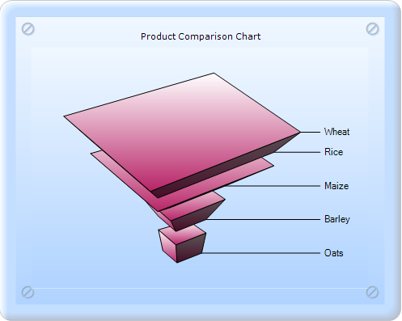

::: {style="DISPLAY: none"}
{#d2h_url_template}{#d2h_package_url style="WIDTH: 0px; DISPLAY: none; HEIGHT: 0px"}
:::

::: {.d2h_secondary_topic style="PADDING-BOTTOM: 10pt; MARGIN: 0pt; PADDING-LEFT: 0pt; PADDING-RIGHT: 0pt; PADDING-TOP: 0pt"}
##### Implementation {#implementation style="tab-stops: 0pt"}

[]{style="FONT-FAMILY: 'Calibri','sans-serif'"} 

Funnel or Pyramid charts with the above properties can be created through two ways:

[·      ]{style="FONT-FAMILY: Symbol"}Builder

[·      ]{style="FONT-FAMILY: Symbol"}ChartModel

[]{style="FONT-FAMILY: 'Calibri','sans-serif'"} 

###### 5.2.1.8.6.1 Builder {#builder style="tab-stops: 0pt"}

[]{style="FONT-FAMILY: 'Calibri','sans-serif'"} 

The steps to create Funnel or Pyramid charts with the above properties through Builder are as follows:

1.   In Controller, return view to the corresponding View page.

[]{style="FONT-FAMILY: 'Calibri','sans-serif'"} 

+-----------------------------------------------------------------------------------------------------------------------------------------------------------------------------------------------------------------+
| \[C#\]                                                                                                                                                                                                          |
|                                                                                                                                                                                                                 |
| [        ]{style="FONT-FAMILY: Consolas; FONT-SIZE: 9.5pt"}[public]{style="FONT-FAMILY: 'Courier New'; COLOR: blue"}[ [ActionResult]{style="COLOR: #2b91af"} SimpleChart()]{style="FONT-FAMILY: 'Courier New'"} |
|                                                                                                                                                                                                                 |
| [        {            ]{style="FONT-FAMILY: 'Courier New'"}                                                                                                                                                     |
|                                                                                                                                                                                                                 |
| [            [return]{style="COLOR: blue"} View();]{style="FONT-FAMILY: 'Courier New'"}                                                                                                                         |
|                                                                                                                                                                                                                 |
| [        }]{style="FONT-FAMILY: 'Courier New'"}[]{style="FONT-FAMILY: Consolas; COLOR: blue; FONT-SIZE: 9.5pt"}                                                                                                 |
+-----------------------------------------------------------------------------------------------------------------------------------------------------------------------------------------------------------------+

[]{style="FONT-FAMILY: 'Calibri','sans-serif'"} 

2.   In the View page, invoke the ChartBuilder by using the control ID as the first argument.

3.   Add the **Series** to the ChartModel and set the series type to **Funnel** or **Pyramid**, and add the **Points** to the series and set the style.

4.   Set the ChartModel and ChartArea properties.

5.   Set the Funnel Config items properties.

[]{style="FONT-FAMILY: 'Calibri','sans-serif'"} 

+------------------------------------------------------------------------------------------------------------------------------------------------------------------------------------------------------------------------------------------------------------------------------------------------+
| View \[ASPX\]                                                                                                                                                                                                                                                                                  |
|                                                                                                                                                                                                                                                                                                |
| []{style="FONT-FAMILY: 'Courier New'; FONT-SIZE: 12pt"}                                                                                                                                                                                                                                        |
|                                                                                                                                                                                                                                                                                                |
| [    [\<%]{style="BACKGROUND: yellow"}[=]{style="COLOR: blue"}Html.Chart([\"chart_Model\"]{style="COLOR: #a31515"}).Text([\"Product Comparison Chart\"]{style="COLOR: #a31515"}).Series(series =\>]{style="FONT-FAMILY: 'Courier New'"}[]{style="FONT-FAMILY: 'Courier New'; FONT-SIZE: 12pt"} |
|                                                                                                                                                                                                                                                                                                |
| [        {]{style="FONT-FAMILY: 'Courier New'"}                                                                                                                                                                                                                                                |
|                                                                                                                                                                                                                                                                                                |
| [            series.Add().Name([\"Funnel Chart\"]{style="COLOR: #a31515"}).Name([\"Pyramid Chart\"]{style="COLOR: #a31515"}).Type(Syncfusion.Windows.Forms.Chart.[ChartSeriesType]{style="COLOR: #2b91af"}.Pyramid).Points(points =\>]{style="FONT-FAMILY: 'Courier New'"}                     |
|                                                                                                                                                                                                                                                                                                |
| [           {]{style="FONT-FAMILY: 'Courier New'"}                                                                                                                                                                                                                                             |
|                                                                                                                                                                                                                                                                                                |
| **[               points.Add(0, 20.6);]{style="FONT-FAMILY: 'Courier New'"}**                                                                                                                                                                                                                  |
|                                                                                                                                                                                                                                                                                                |
| **[               points.Add(1, 25.3);]{style="FONT-FAMILY: 'Courier New'"}**                                                                                                                                                                                                                  |
|                                                                                                                                                                                                                                                                                                |
| **[               points.Add(2, 45.7);]{style="FONT-FAMILY: 'Courier New'"}**                                                                                                                                                                                                                  |
|                                                                                                                                                                                                                                                                                                |
| **[               points.Add(3, 97.3);]{style="FONT-FAMILY: 'Courier New'"}**                                                                                                                                                                                                                  |
|                                                                                                                                                                                                                                                                                                |
| **[               points.Add(4, 125.8);]{style="FONT-FAMILY: 'Courier New'"}**                                                                                                                                                                                                                 |
|                                                                                                                                                                                                                                                                                                |
| [           }).ConfigItems(items =\>]{style="FONT-FAMILY: 'Courier New'"}                                                                                                                                                                                                                      |
|                                                                                                                                                                                                                                                                                                |
| [           {]{style="FONT-FAMILY: 'Courier New'"}                                                                                                                                                                                                                                             |
|                                                                                                                                                                                                                                                                                                |
| **[               items.FunnelItem(item =\>]{style="FONT-FAMILY: 'Courier New'"}**                                                                                                                                                                                                             |
|                                                                                                                                                                                                                                                                                                |
| **[               {]{style="FONT-FAMILY: 'Courier New'"}**                                                                                                                                                                                                                                     |
|                                                                                                                                                                                                                                                                                                |
| **[                   item.LabelStyle(Syncfusion.Windows.Forms.Chart.[ChartAccumulationLabelStyle]{style="COLOR: #2b91af"}.OutsideInColumn)]{style="FONT-FAMILY: 'Courier New'"}**                                                                                                             |
|                                                                                                                                                                                                                                                                                                |
| **[                       .LabelPlacement(Syncfusion.Windows.Forms.Chart.[ChartAccumulationLabelPlacement]{style="COLOR: #2b91af"}.Center)]{style="FONT-FAMILY: 'Courier New'"}**                                                                                                              |
|                                                                                                                                                                                                                                                                                                |
| **[                       .FigureBase(Syncfusion.Windows.Forms.Chart.[ChartFigureBase]{style="COLOR: #2b91af"}.Square)]{style="FONT-FAMILY: 'Courier New'"}**                                                                                                                                  |
|                                                                                                                                                                                                                                                                                                |
| **[                       .GapRatio(0.2f)]{style="FONT-FAMILY: 'Courier New'"}**                                                                                                                                                                                                               |
|                                                                                                                                                                                                                                                                                                |
| **[                       .FunnelMode(Syncfusion.Windows.Forms.Chart.[ChartFunnelMode]{style="COLOR: #2b91af"}.YIsWidth);]{style="FONT-FAMILY: 'Courier New'"}**                                                                                                                               |
|                                                                                                                                                                                                                                                                                                |
| **[               });]{style="FONT-FAMILY: 'Courier New'"}**                                                                                                                                                                                                                                   |
|                                                                                                                                                                                                                                                                                                |
| **[           });]{style="FONT-FAMILY: 'Courier New'"}**                                                                                                                                                                                                                                       |
|                                                                                                                                                                                                                                                                                                |
| [//\-\-\-\-\-\-\-\-- Add the Series and set the styling properties that you want\-\-\-\-\--]{style="FONT-FAMILY: 'Courier New'; COLOR: green"}[]{style="FONT-FAMILY: 'Courier New'"}                                                                                                           |
|                                                                                                                                                                                                                                                                                                |
| []{style="FONT-FAMILY: 'Courier New'"}                                                                                                                                                                                                                                                         |
|                                                                                                                                                                                                                                                                                                |
| [            })]{style="FONT-FAMILY: 'Courier New'"}                                                                                                                                                                                                                                           |
|                                                                                                                                                                                                                                                                                                |
| [    [//\-\-\-\-\-\-\-\--Set the ChartModel and ChartArea properties that you want\-\-\-\-\--]{style="COLOR: green"}]{style="FONT-FAMILY: 'Courier New'"}                                                                                                                                      |
|                                                                                                                                                                                                                                                                                                |
| **[]{style="FONT-FAMILY: 'Courier New'"}**                                                                                                                                                                                                                                                     |
|                                                                                                                                                                                                                                                                                                |
| [    [%\>]{style="BACKGROUND: yellow"}]{style="FONT-FAMILY: 'Courier New'"}[]{style="FONT-FAMILY: Consolas; COLOR: blue; FONT-SIZE: 9.5pt"}                                                                                                                                                    |
+------------------------------------------------------------------------------------------------------------------------------------------------------------------------------------------------------------------------------------------------------------------------------------------------+

[]{style="BACKGROUND: yellow"} 

[]{style="FONT-FAMILY: 'Calibri','sans-serif'"} 

+----------------------------------------------------------------------------------------------------------------------------------------------------------------------------------------------------------------------------------------------------------------------------+
| View \[cshtml\]                                                                                                                                                                                                                                                            |
|                                                                                                                                                                                                                                                                            |
| []{style="FONT-FAMILY: 'Courier New'; FONT-SIZE: 12pt"}                                                                                                                                                                                                                    |
|                                                                                                                                                                                                                                                                            |
| [    [\@{]{style="BACKGROUND: yellow"} Html.Chart([\"chart_Model\"]{style="COLOR: #a31515"}).Text([\"Product Comparison Chart\"]{style="COLOR: #a31515"}).Series(series =\>]{style="FONT-FAMILY: 'Courier New'"}[]{style="FONT-FAMILY: 'Courier New'; FONT-SIZE: 12pt"}    |
|                                                                                                                                                                                                                                                                            |
| [        {]{style="FONT-FAMILY: 'Courier New'"}                                                                                                                                                                                                                            |
|                                                                                                                                                                                                                                                                            |
| [            series.Add().Name([\"Funnel Chart\"]{style="COLOR: #a31515"}).Name([\"Pyramid Chart\"]{style="COLOR: #a31515"}).Type(Syncfusion.Windows.Forms.Chart.[ChartSeriesType]{style="COLOR: #2b91af"}.Pyramid).Points(points =\>]{style="FONT-FAMILY: 'Courier New'"} |
|                                                                                                                                                                                                                                                                            |
| [           {]{style="FONT-FAMILY: 'Courier New'"}                                                                                                                                                                                                                         |
|                                                                                                                                                                                                                                                                            |
| **[               points.Add(0, 20.6);]{style="FONT-FAMILY: 'Courier New'"}**                                                                                                                                                                                              |
|                                                                                                                                                                                                                                                                            |
| **[               points.Add(1, 25.3);]{style="FONT-FAMILY: 'Courier New'"}**                                                                                                                                                                                              |
|                                                                                                                                                                                                                                                                            |
| **[               points.Add(2, 45.7);]{style="FONT-FAMILY: 'Courier New'"}**                                                                                                                                                                                              |
|                                                                                                                                                                                                                                                                            |
| **[               points.Add(3, 97.3);]{style="FONT-FAMILY: 'Courier New'"}**                                                                                                                                                                                              |
|                                                                                                                                                                                                                                                                            |
| **[               points.Add(4, 125.8);]{style="FONT-FAMILY: 'Courier New'"}**                                                                                                                                                                                             |
|                                                                                                                                                                                                                                                                            |
| [           }).ConfigItems(items =\>]{style="FONT-FAMILY: 'Courier New'"}                                                                                                                                                                                                  |
|                                                                                                                                                                                                                                                                            |
| [           {]{style="FONT-FAMILY: 'Courier New'"}                                                                                                                                                                                                                         |
|                                                                                                                                                                                                                                                                            |
| **[               items.FunnelItem(item =\>]{style="FONT-FAMILY: 'Courier New'"}**                                                                                                                                                                                         |
|                                                                                                                                                                                                                                                                            |
| **[               {]{style="FONT-FAMILY: 'Courier New'"}**                                                                                                                                                                                                                 |
|                                                                                                                                                                                                                                                                            |
| **[                   item.LabelStyle(Syncfusion.Windows.Forms.Chart.[ChartAccumulationLabelStyle]{style="COLOR: #2b91af"}.OutsideInColumn)]{style="FONT-FAMILY: 'Courier New'"}**                                                                                         |
|                                                                                                                                                                                                                                                                            |
| **[                       .LabelPlacement(Syncfusion.Windows.Forms.Chart.[ChartAccumulationLabelPlacement]{style="COLOR: #2b91af"}.Center)]{style="FONT-FAMILY: 'Courier New'"}**                                                                                          |
|                                                                                                                                                                                                                                                                            |
| **[                       .FigureBase(Syncfusion.Windows.Forms.Chart.[ChartFigureBase]{style="COLOR: #2b91af"}.Square)]{style="FONT-FAMILY: 'Courier New'"}**                                                                                                              |
|                                                                                                                                                                                                                                                                            |
| **[                       .GapRatio(0.2f)]{style="FONT-FAMILY: 'Courier New'"}**                                                                                                                                                                                           |
|                                                                                                                                                                                                                                                                            |
| **[                       .FunnelMode(Syncfusion.Windows.Forms.Chart.[ChartFunnelMode]{style="COLOR: #2b91af"}.YIsWidth);]{style="FONT-FAMILY: 'Courier New'"}**                                                                                                           |
|                                                                                                                                                                                                                                                                            |
| **[               });]{style="FONT-FAMILY: 'Courier New'"}**                                                                                                                                                                                                               |
|                                                                                                                                                                                                                                                                            |
| **[           });]{style="FONT-FAMILY: 'Courier New'"}**                                                                                                                                                                                                                   |
|                                                                                                                                                                                                                                                                            |
| [//\-\-\-\-\-\-\-\-- Add the series and set the styling properties that you want\-\-\-\-\--]{style="FONT-FAMILY: 'Courier New'; COLOR: green"}[]{style="FONT-FAMILY: 'Courier New'"}                                                                                       |
|                                                                                                                                                                                                                                                                            |
| []{style="FONT-FAMILY: 'Courier New'"}                                                                                                                                                                                                                                     |
|                                                                                                                                                                                                                                                                            |
| [            }).Render();]{style="FONT-FAMILY: 'Courier New'"}                                                                                                                                                                                                             |
|                                                                                                                                                                                                                                                                            |
| [    [//\-\-\-\-\-\-\-\--Set the ChartModel and ChartArea properties that you want\-\-\-\-\--]{style="COLOR: green"}]{style="FONT-FAMILY: 'Courier New'"}                                                                                                                  |
|                                                                                                                                                                                                                                                                            |
| **[]{style="FONT-FAMILY: 'Courier New'"}**                                                                                                                                                                                                                                 |
|                                                                                                                                                                                                                                                                            |
| [    [}]{style="BACKGROUND: yellow"}]{style="FONT-FAMILY: 'Courier New'"}[]{style="FONT-FAMILY: Consolas; COLOR: blue; FONT-SIZE: 9.5pt"}                                                                                                                                  |
+----------------------------------------------------------------------------------------------------------------------------------------------------------------------------------------------------------------------------------------------------------------------------+

[]{style="BACKGROUND: yellow"} 

[]{style="BACKGROUND: yellow"} 

6.   [Build and run the application, to get the following output:]{style="FONT-FAMILY: 'Calibri','sans-serif'"}

[]{style="FONT-FAMILY: 'Calibri','sans-serif'"} 

{border="0"}[]{style="BACKGROUND: yellow"}

[]{style="FONT-FAMILY: Consolas; BACKGROUND: yellow; FONT-SIZE: 9.5pt"} 

Figure 231:: Funnel chart with LabelStyle outsideinColumn, LabelPlacement center, FunnelMode YIsWidth, FigureBase Square, and GapRatio 0.2f

[]{style="FONT-FAMILY: Consolas; FONT-SIZE: 9.5pt"} 

###### 5.2.1.8.6.2 ChartModel {#chartmodel style="tab-stops: 0pt"}

[]{style="FONT-FAMILY: 'Calibri','sans-serif'"} 

To create Funnel or Pyramid charts with the above properties through ChartModel:

1.   In Controller, create an instance of **MVCChartModel**.

2.   Create an instance of **ChartSeries**, and set the SeriesType to **Funnel** or **Pyramid**.

3.   Set the ChartSeries, ChartArea, and ChartModel properties.

4.   Set the Funnel ConfigItem properties.

5.   Return view to the corresponding View page after setting the ChartModel to the ViewData.

[]{style="FONT-FAMILY: 'Times New Roman','serif'; FONT-SIZE: 12pt"} 

+-------------------------------------------------------------------------------------------------------------------------------------------------------------------------------------------------------------------------------------------------------------------+
| \[C#\]                                                                                                                                                                                                                                                            |
|                                                                                                                                                                                                                                                                   |
| [       ]{style="FONT-FAMILY: Consolas; FONT-SIZE: 9.5pt"}[public]{style="FONT-FAMILY: 'Courier New'; COLOR: blue"}[ [ActionResult]{style="COLOR: #2b91af"} SimpleChart()]{style="FONT-FAMILY: 'Courier New'"}                                                    |
|                                                                                                                                                                                                                                                                   |
| [        {]{style="FONT-FAMILY: 'Courier New'"}                                                                                                                                                                                                                   |
|                                                                                                                                                                                                                                                                   |
| [    ]{style="FONT-FAMILY: 'Courier New'"}                                                                                                                                                                                                                        |
|                                                                                                                                                                                                                                                                   |
| [           [MVCChartModel]{style="COLOR: #2b91af"} chartModel = [new]{style="COLOR: blue"} [MVCChartModel]{style="COLOR: #2b91af"}();]{style="FONT-FAMILY: 'Courier New'"}                                                                                       |
|                                                                                                                                                                                                                                                                   |
| [            [// Create chart series and add data points to it.]{style="COLOR: green"}]{style="FONT-FAMILY: 'Courier New'"}                                                                                                                                       |
|                                                                                                                                                                                                                                                                   |
| []{style="FONT-FAMILY: 'Courier New'"}                                                                                                                                                                                                                            |
|                                                                                                                                                                                                                                                                   |
| [            [ChartSeries]{style="COLOR: #2b91af"} series1 = [new]{style="COLOR: blue"} [ChartSeries]{style="COLOR: #2b91af"}([\"Funnel Chart\"]{style="COLOR: #a31515"}, [ChartSeriesType]{style="COLOR: #2b91af"}.Funnel);]{style="FONT-FAMILY: 'Courier New'"} |
|                                                                                                                                                                                                                                                                   |
| []{style="FONT-FAMILY: 'Courier New'"}                                                                                                                                                                                                                            |
|                                                                                                                                                                                                                                                                   |
| [            series1.Points.Add(0, 20.6);]{style="FONT-FAMILY: 'Courier New'"}                                                                                                                                                                                    |
|                                                                                                                                                                                                                                                                   |
| [            series1.Points.Add(1, 25.3);]{style="FONT-FAMILY: 'Courier New'"}                                                                                                                                                                                    |
|                                                                                                                                                                                                                                                                   |
| [            series1.Points.Add(2, 45.7);]{style="FONT-FAMILY: 'Courier New'"}                                                                                                                                                                                    |
|                                                                                                                                                                                                                                                                   |
| [            series1.Points.Add(3, 97.3);]{style="FONT-FAMILY: 'Courier New'"}                                                                                                                                                                                    |
|                                                                                                                                                                                                                                                                   |
| [            series1.Points.Add(4, 125.8);]{style="FONT-FAMILY: 'Courier New'"}                                                                                                                                                                                   |
|                                                                                                                                                                                                                                                                   |
| []{style="FONT-FAMILY: 'Courier New'"}                                                                                                                                                                                                                            |
|                                                                                                                                                                                                                                                                   |
| [//\-\-\-\-\-\-\-\-- Add the series and set the styling properties that you want\-\-\-\-\--]{style="FONT-FAMILY: 'Courier New'; COLOR: green"}[]{style="FONT-FAMILY: 'Courier New'"}                                                                              |
|                                                                                                                                                                                                                                                                   |
| []{style="FONT-FAMILY: 'Courier New'"}                                                                                                                                                                                                                            |
|                                                                                                                                                                                                                                                                   |
| **[            series1.ConfigItems.FunnelItem.LabelPlacement = [ChartAccumulationLabelPlacement]{style="COLOR: #2b91af"}.Center;]{style="FONT-FAMILY: 'Courier New'"}**                                                                                           |
|                                                                                                                                                                                                                                                                   |
| **[            series1.ConfigItems.FunnelItem.LabelStyle = [ChartAccumulationLabelStyle]{style="COLOR: #2b91af"}.OutsideInColumn;]{style="FONT-FAMILY: 'Courier New'"}**                                                                                          |
|                                                                                                                                                                                                                                                                   |
| **[            series1.ConfigItems.FunnelItem.FigureBase = [ChartFigureBase]{style="COLOR: #2b91af"}.Square;]{style="FONT-FAMILY: 'Courier New'"}**                                                                                                               |
|                                                                                                                                                                                                                                                                   |
| **[            series1.ConfigItems.FunnelItem.GapRatio = 0.2f;]{style="FONT-FAMILY: 'Courier New'"}**                                                                                                                                                             |
|                                                                                                                                                                                                                                                                   |
| **[            series1.ConfigItems.FunnelItem.FunnelMode = [ChartFunnelMode]{style="COLOR: #2b91af"}.YIsWidth;]{style="FONT-FAMILY: 'Courier New'"}**                                                                                                             |
|                                                                                                                                                                                                                                                                   |
| []{style="FONT-FAMILY: 'Courier New'"}                                                                                                                                                                                                                            |
|                                                                                                                                                                                                                                                                   |
| []{style="FONT-FAMILY: 'Courier New'"}                                                                                                                                                                                                                            |
|                                                                                                                                                                                                                                                                   |
| [            [// Adding Chart Series to the Chart Model]{style="COLOR: green"}]{style="FONT-FAMILY: 'Courier New'"}                                                                                                                                               |
|                                                                                                                                                                                                                                                                   |
| [            chartModel.Series.Add(series1);]{style="FONT-FAMILY: 'Courier New'"}                                                                                                                                                                                 |
|                                                                                                                                                                                                                                                                   |
| []{style="FONT-FAMILY: 'Courier New'"}                                                                                                                                                                                                                            |
|                                                                                                                                                                                                                                                                   |
| [//\-\-\-\-\-\-\-\--Set the ChartModel and ChartArea properties that you want\-\-\-\-\--]{style="FONT-FAMILY: 'Courier New'; COLOR: green"}                                                                                                                       |
|                                                                                                                                                                                                                                                                   |
| []{style="FONT-FAMILY: 'Courier New'"}                                                                                                                                                                                                                            |
|                                                                                                                                                                                                                                                                   |
| [            ViewData.Model = chartModel;]{style="FONT-FAMILY: 'Courier New'"}                                                                                                                                                                                    |
|                                                                                                                                                                                                                                                                   |
| [            [return]{style="COLOR: blue"} View();]{style="FONT-FAMILY: 'Courier New'"}                                                                                                                                                                           |
|                                                                                                                                                                                                                                                                   |
| [        }]{style="FONT-FAMILY: 'Courier New'"}[]{style="FONT-FAMILY: Consolas; COLOR: blue; FONT-SIZE: 9.5pt"}                                                                                                                                                   |
+-------------------------------------------------------------------------------------------------------------------------------------------------------------------------------------------------------------------------------------------------------------------+

[]{style="FONT-FAMILY: 'Times New Roman','serif'; FONT-SIZE: 12pt"} 

6.   In the View page, invoke the ChartBuilder by using the control ID as the first argument, and convert the ViewData to **MVCChartModel** and set it as the second argument.

[]{style="FONT-FAMILY: Consolas; FONT-SIZE: 9.5pt"} 

[]{style="FONT-FAMILY: 'Calibri','sans-serif'"} 

+---------------------------------------------------------------------------------------------------------------------------------------------------------------------------------------------------------------------------------------------------------------------------------------------------------+
| View\[ASPX\]                                                                                                                                                                                                                                                                                            |
|                                                                                                                                                                                                                                                                                                         |
| []{style="FONT-FAMILY: 'Calibri','sans-serif'"}                                                                                                                                                                                                                                                         |
|                                                                                                                                                                                                                                                                                                         |
| [\<%]{style="FONT-FAMILY: 'Courier New'; BACKGROUND: yellow"}[=]{style="FONT-FAMILY: 'Courier New'; COLOR: blue"}[ Html.Chart([\"SimpleChart\"]{style="COLOR: #a31515"},([MVCChartModel]{style="COLOR: #2b91af"})ViewData.Model) [%\>]{style="BACKGROUND: yellow"}]{style="FONT-FAMILY: 'Courier New'"} |
|                                                                                                                                                                                                                                                                                                         |
| []{style="FONT-FAMILY: Consolas; COLOR: blue; FONT-SIZE: 9.5pt"}                                                                                                                                                                                                                                        |
+---------------------------------------------------------------------------------------------------------------------------------------------------------------------------------------------------------------------------------------------------------------------------------------------------------+

[]{style="FONT-FAMILY: 'Calibri','sans-serif'"} 

[]{style="FONT-FAMILY: 'Calibri','sans-serif'"} 

+----------------------------------------------------------------------------------------------------------------------------------------------------------------------------------------------------------------------------------------------------------------------------------------------------------------------------------------------------------------------------------------------------------+
| View\[cshtml\]                                                                                                                                                                                                                                                                                                                                                                                           |
|                                                                                                                                                                                                                                                                                                                                                                                                          |
| [    [@(]{style="BACKGROUND: yellow"}[new]{style="COLOR: blue"} [HtmlString]{style="COLOR: #2b91af"}(]{style="FONT-FAMILY: Consolas; FONT-SIZE: 9.5pt"}[Html.Chart([\"SimpleChart\"]{style="COLOR: #a31515"},([MVCChartModel]{style="COLOR: #2b91af"})ViewData.Model)]{style="FONT-FAMILY: 'Courier New'"}[.ToString())[)]{style="BACKGROUND: yellow"}]{style="FONT-FAMILY: Consolas; FONT-SIZE: 9.5pt"} |
|                                                                                                                                                                                                                                                                                                                                                                                                          |
| []{style="FONT-FAMILY: Consolas; COLOR: blue; FONT-SIZE: 9.5pt"}                                                                                                                                                                                                                                                                                                                                         |
+----------------------------------------------------------------------------------------------------------------------------------------------------------------------------------------------------------------------------------------------------------------------------------------------------------------------------------------------------------------------------------------------------------+

[]{style="FONT-FAMILY: 'Calibri','sans-serif'"} 

[]{style="FONT-FAMILY: 'Calibri','sans-serif'"} 

7.   Build and run the application, to get the following output:

[]{style="FONT-FAMILY: Consolas; FONT-SIZE: 9.5pt"} 

{border="0"}[]{style="BACKGROUND: yellow"}

[]{style="FONT-FAMILY: Consolas; BACKGROUND: yellow; FONT-SIZE: 9.5pt"} 

Figure 232: Funnel chart with LabelStyle outsideinColumn, LabelPlacement center, FunnelMode YIsWidth, FigureBase Square, and GapRatio 0.2f

[]{#related-topics}
:::
